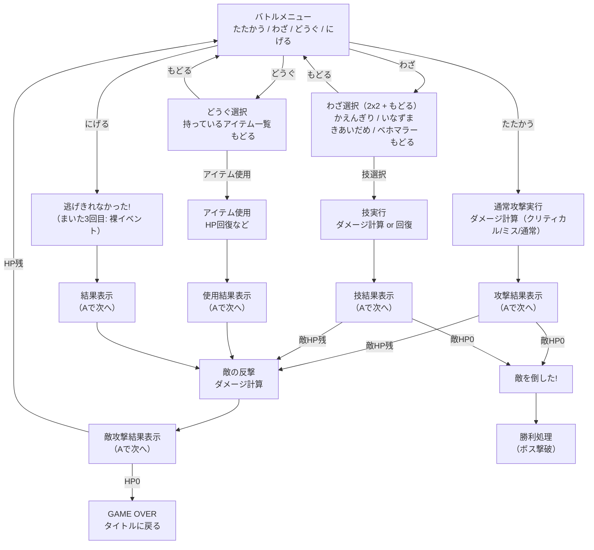

# 戦闘画面フロー

## メインメニュー（2x2）

```
たたかう    わざ
どうぐ      にげる
```

## フロー図



## 現在の実装状態

### たたかう（battleMenu === 0）

- [x] 通常攻撃を即実行
- [x] クリティカル/ミス判定あり
- [x] きあいだめ後は確定クリティカル

### わざ（battleMenu === 1）

- [x] サブメニューに遷移
- [x] 未習得は「???」で選択不可
- [x] もどるでメニューに戻れる
- [ ] **現在の問題**: カーソルがもどるにデフォルトで行く

### どうぐ（battleMenu === 2）

- [ ] **現在の問題**: サブメニューではなく直接実行される
- [ ] サブメニューに遷移して、アイテム一覧+もどるを表示すべき

### にげる（battleMenu === 3）

- [x] 逃げきれなかった表示
- [x] まいた3回目で裸イベント
- [ ] **現在の問題**: 敵の反撃が来ない？確認必要

## 修正が必要な点

1. **どうぐ**: サブメニュー化（アイテム一覧 + もどる）
2. **にげる後**: 確実に敵の反撃が来ること
3. **各サブメニュー**: 右下にもどるボタン
