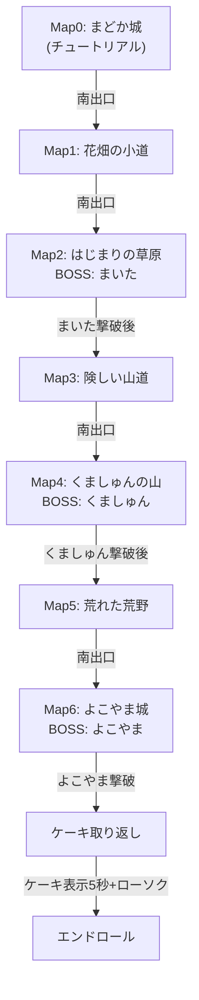

# 12054 - ゲームデータ

## ストーリー

2026年4月4日、まどかの誕生日。まどか姫にローソクの火を消してほしくて誕生日ケーキを用意したが、よこやま、くましゅん、まいたの3人に盗まれた。まどかはケーキを取り戻すため冒険に出る。

## マップ構成（全7マップ）



## 各マップ詳細

### Map0: まどか城（チュートリアル）

| 種別 | 名前         | 位置                 | 内容                          |
| ---- | ------------ | -------------------- | ----------------------------- |
| NPC  | じいや       | (3,2)                | チュートリアル+ストーリー導入 |
| 宝箱 | ひのきのぼう | (9,2)                | 武器: ATK+5, CRIT+5%, MISS-3% |
| 本棚 | 左(6,1)      | 自己理解についての本 |
| 本棚 | 右(7,1)      | 歯列矯正についての本 |

**じいやのセリフ:**

1. 「まどか姫! お誕生日おめでとうございます!」
2. 「まどか姫にローソクの火を消してほしくて誕生日ケーキを用意したのですが...」
3. 「よこやま、くましゅん、まいたの3人に盗まれてしまいました!」
4. 「宝箱に武器があります。まずは開けてみてください」
5. 「十字キーで移動、Aボタンで調べられます」

---

### Map1: 花畑の小道

| 種別 | 名前       | 位置  | 内容                   |
| ---- | ---------- | ----- | ---------------------- |
| NPC  | 旅人       | (2,4) | 道案内+まいたヒント    |
| 宝箱 | ポーション | (9,6) | HP+30（飲む/箱に戻す） |

**旅人のセリフ:**

1. 「この道はまっすぐ行くとまいたの草原に出るよ」
2. 「花がきれいだろう? まどか姫の誕生日だから咲いたんだ」
3. 「そういえば、まいたは最近編み物にハマってるらしい」
4. 「今日着てる服も自分で編んだんだってさ」

---

### Map2: はじまりの草原（BOSS: まいた）

| 種別 | 名前       | 位置   | 内容                                        |
| ---- | ---------- | ------ | ------------------------------------------- |
| NPC  | 村人       | (2,3)  | まいた情報+にげるヒント                     |
| 宝箱 | ポーション | (9,4)  | HP+30（飲む/箱に戻す）                      |
| 本棚 | 草原の石碑 | (10,2) | まいたからのメッセージ + **かえんぎり習得** |
| BOSS | まいた     | (5,8)  | 第1ボス                                     |

**村人のセリフ:**

1. 「まいたがこの先の道を塞いでいるよ」
2. 「あいつは見た目ほど強くない雑魚だ」
3. 「ただ危なくなったら逃げればいい」

**まいた特殊行動:**

- 隣を素通りしようとすると: 「そこのお姉ちゃんかわいいね」→「しつこいので引き返した方がよさそうだ...」
- 撃破後に話しかける（1-4回目）: 「う......（もう少しでパンツが見えそうなのに）」
- 撃破後に話しかける（5回目以降）: 「う......（あ、パンツが見えた。今日はこん色だ）」→ **ミッション「こん色のパンツ」解放**
- 戦闘中に3回にげる: 服の紐が足に絡まり裸になる → **ミッション「裸」解放**

---

### Map3: 険しい山道

| 種別 | 名前         | 位置  | 内容                          |
| ---- | ------------ | ----- | ----------------------------- |
| NPC  | 商人         | (2,5) | くましゅん情報                |
| 本棚 | 古い巻物     | (9,5) | **きあいだめ習得**            |
| 宝箱 | ポーション   | (9,2) | HP+30                         |
| 宝箱 | かぜのつるぎ | (3,7) | 武器: ATK+8, CRIT+8%, MISS-4% |

---

### Map4: くましゅんの山（BOSS: くましゅん）

| 種別 | 名前           | 位置   | 内容                                                                         |
| ---- | -------------- | ------ | ---------------------------------------------------------------------------- |
| NPC  | きこり         | (8,2)  | くましゅん情報+さつまいもヒント                                              |
| 宝箱 | てつのけん     | (1,4)  | 武器: ATK+10, CRIT+10%, MISS-5%。開封後3回調べると**さつまいも**入手         |
| 宝箱 | ポーション     | (10,7) | HP+30                                                                        |
| 宝箱 | さつまいも宝箱 | (3,7)  | 別途さつまいも専用宝箱                                                       |
| 本棚 | 古びた巻物     | (1,2)  | ク・マシュンの文章「Lv33おめでとう。ベホマラー使えるね」+ **ベホマラー習得** |
| BOSS | くましゅん     | (5,8)  | 第2ボス                                                                      |

**きこりのセリフ:**

1. 「この先にくましゅんがいる...気をつけな」
2. 「あいつはデカいが動きは鈍い」
3. 「このへんはさつまいもがそこらじゅうに落ちてるんだ」

**くましゅん撃破後セリフ:**

- 通常: 「............」→「また一緒にご飯作ろうね」
- さつまいもで倒した場合: 「さつまいもおいしい...おいしい...」→ **ミッション「さつまいも」解放**

---

### Map5: 荒れた荒野

| 種別 | 名前       | 位置   | 内容              |
| ---- | ---------- | ------ | ----------------- |
| NPC  | 兵士       | (2,3)  | 激励+パンツヒント |
| 本棚 | 雷の書     | (10,3) | **いなずま習得**  |
| 宝箱 | ポーション | (9,6)  | HP+30             |
| 宝箱 | ポーション | (3,7)  | HP+30             |

**兵士のセリフ:**

1. 「よこやま城はこの先だ」
2. 「姫様、どうかご武運を!」
3. 「そういえば、前にいたまいたにスカート覗かれなかったか?」
4. 「あいつには気をつけろよ」

---

### Map6: よこやま城（BOSS: よこやま）

| 種別 | 名前           | 位置  | 内容                                                                    |
| ---- | -------------- | ----- | ----------------------------------------------------------------------- |
| 宝箱 | ほのおのけん   | (2,2) | 武器: ATK+15, CRIT+20%, MISS-8%                                         |
| 宝箱 | ポーション     | (9,2) | HP+30                                                                   |
| 本棚 | 古びた伝記(右) | (9,4) | ブラック・マジシャン・マイター「今度はまどかのピアノでBGMつくらせて〜」 |
| 本棚 | 古びた伝記(左) | (2,4) | ヨコヤ・マー「マドカもマドカモスに進化しよう」                          |
| BOSS | よこやま       | (5,6) | ラスボス                                                                |

**よこやま撃破後:** ケーキが城の左下(2,8)に出現
**よこやま撃破後セリフ:** 「なんでも助けたるから、何かあったらまた連絡して」

---

## キャラクター

### 主人公

| 名前   | 初期HP | 初期ATK | 初期DEF | 初期CRIT | 初期MISS |
| ------ | ------ | ------- | ------- | -------- | -------- |
| まどか | 100    | 10      | 5       | 10%      | 10%      |

### ボス

| 名前       | HP  | ATK | DEF | CRIT | MISS | マップ |
| ---------- | --- | --- | --- | ---- | ---- | ------ |
| まいた     | 40  | 8   | 3   | 5%   | 15%  | Map2   |
| くましゅん | 70  | 14  | 6   | 10%  | 10%  | Map4   |
| よこやま   | 100 | 20  | 10  | 15%  | 5%   | Map6   |

---

## 武器一覧

| 武器名       | ATK | CRIT | MISS | 入手場所 |
| ------------ | --- | ---- | ---- | -------- |
| すで         | +0  | +0%  | +0%  | 初期装備 |
| ひのきのぼう | +5  | +5%  | -3%  | Map0     |
| かぜのつるぎ | +8  | +8%  | -4%  | Map3     |
| てつのけん   | +10 | +10% | -5%  | Map4     |
| ほのおのけん | +15 | +20% | -8%  | Map6     |

---

## ポーションシステム

- 宝箱から取得した時点で「飲みますか?」と確認
- **飲む**: その場でHP+30回復
- **箱に戻す**: 宝箱が未開封状態に戻る（再取得可能）

---

## バトルシステム

### バトルメニュー（2x2）

```
たたかう    わざ
どうぐ      にげる
```

- **たたかう**: 通常攻撃（倍率1.0）を即実行
- **わざ**: サブメニュー（4技+もどる）。技なしの場合「まだ技を覚えていない!」
- **どうぐ**: アイテム使用（さつまいも等）
- **にげる**: 逃げきれなかった + 敵の反撃。まいた戦で3回逃げると裸イベント

### ダメージ計算

```
基本ダメージ = max(1, ATK - 敵DEF + random(0~4))
クリティカル = 基本ダメージ x 2
ミス = 0ダメージ
```

### ゲームオーバー

- HP 0 → GAME OVER画面 → タイトルに戻る（全リセット）
- セーブ/コンティニュー機能なし（毎回はじめから）

---

## 技システム

| 技名       | 倍率 | CRIT補正 | MISS補正 | 効果                 | 習得場所         |
| ---------- | ---- | -------- | -------- | -------------------- | ---------------- |
| かえんぎり | 2.5x | +10%     | +5%      | 高火力               | Map2: 草原の石碑 |
| いなずま   | 2.0x | +20%     | +0%      | クリティカル狙い     | Map5: 雷の書     |
| きあいだめ | -    | -        | -        | 次は確定クリティカル | Map3: 古い巻物   |
| ベホマラー | -    | -        | -        | HP30回復             | Map4: 古びた巻物 |

---

## BGM

| マップ       | BGMファイル               | 音量                    |
| ------------ | ------------------------- | ----------------------- |
| Map0〜Map5   | `/audio/bgm-kumashun.m4a` | 1.0（GainNode 2.0増幅） |
| Map6         | `/audio/bgm-yokoyama.m4a` | 0.2                     |
| エンドロール | `/audio/bgm-endroll.m4a`  | 0.2                     |

---

## ミッション一覧（全10個）

localStorage (`birthday-rpg-achievements`) に永続保存。ゲームクリア/ゲームオーバー/はじめからでもリセットされない。

| #   | ラベル               | 達成条件                                                             |
| --- | -------------------- | -------------------------------------------------------------------- |
| 1   | まいたを倒した       | まいたをバトルで撃破                                                 |
| 2   | くましゅんを倒した   | くましゅんをバトルで撃破                                             |
| 3   | よこやまを倒した     | よこやまをバトルで撃破                                               |
| 4   | ケーキを取り返した   | よこやま城でケーキに話しかける                                       |
| 5   | こん色のパンツ       | 撃破後のまいたに5回話しかける                                        |
| 6   | ローソクを吹き消した | ケーキ表示画面でロウソク3本をタップで消す                            |
| 7   | フォーショット       | タイトル画面で走る3キャラを全員止める（要:全ボス撃破済み、20秒間隔） |
| 8   | 裸                   | まいた戦で3回にげて服を解く                                          |
| 9   | さつまいも           | くましゅんをさつまいもで倒す                                         |
| 10  | 踏みつけコンプリート | 1プレイ中に倒れた3ボス全員の上を歩く（よこやまを踏んだ時に判定）     |

---

## エンディングの流れ

1. よこやま撃破 → ケーキ出現
2. ケーキにAボタン → ダイアログ
3. ケーキ表示画面（5秒、ロウソクタップで消せる）
4. エンドロール（スターウォーズ風スクロール）
5. ミッション一覧 + 4人ケーキ囲みイラスト（桜背景）
6. タップでトップ画面に戻る

---

## タイトル画面

- ゲームタイトル: **12054**
- まどか姫が桜を眺めるドット絵（花びら舞い散りアニメーション）
- 「START」ボタンのみ（コンティニューなし）
- ボス3体撃破済み: 20秒ごとにキャラが走る（フォーショットミッション）

---

## プロローグ

1. 「今日は2026年4月4日、私の誕生日。」
2. 「1人で、おいしいものでも食べよう。」

- 各テキスト遷移時に500msのクールダウン
- プロローグ終了時にBGM再生開始

---

## デバッグワープ（まどか城限定）

| 位置       | 方向   | Aボタン10回                 | 効果             |
| ---------- | ------ | --------------------------- | ---------------- |
| 右上(10,1) | 上向き | 全ボス撃破+ケーキ           | よこやま城ワープ |
| 左上(1,1)  | 上向き | まいた+くましゅん撃破       | 荒野ワープ       |
| 右下(10,8) | 下向き | まいた撃破                  | 山道ワープ       |
| 左下(1,8)  | 左向き | 全ボス撃破+全ミッション達成 | よこやま城ワープ |

---

## 操作方法

| 操作        | キーボード        | SP      |
| ----------- | ----------------- | ------- |
| 上移動      | ↑ / W / Ctrl+P    | D-pad上 |
| 下移動      | ↓ / S / Ctrl+N    | D-pad下 |
| 左移動      | ← / A / Ctrl+B    | D-pad左 |
| 右移動      | → / D / Ctrl+F    | D-pad右 |
| 決定/調べる | Space / Enter / Z | Aボタン |

---

## 演出

- **HP 20%以下**: 画面周囲が赤く脈動（ゲーム中のみ）
- **ケーキ表示画面**: キラキラ星+ロウソク炎揺れ+2段ケーキ
- **エンドロール**: スターウォーズ風スクロール
- **エンドロール後**: ミッション一覧 + 4人ケーキ囲みイラスト（桜背景+花びら舞い散り）
- **タイトル画面**: 桜の花びら舞い散りアニメーション + キャラ走りイベント
