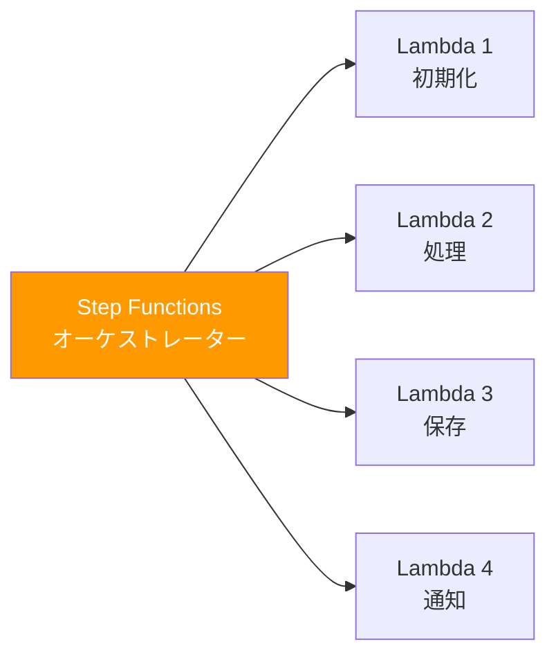
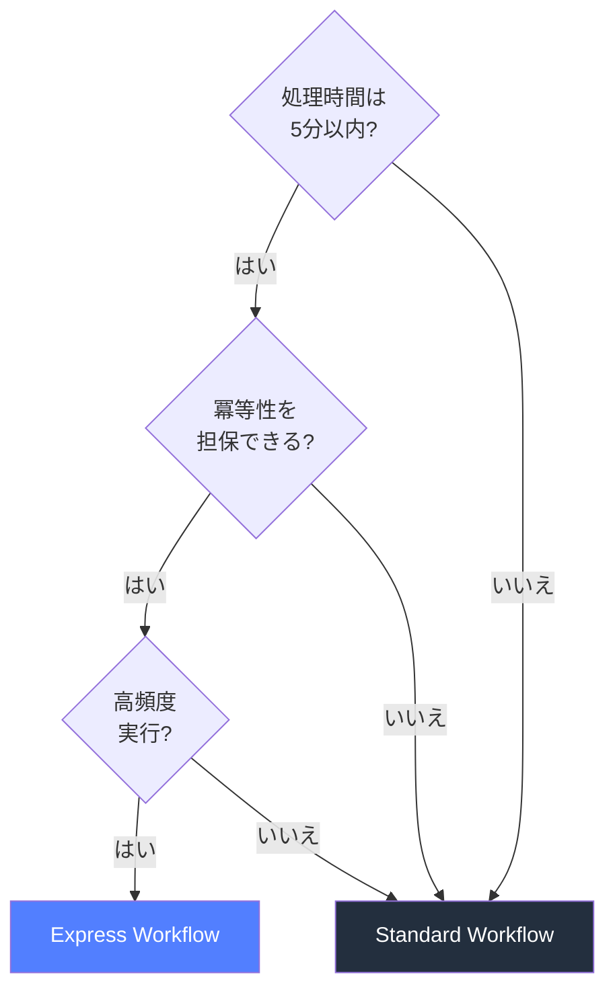
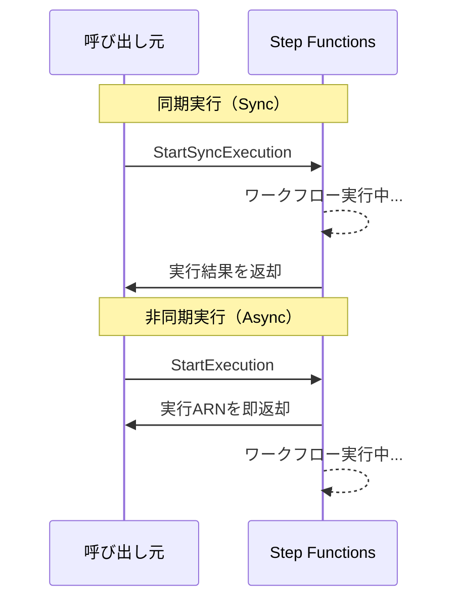
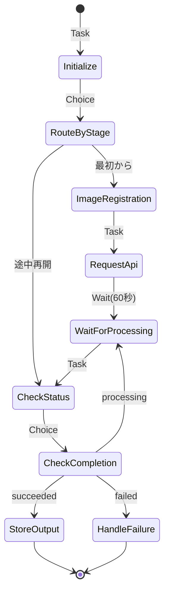

## Step Functions とは何か

AWS Step Functions は、複数の AWS サービスをワークフローとして連携させるためのサーバーレスオーケストレーションサービスである。内部的には **有限ステートマシン（Finite State Machine）** の概念に基づいており、各処理を「ステート（状態）」として定義し、ステート間の遷移を JSON ベースの **Amazon States Language (ASL)** で記述する。

ステートマシンという概念自体は計算機科学の基礎であり、「現在の状態」と「入力」に基づいて「次の状態」が決まるという決定論的なモデルである。Step Functions はこのモデルをクラウド上のワークフロー管理に適用したものと理解すると分かりやすい。

従来、複数の Lambda 関数を順番に呼び出すには、Lambda 内で次の Lambda を invoke するか、SQS を挟むなどの方法が取られていた。しかし、これでは処理全体の進行状況が見えにくく、エラー発生時のリカバリも各関数に個別実装する必要があった。Step Functions はこれらの課題を宣言的に解決する。

### 補足：オーケストレーションとコレオグラフィ

マイクロサービス連携のパターンには大きく **オーケストレーション**（中央の指揮者が全体を制御）と **コレオグラフィ**（各サービスがイベントに反応して自律的に動く）の 2 つがある。Step Functions はオーケストレーションパターンの代表格であり、処理の順序・分岐・並列を中央で一元管理できる点が強みである。一方、EventBridge を中心としたイベント駆動アーキテクチャはコレオグラフィに該当する。どちらが優れているという話ではなく、ユースケースに応じて使い分ける。

---

## Standard vs Express Workflow

Step Functions には 2 種類のワークフロータイプがある。

### Standard Workflow

- 最大実行期間：**1 年**
- 実行履歴が **完全に記録** される（AWS コンソールで各ステートの入出力を確認可能）
- exactly-once のセマンティクス（各ステートは厳密に 1 回だけ実行される）
- 料金：ステート遷移ごとに課金（1,000 遷移あたり約 $0.025）
- 用途：長時間実行ワークフロー、人間の承認待ちを含む処理、確実性が求められるビジネスプロセス

### Express Workflow

- 最大実行期間：**5 分**
- 実行履歴は CloudWatch Logs に出力（コンソールでのビジュアル確認は Standard ほど手軽ではない）
- at-least-once のセマンティクス（リトライにより同一ステートが複数回実行される可能性がある）
- 料金：実行回数＋実行時間で課金（大量の短時間実行では Standard より安くなる）
- 用途：IoT データ処理、ストリーミング変換、高頻度の短時間処理

### 選定の目安

処理時間が 5 分以内で完了する見込みがあり、かつ冪等性を担保できるなら Express を検討する。それ以外は Standard を選ぶのが無難である。特に初めて Step Functions を使う場合は Standard から始めることを推奨する。実行履歴のビジュアル確認が圧倒的にデバッグしやすいためである。

---

## 同期実行（Sync）vs 非同期実行（Async）

Step Functions の実行方法には **同期（Synchronous）** と **非同期（Asynchronous）** の 2 パターンがある。これはワークフロータイプ（Standard / Express）とは別の概念であるため、混同しないように注意が必要である。

### 非同期実行（StartExecution）

- `StartExecution` API を呼ぶと、実行 ARN が即座に返される
- ワークフローはバックグラウンドで実行される
- 結果を取得するには `DescribeExecution` API でポーリングするか、完了イベントを EventBridge で受け取る
- Standard Workflow のデフォルトの実行方法
- 最大実行期間は Standard の場合 **1 年**

### 同期実行（StartSyncExecution）

- `StartSyncExecution` API を呼ぶと、**ワークフロー完了まで API レスポンスが返らない**
- 完了後、最終的な出力がレスポンスに含まれる
- **Express Workflow 専用**（Standard では使えない）
- 同期実行のタイムアウトは **5 分**（Express Workflow の最大実行期間と同じ）
- API Gateway や Lambda から直接呼び出して結果を待つパターンで有用

### 実務での使い分け

API Gateway のバックエンドとして Step Functions を使いたい場合、同期実行が直感的である。ただし、API Gateway 自体にも 29 秒のタイムアウト制限があるため、Express + Sync で呼ぶ場合は処理全体が 29 秒以内に収まるかを確認する必要がある。

長時間処理（バッチ処理、承認フローなど）は非同期実行で起動し、完了通知を EventBridge や SNS で受け取る設計にする。

---

## ステートの種類

Amazon States Language で定義できるステートは全部で **8 種類** ある。よくある誤解として「Step Functions のステートはすべて Lambda を呼ぶもの」と思われがちだが、Lambda を呼ぶのは Task ステートの一部のケースに過ぎない。

### Task

外部のサービスを呼び出すステート。Step Functions の中核をなす。

呼び出せるサービスは Lambda だけではなく、**200 以上の AWS サービス** に対して SDK Integration を通じてダイレクトに呼び出せる。例えば以下のような操作が Lambda を介さずに実行可能である：

- DynamoDB の PutItem / GetItem
- SQS の SendMessage
- SNS の Publish
- ECS の RunTask
- Glue の StartJobRun
- SageMaker のトレーニングジョブ起動

Lambda を噛ませるのは、カスタムロジック（データ変換、外部 API 呼び出し、複雑な条件判定など）が必要な場合に限定するのが望ましい。SDK Integration で済む処理に Lambda を使うと、コードのメンテナンスコスト・Lambda のコールドスタート・追加課金が発生する。

#### Task の呼び出しパターン

Task ステートには 3 つの呼び出しパターンがある：

1. **Request-Response**（デフォルト）：API を呼んだらすぐに次のステートに遷移。非同期的。
2. **Run a Job (.sync)**：ジョブの完了を待ってから次のステートに遷移。ECS RunTask や Glue StartJobRun でよく使う。
3. **Wait for Callback (.waitForTaskToken)**：タスクトークンを外部に渡し、外部からコールバックが来るまで待機。人間の承認や外部システムとの連携に使う。

### Choice

条件分岐を表すステート。プログラミング言語の `if-else` や `switch-case` に相当する。入力データの値に基づいて次の遷移先を決定する。

比較演算子として `StringEquals`、`NumericGreaterThan`、`BooleanEquals`、`IsPresent`、`StringMatches`（ワイルドカード対応）などが用意されており、`And` / `Or` / `Not` で複合条件も書ける。

### Wait

指定した時間だけ待機するステート。秒数での指定（`Seconds`）またはタイムスタンプでの指定（`Timestamp`）が可能。

**Wait ステートの最大の利点はコストである。** Lambda で `time.sleep()` を使って待機すると、待機時間中もLambda の実行時間課金が発生する。一方、Wait ステートは Step Functions のステート遷移課金のみで、待機中に追加料金は発生しない。1 時間待機する処理の場合、Lambda で実装するとかなりのコストになるが、Wait ステートなら 1 回のステート遷移分（$0.000025）のみである。

### Parallel

複数のブランチ（処理の流れ）を **同時並行** で実行するステート。すべてのブランチが完了すると次のステートに遷移する。1 つでもブランチが失敗すると Parallel ステート全体が失敗扱いになる（他のブランチはキャンセルされる）。

例えば、注文処理で「在庫確認」「与信チェック」「配送先バリデーション」を同時に行いたい場合に使う。

### Map

配列データに対して、各要素ごとに同じ処理を繰り返すステート。プログラミング言語の `Array.map()` に相当する。

Map には 2 つのモードがある：

- **Inline Mode**：ステートマシン定義内にイテレーション処理を記述。40 件以下の少量データ向け。
- **Distributed Mode**：大規模データセットに対して最大 **10,000 件の並列実行** が可能。S3 から CSV/JSON を読み込んで各行を並列処理するようなバッチ処理に最適。

### Pass

入力をそのまま（または変換して）出力に渡すステート。実際の処理は行わない。主に以下の用途で使う：

- データの整形・加工（`Parameters` や `ResultPath` でフィールドの追加・変換）
- 開発中のモック・プレースホルダー
- デバッグ時のデータ確認

### Succeed

ステートマシンの実行を **成功** として終了させるステート。Choice ステートの分岐先として「この条件なら正常終了」というケースで使うことが多い。

### Fail

ステートマシンの実行を **失敗** として終了させるステート。エラー名（`Error`）とエラーメッセージ（`Cause`）を指定できる。Choice の分岐先として「この条件ならエラー」という使い方や、Catch で捕捉した異常系の最終処理として使う。

---

## 実行履歴とビジュアルグラフの活用

Step Functions（Standard Workflow）の最大の強みの 1 つが、**ビジュアルワークフローグラフ** である。AWS コンソール上で各ステートの実行状態（成功・失敗・実行中）がリアルタイムに色分け表示され、各ステートをクリックすると入力・出力の JSON がそのまま確認できる。

### 障害調査での威力

Lambda 単体の場合、障害調査は CloudWatch Logs を頼ることになる。複数の Lambda が連携している場合、ログが各関数に分散しているため、どこで失敗したのか、何が入力されたのかを追跡するのが大変である。

Step Functions では以下が一目で分かる：

- **どのステートで失敗したか**（赤色で表示）
- **失敗時の入力データ**（ステートの Input タブで確認）
- **エラーメッセージ**（Error タブで確認）
- **各ステートの実行時間**（パフォーマンスボトルネックの特定）
- **リトライ回数**（Retry が何回発生したか）

これは特にプロダクション環境での障害対応で圧倒的に役立つ。「何が起きたか」をチームメンバーに説明するときも、ビジュアルグラフのスクリーンショットを共有するだけで済む。

### X-Ray との比較

AWS X-Ray は分散トレーシングサービスであり、複数サービスにまたがるリクエストの流れを可視化する。Step Functions と機能が重複する部分があるため、「どちらを使うべきか」と迷うことがある。

**Step Functions だけで十分なケース：**
- ワークフローが Step Functions 内で完結している
- 各ステートの入出力とエラーが確認できればよい
- チームが Step Functions のコンソールに慣れている

**X-Ray も併用すべきケース：**
- Step Functions から呼ばれた Lambda が内部でさらに外部 API や他の AWS サービスを呼んでいる
- Lambda 内部のどの処理に時間がかかっているかを特定したい
- Step Functions 以外のサービス（API Gateway, AppSync など）も含めたエンドツーエンドのトレースが必要

多くの場合、Step Functions のビジュアルグラフだけで運用は回る。X-Ray は「Lambda 内部の深掘り」が必要になったときに追加する、という段階的なアプローチが現実的である。

---

## 料金モデル

Step Functions の料金体系を正しく理解しておくことは、設計段階でのコスト見積もりに不可欠である。

### Standard Workflow

**ステート遷移ごとの課金** が基本である。

- 1,000 ステート遷移あたり $0.025（東京リージョン）
- 月 4,000 遷移までは無料枠

例えば、10 ステートのワークフローを月に 10,000 回実行する場合：
10 ステート x 10,000 回 = 100,000 遷移 → 約 $2.50 / 月

この料金モデルの重要なポイントは、**待機時間に対して課金されない** ということである。Wait ステートで 1 時間待機しても 1 遷移分の課金のみ。これは Lambda の秒単位課金と比べると大きなアドバンテージである。

### Express Workflow

- 実行回数あたりの課金：100 万リクエストあたり $1.00
- 実行時間あたりの課金：メモリ 64 MB で 1 GB-秒あたり $0.00001667

高頻度・短時間のワークフローでは Express の方がコスト効率が良くなる場合がある。

### コスト最適化のヒント

- **SDK Integration を活用する**：Lambda を介さず直接 AWS サービスを呼べば、Lambda の実行コストを削減できる
- **不要なステートを減らす**：Pass ステートを整理統合するだけでも遷移回数が減る
- **Wait ステートを積極的に使う**：ポーリングや遅延処理に Lambda の sleep を使わない
- **Express を検討する**：大量の短時間ワークフローでは Express の方が安い

---

## ユースケース例

### 動画処理パイプライン

1. S3 に動画ファイルがアップロードされる
2. MediaConvert でトランスコード（Task: SDK Integration）
3. トランスコード完了を待機（Task: .sync パターン）
4. Rekognition でコンテンツ分析（Task: SDK Integration）
5. 結果に応じて分岐（Choice）
   - 不適切コンテンツあり → 管理者通知（SNS Publish）→ Fail
   - 問題なし → メタデータを DynamoDB に書き込み → CDN キャッシュ無効化 → Succeed

### ETL / データパイプライン

1. Glue Crawler でスキーマ検出（Task: .sync）
2. Glue Job でデータ変換（Task: .sync）
3. 変換結果のバリデーション（Lambda Task）
4. 結果に応じて分岐（Choice）
   - バリデーション OK → Redshift にロード → 完了通知
   - バリデーション NG → エラー通知 → Fail

### 注文処理（Saga パターン）

マイクロサービスで注文処理を行う場合、各サービスへのリクエストが途中で失敗した際に **補償トランザクション** を実行して整合性を保つ必要がある（Saga パターン）。

1. 在庫引当（Task）→ 失敗時は在庫戻し（Catch → 補償 Task）
2. 決済処理（Task）→ 失敗時は決済取消 + 在庫戻し
3. 配送手配（Task）→ 失敗時は配送キャンセル + 決済取消 + 在庫戻し
4. すべて成功 → 注文確定通知

Step Functions の Catch 機構を使えば、各ステップの補償トランザクションを宣言的に記述できる。

### 外部 API 連携（コールバックパターン）

1. 外部決済サービスに決済リクエストを送信（Task + `.waitForTaskToken`）
2. タスクトークンを DynamoDB に保存
3. Step Functions は外部からのコールバックを待機（この間、課金は発生しない）
4. 外部サービスが Webhook で結果を通知
5. Lambda が Webhook を受け取り、`SendTaskSuccess` / `SendTaskFailure` を呼ぶ
6. Step Functions が次のステートに遷移

---

## Map State によるバッチ処理の並列化

Map State の Distributed Mode は大規模バッチ処理で特に威力を発揮する。

### 典型的なパターン

S3 上の CSV ファイル（数万〜数百万行）を読み込み、各行に対して処理を行うケース：

1. Map State の ItemReader で S3 上の CSV を指定
2. 各行が自動的に Map のイテレーションに渡される
3. 最大 10,000 の同時実行で並列処理
4. 結果は ResultWriter で S3 に書き出し

従来は「S3 から CSV を Lambda で読み込み → SQS にメッセージを投入 → 別の Lambda が SQS から consume」というアーキテクチャを組む必要があったが、Distributed Map なら Step Functions だけで完結する。

### 注意点

- 子ワークフロー（各イテレーション）は Express Workflow として実行される
- 同時実行数の上限に注意（デフォルトは 40、最大 10,000 まで引き上げ可能）
- 子ワークフローから呼ばれる AWS サービス側のスロットリングにも注意（例：DynamoDB の WCU）

---

## エラーハンドリング（Retry / Catch）

Step Functions のエラーハンドリングは、ステート定義内に **Retry** と **Catch** を宣言的に記述する。

### Retry

一時的なエラー（ネットワークタイムアウト、スロットリングなど）に対して自動リトライを設定する。

主要なパラメータ：
- **ErrorEquals**：対象のエラー名（`States.TaskFailed`, `Lambda.ServiceException`, `States.ALL` など）
- **IntervalSeconds**：リトライ間隔（秒）
- **MaxAttempts**：最大リトライ回数（デフォルト 3、0 にするとリトライなし）
- **BackoffRate**：指数バックオフの倍率（例：2.0 なら間隔が 2 倍ずつ増える）
- **JitterStrategy**：`FULL` を指定するとジッター（ランダムな揺らぎ）が追加される。複数の実行が同時にリトライして再びスロットリングされる「サンダリングハード問題」を軽減する

### Catch

リトライで回復しなかったエラー、またはリトライ対象外のエラーをキャッチして別のステートに遷移させる。

- **ErrorEquals**：対象のエラー名
- **Next**：遷移先のステート名
- **ResultPath**：エラー情報を入力のどこに格納するか

### ベストプラクティス

1. **すべての Task ステートに Retry を設定する**：少なくとも `States.TaskFailed` に対する Retry は入れておく
2. **Catch でフォールバックパスを用意する**：エラー通知（SNS）やエラーログ記録（DynamoDB）を行うステートに遷移させる
3. **エラーの種類を細かく分ける**：`Lambda.TooManyRequestsException`（スロットリング）は長めの間隔でリトライ、`States.Timeout` は即座に Catch、のように分けて定義する
4. **BackoffRate と JitterStrategy を組み合わせる**：`BackoffRate: 2.0` + `JitterStrategy: FULL` がスロットリング対策の定番

### 定義済みエラー名

Step Functions にはいくつかの定義済みエラーがある：

- `States.ALL`：すべてのエラーにマッチ
- `States.Timeout`：ステートのタイムアウト
- `States.TaskFailed`：タスクの実行失敗
- `States.Permissions`：権限不足
- `States.ResultPathMatchFailure`：ResultPath の適用に失敗
- `States.ParameterPathFailure`：パラメータのパス解決に失敗
- `States.BranchFailed`：Parallel ステートのブランチ失敗
- `States.NoChoiceMatched`：Choice ステートでどの条件にもマッチしなかった
- `States.HeartbeatTimeout`：ハートビートのタイムアウト（長時間タスクの生存確認に使用）

---

## 実務 Tips

### 1. InputPath / OutputPath / ResultPath / Parameters を理解する

Step Functions のデータフローは最初は混乱しやすい。ステートの入出力を制御する 4 つの機能を整理しておく：

- **InputPath**：入力 JSON のどの部分をステートに渡すかをフィルタする（JSONPath）
- **Parameters**：入力を加工して新しい JSON を構成する（固定値の追加、フィールドの組み替え）
- **ResultPath**：ステートの実行結果を入力 JSON のどこに格納するか（`$.result` のように指定）
- **OutputPath**：最終的な出力のどの部分を次のステートに渡すかをフィルタする

処理の流れは InputPath → Parameters → （ステート実行） → ResultSelector → ResultPath → OutputPath の順である。

### 2. ペイロードサイズの制限に注意

Step Functions のステート間で受け渡せるデータサイズは **256 KB** が上限である。これを超える場合は S3 にデータを保存し、S3 の URI を受け渡す設計にする。

### 3. テスト戦略

- **TestState API**：個々のステートを単独でテストできる API がある。ステートマシン全体をデプロイせずに、特定のステートの動作を確認可能
- **Step Functions Local**：ローカル環境で Step Functions をエミュレートできる Docker イメージが提供されている。CI/CD パイプラインでの自動テストに組み込める
- **モックの活用**：Step Functions のテスト機能でサービス呼び出しの結果をモックできる。外部依存なしでフロー全体のテストが可能

### 4. バージョニングとデプロイ

Step Functions にはネイティブのバージョニング機能（**エイリアス** と **バージョン**）がある。Lambda のエイリアスと同様の概念で、本番エイリアスを最新バージョンに切り替えることでデプロイを行う。ロールバックも容易である。

### 5. Idempotency（冪等性）の確保

Express Workflow は at-least-once セマンティクスであるため、同じ処理が複数回実行される可能性がある。DynamoDB の条件付き書き込みや、実行 ID をキーとした重複チェックなど、冪等性を担保する仕組みをアプリケーション側で用意する。

### 6. 命名規則を統一する

ステートマシンとステートの命名は、チーム内で規則を統一する。例えば：
- ステートマシン名：`{サービス名}-{処理名}-workflow`（例：`order-processing-workflow`）
- ステート名：`{動詞}-{対象}`（例：`Validate-Input`, `Reserve-Inventory`, `Process-Payment`）

ビジュアルグラフ上で処理内容が一目で分かる命名にしておくと、障害調査時に大きな差が出る。

### 7. CloudWatch メトリクスの監視

Step Functions は以下のメトリクスを CloudWatch に自動で出力する：

- `ExecutionsFailed`：失敗した実行数
- `ExecutionsTimedOut`：タイムアウトした実行数
- `ExecutionThrottled`：スロットリングされた実行数
- `ExecutionsSucceeded`：成功した実行数
- `ExecutionTime`：実行時間

最低限、`ExecutionsFailed` と `ExecutionsTimedOut` にアラームを設定しておくことを推奨する。

---

## まとめ

Step Functions は「複数の処理をつなげて管理する」というシンプルな目的のサービスだが、ステートの種類・実行パターン・料金モデルを正しく理解すると、その応用範囲は非常に広い。特にビジュアルグラフによる可視化と宣言的なエラーハンドリングは、運用フェーズでの負担を大きく軽減してくれる。

Lambda 単体では管理が煩雑になるような複数ステップの処理があれば、Step Functions の導入を検討する価値がある。

---

## 参考文献

- [AWS Step Functions 開発者ガイド](https://docs.aws.amazon.com/step-functions/latest/dg/welcome.html)
- [AWS Step Functions の料金](https://aws.amazon.com/step-functions/pricing/)
- [Amazon States Language の仕様](https://states-language.net/spec.html)
- [Standard ワークフローと Express ワークフローの比較](https://docs.aws.amazon.com/step-functions/latest/dg/concepts-standard-vs-express.html)
- [Step Functions のエラー処理](https://docs.aws.amazon.com/step-functions/latest/dg/concepts-error-handling.html)
