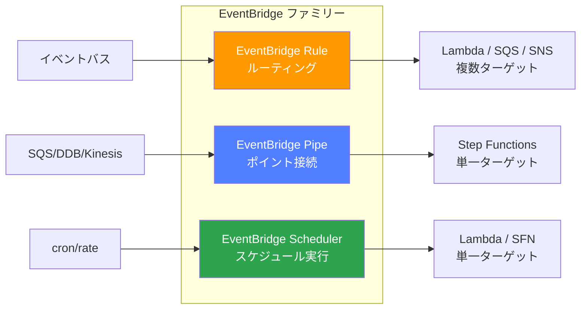
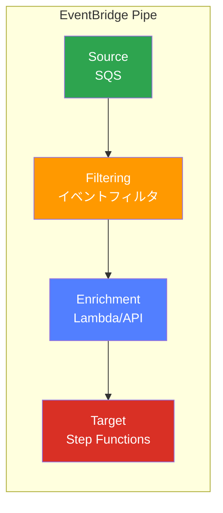
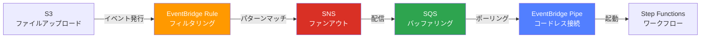

## EventBridge ファミリーの全体像

「EventBridge」という名前がつく AWS サービスは現在 **3 つ** ある。名前は似ているが、それぞれ目的も動作モデルも異なる。混同しやすいため、最初に整理しておく。

| サービス | AWS リソースタイプ | 概要 |
|---|---|---|
| **EventBridge Rule** | `AWS::Events::Rule` | イベントバス上のイベントをパターンマッチングしてターゲットにルーティング |
| **EventBridge Pipe** | `AWS::Pipes::Pipe` | ソースからターゲットへの 1 対 1 のポイントツーポイント接続 |
| **EventBridge Scheduler** | `AWS::Scheduler::Schedule` | cron / rate ベースのスケジュール実行（旧 CloudWatch Events のスケジュール機能の後継） |

特に **Rule と Pipe は「EventBridge」を冠していながら全く別のサービス** であり、CloudFormation / CDK でのリソースタイプも異なる。アーキテクチャ図で同じ EventBridge アイコンを使ってしまうと、レビュー時に混乱を招くため、明確に区別して記載すべきである。

### 補足：EventBridge の歴史的経緯

もともと AWS には **CloudWatch Events** というサービスがあり、これが 2019 年に **EventBridge** としてリブランドされた。EventBridge Rule は CloudWatch Events Rule の後継であり、API 互換性が維持されている（`events:PutRule` など、API のプレフィックスが `events` のままなのはこの歴史的経緯による）。

一方、EventBridge Pipe は **2022 年の re:Invent** で発表された全く新しいサービスであり、CloudWatch Events とは無関係である。Scheduler も同時期に発表された。つまり「EventBridge」は単一のサービスではなく、**イベント駆動アーキテクチャに関連するサービス群のブランド名** と理解するのが正確である。

---

## EventBridge Rule とは

### 基本概念

EventBridge Rule は **イベントバス（Event Bus）** 上を流れるイベントに対して **パターンマッチング** を行い、マッチしたイベントを 1 つ以上の **ターゲット** にルーティングするサービスである。

イベントバスには 3 種類ある：

1. **デフォルトイベントバス**：AWS サービスが自動的にイベントを発行するバス（例：EC2 の状態変化、S3 のオブジェクト作成など）
2. **カスタムイベントバス**：アプリケーションが独自に作成するバス。自分のアプリケーションからのイベントを分離したい場合に使う
3. **パートナーイベントバス**：SaaS パートナー（Datadog, Auth0, Shopify など）からのイベントを受け取るバス

### イベントパターン記法

Rule の核心はイベントパターンである。JSON 形式で記述し、イベントの特定のフィールドの値をマッチングする。

主な記法：

- **完全一致**：`{"source": ["aws.s3"]}` — source が `aws.s3` のイベントにマッチ
- **プレフィックスマッチ**：`{"detail": {"key": [{"prefix": "images/"}]}}` — key が `images/` で始まるもの
- **数値比較**：`{"detail": {"age": [{"numeric": [">=", 18]}]}}` — 18 以上
- **存在チェック**：`{"detail": {"error": [{"exists": true}]}}` — error フィールドが存在する
- **否定**：`{"detail": {"status": [{"anything-but": "healthy"}]}}` — healthy 以外
- **OR 条件**：配列内に複数値を列挙 `{"source": ["aws.s3", "aws.ec2"]}` — いずれかにマッチ
- **ワイルドカード**：`{"detail": {"key": [{"wildcard": "*.jpg"}]}}` — .jpg で終わるもの

### ターゲット

1 つの Rule に対して最大 **5 つ** のターゲットを設定できる。主なターゲット：

- Lambda 関数
- SQS キュー
- SNS トピック
- Step Functions ステートマシン
- Kinesis Data Streams
- ECS タスク
- CodePipeline
- API Gateway
- 別の EventBridge イベントバス（クロスアカウント / クロスリージョン連携）

**1 つの Rule から複数ターゲットに fan-out できる** のが Rule の特徴である。

### Rule の 2 つのタイプ

Rule にはイベントパターンによるマッチングの他に、**スケジュール式**（cron / rate）による定期実行も設定できる。ただし、現在は EventBridge Scheduler の方が機能が豊富（タイムゾーン指定、フレキシブルウィンドウ、1 回限りのスケジュールなど）であるため、新規で定期実行を設定する場合は Scheduler を使うことが推奨されている。

---

## EventBridge Pipe とは

### 基本概念

EventBridge Pipe は **ソース** から **ターゲット** への **1 対 1 のポイントツーポイント接続** を提供するサービスである。Rule がイベントバス上のルーティングであるのに対し、Pipe はソースから直接ターゲットにデータを流す「パイプライン」である。

Pipe のアーキテクチャは以下の 4 ステージで構成される：

1. **Source**（必須）：データの取得元
2. **Filtering**（任意）：取得したデータのフィルタリング
3. **Enrichment**（任意）：データの加工・補足情報の付加
4. **Target**（必須）：データの送信先

### ソース（Source）

Pipe が接続できるソースは以下の通り：

- **SQS キュー**（標準 / FIFO）
- **DynamoDB Streams**
- **Kinesis Data Streams**
- **Amazon MQ**（ActiveMQ / RabbitMQ）
- **Amazon MSK**（Apache Kafka）
- **セルフマネージド Apache Kafka**

これらはすべて **ポーリングベース** のイベントソースである。Pipe は内部でソースをポーリングし、新しいデータが到着すると処理を開始する。

**重要な違い：** Rule はイベントバスに push されたイベントを受動的にマッチングするのに対し、Pipe はソースを能動的にポーリングする。つまり、イベントの取得モデルが根本的に異なる。

### フィルタリング

ソースから取得したデータに対して、EventBridge のイベントパターン記法と同様のフィルタリングが可能。不要なデータをターゲットに送らないことで、ターゲット側の処理負荷とコストを削減できる。

例えば、DynamoDB Streams から全変更を受け取るが、`eventName` が `INSERT` のものだけをターゲットに流す、といった使い方ができる。

### エンリッチメント（Enrichment）

フィルタリングを通過したデータに対して、追加の処理を行うステージ。以下のサービスを Enrichment に指定できる：

- **Lambda 関数**：任意のカスタムロジックでデータを加工
- **Step Functions**（Express Workflow, Sync 実行のみ）：複雑な加工処理
- **API Gateway**：外部 API からの情報取得
- **API Destination**：サードパーティ API からの情報取得

Enrichment はオプションだが、これが Pipe の大きな付加価値である。従来であれば「SQS → Lambda（データ加工）→ 次のサービス」と Lambda をグルーコードとして書く必要があった処理を、Pipe の設定だけで実現できる場合がある。

### ターゲット（Target）

Pipe のターゲットは以下を含む（Rule のターゲットと一部重複する）：

- Lambda 関数
- SQS キュー
- SNS トピック
- Step Functions ステートマシン
- Kinesis Data Streams
- EventBridge イベントバス
- ECS タスク
- API Gateway
- API Destination
- CloudWatch Logs
- Firehose
- その他多数

**Pipe のターゲットは 1 つ** である。Rule のように複数ターゲットへの fan-out はできない。fan-out が必要な場合は、Pipe のターゲットを SNS や EventBridge イベントバスにして、そこから分岐させる。

---

## AWS リソースタイプの違い

IaC（Infrastructure as Code）で管理する際に重要な違いを整理する。

### EventBridge Rule

- CloudFormation: `AWS::Events::Rule`
- CDK: `aws_events.Rule`
- Terraform: `aws_cloudwatch_event_rule`（CloudWatch Events 時代の名前が残っている）
- API プレフィックス: `events:*`（例：`events:PutRule`, `events:PutTargets`）

### EventBridge Pipe

- CloudFormation: `AWS::Pipes::Pipe`
- CDK: `aws_pipes.CfnPipe`（L2 Construct も利用可能になりつつある）
- Terraform: `aws_pipes_pipe`
- API プレフィックス: `pipes:*`（例：`pipes:CreatePipe`, `pipes:UpdatePipe`）

### EventBridge Scheduler

- CloudFormation: `AWS::Scheduler::Schedule`
- CDK: `aws_scheduler.CfnSchedule`
- Terraform: `aws_scheduler_schedule`
- API プレフィックス: `scheduler:*`

IAM ポリシーを設定する際も、`events:*` と `pipes:*` と `scheduler:*` は別のアクションであるため、権限設計で混同しないように注意する。

---

## 使い分けの判断基準

### EventBridge Rule を選ぶケース

1. **AWS サービスのイベントに反応したい**：S3 オブジェクト作成、EC2 状態変化、CodePipeline のステージ変化など
2. **1 つのイベントを複数のターゲットに fan-out したい**：1 つの Rule から最大 5 ターゲット
3. **カスタムイベントを発行して疎結合にしたい**：アプリケーションから `PutEvents` でイベントを発行し、Rule でルーティング
4. **クロスアカウント / クロスリージョンでイベントを転送したい**：イベントバス間の連携

### EventBridge Pipe を選ぶケース

1. **SQS / DynamoDB Streams / Kinesis からデータを取得して処理したい**：ポーリングベースのソースが対象
2. **ソースからターゲットへのシンプルな 1 対 1 接続を作りたい**
3. **Lambda のグルーコードを減らしたい**：フィルタリングとエンリッチメントで Lambda なしのデータパイプラインを構築
4. **順序保証が必要**：Pipe は FIFO SQS や Kinesis のシャード単位での順序を保持する

### どちらでもない場合

- **定期実行**：EventBridge Scheduler を使う
- **複雑なワークフロー**：Step Functions を使う
- **ストリーム処理**：Kinesis Data Analytics や Lambda（Kinesis トリガー）を使う

---

## インフラ図での表記

AWS のアーキテクチャアイコンでは、EventBridge Rule / Pipe / Scheduler はすべて同じ **Amazon EventBridge** のアイコンが使われることが多い。これが混乱の原因になる。

### 推奨される表記方法

1. **アイコンの下にサブサービス名を明記する**：「EventBridge Rule」「EventBridge Pipe」「EventBridge Scheduler」とフルネームで書く
2. **色分けやバッジで区別する**：チーム内で統一ルールを決める
3. **矢印の形状を変える**：Rule は fan-out を表現するために 1 対多の矢印、Pipe は 1 対 1 の矢印

特にレビューや設計ドキュメントで「EventBridge」とだけ書かれていると、Rule なのか Pipe なのかが分からず議論が空転することがある。必ずサブサービス名まで記載する習慣をつける。

---

## 多段構成の実例

実際のプロダクションでは、Rule と Pipe の **両方** を組み合わせた多段構成が登場することがある。以下は典型的な例である。

### S3 → EventBridge Rule → SNS → SQS → EventBridge Pipe → Step Functions

この構成の各段の役割を解説する。

#### 1. S3 → EventBridge Rule

S3 バケットで EventBridge 通知を有効化すると、オブジェクトの作成・削除などのイベントがデフォルトイベントバスに発行される。EventBridge Rule でイベントパターンを設定し、特定のプレフィックスやサフィックスにマッチするイベントだけをフィルタリングする。

**なぜ Rule を使うか：** S3 イベントはイベントバスに push される形式であり、ポーリングベースではないため、Pipe ではなく Rule が適切。

#### 2. EventBridge Rule → SNS

Rule のターゲットとして SNS トピックを指定する。

**なぜ SNS を挟むか：** fan-out のため。同じイベントを複数のサブスクライバー（SQS キュー、Lambda、メール通知など）に配信したい場合、SNS を間に入れる。また、SNS を挟むことでメッセージの永続化ポイントが増え、EventBridge Rule → ターゲットのダイレクト配信が失敗した場合のリスクを軽減できる。

#### 3. SNS → SQS

SNS サブスクリプションとして SQS キューを設定する。

**なぜ SQS を挟むか：** バッファリングとレート制御のため。後段の Step Functions に一度に大量のリクエストが流れるとスロットリングが発生する。SQS をバッファとして挟むことで、処理速度を制御できる。また、SQS のデッドレターキュー（DLQ）により、処理失敗したメッセージを保持して後から再処理することも可能になる。

#### 4. SQS → EventBridge Pipe

SQS キューを EventBridge Pipe のソースとして設定する。

**なぜ Pipe を使うか：** SQS はポーリングベースのソースであり、Pipe のソースとして最適。Pipe のフィルタリング機能でメッセージの内容に基づいた追加フィルタリングができ、エンリッチメントでメッセージに付加情報を加えることもできる。Lambda のグルーコードを書かずに済む。

Pipe のバッチ設定（`BatchSize`、`MaximumBatchingWindowInSeconds`）で、SQS からのメッセージ取得をバッチ化し、後段の処理効率を上げることもできる。

#### 5. EventBridge Pipe → Step Functions

Pipe のターゲットとして Step Functions ステートマシンを設定する。

Pipe から渡されたデータが Step Functions のワークフロー入力となり、以降は Step Functions 内で複数ステップの処理が実行される。

### この多段構成の利点

- **各段に明確な責務がある**：ルーティング（Rule）、fan-out（SNS）、バッファリング（SQS）、接続 + フィルタ（Pipe）、ワークフロー（Step Functions）
- **スケーラビリティ**：SQS がバッファになるため、スパイクを吸収できる
- **可観測性**：各段でメトリクスが取得でき、どこがボトルネックかを特定しやすい
- **障害耐性**：SQS の DLQ で失敗メッセージを保持、Step Functions の Retry/Catch でリトライ

### この多段構成の注意点

- **レイテンシの増加**：各段を経由するたびにレイテンシが加算される
- **コストの増加**：各サービスの利用料が積み上がる
- **運用の複雑さ**：監視・アラート設定の箇所が増える
- **デバッグの難しさ**：イベントが各段を流れる過程で変換されるため、原因追跡にはトレーシングの仕組みが必要

すべてのユースケースでこの多段構成が必要なわけではない。要件に応じて段数を減らす（例：S3 → EventBridge Rule → Step Functions でダイレクトに接続）ことも当然あり得る。

---

## 実務での注意点

### 1. EventBridge Rule の配信保証

EventBridge Rule からターゲットへの配信は **at-least-once** である。つまり、まれに同じイベントが 2 回以上配信される可能性がある。ターゲット側で冪等性を担保する必要がある。

また、Rule からターゲットへの配信が失敗した場合のリトライポリシー（最大リトライ回数、最大イベント保持期間）を設定できる。デフォルトは 24 時間・185 回のリトライであり、それでも失敗した場合はイベントが破棄される。重要なイベントの場合は DLQ を設定して破棄を防ぐ。

### 2. EventBridge Pipe のエラーハンドリング

Pipe はソースの種類に応じたエラーハンドリング動作を持つ。例えば SQS ソースの場合、処理に失敗したメッセージは SQS キューに戻り、可視性タイムアウト後に再処理される。一定回数失敗すると DLQ に移動する（SQS 側の DLQ 設定による）。

DynamoDB Streams や Kinesis がソースの場合は、失敗したレコードの処理をスキップするか、パイプ全体を停止するかを設定できる。

### 3. Pipe のスケーリング

Pipe は内部で自動的にスケーリングするが、ソースの種類によってスケーリングの挙動が異なる：

- **SQS**：キュー内のメッセージ数に応じてポーラーがスケール
- **Kinesis / DynamoDB Streams**：シャード数に応じてスケール（1 シャードにつき 1 ポーラー）

ターゲット側のスロットリングが発生した場合、Pipe は自動的にバックプレッシャーを適用してソースからの取得速度を落とす。

### 4. コスト比較

**EventBridge Rule：**
- カスタムイベント：100 万イベントあたり $1.00
- AWS サービスイベント：無料
- ターゲットへの配信：追加料金なし

**EventBridge Pipe：**
- リクエスト数：64 KB チャンクあたりの課金
- ポーリング：ソースのポーリングにも課金が発生
- フィルタリングで除外されたイベントにも課金される（ソースからの取得時点で課金）

Pipe はフィルタリングで除外しても取得時点の料金が発生する点に注意。大量のイベントをフィルタリングで絞り込む場合、ソース側（SQS のメッセージフィルタリングなど）で先に絞り込む方がコスト効率が良い場合がある。

### 5. 権限設計

Rule と Pipe では必要な IAM 権限の構造が異なる。

**Rule の場合：**
- Rule 自体にはロールは不要（一部ターゲットを除く）
- ターゲットに応じたリソースベースポリシーまたは実行ロールが必要
- 例：Lambda ターゲットなら Lambda 側にリソースベースポリシーを設定

**Pipe の場合：**
- Pipe に **実行ロール（Execution Role）** が必須
- ソースからの読み取り権限、ターゲットへの書き込み権限、エンリッチメントの呼び出し権限をすべて 1 つのロールにまとめる
- 最小権限の原則を守りつつ、ソース / エンリッチメント / ターゲットすべてへの権限を設計する

### 6. イベントの変換

Rule と Pipe の両方でイベントの変換（Input Transformation）が可能だが、書き方が異なる。

**Rule：** InputTransformer で入力パスと入力テンプレートを定義する。

**Pipe：** ターゲットパラメータ内で InputTemplate を定義する。また、Enrichment のレスポンスをターゲットの入力に組み込む場合は、ステージ間のデータフローを理解する必要がある。

### 7. 監視のポイント

**Rule の監視：**
- `Invocations`：ターゲット呼び出し回数
- `FailedInvocations`：ターゲット呼び出し失敗回数
- `TriggeredRules`：ルールがトリガーされた回数
- `DeadLetterInvocations`：DLQ に送られた回数

**Pipe の監視：**
- `ExecutionFailed`：実行失敗回数
- `ExecutionThrottled`：スロットリングされた回数
- `ExecutionTimeout`：タイムアウト回数
- `Invocations`：ターゲット呼び出し回数

最低限、`FailedInvocations`（Rule）と `ExecutionFailed`（Pipe）にアラームを設定しておく。

---

## まとめ

EventBridge Rule と EventBridge Pipe は「EventBridge」という名前を共有しているが、設計思想もリソースタイプもユースケースも異なる別のサービスである。

- **Rule** = イベントバス上のルーティング。push モデル。fan-out 可能。
- **Pipe** = ソースからターゲットへの 1 対 1 接続。poll モデル。フィルタリング + エンリッチメント付き。
- **Scheduler** = 定期実行。cron / rate / 1 回限り。

アーキテクチャ図やドキュメントでは必ず「EventBridge Rule」「EventBridge Pipe」とフルネームで記載し、チーム内の認識を揃えることが実務では最も重要である。

---

## 参考文献

- [Amazon EventBridge ユーザーガイド](https://docs.aws.amazon.com/eventbridge/latest/userguide/eb-what-is.html)
- [Amazon EventBridge Pipes ユーザーガイド](https://docs.aws.amazon.com/eventbridge/latest/userguide/eb-pipes.html)
- [Amazon EventBridge Scheduler ユーザーガイド](https://docs.aws.amazon.com/scheduler/latest/UserGuide/what-is-scheduler.html)
- [EventBridge イベントパターン](https://docs.aws.amazon.com/eventbridge/latest/userguide/eb-event-patterns.html)
- [EventBridge Pipes のソースとターゲット](https://docs.aws.amazon.com/eventbridge/latest/userguide/eb-pipes-event-source.html)
