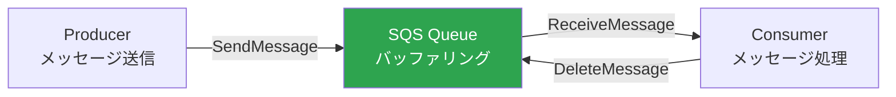
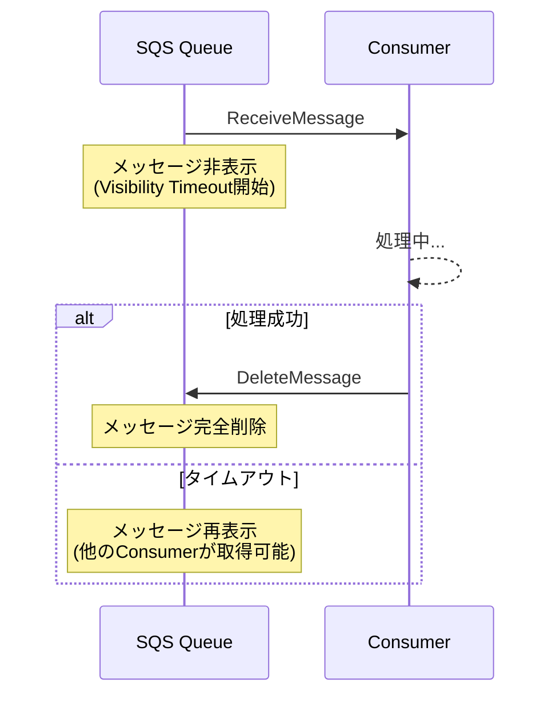
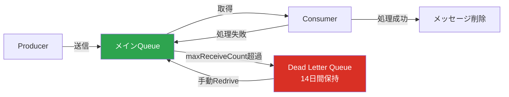
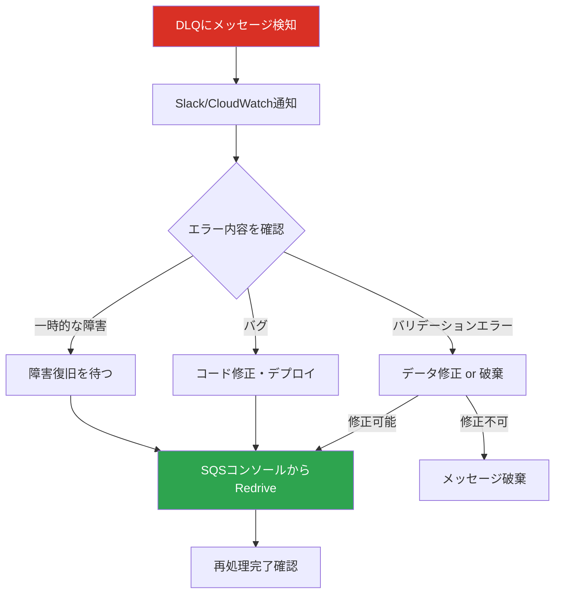

## はじめに

分散システムにおいて、サービス間の非同期通信は避けて通れないテーマである。Amazon SQS（Simple Queue Service）は、AWSが提供するフルマネージドなメッセージキューイングサービスで、システム間の疎結合を実現するための中核的なサービスだ。

本記事では、SQSの基本概念からDLQ（Dead Letter Queue）の運用、そしてRedriveによる障害復旧まで、実務で必要となる知識を体系的に解説する。

---

## メッセージキューイングの基本概念

メッセージキューイングとは、送信側（Producer）と受信側（Consumer）の間にキュー（待ち行列）を挟むことで、両者を疎結合にする通信パターンである。

### 登場人物

- **Producer（プロデューサー）**: メッセージをキューに送信する側。APIサーバーやバッチ処理などがこの役割を担う
- **Queue（キュー）**: メッセージを一時的に保持するバッファ。Producerが送信したメッセージをConsumerが取得するまで保持する
- **Consumer（コンシューマー）**: キューからメッセージを取得し、処理する側。Lambda関数やECSタスクなどが該当する



### なぜキューを挟むのか

キューを挟むことで得られる主な利点は以下の通りである。

1. **疎結合**: ProducerはConsumerの存在を意識しなくてよい。Consumerがダウンしていても、メッセージはキューに蓄積される
2. **負荷の平準化**: 一時的なスパイクが発生しても、キューがバッファとなりConsumerは自分のペースで処理できる
3. **スケーラビリティ**: Consumerを水平にスケールさせることで、処理能力を柔軟に調整できる
4. **耐障害性**: Consumer側で一時的な障害が発生しても、メッセージは失われない

---

## Amazon SQSとは

Amazon SQSはAWSが提供するフルマネージドなメッセージキューイングサービスである。サーバーの管理が不要で、事実上無制限のスループットを持つ。

### Standard Queue と FIFO Queue

SQSには2種類のキュータイプがある。

#### Standard Queue

- **ほぼ無制限のスループット**: 1秒あたりのAPI呼び出し数に実質的な上限がない
- **少なくとも1回の配信（At-Least-Once Delivery）**: まれにメッセージが重複して配信される可能性がある
- **ベストエフォートの順序保証**: メッセージの順序は保証されない。送信した順序と異なる順序で配信される可能性がある
- **ユースケース**: バックグラウンドジョブ、通知処理、ログ収集など、順序や重複に対して許容できる処理

#### FIFO Queue

- **正確な1回の処理（Exactly-Once Processing）**: 重複を排除し、各メッセージが正確に1回だけ処理される
- **先入先出の順序保証**: メッセージは送信された順序で配信される
- **スループット制限**: デフォルトで1秒あたり300メッセージ（バッチ処理で3,000メッセージ）。高スループットモードを有効にするとさらに増加する
- **キュー名の末尾が `.fifo`**: 命名規則として、FIFOキューの名前は `.fifo` で終わる必要がある
- **ユースケース**: 注文処理、金融トランザクション、順序が重要な処理

#### どちらを選ぶか

実務では、まずStandard Queueを検討するのが一般的である。FIFOキューはスループットに制限があり、コストもやや高い。「順序保証」や「重複排除」が本当に必要かどうかを見極めることが重要だ。Consumer側で冪等性（同じメッセージを複数回処理しても結果が変わらないこと）を担保できるなら、Standard Queueで十分なケースが多い。

---

## Visibility Timeout（可視性タイムアウト）

Visibility Timeoutは、SQSの動作を理解する上で極めて重要な概念である。

### 仕組み

1. ConsumerがキューからメッセージをReceive（受信）する
2. そのメッセージは他のConsumerから**一時的に見えなくなる**（Visibility Timeout期間中）
3. Consumerが処理を完了し、メッセージをDelete（削除）する
4. もしVisibility Timeout内にDeleteされなければ、メッセージは再びキューに戻り、他のConsumerから取得可能になる

### なぜこの仕組みが必要か

SQSはPull型のメッセージングサービスである。Consumerがメッセージを「受信」しただけでは、SQSはそのメッセージが正しく処理されたかどうかを知ることができない。Visibility Timeoutは「このConsumerが処理中だから、他のConsumerには見せない」という猶予期間を設けることで、二重処理を防ぎつつ、処理失敗時の再配信を可能にしている。



### 設定の考え方

- **デフォルト値**: 30秒
- **設定範囲**: 0秒 ~ 12時間
- Consumerの処理にかかる最大時間よりも長く設定する必要がある
- 短すぎると、処理中なのにメッセージが再度キューに現れ、二重処理が発生する
- 長すぎると、処理失敗時の再配信が遅れる

たとえば、Lambda関数のタイムアウトが60秒なら、Visibility Timeoutは余裕を持って90秒～120秒程度に設定するのが望ましい。AWS公式ドキュメントでは、Lambda関数のタイムアウトの6倍をVisibility Timeoutに設定することを推奨している。

---

## SQSの主要設定項目

SQSキューを作成する際に設定する主要なパラメータを整理する。

### VisibilityTimeout（可視性タイムアウト）

前述の通り、メッセージが受信された後に他のConsumerから見えなくなる期間。

- デフォルト: 30秒
- 範囲: 0秒 ~ 12時間

### MessageRetentionPeriod（メッセージ保持期間）

メッセージがキューに保持される最大期間。この期間を過ぎると、メッセージは自動的に削除される。

- デフォルト: 4日（345,600秒）
- 範囲: 60秒 ~ 14日（1,209,600秒）
- **最大14日間**という制限は、DLQ運用において非常に重要なポイントである。DLQに溜まったメッセージも14日を過ぎると消えてしまうため、それまでに調査・対応を完了する必要がある

### MaximumMessageSize（最大メッセージサイズ）

1メッセージの最大サイズ。

- デフォルト: 256KB
- 範囲: 1バイト ~ 256KB
- 256KBを超えるデータを扱いたい場合は、S3にデータを置き、SQSメッセージにはS3のパスだけを含める「Claim Checkパターン」を使う

### DelaySeconds（配信遅延）

メッセージがキューに投入されてから、Consumerに見えるようになるまでの遅延時間。

- デフォルト: 0秒
- 範囲: 0秒 ~ 15分
- ユースケース: 一定時間後に処理を開始したい場合（例: 注文キャンセル猶予期間）

### ReceiveMessageWaitTimeSeconds（ロングポーリング待機時間）

ReceiveMessage APIがメッセージを待つ最大時間。0に設定するとショートポーリング、1以上でロングポーリングとなる。

- デフォルト: 0秒（ショートポーリング）
- 範囲: 0秒 ~ 20秒
- **ロングポーリングの推奨**: ショートポーリングはキューが空でも即座にレスポンスを返すため、空のレスポンスに対してもAPI呼び出し料金が発生する。ロングポーリング（20秒推奨）を設定すると、メッセージが届くか待機時間が経過するまで待ってくれるため、不要なAPI呼び出しを削減できる

---

## DLQ（Dead Letter Queue）とは

DLQ（Dead Letter Queue、デッドレターキュー）は、正常に処理できなかったメッセージを退避させるための専用キューである。

### なぜDLQが必要か

Consumerがメッセージの処理に失敗すると、Visibility Timeout経過後にメッセージはキューに戻り、再度Consumerに配信される。しかし、メッセージ自体に問題がある場合（不正なJSON、必要なフィールドが欠落しているなど）、何度再配信しても処理は永久に成功しない。

このような「ポイズンメッセージ」が元のキューに居座り続けると、以下の問題が生じる。

- Consumerのリソースが無駄に消費される
- 同じエラーログが繰り返し出力される
- 正常なメッセージの処理が遅延する可能性がある
- CloudWatchのメトリクスやアラームがノイズだらけになる

DLQはこのような問題を解決するために、一定回数処理に失敗したメッセージを別のキューに移す仕組みを提供する。

### maxReceiveCount の設定

DLQの動作は「リドライブポリシー（Redrive Policy）」で制御する。主要な設定は `maxReceiveCount` である。

- **maxReceiveCount**: メッセージが何回受信されたらDLQに移すかを指定する
- 例: `maxReceiveCount = 3` の場合、メッセージが3回受信されても正常に削除されなければ、DLQに移される

設定例として、元のキュー（ソースキュー）に対してリドライブポリシーを設定する。

```
ソースキューのリドライブポリシー:
  deadLetterTargetArn: DLQのARN
  maxReceiveCount: 3
```

maxReceiveCountの値は、処理内容に応じて決定する。一時的な障害（ネットワークエラー、外部APIのタイムアウトなど）で失敗する可能性がある場合は、3～5回程度に設定しておくことで、一時障害からの自動復旧を期待できる。

### DLQにメッセージが到達するケース

実務で遭遇するDLQ行きの代表的なケースを挙げる。

1. **メッセージのフォーマット不正**: JSONパースエラーなど、メッセージ自体に問題がある
2. **バリデーションエラー**: 必要なフィールドが欠落している、値が不正である
3. **外部サービスの長時間ダウン**: 依存先APIが数時間ダウンし、maxReceiveCountを超えた
4. **Consumer側のバグ**: デプロイ直後のバグにより、特定のパターンのメッセージが処理できない
5. **リソース制約**: メモリ不足やタイムアウトにより処理が完了できない
6. **権限不足**: Consumer（Lambda関数など）がDynamoDBやS3にアクセスする権限がない



### DLQ作成時の注意点

- DLQは通常のSQSキューと同じものである。特別なキュータイプがあるわけではない
- ソースキューがStandard Queueなら、DLQもStandard Queueにする
- ソースキューがFIFO Queueなら、DLQもFIFO Queueにする（名前の末尾が `.fifo`）
- DLQのメッセージ保持期間は、ソースキューと同じか、それ以上にするのが望ましい。調査に時間がかかることを考慮し、最大の14日間に設定するケースが多い

---

## Redrive（リドライブ）とは

Redriveとは、DLQに溜まったメッセージを元のソースキューに戻す操作のことである。障害の原因を特定・修正した後に、DLQに退避されたメッセージを再処理するために行う。

### なぜRedriveは手動が推奨されるのか

DLQからの自動Redriveを設定したくなるかもしれないが、これは避けるべきである。理由は明確だ。

**すべてのメッセージが再処理可能とは限らない**。

DLQにあるメッセージの中には、以下のように再処理しても意味がないものが含まれている可能性がある。

- **ValidationError**: メッセージ自体が不正なフォーマットであり、何度処理しても失敗する
- **ビジネスロジック上の矛盾**: 既に別の手段で処理が完了しており、再処理すると二重処理になる
- **不正なデータ**: 悪意のあるリクエストや、テスト用のゴミデータ
- **期限切れ**: 時間制約のある処理で、既に期限が過ぎている

自動Redriveを設定すると、これらのメッセージが元のキューに戻され、再び処理に失敗し、DLQに戻り...という無限ループに陥る可能性がある。

したがって、Redriveは以下のフローで手動実施するのが正しい運用である。

1. DLQのメッセージ内容を確認する
2. 障害の原因を調査する
3. 原因を修正する（Consumer側のバグ修正、外部サービスの復旧確認など）
4. 再処理して問題ないメッセージかどうかを判断する
5. 問題ないメッセージのみをRedriveする
6. 再処理不可能なメッセージは、ログに記録した上でDLQから削除する



### Redriveの具体的な手順

#### AWSコンソールでのRedrive

AWSマネジメントコンソールには、2021年12月から「DLQリドライブ」機能が追加されている。

1. SQSコンソールでDLQを選択する
2. 「DLQリドライブの開始」ボタンをクリックする
3. リドライブ先（ソースキュー）を確認する
4. 「DLQリドライブ」を実行する

この機能では、DLQの全メッセージを一括でソースキューに戻すことができる。メッセージ単位の選択的なRedriveはコンソールからは行えないため、部分的にRedriveしたい場合はCLIやSDKを使う必要がある。

#### AWS CLIでのRedrive

AWS CLIを使ったRedriveの手順は以下の通りである。

**ステップ1: Redriveの開始**

```bash
aws sqs start-message-move-task \
  --source-arn arn:aws:sqs:ap-northeast-1:123456789012:my-queue-dlq \
  --destination-arn arn:aws:sqs:ap-northeast-1:123456789012:my-queue \
  --max-number-of-messages-per-second 10
```

`--max-number-of-messages-per-second` を指定することで、Consumerへの負荷を制御しながらRedriveできる。省略すると最大速度で移動する。

**ステップ2: Redriveの進行状況を確認**

```bash
aws sqs list-message-move-tasks \
  --source-arn arn:aws:sqs:ap-northeast-1:123456789012:my-queue-dlq
```

レスポンスの `Status` フィールドで、`RUNNING`、`COMPLETED`、`CANCELLING`、`CANCELLED`、`FAILED` のいずれかを確認できる。

**ステップ3: 必要に応じてRedriveをキャンセル**

```bash
aws sqs cancel-message-move-task \
  --task-handle <task-handle-from-start-response>
```

---

## SQSとLambdaの連携パターン

SQSとLambdaの連携は、サーバーレスアーキテクチャにおける最も一般的なパターンの1つである。

### イベントソースマッピング

LambdaにはSQSキューをイベントソースとして設定する「イベントソースマッピング」機能がある。これを設定すると、Lambda側が自動的にSQSキューをポーリングし、メッセージが到着するとLambda関数を呼び出す。

### バッチサイズの考え方

イベントソースマッピングの `BatchSize` は、1回のLambda呼び出しで渡されるメッセージの最大数を指定する。

- **デフォルト**: 10
- **範囲**: 1 ~ 10,000（Standard Queue）、1 ~ 10（FIFO Queue）

バッチサイズの設定で考慮すべきポイントは以下の通りである。

- **バッチサイズが大きい場合**: Lambda呼び出し回数が減り、コスト効率が向上する。ただし、バッチ内の1件でも処理に失敗すると、デフォルトではバッチ全体がリトライ対象となる
- **バッチサイズが小さい場合**: 処理が細かく分かれるため、失敗時の影響範囲が小さい。ただし、Lambda呼び出し回数が増える
- **部分バッチレスポンス（Partial Batch Response）**: `ReportBatchItemFailures` を有効にすると、バッチ内で失敗したメッセージだけをリトライ対象にできる。これは多くのケースで有効にすべき設定である

### MaximumBatchingWindowInSeconds

バッチサイズに加えて、`MaximumBatchingWindowInSeconds` を設定することで、指定した秒数だけメッセージを貯めてからLambdaを呼び出すことができる。

- メッセージの到着頻度が低い場合、1件ずつLambdaが起動されるのは非効率
- `MaximumBatchingWindowInSeconds = 5` に設定すると、最大5秒間メッセージを貯めてからバッチとして渡す
- バッチサイズに達するか、バッチウィンドウの時間が経過するかのどちらか早い方でLambdaが起動する

### Lambda関数のタイムアウトとVisibility Timeout

Lambda関数のタイムアウトとSQSのVisibility Timeoutの関係は重要である。

- Lambda関数のタイムアウト < Visibility Timeout にする必要がある
- AWSの推奨: Visibility Timeout = Lambda関数のタイムアウト × 6
- Lambda関数がタイムアウトしてもメッセージがまだ不可視状態であれば、別のLambdaインスタンスが同じメッセージを重複処理することを防げる

---

## SQSとEventBridge Pipeの連携

Amazon EventBridge Pipesは、SQSキューをソースとして、メッセージの変換やフィルタリングを行った上で、ターゲット（Lambda、Step Functions、別のSQSキュー、API Gatewayなど）にメッセージを配信するサービスである。

### EventBridge Pipeの利点

- **フィルタリング**: Pipe内でメッセージをフィルタリングし、条件に合うメッセージだけをターゲットに送れる
- **変換**: InputTransformerを使って、メッセージのフォーマットを変換できる
- **グルーコード不要**: Lambda関数を書かなくても、SQSからのメッセージをそのまま別サービスに連携できる

### ユースケース

- SQSメッセージの特定のフィールドに基づいてフィルタリングし、条件に合うものだけStep Functionsに渡す
- SQSメッセージのフォーマットを変換してAPI Gatewayに送る
- 複数のSQSキューからのメッセージを統合的にハンドリングする

---

## メッセージの順序保証とFIFOキュー

### FIFOキューの仕組み

FIFOキューでは、メッセージグループID（MessageGroupId）という概念が重要になる。

- **MessageGroupId**: 同じMessageGroupIdを持つメッセージは、送信された順序で配信される
- 異なるMessageGroupIdを持つメッセージ間の順序は保証されない
- MessageGroupIdを使うことで、「ユーザーAの注文は順序通り処理する」「ユーザーBの注文も順序通り処理する」「ただしAとBの間の順序は問わない」という設計が可能になる

### MessageDeduplicationId

FIFOキューでは、重複排除のために `MessageDeduplicationId` を使用する。

- 同じ `MessageDeduplicationId` のメッセージは、5分間のウィンドウ内で重複排除される
- `ContentBasedDeduplication` を有効にすると、メッセージ本文のSHA-256ハッシュを自動的にDeduplicationIdとして使用する

---

## 実務でのDLQ運用フロー

実際の現場では、DLQの運用を以下のようなフローで行う。

### 1. 監視・通知の設定

DLQにメッセージが入ったことを検知するために、CloudWatchアラームを設定する。

- **監視メトリクス**: `ApproximateNumberOfMessagesVisible`
- **閾値**: 0より大きい（DLQにメッセージが1件でも入ったら通知）
- **通知先**: SNSトピック経由でSlack、PagerDuty、メールなどに通知

### 2. 調査

通知を受けたら、以下の手順で調査する。

- DLQのメッセージ内容を確認する（AWSコンソール or CLI）
- メッセージの属性（送信時刻、受信回数など）を確認する
- ソースキューに紐づくConsumer（Lambda関数など）のログを確認する
- エラーの原因を特定する

### 3. 修正

原因に応じた修正を行う。

- Consumer側のバグ修正 → デプロイ
- 外部サービスの障害 → 復旧を待つ or ワークアラウンドを実装
- データの不正 → データ修正 or 手動対応

### 4. Redriveまたは削除

- 修正後、再処理可能なメッセージはRedriveする
- 再処理不可能・不要なメッセージは、内容をログに記録した上でDLQから削除する

### 5. 再発防止

- エラーの原因を振り返り、同様の問題が再発しないよう対策を講じる
- 必要に応じてバリデーションの強化、エラーハンドリングの改善、テストの追加を行う

---

## CloudWatch メトリクスによるDLQ監視

SQSキューに対してCloudWatchで監視できる主要なメトリクスを整理する。

### SQSの主要メトリクス

| メトリクス名 | 意味 |
|---|---|
| `ApproximateNumberOfMessagesVisible` | 取得可能なメッセージ数 |
| `ApproximateNumberOfMessagesNotVisible` | 処理中（Visibility Timeout中）のメッセージ数 |
| `ApproximateNumberOfMessagesDelayed` | 遅延配信中のメッセージ数 |
| `NumberOfMessagesSent` | キューに送信されたメッセージ数 |
| `NumberOfMessagesReceived` | キューから受信されたメッセージ数 |
| `NumberOfMessagesDeleted` | キューから削除されたメッセージ数 |
| `ApproximateAgeOfOldestMessage` | キュー内の最も古いメッセージの経過時間 |
| `SentMessageSize` | 送信されたメッセージのサイズ |

### DLQ監視で特に重要なメトリクス

- **`ApproximateNumberOfMessagesVisible` > 0**: DLQにメッセージが存在する。即座に対応が必要
- **`ApproximateAgeOfOldestMessage`**: DLQ内の最も古いメッセージがいつから滞留しているかを示す。メッセージ保持期間（最大14日）を超えるとメッセージが消失するため、この値が大きくなっていないかを監視する

### アラーム設定の例

DLQに対する最低限のアラーム設定は以下のようになる。

- **メトリクス**: `ApproximateNumberOfMessagesVisible`
- **統計**: Sum
- **期間**: 1分
- **閾値**: 1以上
- **アクション**: SNSトピックに通知
- **評価期間**: 1期間（1分間で1回でも条件を満たしたらアラーム）

加えて、以下のアラームも設定しておくと安心である。

- **`ApproximateAgeOfOldestMessage`が一定時間を超えた場合のアラーム**: DLQのメッセージが長期間放置されていないかを検知する。たとえば、7日を超えたら警告、12日を超えたら緊急通知とする

---

## 補足: SQSの料金体系

SQSの料金は、APIリクエスト数に基づいて課金される。

- **Standard Queue**: 最初の100万リクエスト/月は無料。以降、100万リクエストあたり一定の料金
- **FIFO Queue**: Standard Queueよりもやや高い料金設定
- 1回のAPIリクエストで最大10件のメッセージをバッチ処理できるため、SendMessageBatchやDeleteMessageBatchを活用するとコスト削減になる
- 64KBを1リクエストとしてカウントする。256KBのメッセージは4リクエストとしてカウントされる

ロングポーリングを使って空のReceiveMessageレスポンスを減らすことも、コスト削減に有効である。

---

## まとめ

SQS、DLQ、Redriveは、分散システムの信頼性を支える重要な仕組みである。特に押さえておきたいポイントをまとめる。

- SQSは疎結合・負荷平準化・耐障害性を実現するフルマネージドなメッセージキュー
- Standard Queueが基本。FIFOは順序保証・重複排除が本当に必要な場合のみ選択する
- Visibility Timeoutは、二重処理防止と再配信の仕組みの要
- DLQは処理不能なメッセージの退避先。maxReceiveCountで閾値を設定する
- Redriveは手動で行い、再処理可能かどうかを判断した上で実行する
- メッセージの保持期間は最大14日。DLQのメッセージもこの制限に従う
- CloudWatchアラームでDLQを常時監視し、メッセージが入ったら即座に対応する体制を整える

これらの概念を正しく理解し、適切な設定と運用フローを構築することで、安定した非同期処理基盤を実現できる。

---

## 参考文献

- [Amazon SQS 開発者ガイド](https://docs.aws.amazon.com/AWSSimpleQueueService/latest/SQSDeveloperGuide/welcome.html)
- [Amazon SQS デッドレターキュー](https://docs.aws.amazon.com/AWSSimpleQueueService/latest/SQSDeveloperGuide/sqs-dead-letter-queues.html)
- [デッドレターキューのリドライブ](https://docs.aws.amazon.com/AWSSimpleQueueService/latest/SQSDeveloperGuide/sqs-configure-dead-letter-queue-redrive.html)
- [Amazon SQS の可視性タイムアウト](https://docs.aws.amazon.com/AWSSimpleQueueService/latest/SQSDeveloperGuide/sqs-visibility-timeout.html)
- [Amazon SQS の料金](https://aws.amazon.com/sqs/pricing/)
