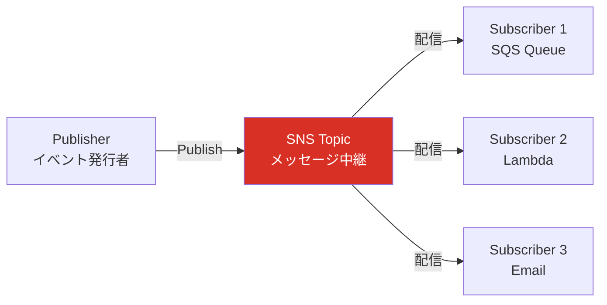
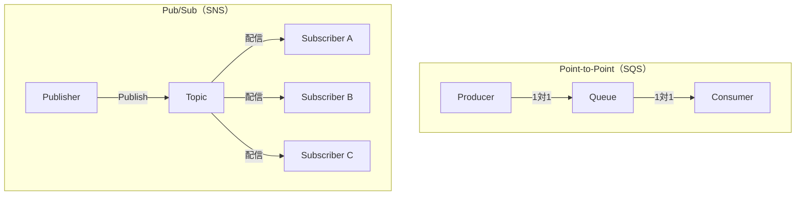
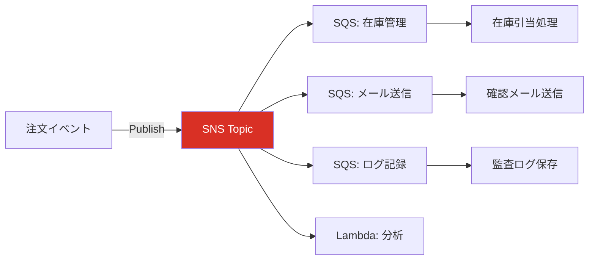
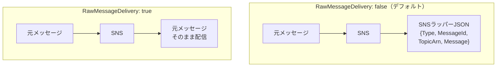

## はじめに

マイクロサービスやイベント駆動アーキテクチャにおいて、「1つのイベントを複数のサービスに配信する」というニーズは非常に多い。Amazon SNS（Simple Notification Service）は、このようなPub/Sub（出版/購読）パターンを実現するためのAWSのフルマネージドサービスである。

本記事では、Pub/Subパターンの基本概念からSNSの詳細設定、ファンアウトパターン、RawMessageDeliveryの使い分け、そして実務での設計パターンまでを包括的に解説する。

---

## Pub/Sub（出版/購読）パターンとは

Pub/Sub（Publish/Subscribe）パターンは、メッセージの送信側と受信側を完全に切り離すメッセージングパターンである。

### 基本的な構造

- **Publisher（出版者）**: イベント（メッセージ）を発行する側。Publisherは「誰がそのメッセージを受け取るか」を知らない
- **Topic（トピック）**: メッセージの中継地点。Publisherが発行したメッセージを受け取り、登録されたSubscriberに配信する
- **Subscriber（購読者）**: Topicに対して購読を登録し、メッセージを受信する側。自分が関心のあるTopicだけを購読する



### Point-to-Point との違い

メッセージングパターンには大きく2つの種類がある。

- **Point-to-Point（1対1）**: 1つのメッセージは1つのConsumerだけが受信する。SQSがこのパターンに該当する
- **Pub/Sub（1対多）**: 1つのメッセージが複数のSubscriberに同時に配信される。SNSがこのパターンに該当する

この違いを理解することが、SNSとSQSの使い分けの基盤となる。



### Pub/Subの利点

1. **疎結合**: PublisherはSubscriberの存在を知らなくてよい。新しいSubscriberを追加してもPublisher側の変更は不要
2. **拡張性**: 新しい処理を追加する際、既存のコードを変更せずにSubscriberを追加するだけでよい
3. **関心の分離**: 各Subscriberは自分の関心事だけを処理する。注文イベントに対して、在庫管理・メール送信・ログ記録をそれぞれ独立して実装できる

---

## Amazon SNSの基本

Amazon SNS（Simple Notification Service）は、AWSが提供するフルマネージドなPub/Subメッセージングサービスである。

### 主な構成要素

#### Topic（トピック）

メッセージの配信先となるチャネル。Publisherはこのトピックにメッセージを発行する。

- Standard Topic: 順序保証なし、ほぼ無制限のスループット
- FIFO Topic: 順序保証あり、重複排除あり（後述）

#### Subscription（サブスクリプション）

トピックに対する購読設定。「どのエンドポイントに、どのプロトコルで配信するか」を定義する。

#### Publisher（パブリッシャー）

トピックにメッセージを発行するアプリケーション。SNSのPublish APIを呼び出す。

### SNSのサブスクリプションタイプ

SNSは、複数のプロトコルでメッセージを配信できる。主なサブスクリプションタイプは以下の通りである。

#### SQS

- SNSメッセージをSQSキューに配信する
- 最も一般的な組み合わせ。ファンアウト + バッファリングの構成に使用する
- 後述のRawMessageDeliveryの設定がこの組み合わせで特に重要になる

#### Lambda

- SNSメッセージを直接Lambda関数に配信する
- メッセージ到着時に自動的にLambda関数が呼び出される
- 同期的な処理が必要な場合や、簡単な変換処理に適している

#### HTTP/HTTPS

- SNSメッセージをHTTPエンドポイントにPOSTリクエストとして配信する
- 外部のWebhookやマイクロサービスにイベントを通知する場合に使用する
- サブスクリプション確認（Subscription Confirmation）のフローが必要

#### Email / Email-JSON

- メールアドレスにメッセージを配信する
- 運用通知やアラートに使用する
- Email-JSONはJSON形式で配信する

#### SMS

- 電話番号にSMSメッセージを配信する
- 二要素認証やアラート通知に使用する

#### Kinesis Data Firehose

- メッセージをKinesis Data Firehose経由でS3、Redshift、OpenSearchなどに配信する
- ログやイベントのアーカイブに使用する

---

## ファンアウト（Fan-out）パターン

ファンアウトは、SNSの最も代表的な利用パターンである。1つのイベントを複数の宛先に同時配信する構成を指す。

### 基本的なファンアウト

たとえば、ECサイトで注文が確定したイベントを考える。

```
注文確定イベント → SNS Topic
                    ├── SQS (在庫管理キュー) → Lambda (在庫更新)
                    ├── SQS (メール通知キュー) → Lambda (確認メール送信)
                    ├── SQS (分析キュー) → Lambda (データ分析)
                    └── Lambda (リアルタイムダッシュボード更新)
```

Publisher（注文サービス）は、SNSトピックにメッセージを1回だけPublishすればよい。各Subscriberは独立して処理を行う。



### ファンアウトの利点

1. **Publisher側のシンプルさ**: 送信先が増えても、Publisherのコードは変更不要
2. **独立した処理**: 各Subscriberの処理は独立しており、1つが失敗しても他に影響しない
3. **段階的な拡張**: 新しい機能を追加する際、新しいSubscriberを追加するだけでよい

### SNS + SQS ファンアウトパターン

ファンアウトにおいて、SNSのSubscriberとしてSQSを挟むのは非常に一般的である。この構成には以下の理由がある。

- **バッファリング**: Consumerが一時的にダウンしても、メッセージはSQSに蓄積される
- **リトライ**: SQSのVisibility Timeoutによる自動リトライが使える
- **DLQ**: 処理失敗メッセージの退避先を設定できる
- **バッチ処理**: SQSからバッチでメッセージを取得できるため、効率的な処理が可能

SNS → Lambdaの直接連携だと、Lambda呼び出しが失敗した場合のリトライはSNS側のリトライポリシーに依存する。SNS → SQS → Lambdaの構成にすることで、SQSの堅牢なリトライ・DLQ機構を活用できる。

---

## RawMessageDelivery の詳細

RawMessageDeliveryは、SNSのサブスクリプションに対して設定できるオプションで、メッセージの配信フォーマットに影響する。

### RawMessageDelivery: false（デフォルト）の場合

SNSがSQSにメッセージを配信する際、デフォルトではSNSが独自のラッパーJSON（エンベロープ）でメッセージを包んで配信する。

SQSに届くメッセージの Body は以下のような構造になる。

```json
{
  "Type": "Notification",
  "MessageId": "xxxx-xxxx-xxxx",
  "TopicArn": "arn:aws:sns:ap-northeast-1:123456789012:my-topic",
  "Subject": "...",
  "Message": "{\"orderId\": \"12345\", \"amount\": 5000}",
  "Timestamp": "2026-04-02T12:00:00.000Z",
  "SignatureVersion": "1",
  "Signature": "...",
  "SigningCertURL": "...",
  "UnsubscribeURL": "..."
}
```

注目すべき点は、実際のメッセージ本文が `Message` フィールドの中に**文字列として**格納されていることである。つまり、Consumer側でSQSメッセージのBodyをパースした後、さらに `Message` フィールドの値をパースする二重のJSONパースが必要になる。

### RawMessageDelivery: true の場合

RawMessageDeliveryを有効にすると、SNSのラッパーJSONが省略され、Publisherが送信した元のメッセージがそのままSQSに配信される。

SQSに届くメッセージの Body は以下のようになる。

```json
{
  "orderId": "12345",
  "amount": 5000
}
```

Consumer側はSQSメッセージのBodyを1回パースするだけで、元のメッセージにアクセスできる。



### RawMessageDeliveryを使う場面

以下のケースでは、RawMessageDelivery: trueを設定するのが望ましい。

- **SQSサブスクリプション**: Consumer側のパース処理がシンプルになる。最も一般的なユースケース
- **Kinesis Data Firehoseサブスクリプション**: ログやデータをそのまま保存したい場合
- **HTTP/HTTPSサブスクリプション**: エンドポイント側でSNSエンベロープのパースを行いたくない場合
- **既存のConsumerがSNSを経由しない前提で作られている場合**: SQSから直接メッセージを受け取る設計で作られたConsumerを、SNS経由に変更する場合、RawMessageDeliveryを有効にすればConsumer側の変更が不要になる

### RawMessageDeliveryを使わない場面

以下のケースでは、RawMessageDelivery: falseのままにする理由がある。

- **SNSのメタデータが必要な場合**: TopicArn、MessageId、Timestampなど、SNSが付与するメタデータをConsumer側で利用したい場合
- **署名検証を行いたい場合**: SNSの署名（Signature）を検証してメッセージの真正性を確認したい場合。これはHTTP/HTTPSエンドポイントでセキュリティ上重要になることがある
- **Emailサブスクリプション**: RawMessageDeliveryはEmail/SMS/Lambdaサブスクリプションでは使用できない

### 実務での推奨

SNS + SQSの構成では、特別な理由がない限り **RawMessageDelivery: true を設定する** のが実務での推奨事項である。Consumer側のコードがシンプルになり、パース処理のバグも減る。

---

## SNSのメッセージフィルタリング

SNSのサブスクリプションフィルタポリシーを使うと、トピックに発行されたメッセージのうち、条件に合致するものだけを特定のサブスクリプションに配信できる。

### フィルタポリシーの仕組み

フィルタポリシーは、サブスクリプション単位で設定する。フィルタの対象は以下の2つから選べる。

- **MessageAttributes（メッセージ属性）ベース**: メッセージ属性のキーと値に基づいてフィルタリングする（デフォルト）
- **MessageBody（メッセージ本文）ベース**: メッセージ本文のJSONフィールドに基づいてフィルタリングする

### フィルタポリシーの例

たとえば、注文イベントに `orderType` というメッセージ属性がある場合、以下のようなフィルタポリシーを設定できる。

```json
{
  "orderType": ["premium"]
}
```

この設定をしたサブスクリプションは、`orderType` が `premium` のメッセージだけを受信する。

### フィルタ演算子

フィルタポリシーでは、以下の演算子が使用できる。

- **完全一致**: `["value1", "value2"]`
- **プレフィックス一致**: `[{"prefix": "order-"}]`
- **数値条件**: `[{"numeric": [">=", 100, "<", 1000]}]`
- **存在チェック**: `[{"exists": true}]` または `[{"exists": false}]`
- **否定**: `[{"anything-but": "rejected"}]`

### フィルタリングの利点

- **不要なメッセージの配信を防ぐ**: Consumer側でフィルタリングする必要がなくなる
- **コスト削減**: SQSへの不要なメッセージ配信が減り、SQSのリクエスト課金も削減できる
- **Consumer側のシンプル化**: 受信したメッセージは全て処理対象であるという前提でコードを書ける

---

## SNS vs SQS の違い

SNSとSQSは混同されやすいが、根本的に異なるサービスである。

### Push vs Pull

| 観点 | SNS | SQS |
|---|---|---|
| **配信モデル** | Push型（SNSがSubscriberに送る） | Pull型（ConsumerがSQSから取りに行く） |
| **メッセージの保持** | 保持しない。配信に失敗したら消える | キューにメッセージを保持する |
| **配信先** | 複数のSubscriberに同時配信 | 1つのConsumerが受信 |
| **リトライ** | SNSのリトライポリシーで制御 | Visibility Timeoutで制御 |
| **順序** | 保証なし（FIFO Topicを除く） | 保証なし（FIFO Queueを除く） |
| **バッファリング** | なし | あり |
| **DLQ** | SNS自体のDLQはサブスクリプションレベルで設定 | キューレベルで設定 |

### 使い分けの指針

- **1対多の配信が必要** → SNS
- **メッセージのバッファリングが必要** → SQS
- **1対多 + バッファリングの両方が必要** → SNS + SQS（ファンアウトパターン）
- **メッセージの配信保証を強くしたい** → SQS（メッセージが保持されるため）

---

## SNS vs EventBridge の使い分け

Amazon EventBridgeもイベント駆動アーキテクチャで使われるサービスであり、SNSとの使い分けが議論されることが多い。

### EventBridgeの特徴

- **ルールベースのフィルタリング**: イベントの内容に基づいて、複雑なルーティングルールを設定できる
- **スキーマレジストリ**: イベントスキーマの管理・発見が可能
- **SaaSインテグレーション**: Salesforce、Zendesk、Datadogなどのサードパーティイベントを受信できる
- **AWSサービスイベント**: EC2の状態変化、CodePipelineのステージ変更など、AWSサービスが自動的にEventBridgeにイベントを発行する
- **アーカイブ・リプレイ**: 過去のイベントをアーカイブし、必要に応じて再配信（リプレイ）できる

### 使い分けの指針

| 観点 | SNS | EventBridge |
|---|---|---|
| **スループット** | 非常に高い（ほぼ無制限） | SNSよりやや低い |
| **レイテンシ** | 低い | SNSよりやや高い |
| **フィルタリング** | サブスクリプションフィルタポリシー | 高度なイベントパターンルール |
| **ターゲット数** | 1トピックあたり最大12,500,000サブスクリプション | 1ルールあたり最大5ターゲット |
| **SaaS連携** | なし | あり |
| **スキーマ管理** | なし | あり |
| **アーカイブ・リプレイ** | なし | あり |
| **料金** | リクエスト数ベース | イベント数ベース（やや高い） |

### 具体的な判断基準

- **シンプルなファンアウト**: SNS。高スループット・低レイテンシが求められる場合に適している
- **複雑なイベントルーティング**: EventBridge。イベントの内容に基づいて異なるターゲットに振り分けたい場合
- **AWSサービスのイベント**: EventBridge。EC2、ECS、CodePipelineなどのイベントはEventBridgeに自動発行される
- **サードパーティ連携**: EventBridge。SaaSパートナーイベントを受信できる
- **過去のイベントのリプレイ**: EventBridge。アーカイブ・リプレイ機能が使える
- **大量のSubscriber**: SNS。EventBridgeの1ルールあたり5ターゲットの制限が厳しい場合

実務では、両者を組み合わせることも多い。たとえば、EventBridgeでイベントを受信・フィルタリングし、ターゲットとしてSNSトピックを指定してファンアウトする構成が使われる。

---

## メッセージの再配信とリトライポリシー

SNSの配信が失敗した場合のリトライ動作について理解しておく。

### 配信リトライポリシー

SNSは、サブスクリプションのプロトコルによって異なるリトライポリシーを持つ。

#### SQS / Lambda サブスクリプション

AWSマネージドなエンドポイントへの配信は、SNS側で自動的に3回リトライされる（即時リトライ × 2回 + バックオフ × 1回）。

#### HTTP/HTTPS サブスクリプション

カスタムリトライポリシーを設定できる。デフォルトでは以下の4フェーズでリトライが行われる。

1. **即時リトライフェーズ**: 失敗直後に3回リトライ
2. **プリバックオフフェーズ**: 2回リトライ（1秒間隔）
3. **バックオフフェーズ**: 10回リトライ（指数バックオフ、最大20秒間隔）
4. **ポストバックオフフェーズ**: 100,000回リトライ（20秒間隔）

合計100,015回のリトライが行われ、最大で約23日間リトライが継続する。

### SNSサブスクリプションのDLQ

SNSのサブスクリプション単位でDLQ（SQSキュー）を設定できる。全てのリトライが失敗した場合、メッセージはこのDLQに退避される。

これは「SNSからSubscriberへの配信が失敗した場合のDLQ」であり、「SQS ConsumerがSQSメッセージの処理に失敗した場合のDLQ」とは別物である。両方を設定しておくと、メッセージの損失を二重に防げる。

---

## FIFO SNS Topic

SNSにもFIFOバリアントが存在する。

### FIFO Topicの特徴

- **メッセージの順序保証**: 同じMessageGroupId内でメッセージの順序が保証される
- **重複排除**: MessageDeduplicationIdによる重複排除が行われる
- **サブスクリプション先の制限**: FIFO TopicのSubscriberはFIFO SQSキューに限定される。Lambda、HTTP、Emailなどは使えない

### FIFO Topicのユースケース

- 順序が重要なイベントを複数のFIFO SQSキューにファンアウトしたい場合
- 例: ユーザーのアカウント操作イベント（作成 → 更新 → 削除）を複数のサービスに順序通り配信する

### FIFO Topicの制限事項

- サブスクリプションプロトコルがSQS FIFOキューに限定される
- Standard Topicよりもスループットが低い
- トピック名の末尾が `.fifo` である必要がある

---

## 実務での設計パターンと注意点

### パターン1: 基本的なファンアウト

```
API Gateway → Lambda (Publisher) → SNS Topic
                                      ├── SQS Queue A → Lambda A
                                      ├── SQS Queue B → Lambda B
                                      └── SQS Queue C → Lambda C
```

各SQSキューにDLQを設定し、CloudWatchアラームでDLQを監視する構成が基本形となる。

### パターン2: フィルタリング付きファンアウト

全てのSubscriberが全メッセージを必要としない場合、サブスクリプションフィルタポリシーを活用する。

```
SNS Topic (orderEvents)
  ├── SQS Queue (premium-orders) [Filter: orderType = "premium"]
  ├── SQS Queue (standard-orders) [Filter: orderType = "standard"]
  └── SQS Queue (all-orders-analytics) [Filter: なし（全メッセージ）]
```

### パターン3: EventBridge + SNS の組み合わせ

```
EventBridge (AWSイベント / カスタムイベント)
  → EventBridge Rule (フィルタリング)
    → SNS Topic (ファンアウト)
      ├── SQS Queue A → Lambda A
      └── SQS Queue B → Lambda B
```

EventBridgeの高度なフィルタリングとSNSのファンアウトを組み合わせることで、柔軟かつスケーラブルなイベント駆動アーキテクチャを構築できる。

### 設計時の注意点

#### 1. サブスクリプションの確認（Confirmation）

HTTP/HTTPSやEmailのサブスクリプションは、作成後に確認（Confirmation）プロセスが必要である。SQSやLambdaのサブスクリプションは自動的に確認されるが、外部エンドポイントはConfirmation URLにアクセスする必要がある。

#### 2. メッセージサイズの制限

SNSのメッセージサイズの上限は **256KB** である。これはSQSと同じ制限だ。大きなペイロードを扱う場合は、S3にデータを保存し、SNSメッセージにはS3のパスを含めるClaim Checkパターンを使用する。

#### 3. サブスクリプションの権限

SNS TopicからSQSキューにメッセージを配信するには、SQSキューのアクセスポリシーでSNS Topicからの `sqs:SendMessage` を許可する必要がある。これを忘れると配信エラーが発生するが、エラーメッセージが分かりにくいことがあるため、設定時に必ず確認する。

#### 4. 配信の順序に関する注意

Standard SNS Topicでは、Subscriberへの配信順序は保証されない。また、各Subscriberへの配信は並行して行われるため、Subscriber Aに先に届いたメッセージがSubscriber Bに後から届くこともある。順序が重要な場合はFIFO Topicを使うか、Consumer側で順序制御のロジックを実装する必要がある。

#### 5. 冪等性の確保

SNSのStandard Topicは「少なくとも1回の配信」を保証するため、同じメッセージが複数回配信される可能性がある。Consumer側で冪等性を確保する設計が重要である。具体的には、メッセージIDや業務上のユニークキーを使って、処理済みかどうかを判定する仕組みを入れる。

#### 6. クロスアカウント配信

SNSは、異なるAWSアカウントのSQSキューやLambda関数にもメッセージを配信できる。マルチアカウント構成では、SNS TopicのアクセスポリシーとSubscriber側のリソースポリシーの両方を正しく設定する必要がある。

---

## SNSの料金体系

SNSの料金は、リクエスト数と配信先のプロトコルに基づいて課金される。

- **Publish API呼び出し**: 最初の100万リクエスト/月は無料。以降、100万リクエストあたり一定の料金
- **配信（Delivery）**: プロトコルによって異なる
  - SQS: 無料
  - Lambda: 無料
  - HTTP/HTTPS: 100万通知あたり一定の料金
  - Email: 10万通知あたり一定の料金
  - SMS: 送信先の国・地域によって異なる

SQSとLambdaへの配信は無料であるため、SNS + SQS / Lambdaの構成はコスト効率が高い。

---

## まとめ

Amazon SNSとPub/Subパターンについて、重要なポイントを振り返る。

- **Pub/Subパターン**は、PublisherとSubscriberを疎結合にし、1対多のメッセージ配信を実現する
- **SNSのファンアウト**により、1つのイベントを複数のサービスに同時配信できる
- **SNS + SQS**の組み合わせが最も一般的。バッファリング、リトライ、DLQの恩恵を受けられる
- **RawMessageDelivery: true**をSQSサブスクリプションに設定することで、SNSエンベロープを省略し、Consumer側のパース処理をシンプルにできる
- **サブスクリプションフィルタポリシー**で、Subscriber側で不要なメッセージの受信を防げる
- **SNS vs SQS**: Push型 vs Pull型、1対多 vs 1対1という根本的な違いがある
- **SNS vs EventBridge**: シンプルなファンアウトはSNS、複雑なルーティングやSaaS連携はEventBridge
- **FIFO Topic**: 順序保証が必要な場合に使えるが、サブスクリプション先がFIFO SQSに限定される
- **冪等性の確保**はConsumer側の責務。Standard Topicでは重複配信の可能性を常に考慮する

これらの知識を活用し、堅牢で拡張性の高いイベント駆動アーキテクチャを設計してほしい。

---

## 参考文献

- [Amazon SNS 開発者ガイド](https://docs.aws.amazon.com/sns/latest/dg/welcome.html)
- [Amazon SNS のメッセージフィルタリング](https://docs.aws.amazon.com/sns/latest/dg/sns-message-filtering.html)
- [Raw メッセージ配信](https://docs.aws.amazon.com/sns/latest/dg/sns-large-payload-raw-message-delivery.html)
- [SNS と SQS のファンアウトパターン](https://docs.aws.amazon.com/sns/latest/dg/sns-sqs-as-subscriber.html)
- [Amazon SNS FIFO トピック](https://docs.aws.amazon.com/sns/latest/dg/sns-fifo-topics.html)
