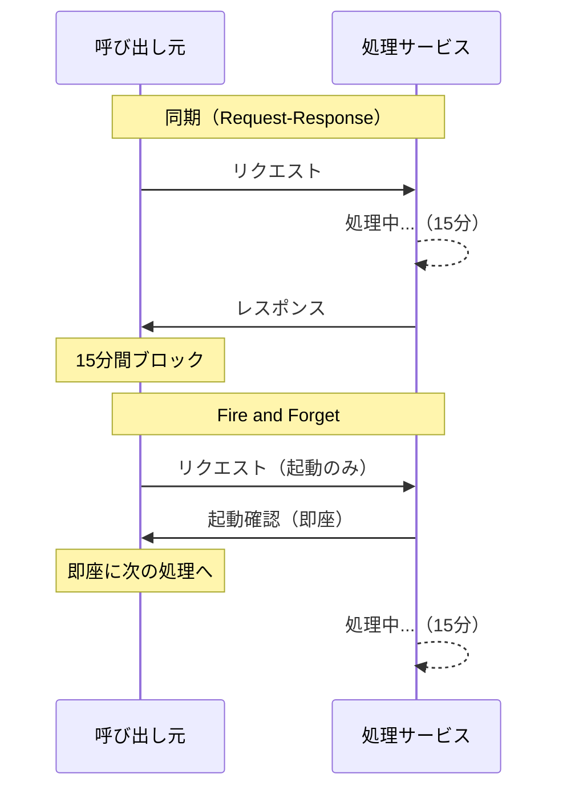
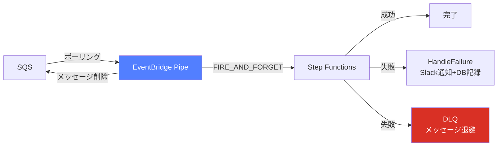
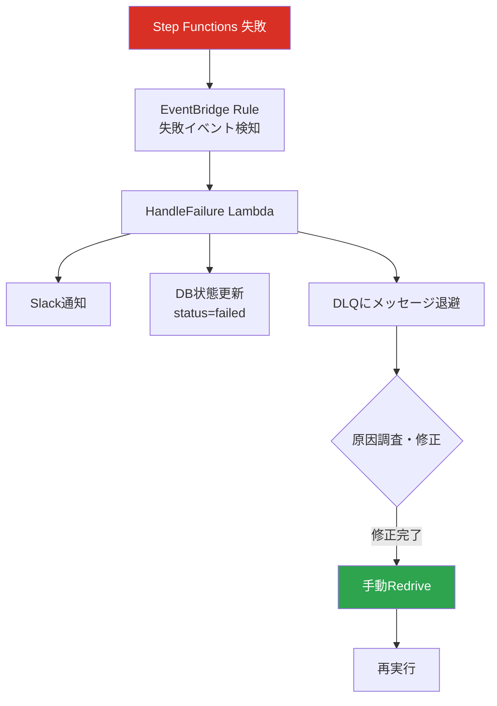
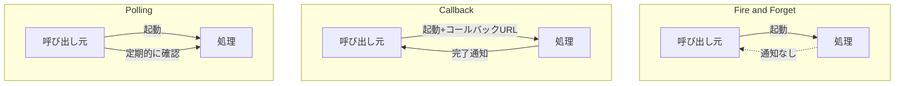

## Fire and Forget とは

Fire and Forget（ファイア・アンド・フォーゲット）は、処理の呼び出し側が「処理を起動したら、その結果を待たずに次に進む」非同期実行パターンである。軍事用語のミサイル発射（発射したら誘導不要）に由来する名前の通り、呼び出し側は処理の成否を関知しない。

日常的な例でいえば、手紙をポストに投函する行為がこれに近い。投函した瞬間に自分の作業は終わり、届いたかどうかの確認は別の仕組み（追跡番号など）に委ねる。

分散システムやマイクロサービスアーキテクチャでは、このパターンが頻繁に登場する。処理の応答を待つことでシステム全体のスループットが低下する場面や、そもそも処理が長時間かかるため応答を待てない場面で特に有効となる。

## 同期（Request-Response）との比較

まず、同期型の Request-Response モデルと Fire and Forget を整理しておく。

**Request-Response（同期）モデル：**
- 呼び出し側がリクエストを送り、レスポンスが返るまでブロックする
- 処理の成否を即座に知ることができる
- エラー時にその場でリトライや補償処理が可能
- 呼び出し側と処理側が密結合になる
- 処理時間が長い場合、呼び出し側がタイムアウトするリスクがある

**Fire and Forget（非同期）モデル：**
- 呼び出し側はリクエストを「投げっぱなし」にする
- 呼び出し側のレイテンシが極めて低い
- 処理の成否は別の仕組みで確認する必要がある
- 呼び出し側と処理側が疎結合になる
- 処理側がダウンしていても、メッセージがキューに残っていれば復旧後に処理できる

どちらが優れているかではなく、ユースケースに応じて使い分けるものである。たとえば「ユーザーに注文確認画面を返す」のは同期で行い、「注文後の在庫引き当てや配送手配」は非同期で行う、というのが典型的な組み合わせだ。



## AWS における Fire and Forget — EventBridge Pipe と Step Functions

AWS の実サービスで Fire and Forget がどう実現されるか、具体的なアーキテクチャを見ていこう。

### EventBridge Pipe → Step Functions の構成

EventBridge Pipe は、ソース（SQS、DynamoDB Streams、Kinesis など）からイベントを受け取り、ターゲットに転送するサービスである。ターゲットに Step Functions を指定した場合、呼び出しモードを `FIRE_AND_FORGET` または `REQUEST_RESPONSE` から選択できる。

**FIRE_AND_FORGET モード：**
- Pipe が Step Functions のステートマシンを起動し、即座に制御を返す
- ステートマシンの実行完了を待たない
- Pipe 側の処理は「起動成功」時点で完了扱いになる

**REQUEST_RESPONSE モード：**
- Pipe が Step Functions のステートマシンを起動し、実行完了まで待つ
- ステートマシンの結果（成功/失敗）を Pipe が受け取る
- 失敗時には SQS のリトライ機構が利用できる



### SQS メッセージが起動時点で削除される特性

ここで極めて重要な特性がある。EventBridge Pipe が SQS をソースとして使っている場合、**メッセージの削除タイミング**が FIRE_AND_FORGET モードと REQUEST_RESPONSE モードで大きく異なる。

**FIRE_AND_FORGET の場合：**
SQS メッセージは、Step Functions の起動が成功した時点で削除される。つまり、ステートマシンの実行が途中で失敗しても、元の SQS メッセージはもう存在しない。SQS の「処理に失敗したら VisibilityTimeout 後にメッセージが再度可視化される」という自動リトライの仕組みが使えなくなる。

**REQUEST_RESPONSE の場合：**
SQS メッセージは、Step Functions の実行が完了するまで保持される。ステートマシンが失敗した場合、メッセージは SQS に戻り、VisibilityTimeout 後に再処理される。

この違いは設計上の大きな分岐点となる。

## トレードオフ — SQS の自動リトライが使えなくなる

Fire and Forget を選択すると、SQS が本来持っている信頼性の仕組み（自動リトライ、DLQ への自動転送）をそのままでは活用できなくなる。これは「便利さと引き換えに安全装置を外す」行為に近い。

具体的に失われるもの：

1. **自動リトライ**: メッセージが削除されているため、処理失敗時に自動で再処理されない
2. **maxReceiveCount による DLQ 転送**: リトライ回数に基づく Dead Letter Queue への自動転送が機能しない
3. **メッセージの追跡可能性**: 元のメッセージ内容が SQS 上に残らない

これは単なる「機能の欠落」ではなく、意図的なトレードオフである。SQS のリトライに依存しない代わりに、処理側（Step Functions 側）で独自のリカバリ戦略を持つ必要がある。

## リカバリ戦略の必要性 — HandleFailure と DLQ

Fire and Forget でメッセージを失わないためには、処理側でエラーハンドリングとリカバリの仕組みを明示的に設計する必要がある。

### Step Functions における HandleFailure パターン

Step Functions では、ステートマシンの各ステップに `Catch` や `Retry` を定義できる。Fire and Forget で起動された場合、以下のような設計が推奨される。

**ステートマシン内部でのリトライ：**
各タスクステートに `Retry` を定義し、一時的な障害（ネットワークエラー、スロットリングなど）に対しては自動リトライを行う。`BackoffRate` を指定して指数バックオフを適用するのが一般的だ。

**Catch によるフォールバック：**
リトライを尽くしても失敗する場合、`Catch` でフォールバック先を定義する。このフォールバック先が HandleFailure ステートとなり、以下の処理を行う。

- 失敗したメッセージの内容を DLQ（Dead Letter Queue）に送信
- エラー内容のログ出力
- 障害通知の発行（SNS、Slack など）

**DLQ の設計：**
Step Functions 用の DLQ は、SQS の DLQ とは別に設計する。この DLQ に入ったメッセージは、運用チームが手動で確認・再処理するか、自動再処理の仕組みを別途構築する。

### リカバリの全体像

```
SQS → EventBridge Pipe → Step Functions（FIRE_AND_FORGET）
                              ├── 正常完了 → 処理終了
                              └── 失敗 → HandleFailure
                                          ├── DLQ にメッセージ保存
                                          ├── CloudWatch Logs にエラー記録
                                          └── SNS で障害通知
```

この構成であれば、SQS の自動リトライに頼らずとも、メッセージの消失を防ぎつつ障害対応が可能になる。



## REQUEST_RESPONSE（同期）モードとの詳細比較

両モードの選択基準をさらに深掘りする。

| 観点 | FIRE_AND_FORGET | REQUEST_RESPONSE |
|------|----------------|-----------------|
| SQS メッセージ削除 | 起動成功時 | 処理完了時 |
| SQS リトライ | 利用不可 | 利用可能 |
| Pipe の待機時間 | なし（即座に次のメッセージを処理） | ステートマシン完了まで |
| スループット | 高い | 処理時間に依存 |
| エラーハンドリング | 処理側で独自に実装 | SQS + Pipe に委任可能 |
| 適用可能な処理時間 | 制限なし | Pipe のタイムアウト内 |

## 長時間処理（15分以上）で Fire and Forget が必要になる理由

Fire and Forget が「選択肢の一つ」ではなく「唯一の選択肢」になるケースがある。それが長時間処理だ。

### AWS Lambda のタイムアウト制約

Lambda の最大実行時間は 15 分である。EventBridge Pipe が Lambda をターゲットとする場合、REQUEST_RESPONSE モードでは Pipe が Lambda の完了を待つため、この 15 分の壁に直面する。

Step Functions の場合は Express Workflow で最大 5 分、Standard Workflow では最大 1 年の実行が可能だが、Pipe が REQUEST_RESPONSE で待機し続けるのは現実的ではない。

### VisibilityTimeout との関係

SQS の VisibilityTimeout は、メッセージが処理中に他のコンシューマーから見えなくなる期間を制御する。REQUEST_RESPONSE モードでは、処理時間が VisibilityTimeout を超えると以下の問題が発生する。

1. メッセージが再度可視化される
2. 別のコンシューマー（または同じ Pipe の別インスタンス）が同じメッセージを取得する
3. 同一メッセージが二重に処理される

VisibilityTimeout を十分に長く設定すれば回避できるが、これは別の問題を生む。メッセージの処理が本当に失敗した場合、VisibilityTimeout が切れるまでリトライが発生しないため、復旧が遅れる。

たとえば VisibilityTimeout を 1 時間に設定した場合、処理開始 1 分後にクラッシュしても、残り 59 分間はメッセージが「処理中」として隠れたままになる。

Fire and Forget であれば、このジレンマは発生しない。メッセージは即座に削除され、処理の成否は Step Functions 側のリカバリ機構に委ねられる。

## 他の非同期パターンとの比較

Fire and Forget は非同期パターンの一つだが、他にもいくつかのパターンがある。それぞれの特徴を把握しておくと、適切な選択ができる。

### Callback パターン

呼び出し側がコールバック先（URL やトークン）を渡し、処理完了時に処理側がコールバックを呼ぶ。Step Functions の `.waitForTaskToken` がこれに相当する。

- 処理完了を確実に知ることができる
- コールバック先が利用不能な場合の対策が必要
- Fire and Forget より実装が複雑だが信頼性は高い

### Polling パターン

呼び出し側が定期的に処理状態を問い合わせる。

- 呼び出し側が能動的に状態を確認する
- ポーリング間隔の設計が必要（短すぎると負荷増大、長すぎると検知遅延）
- シンプルだがリソース効率は悪い

### Webhook パターン

処理完了時に事前登録された URL に HTTP リクエストを送る。Callback の一種だが、より汎用的。

- 外部サービスとの連携でよく使われる（Stripe、GitHub など）
- 受信側の冪等性が重要（同じ Webhook が複数回届く可能性がある）
- 到達保証のために再送機構が必要

### 各パターンの選択基準

| パターン | 結果の把握 | 実装の複雑さ | 適したケース |
|---------|----------|-----------|------------|
| Fire and Forget | 不要/別途確認 | 低い | ログ送信、メール通知、集計処理 |
| Callback | 完了時に通知 | 中程度 | 長時間処理の完了待ち |
| Polling | 定期確認 | 低い | ジョブの進捗表示 |
| Webhook | 完了時に通知 | 中程度 | 外部サービス連携 |



## メッセージブローカーにおける Ack/Nack

Fire and Forget の概念をより広く理解するために、メッセージブローカーの Ack（Acknowledge）/Nack（Negative Acknowledge）の仕組みに触れておく。

### Ack/Nack の基本

メッセージブローカー（RabbitMQ、Apache Kafka、SQS など）では、コンシューマーがメッセージを受け取った後に「処理が完了した」ことをブローカーに伝える仕組みがある。

- **Ack（肯定応答）**: メッセージの処理が正常に完了した。ブローカーはメッセージを削除してよい
- **Nack（否定応答）**: メッセージの処理に失敗した。ブローカーはメッセージを再配送するか、DLQ に送るべき

### SQS における暗黙の Ack

SQS では明示的な Ack/Nack の API はないが、`DeleteMessage` API の呼び出しが事実上の Ack となる。メッセージを削除しなければ、VisibilityTimeout 後に再度可視化される（暗黙の Nack）。

EventBridge Pipe の FIRE_AND_FORGET モードでは、Step Functions 起動成功をもって自動的に `DeleteMessage` が呼ばれる。これは「起動成功 = 処理完了」と見なす早期 Ack に相当する。

### RabbitMQ との比較

RabbitMQ では `autoAck` と `manualAck` を選択できる。

- `autoAck = true`: メッセージ配送時点で Ack（Fire and Forget に近い）
- `autoAck = false`: コンシューマーが明示的に Ack を送るまでメッセージが保持される

SQS + EventBridge Pipe の FIRE_AND_FORGET は、RabbitMQ の `autoAck = true` と概念的に近い。

## 実務での判断基準 — いつ同期、いつ非同期か

実際のシステム設計で Fire and Forget（非同期）と Request-Response（同期）をどう使い分けるか、判断基準を整理する。

### 同期を選ぶべきケース

1. **即座にユーザーに結果を返す必要がある**
   - ログイン認証の結果
   - 在庫確認の結果
   - 決済処理の結果（ただし決済後の後処理は非同期で可）

2. **処理が短時間（数秒以内）で完了する**
   - API のバリデーション
   - データベースの単純な CRUD

3. **処理の成否に基づいて次のアクションが決まる**
   - 前のステップの成功を確認してから次に進む必要がある場合

### 非同期（Fire and Forget）を選ぶべきケース

1. **処理結果を呼び出し側が必要としない**
   - ログの送信
   - メトリクスの記録
   - 監査証跡の保存

2. **処理が長時間かかる**
   - 大量データの集計
   - レポートの生成
   - 動画のエンコード

3. **処理の失敗が呼び出し側に直接影響しない**
   - メール通知の送信
   - サムネイルの生成
   - 検索インデックスの更新

4. **スループットを最大化したい**
   - 大量のイベントを高速に処理するパイプライン
   - Pipe が次のメッセージを即座に処理できる必要がある場合

### グレーゾーンの判断

現実の設計では明確に分類できないケースも多い。その場合、以下の問いかけが役立つ。

- 「この処理が失敗したとき、ユーザーは 即座に 知る必要があるか?」 → Yes なら同期
- 「この処理に 5 秒以上かかる可能性があるか?」 → Yes なら非同期を検討
- 「この処理が失敗したとき、後から検知して対処すれば十分か?」 → Yes なら Fire and Forget

## 補償トランザクション（Saga パターン）との関連

Fire and Forget で起動した処理が失敗した場合、「すでに完了した関連処理を取り消す」必要が生じることがある。これが補償トランザクション（Compensating Transaction）であり、分散システムでは Saga パターンとして体系化されている。

### Saga パターンの概要

Saga は、複数のサービスにまたがるトランザクションを、一連のローカルトランザクションと補償トランザクションで実現するパターンである。

たとえば EC サイトの注文処理：

1. 在庫を確保する（ローカルトランザクション）
2. 決済を実行する（ローカルトランザクション）
3. 配送を手配する（ローカルトランザクション）

ステップ 3 が失敗した場合：

- ステップ 2 の補償: 決済を取り消す
- ステップ 1 の補償: 在庫を戻す

### Fire and Forget と Saga の組み合わせ

Fire and Forget で Step Functions を起動し、そのステートマシン内部で Saga パターンを実装する構成は非常に実用的である。

- 各ステップを Task ステートとして定義
- 各 Task に対応する補償 Task を定義
- `Catch` で失敗を検知し、補償 Task を逆順に実行

Step Functions の Workflow Studio を使えば、この Saga パターンをビジュアルに設計できる。

### Choreography vs Orchestration

Saga には二つの実装スタイルがある。

**Choreography（振付）型：**
- 各サービスがイベントを発行し、次のサービスがそれを購読する
- 中央のコーディネーターが不要
- サービス数が増えると複雑になる

**Orchestration（指揮）型：**
- 中央のオーケストレーター（Step Functions など）が処理の流れを制御する
- フローが可視化しやすい
- オーケストレーターが SPOF になるリスクがある

Fire and Forget で Step Functions を起動する構成は、Orchestration 型の Saga である。

## 障害検知の設計 — EventBridge Rule で失敗を検知して通知

Fire and Forget は「結果を待たない」パターンだが、「結果を気にしない」パターンではない。障害が発生したことを検知し、適切に通知する仕組みは必須である。

### Step Functions の状態変更イベント

Step Functions は実行状態が変更されるたびに EventBridge にイベントを発行する。このイベントを EventBridge Rule でキャプチャすることで、Fire and Forget で起動した処理の失敗を検知できる。

主なイベント：
- `Step Functions Execution Status Change` — 実行の開始、成功、失敗、タイムアウト、中止
- `Step Functions Execution State Change` — 個々のステートの開始、成功、失敗

### EventBridge Rule の設計例

失敗を検知するルールの構造として、`detail-type` に `Step Functions Execution Status Change` を指定し、`detail.status` が `FAILED`、`TIMED_OUT`、`ABORTED` のいずれかである条件を定義する。

ターゲットとしては以下が考えられる：

- **SNS**: 運用チームへのメール/SMS 通知
- **Lambda**: Slack や Teams への通知、チケットの自動起票
- **SQS**: 失敗イベントの蓄積と後続処理

### 多層的な障害検知

単一の検知ポイントに頼るのは危険である。以下のように多層的に設計するのが望ましい。

1. **ステートマシン内部**: `Catch` による即時対応（DLQ 送信、ログ出力）
2. **EventBridge Rule**: ステートマシン全体の失敗検知（通知）
3. **CloudWatch Alarm**: 失敗率の監視（一定閾値を超えたらアラート）
4. **ダッシュボード**: 日次/週次の失敗傾向の可視化

## まとめ — Fire and Forget を安全に使うために

Fire and Forget は、非同期処理のスループットを最大化する強力なパターンだが、「投げっぱなし」の名前に反して、周辺の設計には細心の注意が必要である。

安全に運用するためのチェックリスト：

- メッセージが失われた場合のリカバリ手段があるか
- 処理失敗時の DLQ と通知の仕組みがあるか
- 障害の検知から対応までのフローが定義されているか
- 補償トランザクションが必要な場合、その設計が完了しているか
- VisibilityTimeout と処理時間の関係を考慮しているか

「結果を待たない」ことと「結果を気にしない」ことは全く異なる。Fire and Forget を選択する際には、必ず「Forget した後にどうリカバリするか」をセットで設計することが、分散システムの信頼性を保つ鍵となる。

---

## 参考文献

- [EventBridge Pipes の呼び出しモード](https://docs.aws.amazon.com/eventbridge/latest/userguide/eb-pipes-event-target.html)
- [Step Functions の非同期呼び出し](https://docs.aws.amazon.com/step-functions/latest/dg/concepts-invoke-sfn.html)
- [Enterprise Integration Patterns — Fire and Forget](https://www.enterpriseintegrationpatterns.com/patterns/conversation/FireAndForget.html)
- [マイクロサービスの Saga パターン](https://docs.aws.amazon.com/prescriptive-guidance/latest/modernization-decomposing-monoliths/saga-orchestration.html)
- [AWS での非同期メッセージングパターン](https://docs.aws.amazon.com/prescriptive-guidance/latest/modernization-integrating-microservices/async-messaging.html)
