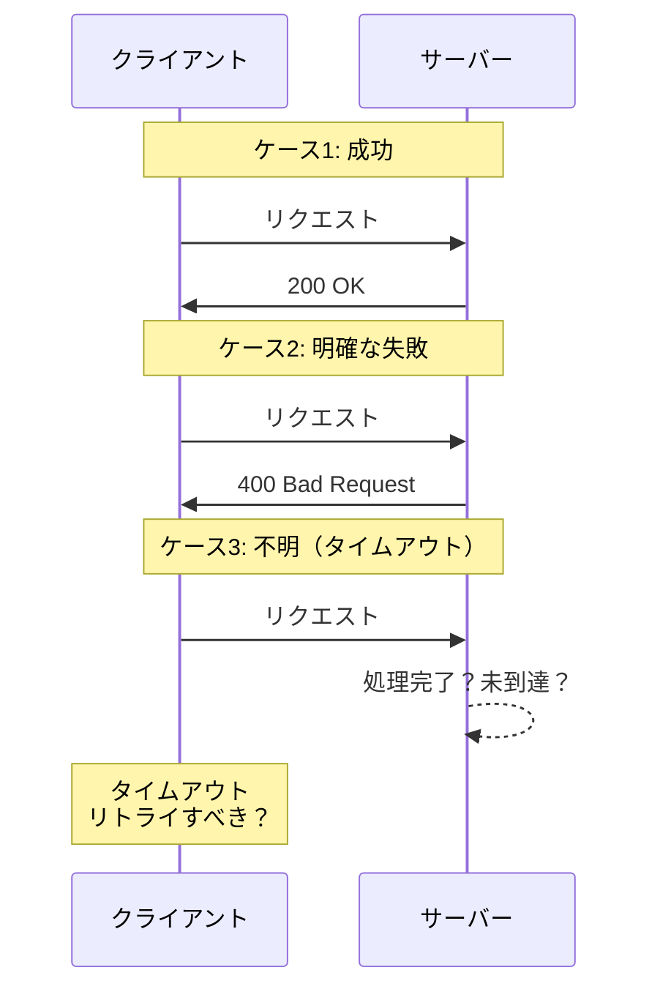
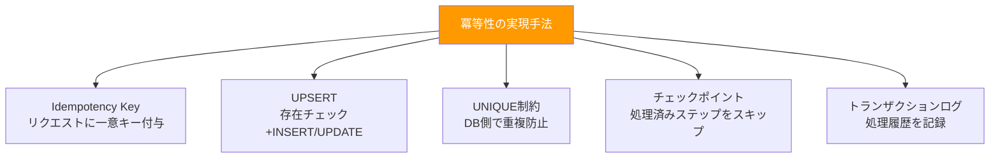
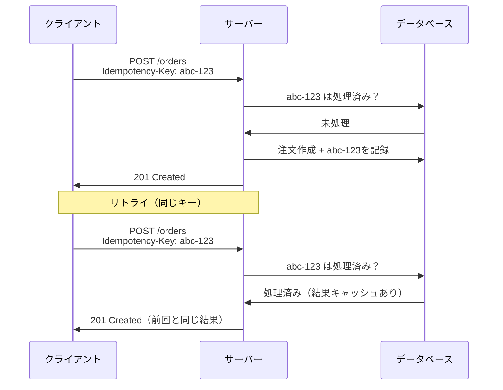

## 冪等性（Idempotency）とは

冪等性とは、「同じ操作を何回実行しても、結果が 1 回実行した場合と同じになる」という性質である。数学的に表現すれば、関数 f に対して `f(f(x)) = f(x)` が成り立つこと。

身近な例でいえば、エレベーターの行き先ボタンがこれにあたる。「5 階」のボタンを 1 回押しても 10 回押しても、エレベーターは 5 階に向かう。2 回押したからといって 10 階に行くことはない。

一方、非冪等な操作の例は銀行振込である。「1 万円を振り込む」という操作を 2 回実行すると 2 万円が振り込まれてしまう。

システム設計においては、冪等性は「安全にリトライできるかどうか」を決定する重要な性質だ。

## なぜ分散システムで冪等性が重要か

単一プロセスで動くシステムでは、関数呼び出しの成否は明確にわかる。しかし分散システムでは、ネットワークを介した通信が入るため、以下のような問題が必然的に発生する。

### ネットワーク障害と曖昧な状態

分散システムにおいて最も厄介なのは「処理が成功したのか失敗したのかわからない」という曖昧な状態である。

たとえば、クライアントがサーバーに API リクエストを送信した場合、以下の 3 つの結果がありうる。

1. **成功**: レスポンスが正常に返る
2. **明確な失敗**: エラーレスポンスが返る（4xx, 5xx）
3. **不明**: タイムアウトしてレスポンスが返らない

3 番目のケースが問題だ。サーバー側で処理が完了しているかもしれないし、リクエストがサーバーに到達していないかもしれない。この状態でリトライするべきか? リトライした場合に二重処理にならないか?

冪等性が担保されていれば、安全にリトライできる。



### リトライの必然性

分散システムでは、一時的な障害（ネットワークの瞬断、サーバーの過負荷など）に対してリトライを行うのが一般的である。AWS SDK をはじめとする多くのクライアントライブラリは、デフォルトで自動リトライを行う。

SQS のような メッセージキューも「at-least-once delivery」（少なくとも 1 回は配送する）を保証するものが多い。これは裏を返せば「同じメッセージが 2 回以上届く可能性がある」ということだ。

### 二重送信

ユーザー起因の二重送信もある。「送信」ボタンの二度押し、ブラウザの「戻る」ボタンからの再送信、モバイルアプリのネットワーク再接続時の自動リトライなど。フロントエンド側でボタンの非活性化などの対策を入れても、完全には防げない。

これらすべてのケースで、サーバー側の処理が冪等であれば、二重処理を防ぐことができる。

## HTTP メソッドと冪等性

HTTP の仕様（RFC 7231）では、メソッドごとに冪等性が定義されている。

### 冪等なメソッド

- **GET**: 同じ URL に何度リクエストしても同じリソースを取得する（副作用なし）
- **PUT**: 同じリクエストボディで何度リクエストしても、リソースの状態は同じになる（リソース全体の置換）
- **DELETE**: 同じリソースを何度削除しても結果は同じ（存在しないリソースの削除は 404 を返すが、システムの状態は変わらない）
- **HEAD**: GET と同じだがボディを返さない
- **OPTIONS**: メタ情報の取得のみ

### 非冪等なメソッド

- **POST**: 同じリクエストを 2 回送ると、リソースが 2 つ作成される可能性がある
- **PATCH**: 適用するパッチの内容によっては冪等にならない（例: `{ "count": "increment" }` のようなパッチ）

ただし、これはあくまで HTTP 仕様上の定義であり、実装次第では PUT を非冪等にすることも、POST を冪等にすることも可能だ。重要なのは、API の設計者が冪等性を意識して実装することである。

### PUT の冪等性に関する補足

PUT が冪等なのは「リソース全体を指定した状態に置換する」操作だからである。「現在の値に 1 を加算する」ような相対的な操作を PUT で行うと、冪等性が崩れる。

冪等な PUT: `PUT /users/123 { "name": "田中", "age": 30 }` — 何度実行しても name は「田中」、age は 30

非冪等な PUT（設計ミス）: `PUT /users/123/increment-login-count` — 実行するたびにカウントが増える

## 冪等性を実現する方法

冪等性を実現するための代表的なテクニックを紹介する。



### 1. Idempotency Key（リクエストに一意キーを付与）

最も汎用的な方法。クライアントがリクエストごとに一意なキー（UUID など）を生成し、リクエストヘッダーやボディに含める。

**仕組み：**
1. クライアントが `Idempotency-Key: abc-123-def` をヘッダーに付与してリクエスト送信
2. サーバーは `abc-123-def` をキーとして処理結果を保存
3. 同じキーで再度リクエストが来た場合、保存済みの結果を返す（処理は実行しない）

**考慮すべき点：**
- キーの保存先（Redis、DynamoDB など）と有効期限
- キーの衝突回避（UUID v4 を使えばまず衝突しない）
- レスポンスのキャッシュ期間（永久に保持するか、一定期間で削除するか）
- キーが同じでリクエストボディが異なる場合の処理（エラーにすべき）



### 2. UPSERT（存在チェック + INSERT or UPDATE）

データベース操作において、レコードが存在しなければ INSERT、存在すれば UPDATE を行う手法。

**SQL の例：**
```sql
-- PostgreSQL
INSERT INTO orders (order_id, user_id, amount, status)
VALUES ('ord-001', 'user-123', 5000, 'created')
ON CONFLICT (order_id)
DO UPDATE SET status = 'created', updated_at = NOW();

-- MySQL
INSERT INTO orders (order_id, user_id, amount, status)
VALUES ('ord-001', 'user-123', 5000, 'created')
ON DUPLICATE KEY UPDATE status = 'created', updated_at = NOW();
```

UPSERT を使えば、同じ `order_id` で何度 INSERT を試みても、レコードは 1 つだけになる。

**注意点：**
- `ON CONFLICT` の対象カラムには UNIQUE 制約が必要
- UPDATE 部分で「上書きしてよいカラム」と「上書きしてはいけないカラム」を慎重に判断する
- 楽観的排他制御（version カラム）と組み合わせると、より安全になる

### 3. UNIQUE 制約による重複防止

最もシンプルで強力な方法。データベースの UNIQUE 制約を利用して、重複データの挿入を物理的に防ぐ。

**設計例：**
```sql
CREATE TABLE payments (
    id SERIAL PRIMARY KEY,
    transaction_id VARCHAR(255) UNIQUE NOT NULL,
    user_id INTEGER NOT NULL,
    amount DECIMAL(10, 2) NOT NULL,
    created_at TIMESTAMP DEFAULT NOW()
);
```

`transaction_id` に UNIQUE 制約を付けることで、同じトランザクション ID での二重登録は DB レベルで拒否される。アプリケーション側では、UNIQUE 制約違反のエラーをキャッチして「すでに処理済み」として正常レスポンスを返す。

**メリット：**
- データベースレベルの保証なので、アプリケーションのバグに影響されない
- 実装がシンプル

**デメリット：**
- エラーハンドリングの実装が必要
- 分散データベースでは UNIQUE 制約の挙動が異なる場合がある

### 4. チェックポイント方式（処理済みステップのスキップ）

長時間の処理や複数ステップからなるバッチ処理で有効な方法。各ステップの完了をチェックポイントとして記録し、再実行時には完了済みのステップをスキップする。

**仕組み：**
1. 処理開始時に、処理 ID に紐づくチェックポイントを確認
2. 完了済みのステップはスキップ
3. 各ステップ完了時にチェックポイントを更新
4. 全ステップ完了で処理完了

**適用例：**
- ETL パイプライン（Extract → Transform → Load の各フェーズ）
- データマイグレーション（テーブルごとの移行）
- Step Functions のステートマシン（各ステートが自然なチェックポイントになる）

### 5. トランザクションログ

すべてのリクエストとその結果をトランザクションログとして記録し、重複チェックに使う方法。

**仕組み：**
1. リクエスト受信時に、ログテーブルから同一リクエストの記録を検索
2. 記録が存在し、処理が完了済みであれば、保存された結果を返す
3. 記録が存在しないか、処理中であれば、新たに処理を開始
4. 処理結果をログテーブルに記録

**設計例：**
```sql
CREATE TABLE transaction_log (
    request_id VARCHAR(255) PRIMARY KEY,
    status VARCHAR(50) NOT NULL,  -- 'processing', 'completed', 'failed'
    request_body JSONB,
    response_body JSONB,
    created_at TIMESTAMP DEFAULT NOW(),
    completed_at TIMESTAMP
);
```

この方法は Idempotency Key と概念的に近いが、より詳細な処理履歴を残せるため、デバッグや監査にも活用できる。

## DB 側での冪等性担保

アプリケーションコードに依存せず、データベースレベルで冪等性を担保する手法について掘り下げる。

### UNIQUE 制約 + UPSERT の組み合わせ

前述の UNIQUE 制約と UPSERT を組み合わせるのが、DB 側での冪等性担保の王道パターンである。

重要なのは、UNIQUE 制約の対象カラムの選定だ。

- **自然キー（ビジネスキー）を使う場合**: 注文番号、取引ID など、ビジネスロジック上一意であるべきキー
- **クライアント生成 ID を使う場合**: UUID など、クライアントが生成した一意 ID

自然キーが存在する場合はそれを使うのが望ましい。クライアント生成 ID は、クライアントの実装ミスで重複する可能性がある。

### 楽観的排他制御との組み合わせ

UPSERT で更新する際に、version カラムを使った楽観的排他制御を組み合わせると、「同じリクエストの再実行」と「異なるリクエストによる同時更新」を区別できる。

```sql
UPDATE orders
SET status = 'confirmed', version = version + 1
WHERE order_id = 'ord-001' AND version = 3;
```

この UPDATE の影響行数が 0 の場合、version が変わっている（他の処理が先に更新した）ことを意味する。

### DynamoDB における条件付き書き込み

DynamoDB では、`ConditionExpression` を使って条件付き書き込みを行うことで冪等性を実現できる。

概念的には、`attribute_not_exists(pk)` という条件を付けて `PutItem` を実行すれば、同じキーのアイテムが存在しない場合のみ書き込みが行われる。存在する場合は `ConditionalCheckFailedException` が返る。

これは RDBMS の UNIQUE 制約 + INSERT に相当する操作だ。

## API 設計での冪等性

API を設計する際に冪等性をどう組み込むか。

### Idempotency-Key ヘッダー

Stripe が採用して広まったパターン。リクエストヘッダーに `Idempotency-Key` を含めることで、API レベルで冪等性を保証する。

**Stripe の実装：**
- `Idempotency-Key` ヘッダーに任意の文字列を指定
- 同じキーで再度リクエストすると、最初のリクエストのレスポンスが返る
- キーの有効期限は 24 時間
- キーが同じでリクエストボディが異なる場合はエラー

**設計時の注意：**
- キーの有効期限を明確にする（短すぎると再利用時に「新規リクエスト」と見なされる）
- キーの保存先を決める（Redis なら TTL が使える、RDB なら定期的なクリーンアップが必要）
- レスポンスのステータスコードも保存する（200 だけでなく、400 や 500 も含めるか?）

### API Gateway でのリクエスト重複排除

AWS API Gateway では、WebSocket API で接続ベースの重複排除が可能だが、REST API では標準機能としての冪等性サポートは提供されていない。アプリケーションレイヤーでの実装が必要になる。

### リソースベースの API 設計

冪等性を意識した API 設計のコツは、「操作」ではなく「リソースの状態」を定義することだ。

非冪等な設計: `POST /orders/123/add-item { "item_id": "abc", "quantity": 1 }` — 実行するたびにアイテムが追加される

冪等な設計: `PUT /orders/123/items/abc { "quantity": 1 }` — 何度実行してもアイテム abc の数量は 1

## 外部 API 呼び出しの冪等性

自社システム内の冪等性だけでなく、外部 API を呼び出す場合の冪等性も重要だ。特に課金が絡む場合は、二重処理の影響が直接的な金銭的損失につながる。

### 決済 API の冪等性

決済処理は冪等性が最も重要な領域の一つである。

- **Stripe**: `Idempotency-Key` ヘッダーで冪等性をサポート
- **PayPay**: リクエストに `merchantPaymentId` を含めることで二重決済を防止
- **GMO ペイメント**: 取引 ID ベースの重複チェック

決済 API を呼び出す側は、以下を徹底する必要がある。

1. 決済リクエスト送信前に、一意な取引 ID を自社 DB に記録する
2. 決済 API に取引 ID を含めて送信する
3. レスポンスが曖昧（タイムアウトなど）な場合は、取引 ID で状態を照会する
4. リトライ時は同じ取引 ID を使用する

### 外部 API が冪等性をサポートしていない場合

すべての外部 API が冪等性をサポートしているわけではない。その場合、呼び出し側で対策を講じる必要がある。

**対策例：**
- 呼び出し前に自社 DB で「処理中」フラグを立てる
- 呼び出し後に結果を記録する
- リトライ前に、前回の呼び出し結果を外部 API の照会 API で確認する
- 照会 API もない場合は、リトライせずに手動確認のアラートを出す

## 冪等性とリトライの関係

冪等性が担保されていることは、安全なリトライの前提条件である。

### リトライ戦略

**即時リトライ**: 一時的な障害に対して有効。ただし、サーバー側の負荷を増大させるリスクがある

**指数バックオフ**: リトライ間隔を指数関数的に増やす（1秒 → 2秒 → 4秒 → 8秒 ...）。サーバーの回復を待つ猶予を与える

**ジッター付き指数バックオフ**: 指数バックオフにランダムな揺らぎ（ジッター）を加える。多数のクライアントが同時にリトライする「サンダリングハード（Thundering Herd）」問題を緩和する

### リトライと冪等性の前提

リトライが安全であるための前提：

1. **操作が冪等である**: 同じリクエストを複数回実行しても結果が変わらない
2. **副作用が制御されている**: メール送信やプッシュ通知などの副作用が二重に発生しない
3. **状態遷移が正しい**: 「作成済み → 確認済み」の遷移が、二重リトライによって矛盾しない

### SQS の at-least-once delivery と冪等性

SQS は「少なくとも 1 回の配送」を保証する。つまり、同じメッセージが 2 回以上配送される可能性がある。これに対応するには、コンシューマー側で冪等性を担保する必要がある。

SQS FIFO キューは「exactly-once processing」をサポートしているが、これは「メッセージ重複排除 ID」に基づく 5 分間の重複排除ウィンドウであり、万能ではない。5 分を超えた再送には対応できないため、コンシューマー側の冪等性は依然として重要だ。

## 冪等性チェックの実装パターン

冪等性チェックの典型的な実装フローを整理する。

### 基本パターン

```
リクエスト受信
  ↓
冪等性キーで処理記録を検索
  ↓
┌─ 記録あり & 処理完了 → 保存された結果を返す
├─ 記録あり & 処理中   → 409 Conflict or 202 Accepted を返す
└─ 記録なし           → 新規処理を開始
                         ↓
                       処理記録を「処理中」で作成
                         ↓
                       ビジネスロジック実行
                         ↓
                       処理記録を「完了」で更新 + 結果を保存
                         ↓
                       結果を返す
```

### レースコンディションへの対処

上記の「記録なし → 処理記録を作成」の間に、同じキーで別のリクエストが到達するとレースコンディションが発生する。

**対策：**
- DB の UNIQUE 制約で二重 INSERT を防ぐ
- Redis の `SET key value NX`（キーが存在しない場合のみセット）を使う
- DynamoDB の `ConditionExpression` を使う

いずれの方法でも、最初の書き込みだけが成功し、2 番目以降は失敗する。失敗した側は「すでに処理中」として扱えばよい。

## 非冪等な操作を冪等にする設計テクニック

本質的に冪等でない操作（カウントの加算、残高の減算など）を、冪等に変換するテクニック。

### 相対値から絶対値への変換

**非冪等**: 「残高を 1000 円減らす」 → 2 回実行すると 2000 円減る
**冪等**: 「残高を 49000 円にする」 → 何回実行しても 49000 円

ただし、現在値を知らないと絶対値を指定できないため、読み取り → 計算 → 書き込みの一連の流れをアトミックに行う必要がある。

### イベントソーシングの活用

操作をイベントとして記録し、現在の状態はイベントの集約から導出する。

各イベントに一意な ID を付与し、同じ ID のイベントは重複として無視する。これにより、イベントの記録操作が冪等になる。

たとえば、「ユーザー A が商品 B を 1 個カートに追加した」というイベントに `event-id: evt-001` を付与する。`evt-001` が 2 回記録されても、カートの状態は「商品 B が 1 個」のままだ。

### 状態機械（ステートマシン）の活用

操作を「状態遷移」として定義する。すでに遷移済みの状態への遷移リクエストは無視する。

- 注文状態: `created → confirmed → shipped → delivered`
- `created → confirmed` の遷移を 2 回リクエストしても、1 回目で `confirmed` になった後は 2 回目は何も起きない

```sql
UPDATE orders
SET status = 'confirmed'
WHERE order_id = 'ord-001' AND status = 'created';
-- 影響行数が 0 → すでに confirmed 以降の状態
```

## 実務での注意点

### キャッシュの有効期限

Idempotency Key の保存期間は、ビジネス要件に応じて設計する必要がある。

- **短すぎる場合**: 有効期限切れ後にリトライが来ると、新規リクエストとして処理される（二重処理のリスク）
- **長すぎる場合**: ストレージコストが増大し、検索性能が低下する

一般的な指針：
- 決済系: 24 時間以上（Stripe は 24 時間）
- 通常の API: 1 時間〜24 時間
- バッチ処理: バッチの実行間隔以上

### レースコンディション

前述の通り、冪等性チェックと処理の間にタイムギャップがあると、レースコンディションが発生する。特に高スループットのシステムでは顕著だ。

**対策の優先順位：**
1. DB の UNIQUE 制約（最も確実）
2. 分散ロック（Redis の Redlock など）
3. アプリケーションレベルの排他制御（楽観的ロック）

### 冪等性の範囲

冪等性を「どこまで」担保するかも重要な設計判断だ。

- **DB の書き込みだけ冪等**: メール送信などの副作用は二重に実行される可能性がある
- **副作用も含めて冪等**: メール送信済みフラグを管理し、二重送信を防ぐ
- **レスポンスも含めて冪等**: 同じリクエストには同じレスポンス（ステータスコード含む）を返す

理想的にはすべてを冪等にすべきだが、コストとのバランスで判断する。最低限、「二重処理による実害がある操作」（決済、在庫引き当て、ポイント付与など）は冪等性を担保すべきだ。

### テスト戦略

冪等性のテストは、通常の機能テストとは異なるアプローチが必要になる。

**テスト項目の例：**
- 同じリクエストを 2 回送信して、結果が同じか
- 1 回目が処理中に 2 回目が来た場合の挙動
- キャッシュの有効期限が切れた後のリトライ
- 異なるリクエストボディで同じ Idempotency Key を使った場合
- 1 回目が失敗した後のリトライ（失敗結果がキャッシュされていないか）

## まとめ

冪等性は分散システムの信頼性を支える基盤的な設計原則である。ネットワーク障害、リトライ、メッセージの重複配送が不可避な分散環境では、「同じ操作が複数回実行されても問題ない」ことを保証する仕組みが不可欠だ。

実装手法は多様だが、基本的な考え方はシンプルだ。

1. **リクエストに一意な識別子を付与する**（Idempotency Key、トランザクション ID）
2. **処理前に重複チェックを行う**（DB の UNIQUE 制約、トランザクションログ）
3. **レースコンディションをデータストアレベルで防ぐ**（UNIQUE 制約、条件付き書き込み）

冪等性の設計は「後から追加する」のが難しい。システム設計の初期段階から、各操作の冪等性を意識して設計することが、将来の障害対応コストを大幅に削減する鍵となる。

---

## 参考文献

- [RFC 7231 — HTTP/1.1 Semantics and Content (Section 4.2.2 Idempotent Methods)](https://datatracker.ietf.org/doc/html/rfc7231#section-4.2.2)
- [Stripe API — Idempotent Requests](https://docs.stripe.com/api/idempotent_requests)
- [AWS Lambda Powertools — Idempotency](https://docs.powertools.aws.dev/lambda/python/latest/utilities/idempotency/)
- [Designing Data-Intensive Applications (Martin Kleppmann) — Chapter 11: Stream Processing](https://dataintensive.net/)
- [Amazon SQS の Exactly-Once 処理](https://docs.aws.amazon.com/AWSSimpleQueueService/latest/SQSDeveloperGuide/FIFO-queues-exactly-once-processing.html)
