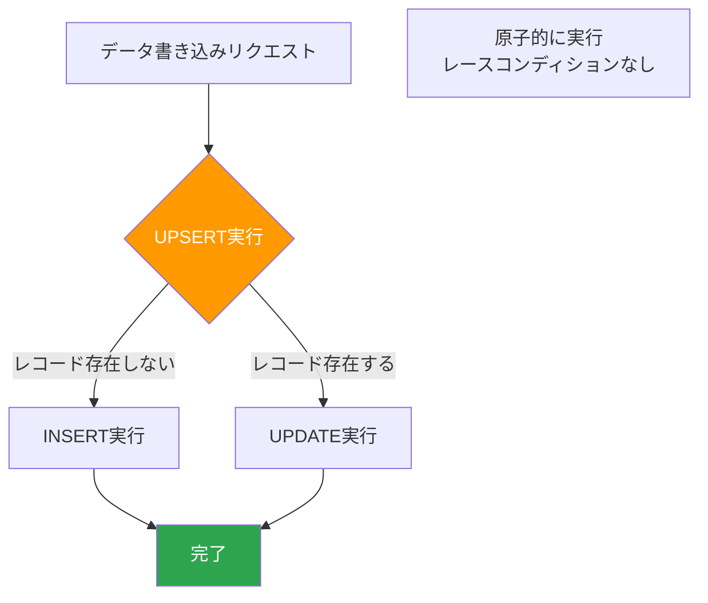
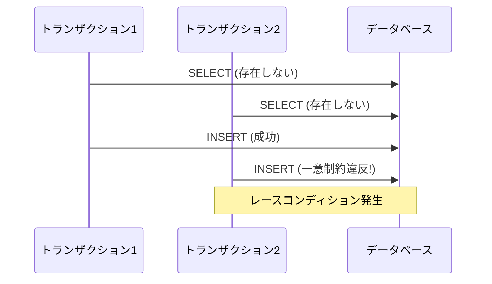
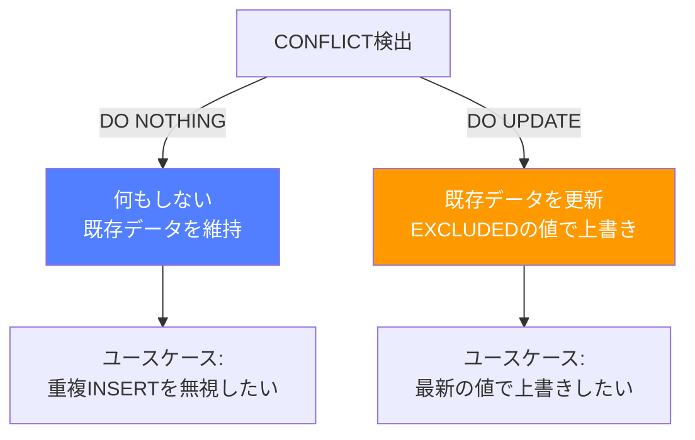

## UPSERT とは

UPSERT は **UPDATE** と **INSERT** を組み合わせた造語で、「レコードが存在すれば更新し、存在しなければ挿入する」という操作を一文で表現するパターンである。正式な SQL 標準の用語ではないが、業界では広く使われている。

日常の開発では「このデータがあれば上書き、なければ新規作成」という要件が頻繁に現れる。この操作を安全かつ効率的に行う仕組みが UPSERT である。



---

## なぜ UPSERT が必要か — 非原子性問題

UPSERT を使わずに同じことを実現しようとすると、典型的には次のような手順になる。

1. SELECT で対象レコードの存在を確認する
2. 存在すれば UPDATE を実行する
3. 存在しなければ INSERT を実行する

この「確認してから操作する」アプローチには致命的な問題がある。手順 1 と手順 2（または 3）の間にタイムラグがあるため、複数のトランザクションが同時に動くと不整合が起きる。

たとえば、2 つのリクエストがほぼ同時に「存在しない」と判断した場合、両方が INSERT を実行して一意制約違反が発生する。あるいは片方のデータが失われる。これが **非原子性問題** であり、UPSERT はこの問題をデータベースエンジンのレベルで解決する。



---

## 各 RDBMS での構文

### PostgreSQL: INSERT ... ON CONFLICT ... DO UPDATE

PostgreSQL 9.5 以降で使える構文で、UPSERT の実装としてもっとも直感的と言われることが多い。

```sql
INSERT INTO settings (key, value, updated_at)
VALUES ('theme', 'dark', NOW())
ON CONFLICT (key)
DO UPDATE SET
  value = EXCLUDED.value,
  updated_at = EXCLUDED.updated_at;
```

`ON CONFLICT` 句で競合の判定対象（カラムまたは制約名）を指定し、`EXCLUDED` という特殊テーブルで挿入しようとした値を参照できる。

**制約名を使った指定も可能:**

```sql
INSERT INTO settings (key, value, updated_at)
VALUES ('theme', 'dark', NOW())
ON CONFLICT ON CONSTRAINT settings_pkey
DO UPDATE SET
  value = EXCLUDED.value,
  updated_at = EXCLUDED.updated_at;
```

制約名を明示すると、どの制約で競合を判定しているかがコード上で明確になる。

### MySQL: INSERT ... ON DUPLICATE KEY UPDATE

MySQL では `ON DUPLICATE KEY UPDATE` 構文を使う。

```sql
INSERT INTO settings (`key`, `value`, updated_at)
VALUES ('theme', 'dark', NOW())
ON DUPLICATE KEY UPDATE
  `value` = VALUES(`value`),
  updated_at = VALUES(updated_at);
```

MySQL 8.0.19 以降では `VALUES()` の代わりにエイリアスを使う新しい構文も利用できる。

```sql
INSERT INTO settings (`key`, `value`, updated_at)
VALUES ('theme', 'dark', NOW()) AS new_row
ON DUPLICATE KEY UPDATE
  `value` = new_row.`value`,
  updated_at = new_row.updated_at;
```

`VALUES()` 関数はこのコンテキストでは非推奨になりつつあるため、新しいコードではエイリアス構文を使うのが望ましい。

### SQLite: INSERT OR REPLACE / INSERT ... ON CONFLICT

SQLite では 2 つのアプローチがある。

**INSERT OR REPLACE（簡易版）:**

```sql
INSERT OR REPLACE INTO settings (key, value, updated_at)
VALUES ('theme', 'dark', datetime('now'));
```

ただし、これは後述する REPLACE INTO と同様に DELETE + INSERT として動作するため注意が必要。

**INSERT ... ON CONFLICT（SQLite 3.24 以降）:**

```sql
INSERT INTO settings (key, value, updated_at)
VALUES ('theme', 'dark', datetime('now'))
ON CONFLICT(key) DO UPDATE SET
  value = excluded.value,
  updated_at = excluded.updated_at;
```

SQLite 3.24 以降では PostgreSQL に近い構文が使えるため、こちらを推奨する。

### SQL Server: MERGE 文

SQL Server では `MERGE` 文を使う。他の RDBMS に比べると冗長だが、より柔軟な条件分岐が可能である。

```sql
MERGE INTO settings AS target
USING (VALUES ('theme', 'dark', GETDATE())) AS source (key, value, updated_at)
ON target.key = source.key
WHEN MATCHED THEN
  UPDATE SET
    target.value = source.value,
    target.updated_at = source.updated_at
WHEN NOT MATCHED THEN
  INSERT (key, value, updated_at)
  VALUES (source.key, source.value, source.updated_at);
```

MERGE 文は MATCHED / NOT MATCHED に加えて `WHEN NOT MATCHED BY SOURCE` も記述でき、ソースに存在しないレコードの DELETE まで一文で表現できる。ただし MERGE にはロック関連の既知の問題があり、本番で使う際にはヒント句（`WITH (HOLDLOCK)` など）の付与が推奨されることが多い。

---

## UNIQUE 制約との組み合わせ — 冪等性の担保

UPSERT が正しく機能するためには、**競合判定の基準となる UNIQUE 制約**（または PRIMARY KEY）が必須である。UNIQUE 制約がなければ、データベースは「既に存在するかどうか」を判断できない。

```sql
CREATE TABLE settings (
  key VARCHAR(255) PRIMARY KEY,
  value TEXT NOT NULL,
  updated_at TIMESTAMP NOT NULL
);
```

UNIQUE 制約を正しく設定した UPSERT は **冪等性（idempotency）** を担保する。つまり、同じ UPSERT 文を何度実行しても結果が同じになる。これはリトライ処理やメッセージキューの再実行において非常に重要な性質である。

**複合ユニーク制約の例:**

```sql
CREATE TABLE daily_stats (
  user_id BIGINT NOT NULL,
  stat_date DATE NOT NULL,
  login_count INT NOT NULL DEFAULT 0,
  UNIQUE (user_id, stat_date)
);

INSERT INTO daily_stats (user_id, stat_date, login_count)
VALUES (42, '2026-04-02', 1)
ON CONFLICT (user_id, stat_date)
DO UPDATE SET login_count = daily_stats.login_count + 1;
```

複合ユニーク制約を活用すると、ユーザーごと・日付ごとの集計のような複雑な条件でも冪等な UPSERT を実現できる。

---

## UPSERT のユースケース

### ジョブ管理テーブル

バッチ処理やスケジューラーで、ジョブの最終実行状態を記録するテーブル。ジョブが初回実行であれば INSERT、再実行であれば UPDATE する。

```sql
INSERT INTO job_status (job_name, last_run_at, status, run_count)
VALUES ('daily_report', NOW(), 'success', 1)
ON CONFLICT (job_name)
DO UPDATE SET
  last_run_at = EXCLUDED.last_run_at,
  status = EXCLUDED.status,
  run_count = job_status.run_count + 1;
```

### キャッシュテーブル

外部 API のレスポンスなどをキャッシュする場合、キーが存在すれば値と有効期限を更新し、なければ新規作成する。

```sql
INSERT INTO api_cache (cache_key, response_body, expires_at)
VALUES ('user_profile_42', '{"name":"John"}', NOW() + INTERVAL '1 hour')
ON CONFLICT (cache_key)
DO UPDATE SET
  response_body = EXCLUDED.response_body,
  expires_at = EXCLUDED.expires_at;
```

### 設定値の管理

アプリケーション設定をデータベースで管理する場合、設定項目があれば更新、なければデフォルト値として挿入する。

### 集計テーブル

PV カウントやいいね数など、リアルタイム集計をインクリメンタルに行う場合に適している。初回のカウントと 2 回目以降のカウントアップを一文で書ける。

---

## REPLACE INTO と UPSERT の違い

MySQL の `REPLACE INTO` や SQLite の `INSERT OR REPLACE` は一見 UPSERT と同じように見えるが、内部動作が根本的に異なる。

**REPLACE INTO の内部動作:**

1. INSERT を試みる
2. 一意制約に違反した場合、既存の行を **DELETE** する
3. 新しい行を **INSERT** する

この DELETE + INSERT という動作により、以下の問題が発生する。

- **AUTO_INCREMENT の値が変わる:** 既存行が削除されて新しい行が挿入されるため、自動採番の ID が新しい値になる。外部キーで参照されている場合は致命的な問題になる。
- **ON DELETE トリガーが発火する:** 意図しない副作用が起きる可能性がある。
- **外部キー制約違反のリスク:** CASCADE DELETE が設定されていると、関連テーブルのデータも削除される。
- **デフォルト値のリセット:** 更新対象でないカラムが、指定しない場合にデフォルト値に戻ってしまう。

一方、真の UPSERT（`ON CONFLICT DO UPDATE` や `ON DUPLICATE KEY UPDATE`）は既存行を **その場で UPDATE** するため、これらの問題は起きない。

**結論:** 特別な理由がない限り、REPLACE INTO ではなく UPSERT 構文を使うべきである。

---

## レースコンディションと UPSERT

UPSERT はアプリケーション層での SELECT → INSERT/UPDATE の非原子性問題を解消するが、UPSERT 自体の同時実行時の安全性についても理解が必要である。

### PostgreSQL の場合

PostgreSQL の `ON CONFLICT DO UPDATE` は行レベルロックを取得するため、同一キーに対する同時 UPSERT はシリアライズされる。一方が完了するまでもう一方は待機する。デッドロックのリスクはあるが、データの不整合は起きない。

### MySQL の場合

MySQL の `ON DUPLICATE KEY UPDATE` も同様に排他ロックを取得する。InnoDB のギャップロックにより、存在しないキーへの同時 INSERT でもレースコンディションは防がれる。

### 注意点: SERIALIZABLE 分離レベルとの相互作用

SERIALIZABLE 分離レベルでは、UPSERT の競合検出がより厳密になり、シリアライゼーション失敗（serialization failure）が発生しやすくなる。アプリケーション側でリトライロジックを実装することが推奨される。

---

## DO NOTHING vs DO UPDATE の使い分け

PostgreSQL では `ON CONFLICT` 句の後に `DO NOTHING` と `DO UPDATE` の 2 つの選択肢がある。

### DO NOTHING

```sql
INSERT INTO user_visits (user_id, first_visit_at)
VALUES (42, NOW())
ON CONFLICT (user_id) DO NOTHING;
```

レコードが既に存在する場合は何もしない。「初回のみ記録したい」「重複を無視して INSERT したい」ケースで使う。

**ユースケース:**
- ユーザーの初回アクセス記録
- 重複排除が目的のバルクインサート
- 「既にあるならそのままでよい」というデータ

### DO UPDATE

```sql
INSERT INTO settings (key, value, updated_at)
VALUES ('theme', 'dark', NOW())
ON CONFLICT (key)
DO UPDATE SET value = EXCLUDED.value, updated_at = EXCLUDED.updated_at;
```

レコードが既に存在する場合は値を更新する。「常に最新の値を保持したい」ケースで使う。

**ユースケース:**
- 設定値の保存
- 最終ログイン日時の更新
- カウンターのインクリメント

### 条件付き DO UPDATE

PostgreSQL では `WHERE` 句を使って、更新条件を追加できる。

```sql
INSERT INTO settings (key, value, updated_at)
VALUES ('theme', 'dark', NOW())
ON CONFLICT (key)
DO UPDATE SET
  value = EXCLUDED.value,
  updated_at = EXCLUDED.updated_at
WHERE settings.updated_at < EXCLUDED.updated_at;
```

この例では「新しいデータの場合のみ更新する」という条件を付けている。古いデータで上書きされる事故を防げる。



---

## RETURNING 句で結果を取得

PostgreSQL では UPSERT に `RETURNING` 句を付けることで、INSERT または UPDATE された行のデータを即座に取得できる。

```sql
INSERT INTO settings (key, value, updated_at)
VALUES ('theme', 'dark', NOW())
ON CONFLICT (key)
DO UPDATE SET
  value = EXCLUDED.value,
  updated_at = EXCLUDED.updated_at
RETURNING id, key, value, updated_at;
```

これにより、UPSERT 後に改めて SELECT を発行する必要がなくなり、ラウンドトリップを削減できる。

**INSERT されたか UPDATE されたかを判別する方法:**

```sql
INSERT INTO settings (key, value, updated_at)
VALUES ('theme', 'dark', NOW())
ON CONFLICT (key)
DO UPDATE SET
  value = EXCLUDED.value,
  updated_at = EXCLUDED.updated_at
RETURNING
  id,
  (xmax = 0) AS was_inserted;
```

PostgreSQL の内部カラム `xmax` を使うと、行が INSERT されたか（`xmax = 0`）UPDATE されたかを判別できる。ただしこれは内部実装に依存するテクニックであり、将来のバージョンで動作が変わる可能性がある点は留意が必要。

---

## ORM での UPSERT

主要な ORM でも UPSERT は対応している。

### Prisma

```typescript
await prisma.setting.upsert({
  where: { key: 'theme' },
  update: { value: 'dark', updatedAt: new Date() },
  create: { key: 'theme', value: 'dark', updatedAt: new Date() },
});
```

Prisma の `upsert` は内部的にトランザクション内で SELECT → INSERT/UPDATE を行う実装になっていることがある。パフォーマンスが重要な場合は `$executeRaw` でネイティブ SQL を使うことも検討する。

### TypeORM

```typescript
await dataSource
  .createQueryBuilder()
  .insert()
  .into(Setting)
  .values({ key: 'theme', value: 'dark' })
  .orUpdate(['value', 'updated_at'], ['key'])
  .execute();
```

### Sequelize

```typescript
await Setting.upsert({
  key: 'theme',
  value: 'dark',
  updatedAt: new Date(),
});
```

### ActiveRecord（Ruby on Rails）

```ruby
Setting.upsert(
  { key: 'theme', value: 'dark', updated_at: Time.current },
  unique_by: :key
)
```

Rails 6 以降で `upsert` および `upsert_all`（バルク版）が使える。

### ORM 利用時の注意点

- ORM が生成する SQL が実際にネイティブ UPSERT になっているか、SELECT + INSERT/UPDATE になっているかを確認すること
- バルク UPSERT のサポート状況は ORM によって異なる
- バリデーションやコールバックがスキップされる ORM もある（ActiveRecord の `upsert` はバリデーションを実行しない）

---

## パフォーマンスの考慮点

### インデックスのオーバーヘッド

UPSERT は一意制約のインデックスを参照するため、インデックスのサイズと効率が直接パフォーマンスに影響する。大量のデータに対するバルク UPSERT では、インデックスのメンテナンスコストが支配的になることがある。

### バルク UPSERT

単一行の UPSERT を繰り返すよりも、複数行をまとめてバルク UPSERT するほうが大幅に効率が良い。

```sql
INSERT INTO daily_stats (user_id, stat_date, login_count)
VALUES
  (1, '2026-04-02', 1),
  (2, '2026-04-02', 1),
  (3, '2026-04-02', 1)
ON CONFLICT (user_id, stat_date)
DO UPDATE SET login_count = daily_stats.login_count + 1;
```

1,000 行の個別 UPSERT と、1,000 行のバルク UPSERT では、後者が数十倍高速になることも珍しくない。

### UPSERT vs SELECT → INSERT/UPDATE のパフォーマンス比較

UPSERT はデータベース内部で完結するため、アプリケーションとデータベース間のラウンドトリップが 1 回で済む。SELECT → INSERT/UPDATE では最低 2 回のラウンドトリップが必要であり、ネットワークレイテンシが加算される。

### HOT (Heap-Only Tuple) 更新との関係（PostgreSQL）

PostgreSQL では、インデックスカラムを更新しない UPDATE は HOT 更新として最適化される。UPSERT の DO UPDATE で更新するカラムにインデックスが張られていない場合、HOT 更新の恩恵を受けられる。

---

## 実務での注意点

### ロックの影響

UPSERT は対象行に排他ロックを取得する。高頻度で同一キーに UPSERT が集中する場合、ロック待ちが発生してスループットが低下する可能性がある。

**対策:**
- ホットキーを分散する設計にする（例: カウンターのシャーディング）
- ロック待ちタイムアウトを適切に設定する
- アプリケーション側でリトライを実装する

### デッドロック

複数のキーに対する UPSERT をトランザクション内で実行する場合、キーの順序が異なるとデッドロックが発生する可能性がある。

**対策:**
- UPSERT の対象キーを常にソートしてから実行する
- 1 トランザクション内での UPSERT 対象を最小限にする
- デッドロック検出時のリトライロジックを実装する

```sql
-- デッドロックを防ぐために、キーをソートしてから UPSERT する
INSERT INTO settings (key, value)
VALUES
  ('a_key', 'value1'),  -- アルファベット順
  ('b_key', 'value2'),
  ('c_key', 'value3')
ON CONFLICT (key)
DO UPDATE SET value = EXCLUDED.value;
```

### トリガーとの相互作用

UPSERT で INSERT が実行された場合は INSERT トリガーが、UPDATE が実行された場合は UPDATE トリガーが発火する。トリガーの設計時にこの挙動を考慮する必要がある。

### 部分インデックスとの組み合わせ（PostgreSQL）

PostgreSQL では部分インデックスを ON CONFLICT の判定に使える。

```sql
CREATE UNIQUE INDEX active_subscriptions_idx
  ON subscriptions (user_id)
  WHERE status = 'active';

INSERT INTO subscriptions (user_id, plan, status)
VALUES (42, 'premium', 'active')
ON CONFLICT (user_id) WHERE status = 'active'
DO UPDATE SET plan = EXCLUDED.plan;
```

「アクティブなサブスクリプションはユーザーにつき 1 つ」というビジネスルールを制約とUPSERT で同時に表現できる。

### マイグレーション時の注意

UPSERT を使う前提のテーブルでは、UNIQUE 制約の追加・変更がアプリケーションの動作に直接影響する。スキーママイグレーションの際は、UPSERT の競合判定に使われている制約を把握しておくことが重要である。

---

## まとめ

UPSERT は「存在すれば更新、なければ挿入」という日常的な要件を、安全かつ効率的に実現するためのパターンである。各 RDBMS で構文は異なるが、UNIQUE 制約を基盤とした原子的操作という本質は共通している。

実務で使う際には、REPLACE INTO との違い、ロックの影響、デッドロック対策を理解し、冪等性を意識した設計を心がけることが重要である。

---

## 参考文献

- [PostgreSQL INSERT — ON CONFLICT 句](https://www.postgresql.org/docs/current/sql-insert.html)
- [MySQL INSERT ... ON DUPLICATE KEY UPDATE](https://dev.mysql.com/doc/refman/8.0/en/insert-on-duplicate.html)
- [SQLite UPSERT (INSERT ... ON CONFLICT)](https://www.sqlite.org/lang_upsert.html)
- [SQL Server MERGE 文](https://learn.microsoft.com/ja-jp/sql/t-sql/statements/merge-transact-sql)
- [Prisma — Upsert](https://www.prisma.io/docs/orm/reference/prisma-client-reference#upsert)
