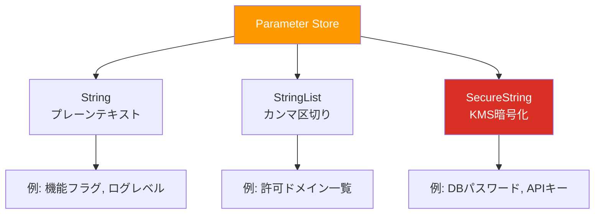
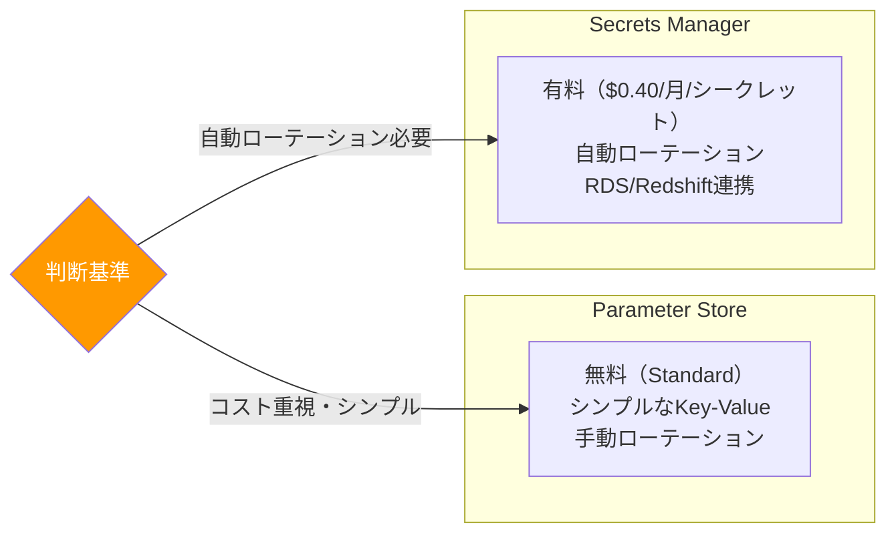
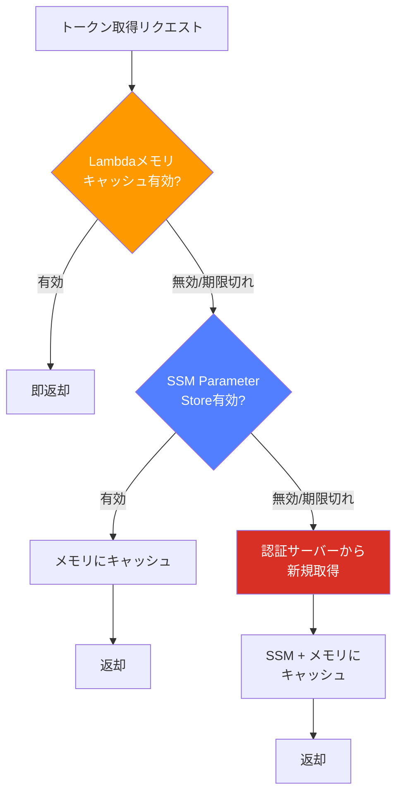

## AWS Systems Manager Parameter Store とは

AWS Systems Manager Parameter Store は、設定データやシークレットを一元管理するためのマネージドサービスである。アプリケーションの設定値、データベースの接続文字列、API トークンなど、コードにハードコーディングすべきでない値を安全に保存・取得できる。

Parameter Store は AWS Systems Manager（旧称 SSM: Simple Systems Manager）の一機能として提供されており、追加のインフラ構築なしで利用を開始できる。

---

## 3 つのパラメータタイプ

### String

プレーンテキストの文字列を保存する。暗号化は行われない。

```
/app/prod/feature_flag = "enabled"
/app/prod/log_level = "INFO"
```

環境変数や機能フラグなど、機密性の低い設定値に適している。

### StringList

カンマ区切りの文字列リストを保存する。

```
/app/prod/allowed_origins = "https://example.com,https://app.example.com"
/app/prod/admin_emails = "admin1@example.com,admin2@example.com"
```

配列的なデータをシンプルに扱いたい場合に便利だが、値にカンマを含められないという制約がある。複雑な構造データの場合は、String タイプに JSON 文字列を格納するほうが柔軟である。

### SecureString

AWS KMS（Key Management Service）で暗号化された文字列を保存する。

```
/app/prod/db/password = "********" (暗号化済み)
/app/prod/api/secret_key = "********" (暗号化済み)
```

パスワード、API キー、トークンなど機密情報の保存に必須のタイプ。取得時に `WithDecryption: true` を指定することで復号された値が返される。



---

## SecureString と KMS 暗号化

SecureString パラメータは KMS キーを使って暗号化される。使用する KMS キーは以下から選択できる。

- **AWS マネージドキー（aws/ssm）:** デフォルトで使われる無料のキー。同一アカウント内での利用に適している。
- **カスタマーマネージドキー（CMK）:** 自分で作成・管理する KMS キー。クロスアカウントアクセスやキーのローテーションポリシーを細かく制御したい場合に使う。

**暗号化の流れ:**

1. パラメータ作成時に `Type: SecureString` を指定
2. Parameter Store が KMS の `Encrypt` API を呼び出し、値を暗号化
3. 暗号化された値が Parameter Store に保存される
4. 取得時に `WithDecryption: true` を指定すると、KMS の `Decrypt` API が呼ばれて復号される

KMS の呼び出しには IAM 権限が必要であり、「Parameter Store の読み取り権限」と「KMS キーの復号権限」の両方が揃って初めて SecureString を読み取れる。この二重のアクセス制御がセキュリティの基盤になっている。

---

## Parameter Store vs Secrets Manager の違いと使い分け

AWS にはシークレット管理サービスとして Parameter Store の他に **Secrets Manager** がある。両者は機能的に重複する部分があるが、設計思想が異なる。

| 観点 | Parameter Store | Secrets Manager |
|------|----------------|-----------------|
| 主な用途 | 設定値 + シークレット | シークレット特化 |
| 自動ローテーション | なし | Lambda による自動ローテーション機能あり |
| クロスアカウント共有 | CMK を使えば可能 | リソースポリシーで容易 |
| バージョン管理 | あり（履歴参照可能） | あり（ステージングラベル付き） |
| 最大サイズ | Standard: 4KB / Advanced: 8KB | 64KB |
| API 料金 | Standard: 無料 / Advanced: 有料 | API 呼び出しごとに課金 |
| 月額基本料金 | なし | シークレットあたり約 $0.40/月 |

**使い分けの指針:**

- **Parameter Store を選ぶケース:** 設定値とシークレットを同じ場所で管理したい、コストを最小限にしたい、自動ローテーションが不要
- **Secrets Manager を選ぶケース:** データベースパスワードの自動ローテーションが必要、RDS/Redshift との統合が重要、クロスアカウント共有を頻繁に行う

実務では、「機密性の高いデータベースパスワードは Secrets Manager、それ以外の設定値や API トークンは Parameter Store」という使い分けが多い。



---

## Lambda 間でのパラメータ共有パターン

マイクロサービスアーキテクチャでは、複数の Lambda 関数が共通のパラメータを参照することが多い。Parameter Store はこの共有の中心的な役割を果たす。

### 共有パターンの設計

```
/shared/prod/external-api/base-url
/shared/prod/external-api/api-key        (SecureString)
/shared/prod/notification/webhook-url
/service-a/prod/specific-config
/service-b/prod/specific-config
```

共通パラメータは `/shared/` プレフィックス、サービス固有のパラメータはサービス名のプレフィックスを使うことで、IAM ポリシーでのアクセス制御が容易になる。

### GetParametersByPath による一括取得

```
GetParametersByPath
  Path: /shared/prod/external-api/
  Recursive: true
  WithDecryption: true
```

パス配下のパラメータをまとめて取得できるため、個別に `GetParameter` を呼ぶよりも API 呼び出し回数を削減できる。

---

## トークンキャッシュの設計 — 多層キャッシュ

外部 API のアクセストークンを Lambda で扱う場合、毎回 Parameter Store や認証サーバーに問い合わせるのは非効率である。多層キャッシュの設計が有効。

### 3 層キャッシュ構成

```
[Lambda メモリ] → [Parameter Store] → [認証サーバー]
     ↑ 高速            ↑ 中速              ↑ 低速
     ↑ 無料            ↑ 低コスト          ↑ レート制限あり
```

**取得フロー:**

1. **Lambda メモリ内キャッシュを確認** — ウォームスタート時にはメモリにトークンが残っている可能性がある。有効期限内であればそのまま使用する。
2. **Parameter Store から取得** — メモリにない場合（コールドスタート時など）は Parameter Store から取得する。有効期限内であればメモリにキャッシュして使用する。
3. **認証サーバーから新規取得** — Parameter Store のトークンも期限切れの場合は認証サーバーにリクエストする。取得したトークンを Parameter Store とメモリの両方にキャッシュする。

### トークン保存時のメタデータ

Parameter Store にトークンを保存する際は、有効期限情報もあわせて保存するのが重要。

```
パラメータ名: /app/prod/external-api/access-token
値: {"token": "eyJhbG...", "expires_at": "2026-04-02T13:00:00Z"}
タイプ: SecureString
```

JSON 形式でトークン本体と有効期限を一緒に保存しておくと、取得側で有効期限の判定が容易になる。



---

## Lambda のメモリキャッシュ — コールドスタート vs ウォームスタート

Lambda の実行環境（コンテナ）は、一定時間再利用される。この仕組みを理解してキャッシュを設計する。

### コールドスタート

Lambda が新しい実行環境で起動する状態。メモリ上のキャッシュは空であるため、Parameter Store から値を取得する必要がある。

### ウォームスタート

既存の実行環境が再利用される状態。ハンドラー関数の外側で宣言したグローバル変数は維持されるため、前回のリクエストでキャッシュしたパラメータがメモリに残っている。

### キャッシュの実装イメージ

グローバルスコープにキャッシュ変数を配置し、有効期限とともに管理する。

```
グローバル変数:
  cachedToken = null
  cacheExpiry = 0

ハンドラー関数:
  if cachedToken != null AND 現在時刻 < cacheExpiry:
    → cachedToken を使用（メモリキャッシュヒット）
  else:
    → Parameter Store から取得
    → cachedToken と cacheExpiry を更新
```

### 注意点

- Lambda の実行環境がいつ破棄されるかは AWS が制御するため、メモリキャッシュに依存しすぎない設計にする
- 同時実行数が多い場合、各実行環境がそれぞれ独立したキャッシュを持つ点に注意（キャッシュの一貫性は保証されない）
- Provisioned Concurrency を使うとコールドスタートを削減でき、メモリキャッシュのヒット率が向上する

---

## バックグラウンドリフレッシュ — 期限切れ前の更新

トークンが期限切れになってから新しいトークンを取得すると、その間のリクエストが失敗する可能性がある。バックグラウンドリフレッシュ戦略でこれを回避する。

### 仕組み

トークンの有効期限の「少し前」をリフレッシュのトリガーとする。

```
トークン有効期限: 60 分
リフレッシュ閾値: 有効期限の 75% (45 分経過時点)

0分         45分        60分
|-----------|-----------|
  通常使用   リフレッシュ  期限切れ
             ゾーン
```

リフレッシュゾーンに入ったリクエストで、現在のトークンを使いつつバックグラウンドで新しいトークンを取得する。

### 実装の考え方

1. トークン取得時に有効期限を確認する
2. 残り時間がリフレッシュ閾値を下回っている場合、現在のトークンをそのまま返しつつ、非同期でトークンのリフレッシュ処理を起動する
3. リフレッシュが完了したら、メモリキャッシュと Parameter Store を更新する

### Lambda でのバックグラウンド処理の制約

Lambda はレスポンスを返した後にバックグラウンド処理を行う保証がないため、純粋なバックグラウンドリフレッシュは難しい。代替策として以下がある。

- **リフレッシュゾーンに入ったら同期的にリフレッシュする:** レイテンシは増加するが確実
- **EventBridge のスケジュールでリフレッシュ用 Lambda を定期実行する:** トークンの更新をリクエスト処理から切り離せる
- **Step Functions でリフレッシュワークフローを管理する:** 複雑なリフレッシュロジックが必要な場合

---

## パラメータの階層化

Parameter Store はスラッシュ区切りのパス構造でパラメータを階層的に管理できる。

### 推奨される階層構造

```
/{アプリ名}/{環境}/{カテゴリ}/{パラメータ名}

例:
/myapp/prod/db/host
/myapp/prod/db/port
/myapp/prod/db/username
/myapp/prod/db/password          (SecureString)
/myapp/prod/redis/endpoint
/myapp/prod/external-api/key     (SecureString)
/myapp/staging/db/host
/myapp/staging/db/port
```

### 階層化のメリット

- **IAM ポリシーでのパス単位のアクセス制御:** `/myapp/prod/*` への読み取り権限を特定のロールだけに付与できる
- **GetParametersByPath による一括取得:** 特定パス配下のパラメータをまとめて取得でき、API 呼び出し回数を削減できる
- **環境の分離:** 同じパラメータ名でも環境ごとに値を変えられる
- **可読性:** パラメータの用途と所属が名前から判断できる

### 階層の深さの制限

Parameter Store のパスは最大 15 階層までサポートされている。実用上は 3〜5 階層に収めるのが管理しやすい。

---

## パラメータポリシー（Advanced パラメータ）

Advanced パラメータでは **パラメータポリシー** を設定でき、有効期限の管理を自動化できる。

### 有効期限ポリシー（Expiration）

```json
{
  "Type": "Expiration",
  "Version": "1.0",
  "Attributes": {
    "Timestamp": "2026-06-01T00:00:00.000Z"
  }
}
```

指定日時に達するとパラメータが自動的に削除される。一時的なトークンや期間限定の設定値に適している。

### 有効期限通知ポリシー（ExpirationNotification）

```json
{
  "Type": "ExpirationNotification",
  "Version": "1.0",
  "Attributes": {
    "Before": "15",
    "Unit": "Days"
  }
}
```

有効期限の一定期間前に CloudWatch Events（EventBridge）に通知を発行する。SNS と連携してアラートメールを送信したり、Lambda を起動してトークンを自動更新したりできる。

### 変更通知ポリシー（NoChangeNotification）

```json
{
  "Type": "NoChangeNotification",
  "Version": "1.0",
  "Attributes": {
    "After": "30",
    "Unit": "Days"
  }
}
```

指定期間パラメータが変更されなかった場合に通知を発行する。定期的に更新すべきパスワードやキーの棚卸しに活用できる。

---

## IAM によるアクセス制御

Parameter Store へのアクセスは IAM ポリシーで細かく制御できる。

### 最小権限の原則に基づいた設計

```json
{
  "Version": "2012-10-17",
  "Statement": [
    {
      "Effect": "Allow",
      "Action": [
        "ssm:GetParameter",
        "ssm:GetParametersByPath"
      ],
      "Resource": "arn:aws:ssm:ap-northeast-1:123456789012:parameter/myapp/prod/*"
    },
    {
      "Effect": "Allow",
      "Action": "kms:Decrypt",
      "Resource": "arn:aws:kms:ap-northeast-1:123456789012:key/xxxxxxxx-xxxx-xxxx-xxxx-xxxxxxxxxxxx"
    }
  ]
}
```

**ポイント:**

- `ssm:GetParameter` と `ssm:PutParameter` は分離する。Lambda には読み取りのみ、デプロイパイプラインには書き込みも許可する、という設計が一般的
- SecureString を読む場合は `kms:Decrypt` の権限も必要
- Resource の ARN でパスを限定し、不要なパラメータへのアクセスを防ぐ
- 環境ごとに IAM ロールを分けることで、staging の Lambda が prod のパラメータを読むことを防止できる

### タグベースのアクセス制御

パラメータにタグを付与し、IAM ポリシーの条件キーでタグベースの制御も可能。

```json
{
  "Condition": {
    "StringEquals": {
      "ssm:resourceTag/Environment": "prod"
    }
  }
}
```

---

## セキュリティのベストプラクティス

### トークンをログに出力しない

Parameter Store から取得したシークレットをログに出力してしまうと、CloudWatch Logs やログ集約サービスにシークレットが平文で保存される。

**やってはいけないこと:**

```
NG: console.log("Token: " + token)
NG: logger.info(f"API response: {response}")  // レスポンスにトークンが含まれる場合
NG: console.log(JSON.stringify(config))         // config オブジェクトにシークレットが含まれる場合
```

**対策:**

- ログ出力前にシークレットをマスクするユーティリティ関数を用意する
- 構造化ログを使い、シークレットフィールドを除外するシリアライザーを設定する
- CloudWatch Logs のデータ保護ポリシーで機密データの自動マスクを有効にする

### ペイロードにトークンを含めない

Lambda 間の呼び出しや SQS メッセージなどのペイロードにトークンを直接含めると、以下のリスクがある。

- ペイロードがログに記録される可能性
- DLQ（Dead Letter Queue）に残留してシークレットが長期保存される
- トレーシングツール（X-Ray など）でペイロードが表示される

**代わりに Parameter Store のパス（参照）を渡す。** 受け取った側が自分の権限でParameter Store から取得する設計にする。

### デバッグ時もマスク必須

開発環境やデバッグ時であっても、シークレットのマスクは必ず行う。

- 開発環境のログが本番と同じログ基盤に集約されることがある
- スクリーンショットや画面共有でシークレットが漏洩することがある
- デバッグ用のコードがそのまま本番にデプロイされることがある

**マスクの例:**

```
OK: "Token: ****...xxxx" (末尾4文字のみ表示)
OK: "Token: [REDACTED]"
OK: "Token exists: true" (存在有無のみ表示)
```

### その他のセキュリティ対策

- **パラメータのバージョン管理を活用する:** 誤って値を上書きした場合に以前のバージョンに戻せる
- **CloudTrail でアクセスを監査する:** 誰がいつどのパラメータにアクセスしたかを記録・監視する
- **VPC エンドポイントを使う:** Lambda が VPC 内にある場合、Systems Manager の VPC エンドポイントを作成してインターネットを経由せずにアクセスする

---

## CloudFormation / CDK での Parameter Store 定義

### CloudFormation

```yaml
Resources:
  AppDbHost:
    Type: AWS::SSM::Parameter
    Properties:
      Name: /myapp/prod/db/host
      Type: String
      Value: mydb.cluster-xxxxx.ap-northeast-1.rds.amazonaws.com
      Description: Production database host
      Tags:
        Environment: prod
        Service: myapp
```

SecureString の場合は CloudFormation で**値を直接定義しない**ことが推奨される。CloudFormation テンプレートにシークレットを記載すると、テンプレート自体がシークレットの漏洩元になる。代わりに、初回は手動またはスクリプトで作成し、CloudFormation では参照のみ行う。

### CDK

```typescript
// String パラメータの作成
new ssm.StringParameter(this, 'DbHost', {
  parameterName: '/myapp/prod/db/host',
  stringValue: 'mydb.cluster-xxxxx.ap-northeast-1.rds.amazonaws.com',
  description: 'Production database host',
});

// 既存の SecureString パラメータの参照
const dbPassword = ssm.StringParameter.fromSecureStringParameterAttributes(
  this, 'DbPassword', {
    parameterName: '/myapp/prod/db/password',
  }
);
```

CDK でも SecureString の値自体はコードに含めず、`fromSecureStringParameterAttributes` で参照するのが定石。

### 動的参照（Dynamic References）

CloudFormation テンプレート内で Parameter Store の値を動的に参照できる。

```yaml
Resources:
  MyFunction:
    Type: AWS::Lambda::Function
    Properties:
      Environment:
        Variables:
          DB_HOST: '{{resolve:ssm:/myapp/prod/db/host}}'
          DB_PASSWORD: '{{resolve:ssm-secure:/myapp/prod/db/password}}'
```

`ssm-secure` を使うと、テンプレートにシークレットの値を含めずに Lambda の環境変数に設定できる。ただし、Lambda の環境変数自体は暗号化されていても CloudFormation のイベントログに表示される場合があるため、ランタイムで Parameter Store から直接取得する方式がより安全である。

---

## API 呼び出し料金

### Standard パラメータ

- **保存:** 無料（最大 10,000 パラメータ）
- **API 呼び出し:** 無料（スループット制限: デフォルト 40 TPS、最大 1,000 TPS まで引き上げ可能）

### Advanced パラメータ

- **保存:** パラメータあたり約 $0.05/月
- **API 呼び出し:** 10,000 リクエストあたり約 $0.05
- **パラメータポリシー:** 追加料金なし
- **最大パラメータ数:** 100,000
- **最大サイズ:** 8KB（Standard は 4KB）

### Secrets Manager とのコスト比較

Secrets Manager はシークレットあたり月額約 $0.40、加えて 10,000 API 呼び出しあたり約 $0.05 が課金される。

**100 個のシークレットを管理する場合の月額概算:**

| サービス | 保存料金 | API 料金（10万リクエスト/月） | 合計 |
|---------|---------|--------------------------|------|
| Parameter Store (Standard) | $0 | $0 | $0 |
| Parameter Store (Advanced) | $5 | $0.50 | $5.50 |
| Secrets Manager | $40 | $0.50 | $40.50 |

コストだけで見れば Parameter Store が圧倒的に有利だが、自動ローテーションやクロスアカウント共有の容易さなど、Secrets Manager にしかない機能が必要な場合はそのコスト差は妥当といえる。

---

## 実務でのユースケースと注意点

### ユースケース 1: 外部 API トークンの管理

SaaS の API トークンを Parameter Store に保存し、複数の Lambda から参照する。トークンのローテーション時は Parameter Store の値を更新するだけで全 Lambda に反映される（キャッシュの有効期限後）。

### ユースケース 2: 機能フラグ

新機能の有効/無効を Parameter Store で管理する。デプロイなしでフラグを切り替えられるため、段階的なロールアウトやインシデント時の緊急無効化に活用できる。ただし高頻度の参照にはスループット制限に注意。

### ユースケース 3: マルチテナント設定

テナントごとの設定値を `/app/prod/tenant/{tenant_id}/` のようなパス構造で管理する。テナント追加時にパラメータを追加するだけで設定が完了する。

### 注意点

- **スループット制限:** Standard パラメータのデフォルトスループットは 40 TPS。高トラフィックなアプリケーションでは引き上げ申請が必要
- **結果整合性:** パラメータ更新後、即座にすべての `GetParameter` 呼び出しで新しい値が返るとは限らない。短い結果整合性の期間がある
- **Lambda Layers での共通化:** Parameter Store の取得ロジックを Lambda Layer として共通化すると、全 Lambda で統一的なキャッシュ戦略を適用できる
- **Parameter Store Extensions（Lambda Extensions）:** AWS が提供する Lambda Extension を使うと、Lambda 関数のコードから直接 Parameter Store を呼び出す代わりに、ローカルの HTTP エンドポイント経由でキャッシュ付きのパラメータ取得が可能。キャッシュのロジックを自前で実装する手間が省ける
- **災害復旧（DR）:** Parameter Store はリージョンサービスであるため、マルチリージョン構成の場合は各リージョンにパラメータを複製する必要がある。自動複製の仕組みは提供されていないため、カスタムソリューション（EventBridge + Lambda など）で同期する

---

## まとめ

SSM Parameter Store は、AWS 環境におけるシークレット管理と設定値管理の基盤として広く使われている。無料で始められる Standard パラメータ、KMS 暗号化による SecureString、パスベースの階層構造、IAM による細かなアクセス制御といった機能を組み合わせることで、セキュアかつ運用しやすいパラメータ管理が実現できる。

Lambda でのトークンキャッシュ設計では、メモリキャッシュと Parameter Store の多層構成を採用し、コールドスタート時のコストとウォームスタート時の高速性を両立させることが重要である。セキュリティ面では、シークレットをログやペイロードに含めない原則を徹底し、CloudTrail による監査ログを有効にすることを忘れないようにしたい。

---

## 参考文献

- [AWS Systems Manager Parameter Store ユーザーガイド](https://docs.aws.amazon.com/systems-manager/latest/userguide/systems-manager-parameter-store.html)
- [Parameter Store と Secrets Manager の違い](https://docs.aws.amazon.com/systems-manager/latest/userguide/integration-ps-secretsmanager.html)
- [Parameter Store のパラメータ階層](https://docs.aws.amazon.com/systems-manager/latest/userguide/sysman-paramstore-hierarchies.html)
- [AWS KMS 開発者ガイド](https://docs.aws.amazon.com/kms/latest/developerguide/overview.html)
- [Lambda 関数での Parameter Store の使用](https://docs.aws.amazon.com/systems-manager/latest/userguide/ps-integration-lambda-extensions.html)
