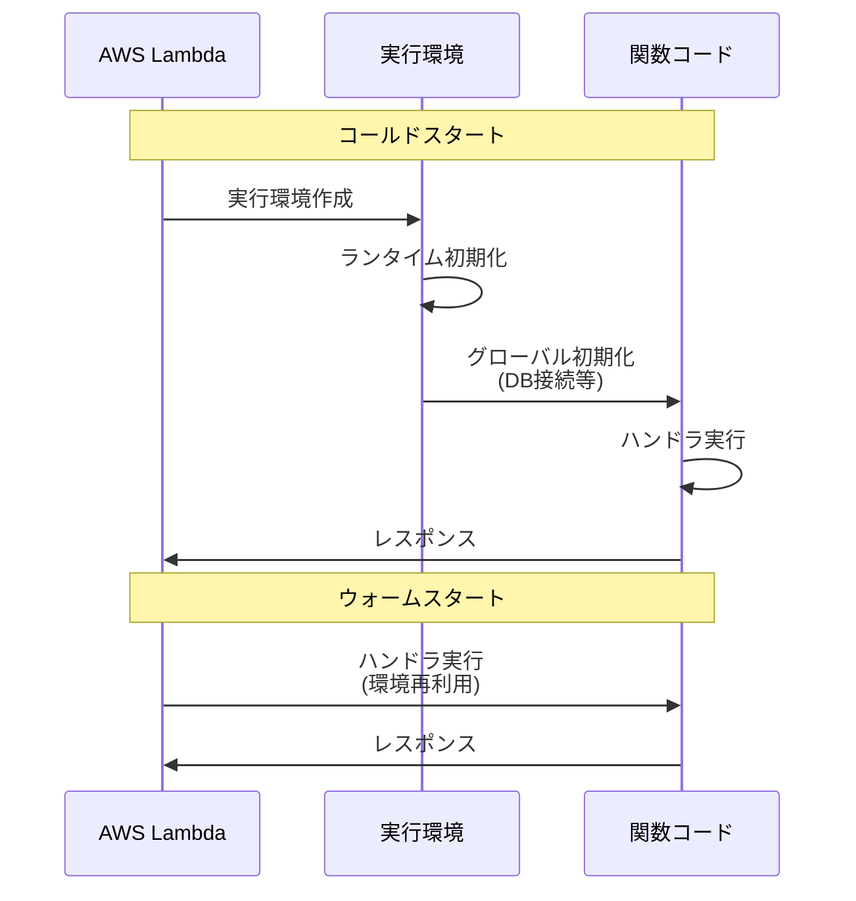
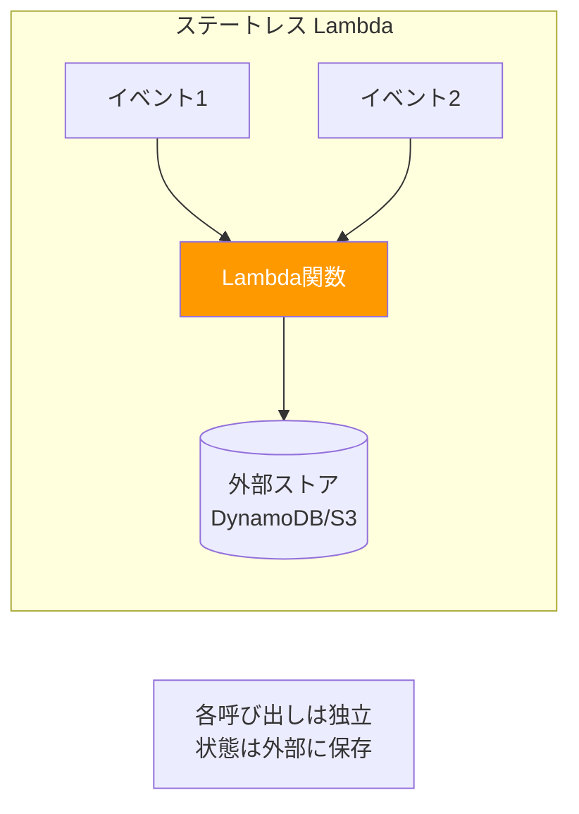
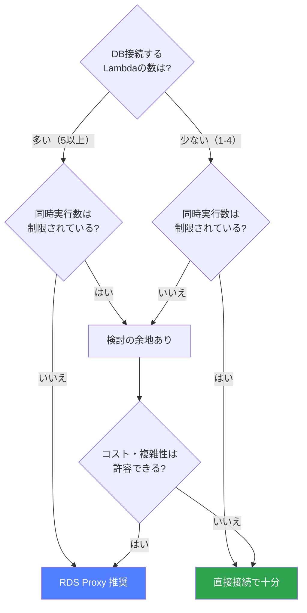
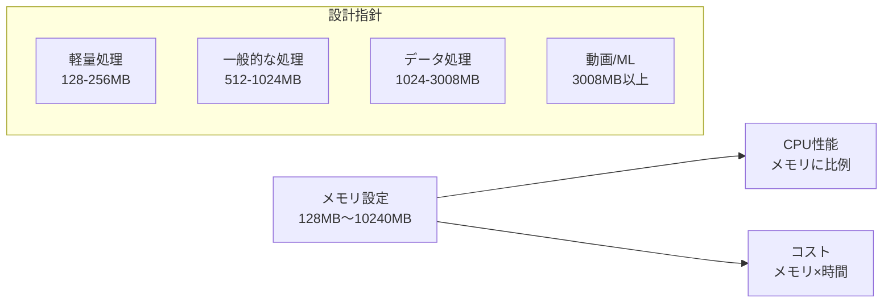

## はじめに

AWS Lambda はサーバーレスコンピューティングの中核であり、インフラ管理の負担を大幅に軽減してくれる。しかし「サーバーがない」わけではなく、実行モデルを正しく理解しないと、パフォーマンス低下やDB接続枯渇といった問題に直面する。本記事では、Lambda を本番運用するうえで押さえておくべき設計パターンと判断基準を体系的にまとめる。

---

## Lambda 関数の実行モデル

### コールドスタートとウォームスタート

Lambda 関数が呼び出されると、AWS は実行環境（コンテナ）を用意する。この実行環境のライフサイクルを理解することが設計の出発点になる。

**コールドスタート**は、実行環境が存在しない状態からの起動を指す。ランタイムの初期化、デプロイパッケージの展開、ハンドラ外のグローバル初期化コードの実行が発生するため、数百ミリ秒〜数秒の遅延が生じる。VPC に接続する Lambda の場合、ENI（Elastic Network Interface）のアタッチも加わるため、さらに遅延が大きくなる傾向がある（ただし 2019 年以降の改善により大幅に短縮されている）。

**ウォームスタート**は、以前の呼び出しで使われた実行環境が再利用されるケースを指す。グローバルスコープで初期化した変数やDB接続はそのまま保持されるため、応答が高速になる。

ここで重要なのは、「ウォームスタートは保証されない」という点だ。AWS が実行環境をいつ破棄するかは利用者がコントロールできない。したがって、ウォームスタートを前提とした設計は避け、あくまで「ボーナス」として扱うべきである。

### 実行環境の再利用で起きること

ウォームスタート時、グローバルスコープの変数は前回の呼び出し時の状態が残る。これを理解していないと以下のようなバグを生む。

- グローバル変数に前回のリクエストデータが残っていて、別ユーザーのデータが混入する
- `/tmp` ディレクトリに前回のファイルが残っていて、ディスク容量を圧迫する
- DB接続がタイムアウトしているのに再利用しようとしてエラーになる

---

## ステートレス設計の原則

### 各 Lambda 呼び出しは独立

Lambda 関数は「各呼び出しが独立した処理単位である」という前提で設計する。これがステートレス設計の根幹だ。

具体的には以下を守る。

1. **呼び出し間で状態を共有しない** — 前回の実行結果に依存する処理を書かない
2. **外部ストアに状態を保存する** — 必要な状態は DynamoDB、S3、ElastiCache などに保存する
3. **入力だけで処理が完結する** — イベント（入力データ）だけで処理結果が一意に決まるようにする

### ステートレスにするメリット

**リトライ時の副作用がない。** Lambda は非同期呼び出しの場合、失敗時に自動リトライが発生する。冪等（べきとう）な設計にしておけば、同じイベントが2回処理されても結果が変わらない。これはステートレス設計が自然に導く帰結でもある。

**スケーラビリティが確保される。** ステートレスであれば、任意の数のインスタンスを並列実行できる。呼び出し間の依存がないため、水平スケーリングが容易になる。

**テストが容易になる。** 入力と出力の関係が明確なため、ユニットテストが書きやすい。前回の実行状態を再現する必要がない。

### 冪等性の確保

ステートレス設計と合わせて、冪等性の確保が重要になる。同じイベントが複数回処理されても結果が変わらないようにするためには、以下のアプローチがある。

- **一意キーによる重複チェック** — DynamoDB の条件付き書き込みで、同じリクエストIDの処理済みチェックを行う
- **upsert パターン** — INSERT ではなく UPSERT（存在すれば更新、なければ挿入）を使う
- **外部サービス呼び出しの冪等性** — 決済APIなどは冪等キーを付与する

---

## DB 接続管理の課題

### 同時実行数 × コネクション = DB 枯渇リスク

Lambda の最大の落とし穴の一つが、DB 接続の管理だ。

Lambda はリクエストに応じて自動スケールする。仮にある Lambda 関数が 1 呼び出しあたり 1 つのDB接続を使い、同時実行数が 100 になると、100 本のDB接続が同時に張られる。RDS の `max_connections` パラメータはインスタンスクラスに依存するが、小〜中規模のインスタンスでは数百程度が上限だ。

複数の Lambda 関数が同じ RDS に接続している場合、各関数の同時実行数の合計がDB接続数の上限を超えるリスクがある。接続上限に達すると新規接続が拒否され、Lambda 関数がエラーを返すことになる。

### コネクションプーリングの限界

従来のアプリケーションサーバーでは、コネクションプールを使ってDB接続を効率的に管理する。しかし Lambda の場合、各実行環境が独立しているため、実行環境をまたいだコネクションプールは機能しない。

各実行環境がそれぞれ独自のコネクションプールを持つことになり、結果としてプールのサイズ × 実行環境数 の接続が張られてしまう。これは従来のコネクションプーリングの恩恵がほぼ得られないことを意味する。

---

## RDS Proxy とは

### コネクションプーリングのマネージドサービス

RDS Proxy は、Lambda と RDS の間に配置されるフルマネージドのデータベースプロキシだ。複数の Lambda 実行環境からのDB接続を集約し、RDS 側には少数の接続だけを維持する。

仕組みとしては以下の通りだ。

1. Lambda 関数は RDS Proxy のエンドポイントに接続する
2. RDS Proxy は接続を受け取り、内部のコネクションプールから既存の接続を割り当てる
3. Lambda 側の接続が切断されても、RDS 側の接続はプール内に保持される
4. 別の Lambda 呼び出しが来たとき、プール内の接続が再利用される

これにより、Lambda の同時実行数が急増しても、RDS 側の接続数は一定に保たれる。

### RDS Proxy の追加メリット

- **フェイルオーバーの高速化** — RDS のフェイルオーバー時、RDS Proxy が新しいプライマリへの接続を自動的に切り替える。アプリケーション側でのリトライロジックが簡素化される
- **IAM 認証のサポート** — DB のパスワード管理を Secrets Manager + IAM 認証に委ねられる
- **接続のピン留め制御** — トランザクション単位で接続を固定し、不要なときはプールに返却する

---

## RDS Proxy を使う判断基準

### 使うべきケース

**DB 接続する Lambda が多い場合。** 複数の Lambda 関数が同じ RDS に接続しており、合計の同時実行数がDB接続上限に近づく可能性がある場合は、RDS Proxy を導入すべきだ。

**トラフィックが予測しにくい場合。** バースト的なトラフィックが発生しうるシステムでは、Lambda の同時実行数が急増する。RDS Proxy がバッファとして機能し、DB を保護する。

**フェイルオーバー耐性が求められる場合。** RDS のマルチAZ構成でフェイルオーバーが発生した際、RDS Proxy がダウンタイムを最小化してくれる。

### 直接接続で十分なケース

**DB 接続する Lambda が少なく、同時実行数が制限されている場合。** ReservedConcurrentExecutions で同時実行数を 10 に制限しており、Lambda 関数も 1〜2 個しかない場合、DB 接続数は最大でも 10〜20 程度に収まる。この規模なら直接接続で問題ない。

**DynamoDB を使っている場合。** そもそも RDS を使わないのであれば、RDS Proxy は不要だ。DynamoDB は HTTP ベースのアクセスでコネクション管理の問題が発生しない。

### コスト・複雑性とのトレードオフ

RDS Proxy は無料ではない。vCPU 単位の時間課金が発生する。小規模なシステムでは、RDS Proxy のコストが DB インスタンスのコストに匹敵することもある。

また、ネットワーク経路に一つレイヤーが増えるため、接続時のレイテンシがわずかに増加する（通常は 1〜5ms 程度）。デバッグ時にも考慮すべきコンポーネントが増える。

**判断のフローチャート:**

1. Lambda から RDS に接続するか？ → No なら不要
2. 同時実行数を ReservedConcurrentExecutions で十分に制限できるか？ → Yes なら直接接続で十分
3. 複数の Lambda が同じ RDS に接続するか？ → Yes なら RDS Proxy を検討
4. バーストトラフィックが発生しうるか？ → Yes なら RDS Proxy を強く推奨

---

## Lambda 同時実行数制限（ReservedConcurrentExecutions）

### 予約済み同時実行数とは

ReservedConcurrentExecutions は、特定の Lambda 関数に対して同時実行数の上限を予約する機能だ。アカウント全体の同時実行数枠（デフォルト 1,000）から指定した数を確保する。

この設定には2つの効果がある。

1. **上限の設定** — 指定した数を超えて同時実行されない（スロットリングが発生する）
2. **枠の確保** — 他の Lambda 関数がリソースを使い切っても、予約した分は確実に実行できる

### 活用シーン

- **DB 接続数の制御** — RDS Proxy を使わない場合、Lambda の同時実行数を制限することでDB接続数を間接的に制御する
- **ダウンストリームサービスの保護** — 外部APIのレートリミットに合わせて同時実行数を制限する
- **コスト制御** — 意図しないスパイクによるコスト爆発を防ぐ

### Provisioned Concurrency との違い

Provisioned Concurrency は、指定した数の実行環境を事前にウォーム状態で待機させる機能だ。コールドスタートを回避できるが、待機中もコストが発生する。

- **ReservedConcurrentExecutions** = 「最大何個まで同時に動かすか」（上限制御）
- **Provisioned Concurrency** = 「最低何個を常にウォーム状態にするか」（下限確保）

両者は併用可能であり、Provisioned Concurrency の数は ReservedConcurrentExecutions 以下でなければならない。

---

## メモリとタイムアウトの設計指針

### メモリ割り当て（128MB〜10,240MB）

Lambda のメモリは 128MB から 10,240MB（10GB）まで 1MB 単位で設定できる。ここで重要なのは、**CPU パワーはメモリに比例して割り当てられる**という点だ。メモリを増やすと CPU 性能も向上する。

**処理内容に応じた目安:**

| 処理内容 | 推奨メモリ | 理由 |
|---------|-----------|------|
| 軽量なAPI応答（DynamoDB読み取り程度） | 128〜256MB | CPU もメモリも最小限で済む |
| JSON の加工・変換 | 256〜512MB | パース処理に若干のメモリが必要 |
| 画像のリサイズ・変換 | 512〜1,024MB | CPU 集約的な処理のため、メモリを増やして CPU を確保 |
| 大量データの集計・ETL | 1,024〜3,008MB | データをメモリに載せる必要がある |
| 機械学習の推論 | 3,008MB 以上 | モデルのロードとCPU/メモリの両方が必要 |

**コスト最適化のポイント:** メモリを増やすと単価は上がるが、処理時間が短縮される場合がある。結果として「メモリを倍にしたら処理時間が半分になり、コストは同じ」というケースも珍しくない。AWS Lambda Power Tuning ツールを使って最適なメモリ設定を見つけることを推奨する。

### タイムアウト設計

Lambda の最大タイムアウトは 15 分（900 秒）だ。以下の指針で設定する。

- **API Gateway 経由の場合** — API Gateway のタイムアウトが最大 29 秒のため、Lambda のタイムアウトもそれ以下に設定する（余裕を持って 25 秒程度）
- **非同期処理の場合** — 処理に必要な時間の 2〜3 倍を設定する。予想外の遅延に対応しつつ、無限に待たないようにする
- **Step Functions から呼ぶ場合** — 各ステップの処理に必要な時間 + マージンで設定する

タイムアウトを長くしすぎると、異常時にコストが無駄に消費される。短すぎると正常な処理がタイムアウトする。ログを分析して実際の処理時間分布を把握し、適切な値を設定することが重要だ。

---

## VPC Lambda vs 非VPC Lambda

### VPC Lambda

Lambda 関数を VPC 内に配置すると、VPC 内のリソース（RDS、ElastiCache、EC2 など）にプライベートネットワーク経由でアクセスできる。

**メリット:**
- RDS やElastiCache にプライベートサブネット経由で接続できる
- セキュリティグループによるネットワークアクセス制御が可能
- 企業のネットワークポリシーに準拠できる

**デメリット:**
- NAT Gateway がないとインターネットにアクセスできない（NAT Gateway のコストが発生）
- ENI の管理が必要（AWS が自動管理する Hyperplane ENI により大幅に改善済み）

### 非VPC Lambda

VPC に配置しない Lambda 関数は、AWS のマネージドネットワーク上で実行される。

**メリット:**
- コールドスタートが高速
- NAT Gateway のコストが不要
- ネットワーク設定が不要でシンプル

**デメリット:**
- VPC 内のリソースに直接アクセスできない
- ネットワークレベルでのアクセス制御が限定的

**判断基準:** RDS や ElastiCache に接続する必要があるなら VPC Lambda、DynamoDB や S3 だけを使うなら非VPC Lambda が基本方針だ。

---

## Lambda Layers

### Layers とは

Lambda Layers は、複数の Lambda 関数で共有するライブラリやコードをパッケージ化する仕組みだ。デプロイパッケージのサイズ削減と、共通コードの一元管理を目的とする。

### 適切な使い方

- **共通ライブラリ** — 全関数で使う SDK やユーティリティを Layer にまとめる
- **バイナリ依存** — FFmpeg、ImageMagick などのバイナリを Layer として配布する
- **設定ファイル** — 共通の設定ファイルを Layer に含める

### 注意点

- Layer は最大 5 つまで重ねられる
- デプロイパッケージ + 全 Layer の合計が 250MB（解凍後）を超えてはならない
- Layer のバージョン管理は明示的に行う必要がある（最新版が自動適用されるわけではない）
- Layer の更新は全関数の再デプロイが必要になるため、影響範囲が大きい

---

## 環境変数の管理

### 基本的な使い方

Lambda の環境変数は、関数の設定画面またはインフラコード（CloudFormation、CDK、Terraform）から設定する。ステージごとに異なる値（開発環境のDB接続先と本番環境のDB接続先など）を管理するのに適している。

### 機密情報の管理

環境変数に直接シークレットを格納するのは避けるべきだ。以下の理由による。

- Lambda コンソールから平文で閲覧可能
- デプロイログに出力される可能性がある
- 環境変数の更新には関数の再デプロイが必要

**推奨アプローチ:**

1. **AWS Secrets Manager** — DB パスワード、API キーなどを格納し、Lambda 関数内で取得する。自動ローテーションもサポートする
2. **AWS Systems Manager Parameter Store** — 設定値やシークレットを格納する。Secrets Manager より安価だが、自動ローテーション機能はない
3. **環境変数 + KMS 暗号化** — 環境変数を KMS キーで暗号化する。ただし Lambda コンソールでは復号された値が表示される点に注意

パフォーマンスの観点では、Secrets Manager や Parameter Store からの取得はAPIコールを伴うため、ハンドラ外（グローバルスコープ）でキャッシュすることを推奨する。Lambda Extensions を使ったキャッシュ機構も提供されている。

---

## Lambda 関数の分割粒度（1 関数 1 責務）

### Single Purpose Function

Lambda 関数は「1 つの関数が 1 つの責務を持つ」ように設計する。これは単一責任原則（SRP）の Lambda 版だ。

**良い例:**
- `processOrder` — 注文処理
- `sendNotification` — 通知送信
- `generateThumbnail` — サムネイル生成

**悪い例:**
- `handleEverything` — 注文処理も通知も画像処理も全部やる

### 分割のメリット

- **デプロイの独立性** — 1 関数の変更が他に影響しない
- **スケーリングの独立性** — 負荷の高い関数だけスケールできる
- **メモリ・タイムアウトの最適化** — 関数ごとに最適な設定ができる
- **障害の局所化** — 1 関数の障害が他に波及しない
- **コードの可読性** — 関数が小さいため理解しやすい

### 分割しすぎの問題

一方で、過度な分割は「ナノサービス」問題を引き起こす。関数が多すぎると以下の課題が生じる。

- 管理対象が増えて運用負荷が上がる
- 関数間の通信オーバーヘッドが増える
- 全体の処理フローが追いにくくなる

適切な粒度は「ビジネスロジックの一つのユースケースを完結させる単位」が目安だ。

---

## エラーハンドリングのパターン

### 同期呼び出しの場合

API Gateway 経由などの同期呼び出しでは、Lambda 関数内で例外をキャッチし、適切な HTTP ステータスコードとエラーメッセージを返す。未処理の例外は 502 エラーとして返却される。

### 非同期呼び出しの場合

S3 イベントや SNS トリガーなどの非同期呼び出しでは、Lambda サービスが自動的に 2 回までリトライする。すべてのリトライが失敗した場合、DLQ（Dead Letter Queue）にイベントが送られる。

**DLQ の設定は必須だ。** DLQ を設定しないと、失敗したイベントは消失する。SQS キューまたは SNS トピックを DLQ として設定し、失敗イベントを後から調査・再処理できるようにする。

### Lambda Destinations

Lambda Destinations は、非同期呼び出しの成功・失敗時に別のサービスを呼び出す機能だ。DLQ の上位互換として位置づけられる。

- 成功時の送信先 — 後続処理の Lambda、SQS、SNS、EventBridge
- 失敗時の送信先 — DLQ としての SQS、通知用の SNS、分析用の EventBridge

DLQ と比較して、成功時のルーティングも可能であり、EventBridge への送信で柔軟なイベント駆動が実現できる点が優れている。

---

## 実務でのアンチパターン

### モノリシック Lambda

1 つの Lambda 関数に大量のロジックを詰め込むパターン。デプロイパッケージが肥大化し、コールドスタートが遅くなり、メモリ割り当ての最適化もできない。ルーティングロジックが関数内部に存在し、API Gateway のルーティング機能を活用できていないケースが典型的だ。

### 過度な共有レイヤー

「コードの重複を避けたい」という動機で巨大な共有 Layer を作成するパターン。Layer の更新が全関数に影響し、デプロイの独立性が失われる。Layer にビジネスロジックを含めてしまうと、テストや変更が困難になる。

Layer には「安定していて、変更頻度が低い共通ライブラリ」だけを含めるべきだ。

### Lambda の連鎖呼び出し（Lambda → Lambda）

Lambda 関数から別の Lambda 関数を直接同期呼び出しするパターン。以下の問題がある。

- 呼び出し元の Lambda が呼び出し先の完了を待つ間もコストが発生する
- タイムアウトの管理が複雑になる
- エラーハンドリングが煩雑になる

代替として、SQS、SNS、EventBridge、Step Functions を使った非同期連携を検討すべきだ。

### /tmp の過信

`/tmp` ディレクトリ（最大 10GB）は実行環境間で共有されないため、永続ストレージとして使えない。また、ウォームスタート時に前回のデータが残っている可能性があるため、処理開始時にクリーンアップするか、ファイル名にリクエストIDを含めるなどの対策が必要だ。

### 環境変数にシークレットを直接格納

前述のとおり、平文でシークレットを環境変数に入れるのは避ける。Secrets Manager や Parameter Store を使うべきだ。

---

## まとめ

Lambda の設計で最も重要なのは、実行モデル（コールドスタート・ウォームスタート）の理解とステートレス設計の徹底だ。DB接続管理については、同時実行数の見積もりを行い、RDS Proxy の要否を判断する。小規模なら直接接続 + ReservedConcurrentExecutions で十分であり、大規模・バーストトラフィックが見込まれる場合は RDS Proxy を導入する。

関数の粒度は「1 関数 1 責務」を基本としつつ、過度な分割を避ける。メモリ設定は処理内容に応じて最適化し、Lambda Power Tuning でコスト効率を検証する。エラーハンドリングでは DLQ の設定を忘れず、アンチパターン（モノリシック Lambda、連鎖呼び出し）を回避する。

これらの原則を押さえておけば、Lambda を活用したシステムの信頼性とコスト効率を大幅に向上させることができる。

---

## 参考文献

- [AWS Lambda 開発者ガイド](https://docs.aws.amazon.com/lambda/latest/dg/welcome.html)
- [Lambda 実行環境のライフサイクル](https://docs.aws.amazon.com/lambda/latest/dg/lambda-runtime-environment.html)
- [Amazon RDS Proxy の使用](https://docs.aws.amazon.com/AmazonRDS/latest/UserGuide/rds-proxy.html)
- [Lambda 関数のベストプラクティス](https://docs.aws.amazon.com/lambda/latest/dg/best-practices.html)
- [Lambda の同時実行数の管理](https://docs.aws.amazon.com/lambda/latest/dg/configuration-concurrency.html)
- [AWS Lambda Power Tuning](https://github.com/alexcasalboni/aws-lambda-power-tuning)
