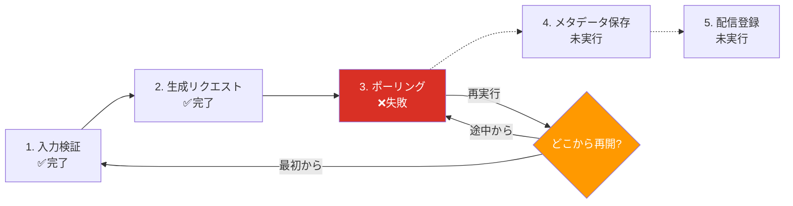
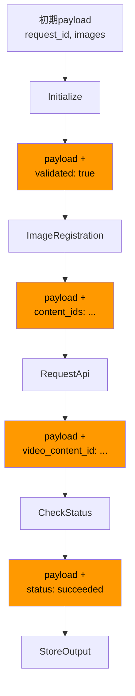
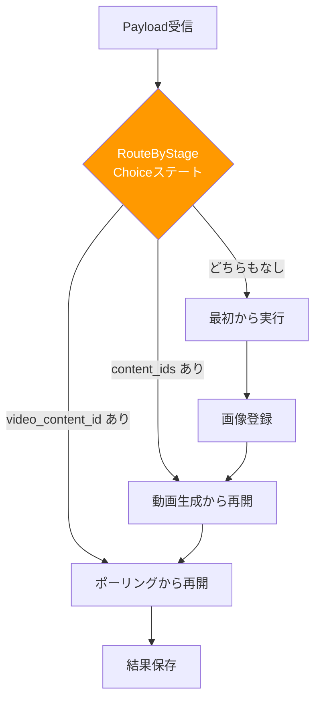
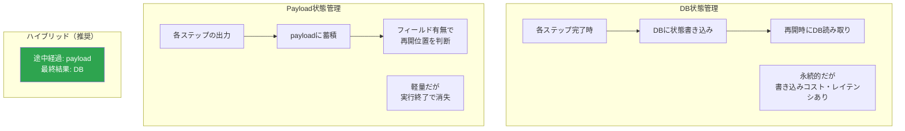

## はじめに

分散ワークフローにおいて、「処理が途中で失敗した場合にどこから再開するか」は避けて通れない設計課題だ。すべてを最初からやり直すのは時間とコストの無駄であり、場合によっては副作用（重複課金、二重送信など）を引き起こす。

本記事では、payload（ステップ間で受け渡されるデータ）の状態を活用したチェックポイントパターンを解説する。AWS Step Functions を例に説明するが、考え方自体はあらゆるワークフローエンジンに適用可能だ。

---

## ワークフローにおける状態管理の課題

### 複数ステップの処理

業務システムのワークフローは、複数のステップで構成されることが多い。たとえば動画コンテンツの生成パイプラインを考えると、以下のようなステップがある。

1. 入力データの検証
2. 動画コンテンツの生成リクエスト
3. 生成完了のポーリング（非同期処理の完了待ち）
4. メタデータの保存
5. 配信設定の登録

ステップ 3（ポーリング中）で外部APIのエラーにより失敗した場合、ステップ 1 と 2 はすでに正常に完了している。この状態で最初から再実行すると、ステップ 2 で再度動画生成リクエストが発行され、不要なリソースが生成される可能性がある。

### 「どこまで完了したか」をどう表現するか

途中再開を実現するためには、「どこまで完了したか」を何らかの形で記録する必要がある。これを実現する方法は大きく2つある。

1. **DB に進捗状態を保存する** — 各ステップの完了時に DB のステータスカラムを更新する
2. **payload にチェックポイント情報を含める** — 各ステップの出力結果を payload に蓄積し、payload の内容から再開位置を判断する

本記事では後者の「payload ベースの状態管理」を中心に解説する。



---

## payload とは

### ステップ間で受け渡される JSON データ

Step Functions における payload とは、ステートマシンの各ステートが受け取り、加工し、次のステートに渡す JSON データのことだ。ステートマシンの実行開始時に入力として与えた JSON が、各ステートを経由するたびにフィールドが追加・変更されていく。

たとえば、最初の入力が以下のようなデータだったとする。

```json
{
  "request_id": "req-001",
  "source_url": "https://example.com/input.mp4"
}
```

ステップ 2（動画生成リクエスト）が完了すると、payload に生成結果が追加される。

```json
{
  "request_id": "req-001",
  "source_url": "https://example.com/input.mp4",
  "video_content_id": "vc-12345"
}
```

ステップ 3（ポーリング完了）後にはさらにフィールドが追加される。

```json
{
  "request_id": "req-001",
  "source_url": "https://example.com/input.mp4",
  "video_content_id": "vc-12345",
  "content_ids": ["content-001", "content-002"]
}
```

このように、payload は処理の進捗を「データの状態」として表現する手段になる。



---

## チェックポイントパターンとは

### 処理の進捗をデータの状態で表現する

チェックポイントパターンとは、payload 内の特定フィールドの有無を見て、処理がどの段階まで完了しているかを判断し、適切な位置から再開する設計パターンだ。

明示的な「ステータス」フィールドを用意するのではなく、**各ステップの出力結果がそのままチェックポイントの証拠になる**という考え方が核心だ。

### payload 内のフィールド有無で処理再開位置を決定する仕組み

具体例で説明する。先ほどの動画生成パイプラインにおいて、以下のルールで再開位置を決定する。

**ルール 1: `content_ids` が存在する場合**
→ 動画生成とポーリングは完了済み。メタデータ保存から再開する。

**ルール 2: `video_content_id` が存在するが `content_ids` は存在しない場合**
→ 動画生成リクエストは完了済みだが、ポーリングが未完了。ポーリングから再開する。

**ルール 3: どちらも存在しない場合**
→ まだ何も処理されていない。最初から実行する。

この判断ロジックをワークフローの冒頭に配置することで、同じステートマシン定義で「初回実行」と「途中再開」の両方を処理できる。

---

## Choice ステートによる分岐（RouteByStage 的な設計）

### Step Functions の Choice ステート

Step Functions の Choice ステートは、payload の内容に基づいて分岐を行うステートだ。チェックポイントパターンにおいて、再開位置の判断ロジックを実装する要となる。

ステートマシンの先頭に「RouteByStage」のような名前の Choice ステートを配置し、以下のような分岐条件を定義する。

1. `$.content_ids` が存在する → `SaveMetadata` ステートへ
2. `$.video_content_id` が存在する → `PollVideoStatus` ステートへ
3. デフォルト → `ValidateInput` ステートへ（最初から実行）

**重要なのは条件の評価順序だ。** より進んだ段階の条件を先に評価する。`content_ids` のチェックを `video_content_id` より先に行うことで、両方存在する場合（= より後の段階まで完了している場合）に正しく判断できる。

### この設計の利点

- **ステートマシンの定義が1つで済む** — 初回実行用と再開用で別のステートマシンを作る必要がない
- **再開ロジックが宣言的** — Choice ステートの条件として明示的に記述されるため、可読性が高い
- **テストが容易** — 異なる payload を入力として与えるだけで、各再開パスをテストできる



---

## DB 状態管理 vs payload 状態管理の比較

### DB 状態管理

DBにステータスカラムを持ち、各ステップの完了時に更新する方式。

**メリット:**
- **永続性がある** — ワークフローの実行が終了してもデータが残る
- **外部から参照可能** — 管理画面やモニタリングツールから進捗を確認できる
- **複数ワークフローをまたぐ** — 異なるステートマシンの実行間で状態を共有できる
- **監査ログとして機能する** — いつ、どのステップまで完了したかの履歴が残る

**デメリット:**
- **書き込みコストとレイテンシ** — 各ステップでDB書き込みが発生する
- **一貫性の管理** — ステップの処理とDB更新の間で不整合が生じる可能性がある（処理は完了したがDB更新前にクラッシュ）
- **DB障害の影響** — DB がダウンするとワークフロー全体が停止する

### payload 状態管理

payload 内のフィールド有無で進捗を表現する方式。

**メリット:**
- **軽量** — DB書き込みが不要で、オーバーヘッドがない
- **自己完結** — payload だけで再開に必要な情報が揃っている
- **トランザクション不要** — payload の更新はステートマシンが保証するため、不整合が起きにくい
- **デバッグ容易** — payload を見れば処理状況が一目でわかる

**デメリット:**
- **揮発性** — Step Functions の実行が終了すると payload は保持されない（実行履歴から確認は可能だが、90日で消える）
- **サイズ制限** — Step Functions の payload は 256KB が上限
- **外部から参照しにくい** — 実行中のステートマシンの payload を外部から取得するにはAPIコールが必要



---

## ハイブリッド設計（payload で途中経過、DB で最終結果）

### 実務で最も多い設計

実際のシステムでは、payload 状態管理と DB 状態管理を組み合わせるハイブリッド設計が多い。

**payload で管理するもの:**
- ステップ間の中間データ（一時的なID、処理結果のサマリー）
- 再開位置の判断に使うフィールド
- 次のステップに渡すパラメータ

**DB で管理するもの:**
- ワークフローの最終結果（成功/失敗、生成されたリソースのID）
- ビジネス上意味のあるステータス（注文状態、配信状態）
- 監査ログ、処理履歴

この分担により、ワークフロー内部の効率性（payload の軽量さ）と、ワークフロー外部からの可視性（DB の永続性）の両方を確保できる。

### 設計指針

- ワークフローの最初と最後でDBを更新する（開始時に「処理中」、完了時に「完了」）
- 中間ステップの状態は payload で管理する
- 障害発生時の再開は payload ベースで行い、最終結果のみ DB に記録する

---

## DLQ Redrive での途中再開フロー

### DLQ に入ったイベントの再処理

Step Functions のタスクステートで Lambda が失敗し、リトライも尽きた場合、エラーをキャッチして DLQ（SQS）にイベントを送ることがある。この DLQ に入ったイベントを再処理する際に、チェックポイントパターンが威力を発揮する。

### 再開フローの例

1. Step Functions の実行がステップ 3 で失敗する
2. Catch 句により、その時点の payload が DLQ に送信される
3. 障害原因を調査・修正する
4. DLQ のメッセージ（= 失敗時の payload）を取り出す
5. その payload を入力として、同じステートマシンを再実行する
6. RouteByStage の Choice ステートが payload を分析し、ステップ 3 から再開する

**ポイントは、DLQ に送るデータとして「その時点の payload」を保存することだ。** 単にエラーメッセージだけを送ってしまうと、再開に必要な情報が失われる。

### SQS DLQ Redrive

SQS には DLQ Redrive 機能があり、DLQ に入ったメッセージを元のキューに戻すことができる。ただし Step Functions の場合は、DLQ のメッセージを取り出して新しいステートマシン実行を開始する形が一般的だ。Lambda トリガーやスクリプトで自動化するケースが多い。

---

## metadata 保存による再実行可能性の確保

### なぜ metadata が必要か

チェックポイントパターンで途中再開を実現するためには、失敗時の payload が完全に保存されている必要がある。しかし、以下のようなケースでは payload だけでは不十分なことがある。

- payload に含まれない実行コンテキスト（実行開始時刻、トリガー元の情報）が再開に必要
- 外部APIの応答全体を保存しておきたいが、payload サイズ制限を超える
- 障害分析のために、各ステップの詳細な入出力を記録したい

### metadata の保存先

**S3 への保存** — 各ステップの入出力を S3 にJSON形式で保存する。payload にはS3のキーだけを含める。大量のデータも保存でき、コストも低い。

**DynamoDB への保存** — 実行IDをキーとして、各ステップの metadata を Item として保存する。高速な読み取りが可能で、TTL による自動削除もできる。

**CloudWatch Logs への出力** — 各ステップの Lambda 関数から構造化ログを出力する。Logs Insights でクエリ可能だが、再処理の入力として使うには取り出しにくい。

### metadata と payload の使い分け

- **payload** — 次のステップが処理に使うデータ。最小限に保つ
- **metadata** — デバッグ・監査・再実行のために保存するデータ。サイズを気にせず保存可能

---

## サーガパターン（Saga Pattern）との関連

### サーガパターンとは

サーガパターンは、分散トランザクションを複数のローカルトランザクションに分割し、いずれかが失敗した場合に補償トランザクション（Compensating Transaction）で巻き戻す設計パターンだ。

チェックポイントパターンが「途中から前に進む」のに対し、サーガパターンは「途中から巻き戻す」アプローチだ。両者は相補的な関係にある。

### Orchestration vs Choreography

サーガパターンの実装には2つのスタイルがある。

**Orchestration（オーケストレーション）**
- 中央のコーディネーター（Step Functions など）が各ステップの実行と補償を制御する
- フローが明示的で可視性が高い
- Step Functions との相性が良い

**Choreography（コレオグラフィ）**
- 各サービスがイベントを発行し、関連サービスがそれに反応する
- 中央のコーディネーターが不要で疎結合
- EventBridge + SQS/SNS で実装されることが多い
- フロー全体の可視性が低く、デバッグが困難

**実務での選択基準:**

| 観点 | Orchestration | Choreography |
|------|--------------|--------------|
| フローの可視性 | 高い（ステートマシンで一覧可能） | 低い（各サービスを横断的に追う必要） |
| 結合度 | コーディネーターに依存 | 各サービスは疎結合 |
| 変更容易性 | ステートマシンを変更するだけ | 関連する全サービスの変更が必要な場合も |
| デバッグ | 容易（実行履歴が一箇所に集約） | 困難（分散トレーシングが必要） |
| 適する規模 | 中小規模のワークフロー | 大規模・マイクロサービス間の連携 |

チェックポイントパターンは主に Orchestration スタイルで使われる。Step Functions がオーケストレーターとなり、payload の管理と再開ロジックを担う。

---

## 補償トランザクション

### 補償トランザクションとは

補償トランザクションとは、すでに完了したステップの結果を「論理的に取り消す」処理のことだ。データベースの ROLLBACK と異なり、物理的な巻き戻しではなく、ビジネスロジックとしての打ち消し処理を行う。

**例:**
- 注文処理が途中で失敗した場合 → 決済のキャンセルAPIを呼ぶ
- 在庫引当が完了した後に後続処理が失敗 → 在庫を戻す
- 動画生成が完了した後にメタデータ保存が失敗 → 生成された動画を削除する

### チェックポイントパターンとの組み合わせ

チェックポイントパターンは「前に進む」（途中から再開する）アプローチだが、すべてのケースで前に進めるとは限らない。外部サービスの仕様変更や、ビジネス要件の変更により、途中再開では解決できない場合がある。

そのような場合は補償トランザクションで巻き戻し、最初からやり直す。Step Functions では、Catch 句で補償ステップを呼び出す形で実装する。

**設計指針:**
- まず途中再開（チェックポイント）を試みる
- 再開で解決できない場合は補償トランザクションで巻き戻す
- 補償も失敗した場合は人間の介入を要求する（アラート + 手動対応）

---

## イベントソーシングとの比較

### イベントソーシングとは

イベントソーシングは、システムの状態を「イベントの履歴」として保存する設計パターンだ。現在の状態は、すべてのイベントを順番に適用（リプレイ）することで再構築できる。

### チェックポイントパターンとの違い

| 観点 | チェックポイントパターン | イベントソーシング |
|------|----------------------|-----------------|
| 状態の表現 | payload の現在の内容 | イベントの履歴全体 |
| 再構築方法 | payload をそのまま使う | イベントをリプレイして状態を再構築 |
| 保存先 | payload 自体（+ S3/DynamoDB） | イベントストア |
| 粒度 | ステップ単位 | イベント単位（より細かい） |
| 用途 | ワークフローの途中再開 | システム全体の状態管理・監査 |

チェックポイントパターンは、ワークフローの途中再開という限定的な目的に特化しており、実装がシンプルだ。イベントソーシングはより汎用的で強力だが、導入コスト（イベントストアの構築、イベントの設計、リプレイ機構の実装）が高い。

**使い分けの基準:**
- ワークフローの途中再開だけが目的 → チェックポイントパターン
- システム全体の状態を任意の時点に復元したい → イベントソーシング
- 監査ログとして「何が起きたか」の完全な記録が必要 → イベントソーシング

---

## 実務での設計 Tips

### payload サイズ制限への対策

Step Functions の payload サイズ制限は 256KB だ。これは各ステートの入力・出力それぞれに適用される。大きなデータを扱う場合、以下の対策がある。

**S3 にデータを退避する。** 大きなデータ（画像、動画のメタデータ、大量のレコード）は S3 に保存し、payload には S3 のキー（パス）だけを含める。各ステップの Lambda 関数が S3 からデータを取得して処理する。

**ResultSelector で出力を絞り込む。** Step Functions の ResultSelector 機能を使い、Lambda の返却値から必要なフィールドだけを payload に含める。不要な情報を省くことで payload サイズを抑制できる。

**InputPath / OutputPath で伝播範囲を制御する。** 各ステートに渡す入力と、次のステートに渡す出力を明示的に制御する。不要なフィールドが payload に蓄積されるのを防ぐ。

### ログ出力のベストプラクティス

チェックポイントパターンを採用した場合、障害発生時に「どの時点の payload で再開すべきか」を素早く判断する必要がある。そのために以下のログ出力を推奨する。

- **各ステップの開始時に payload をログ出力する** — どのフィールドが存在する状態でそのステップに入ったかがわかる
- **各ステップの完了時に追加されたフィールドをログ出力する** — そのステップが何を生成したかがわかる
- **構造化ログを使う** — JSON 形式でログを出力し、CloudWatch Logs Insights でクエリ可能にする
- **実行ID（execution ARN）を含める** — Step Functions の実行とログを紐づけられるようにする

### デバッグ容易性の確保

- **Step Functions のビジュアルエディタ** — 実行履歴からどのステートでどのような payload が渡されたかを視覚的に確認できる。障害分析の第一歩として活用する
- **テスト用の payload テンプレート** — 各再開パスをテストするための payload テンプレートを用意しておく。手動テストや自動テストで利用する
- **payload のバリデーション** — RouteByStage の直後に、必須フィールドの型チェックや値の範囲チェックを行うステートを入れることで、不正な payload による予期しない挙動を防ぐ

### Express Workflow vs Standard Workflow

チェックポイントパターンを採用する場合、Standard Workflow を選択すべきだ。

- **Standard Workflow** — 最大実行時間1年、実行履歴が保持される、exactly-once 実行セマンティクス。途中再開やDLQ Redrive との相性が良い
- **Express Workflow** — 最大実行時間5分、実行履歴は CloudWatch Logs のみ、at-least-once 実行セマンティクス。短時間で大量に実行される処理向け

Express Workflow では実行履歴が Step Functions コンソールに保持されないため、payload の確認やデバッグが困難になる。チェックポイントパターンの前提となる「失敗時の payload を取り出して再実行する」フローとの相性が悪い。

---

## Step Functions の payload サイズ制限（256KB）と対策

### 256KB 制限の詳細

Step Functions の payload サイズ制限は、以下の箇所それぞれに適用される。

- ステートマシンの実行開始時の入力
- 各ステートの入力
- 各ステートの出力
- ステートマシンの実行結果

この制限を超えると `States.DataLimitExceeded` エラーが発生し、ステートマシンの実行が失敗する。

### 具体的な対策

**1. 大きなデータは S3 経由にする**

前述のとおり、大きなデータは S3 に保存し、payload には参照情報だけを持つ。これはチェックポイントパターンとも相性が良い。再開時に必要なのは「どこまで完了したか」の情報であり、処理対象のデータ本体ではない。

**2. payload の肥大化を防ぐ設計**

ステップが増えるにつれて payload にフィールドが蓄積されていく。不要になったフィールドは ResultPath や OutputPath で除外する。ただし、チェックポイントに必要なフィールド（再開位置の判断に使うフィールド）は残す必要があるため、バランスが重要だ。

**3. Step Functions の SDK 統合を活用する**

Lambda を介さずに Step Functions から直接 S3 や DynamoDB にアクセスする SDK 統合を使うことで、Lambda の応答をpayload に含める必要がなくなるケースがある。たとえば、S3 へのデータ保存を Lambda 経由ではなく SDK 統合で行えば、保存結果のメタデータだけが payload に追加される。

**4. Map ステートの parallel iteration に注意する**

Map ステートで大量のアイテムを並列処理する場合、各イテレーションの結果が配列として payload に集約される。アイテム数が多いと容易に 256KB を超える。対策として、各イテレーションの結果を S3 や DynamoDB に保存し、payload には処理件数のサマリーだけを返すようにする。

---

## まとめ

payload ベースのチェックポイントパターンは、ワークフローの途中再開をシンプルかつ効率的に実現する設計パターンだ。フィールドの有無で再開位置を判断する仕組みは直感的であり、Step Functions の Choice ステートとの相性も良い。

実務では、payload だけでなく DB やS3 と組み合わせるハイブリッド設計が一般的だ。payload で中間状態を管理し、DB で最終結果を記録し、S3 で大きなデータを退避する。この三層の使い分けを意識することで、256KB の制限を回避しつつ、再実行可能性と可視性を両立できる。

サーガパターンや補償トランザクション、イベントソーシングといった関連パターンとの位置づけを理解し、システムの要件に応じて適切なパターンを選択することが重要だ。チェックポイントパターンは「前に進む」ことに特化した軽量なアプローチであり、多くの実務シーンで最初の選択肢として検討する価値がある。

---

## 参考文献

- [Step Functions の入出力処理](https://docs.aws.amazon.com/step-functions/latest/dg/concepts-input-output-filtering.html)
- [Step Functions のペイロードサイズ制限](https://docs.aws.amazon.com/step-functions/latest/dg/limits-overview.html)
- [Saga パターン — AWS 規範ガイダンス](https://docs.aws.amazon.com/prescriptive-guidance/latest/modernization-decomposing-monoliths/saga-orchestration.html)
- [イベントソーシングパターン — Microsoft Azure アーキテクチャセンター](https://learn.microsoft.com/ja-jp/azure/architecture/patterns/event-sourcing)
- [Designing Data-Intensive Applications (Martin Kleppmann)](https://dataintensive.net/)
