# tmux + git worktree + tmux-agent-sidebarで複数AIエージェントを並行運用する

AIコーディングエージェント（Claude CodeやCodexなど）を複数同時に動かして開発効率を上げたい。でも「tmuxって何？」「同じリポジトリで複数ブランチを同時に触れるの？」という疑問がある方も多いのではないでしょうか。

この記事では、**tmux**、**git worktree**、**tmux-agent-sidebar**の3つを組み合わせて、複数のAIエージェントを並行して管理する方法を解説します。

---

## 前提知識

この記事で扱うツールの関係を先に整理しておきます。

| ツール | 役割 |
|---|---|
| tmux | 1つのターミナルで複数の作業を同時に行う |
| git worktree | 1つのリポジトリで複数ブランチを同時にチェックアウトする |
| tmux-agent-sidebar | tmux内で動いているAIエージェントの状態を一覧表示する |

3つのツールがどう連携するかを図にすると、以下のようになります。

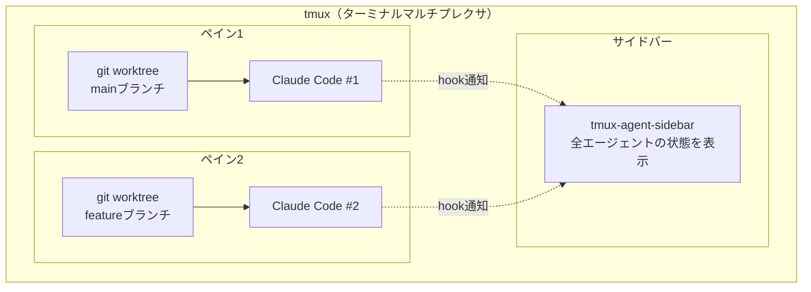

---

## tmuxとは

**tmux**（Terminal Multiplexer）は、1つのターミナルウィンドウ内で**複数の端末を分割・切り替え**できるツールです。

### なぜtmuxが必要なのか

普通のターミナルでは、以下のような問題があります。

- コードを編集しながらサーバーを動かしたい → ターミナルを複数開く必要がある
- ターミナルを閉じたら実行中のプロセスが終了してしまう
- AIエージェントを複数動かすと、どのウィンドウがどれかわからなくなる

tmuxはこれらをすべて解決します。

### tmuxの基本構造

tmuxには3つの階層があります。

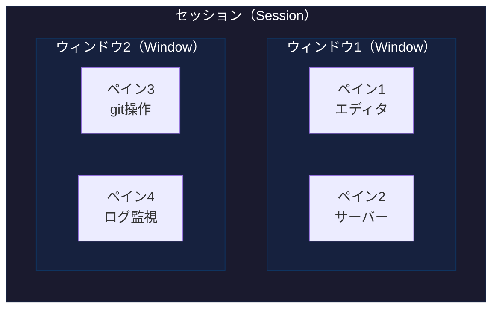

- **セッション**: 一番外側の箱。デタッチしても裏で生き続ける
- **ウィンドウ**: ブラウザのタブのようなもの。切り替えて使う
- **ペイン**: ウィンドウ内の分割された領域。同時に表示される

それぞれを身近なものに例えると：

| tmuxの概念 | 例え |
|---|---|
| セッション | デスクトップそのもの。閉じても裏で生き続ける |
| ウィンドウ | ブラウザのタブ。複数のタブを切り替えて使う |
| ペイン | ブラウザのタブ内を分割した画面。横並びや縦並びに配置できる |

### 画面イメージ

```
┌─────────────────────────┬─────────────────────────┐
│ ペイン1                  │ ペイン2                  │
│ ~/project (main)        │ ~/project-feat           │
│ $ claude                │ (feature/new-api)        │
│ > APIの設計をして        │ $ claude                 │
│                         │ > テストを書いて          │
├─────────────────────────┤                         │
│ ペイン3                  │                         │
│ $ npm run dev           │                         │
│ Server running...       │                         │
└─────────────────────────┴─────────────────────────┘
```

### tmuxのインストール

```bash
# macOS（Homebrewを使用）
brew install tmux

# Ubuntu/Debian
sudo apt install tmux

# バージョン確認
tmux -V
```

### 基本操作

tmuxのすべての操作は**プレフィックスキー**（デフォルトは `Ctrl-b`）の後にキーを押すことで行います。

```
Ctrl-b を押す → 手を離す → 次のキーを押す
```

**同時押しではない**ことに注意してください。

#### よく使うキーバインド

| 操作 | キー | 説明 |
|---|---|---|
| 横分割 | `Ctrl-b` → `%` | ペインを左右に分ける |
| 縦分割 | `Ctrl-b` → `"` | ペインを上下に分ける |
| ペイン移動 | `Ctrl-b` → 矢印キー | 隣のペインに移動 |
| ウィンドウ作成 | `Ctrl-b` → `c` | 新しいウィンドウ（タブ）を作る |
| ウィンドウ切替 | `Ctrl-b` → `n` / `p` | 次/前のウィンドウに移動 |
| デタッチ | `Ctrl-b` → `d` | tmuxから抜ける（セッションは残る） |
| ペインを閉じる | `Ctrl-b` → `x` | 現在のペインを閉じる |

#### セッション管理コマンド

```bash
# 新しいセッションを開始
tmux

# 名前付きセッションを開始
tmux new -s my-project

# セッション一覧を表示
tmux ls

# セッションに再接続（デタッチ後）
tmux attach -t my-project
```

### デタッチとアタッチ

tmuxの最大の特徴の1つが**デタッチ**です。

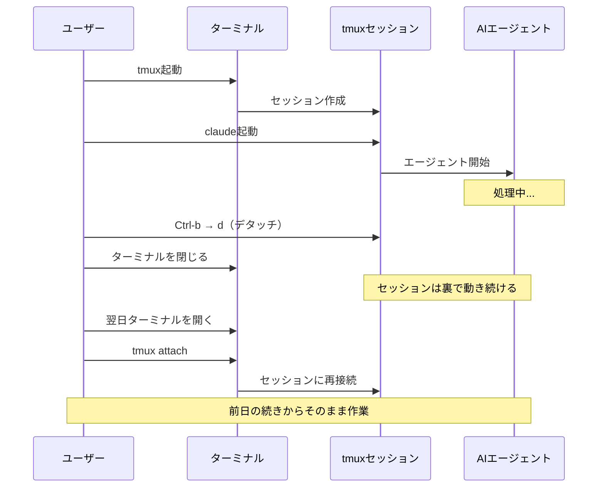

- **デタッチ** = tmuxから抜けること（セッションは裏で動き続ける）
- **アタッチ** = 裏で動いているセッションに再接続すること

つまり、ターミナルを閉じてもtmux内で実行中のプロセス（サーバーやAIエージェント）は**停止しません**。翌日ターミナルを開いて`tmux attach`すれば、前日の続きからそのまま作業できます。

---

## git worktreeとは

### 問題：同じリポジトリで複数ブランチを同時に触りたい

こんな経験はありませんか？

- `feature/api`ブランチで開発中だけど、急に`main`ブランチで別の修正が必要になった
- ブランチを切り替えるたびに`node_modules`の再インストールが走る
- AIエージェントを2つ起動して、別々のブランチで並行作業させたい

通常のgitでは、**1つのディレクトリに1つのブランチしかチェックアウトできません**。ブランチを切り替えるには`git checkout`や`git switch`が必要で、その度にファイルの中身が書き変わります。

### 通常のgit vs git worktree

まず、通常のgitとgit worktreeの違いを図で見てみましょう。

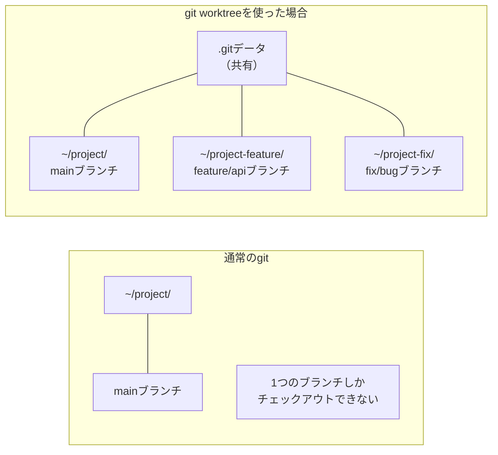

### git worktreeの仕組み

**git worktree**は、1つのリポジトリから**別のディレクトリに別ブランチを展開**する機能です。

重要なのは、すべてのworktreeが**同じ`.git`データを共有**していることです。コミット履歴やリモートの情報は1つだけで、作業ディレクトリが複数あるイメージです。

以下の図は、worktree作成から削除までの流れを示しています。

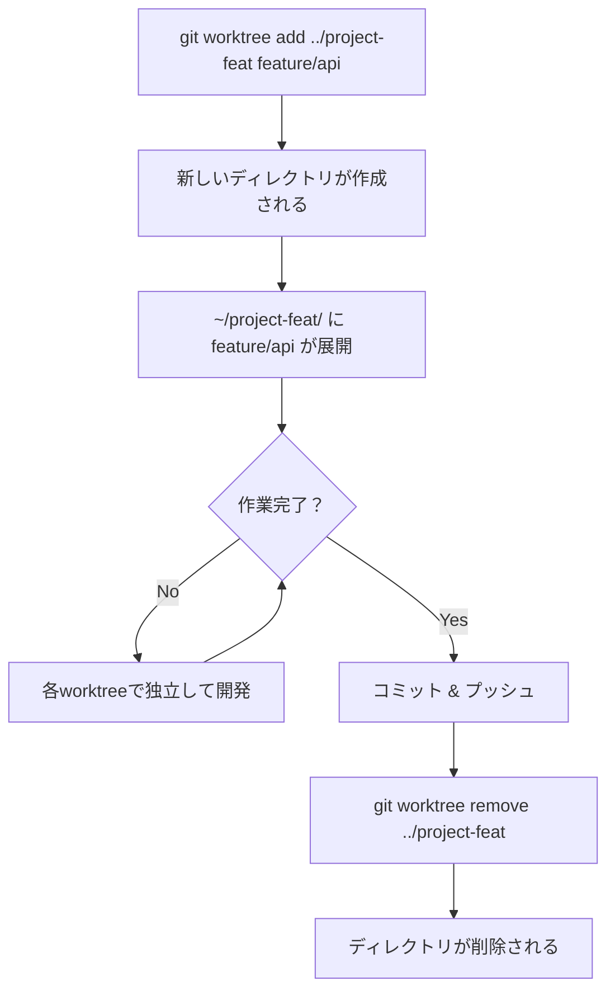

### 基本操作

```bash
# worktreeを作成（既存ブランチを展開）
git worktree add ../project-feature feature/api

# worktreeを作成（新しいブランチを作りつつ展開）
git worktree add -b feature/new-task ../project-new-task

# worktree一覧を表示
git worktree list

# worktreeを削除
git worktree remove ../project-feature
```

### 実行例

```bash
$ cd ~/Developments/my-app
$ git branch
* main
  feature/api
  fix/login-bug

# feature/apiブランチを別ディレクトリに展開
$ git worktree add ../my-app-api feature/api
Preparing worktree (checking out 'feature/api')
HEAD is now at abc1234 Add API endpoints

# worktree一覧を確認
$ git worktree list
/Users/me/Developments/my-app      abc1234 [main]
/Users/me/Developments/my-app-api  def5678 [feature/api]
```

これで`my-app`と`my-app-api`の両方を同時に開いて作業できます。

### worktreeの注意点

| 注意点 | 説明 |
|---|---|
| 同じブランチは同時に展開できない | `main`がメインにあるなら、worktreeでも`main`は使えない |
| `.git`ファイルはシンボリックリンク | worktree側の`.git`はファイルで、メインの`.git`ディレクトリを参照している |
| `node_modules`は各worktreeで独立 | worktree作成後に`npm install`が必要 |
| 不要になったら削除する | `git worktree remove`で片付ける |

---

## tmux-agent-sidebarとは

[tmux-agent-sidebar](https://github.com/hiroppy/tmux-agent-sidebar)は、tmux内で動いている**AIコーディングエージェント（Claude Code、Codex）の状態をリアルタイムで監視**するtmuxプラグインです。

### なぜ必要なのか

複数のAIエージェントを同時に動かしていると、以下の問題が起きます。

- どのペインでどのエージェントが動いているかわからない
- エージェントが許可待ちで止まっていることに気づかない
- 全体の進捗状況を把握するのに各ペインを1つずつ確認する必要がある

tmux-agent-sidebarは、これらを1つのサイドバーで一覧表示して解決します。

### 表示される情報

```
┌ サイドバー ──────────┬─────────────────────────────┐
│                      │                             │
│ ● claude (main)      │  Claude Codeのペイン         │
│   > APIの設計をして   │                             │
│   00:03:42           │  $ claude                   │
│                      │  > APIの設計をしています...   │
│ ◐ claude (feature)   │                             │
│   > テストを書いて    │                             │
│   許可待ち           │                             │
│                      │                             │
│ ○ codex (fix)        │                             │
│   Idle               │                             │
│                      │                             │
│ [Activity] [Git]     │                             │
│ Read src/api.ts      │                             │
│ Edit src/api.ts      │                             │
│ Bash npm test        │                             │
└──────────────────────┴─────────────────────────────┘
```

### ステータスアイコンの意味

| アイコン | 状態 | 意味 |
|---|---|---|
| `●` | Running | エージェントが処理中（アニメーション付き） |
| `◐` | Waiting | ユーザーの入力待ち（ツール実行の許可など） |
| `○` | Idle | 待機中（次のプロンプト入力待ち） |
| `✕` | Error | エラーが発生した |

### エージェントのライフサイクル

サイドバーのステータスは、Claude Codeの各イベントに連動して自動で変わります。

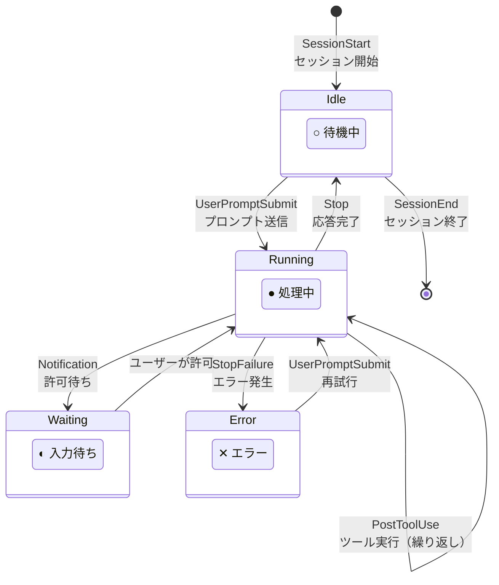

この連動は**hooks**（フック）という仕組みで実現されています。以下の図は、hookがどのようにClaude Codeとサイドバーを繋いでいるかを示しています。

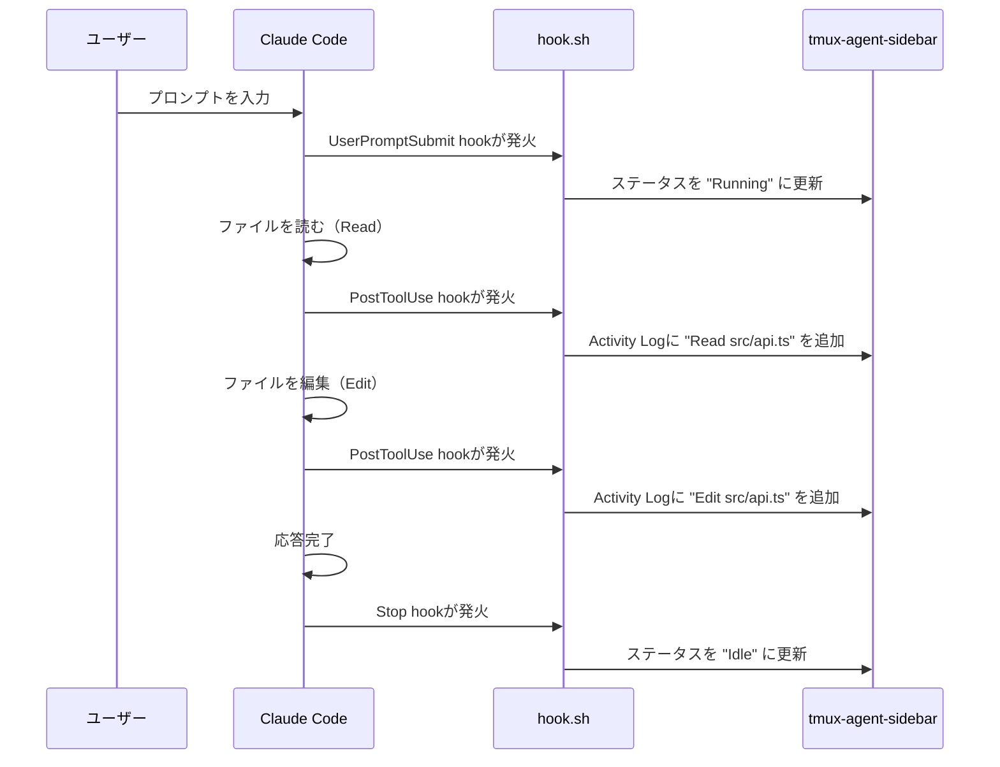

hookとは、Claude Codeが特定のイベント（プロンプト送信、ツール実行など）を実行するたびに、指定したシェルコマンドを自動実行する機能です。

### サイドバーの操作方法

| 操作 | キー | 説明 |
|---|---|---|
| サイドバーの表示/非表示 | `Ctrl-b` → `e` | トグルで切り替え |
| エージェント選択 | `j`/`k` または上下矢印 | リスト内で移動 |
| エージェントに移動 | `Enter` | 選択したエージェントのペインにジャンプ |
| フィルター切替 | `Tab` | All → Running → Waiting → Idle → Error |
| 下部パネル切替 | `Shift + Tab` | ActivityタブとGitタブを切り替え |

---

## セットアップ手順

### 1. tmuxのインストール

```bash
brew install tmux
```

### 2. TPM（tmux Plugin Manager）のインストール

TPMはtmuxのプラグイン管理ツールです。npmがNode.jsのパッケージを管理するのと同じ役割です。

```bash
git clone https://github.com/tmux-plugins/tpm ~/.tmux/plugins/tpm
```

### 3. tmux設定ファイルの作成

`~/.tmux.conf`を作成します。

```bash
# プラグイン設定
set -g @plugin 'tmux-plugins/tpm'
set -g @plugin 'hiroppy/tmux-agent-sidebar'

# TPMの初期化（必ず設定ファイルの最後に記載）
run '~/.tmux/plugins/tpm/tpm'
```

### 4. プラグインのインストール

```bash
# tmuxを起動
tmux

# tmux内で Ctrl-b → I（大文字のI）を押す
# インストールウィザードが表示される
```

### 5. Claude Codeのhook設定

`~/.claude/settings.json`のhooksセクションに以下を追加します。

```json
{
  "hooks": {
    "Notification": [
      {
        "matcher": "",
        "hooks": [
          {
            "type": "command",
            "command": "bash ~/.tmux/plugins/tmux-agent-sidebar/hook.sh claude notification"
          }
        ]
      }
    ],
    "UserPromptSubmit": [
      {
        "matcher": "",
        "hooks": [
          {
            "type": "command",
            "command": "bash ~/.tmux/plugins/tmux-agent-sidebar/hook.sh claude user-prompt-submit"
          }
        ]
      }
    ],
    "SessionStart": [
      {
        "matcher": "",
        "hooks": [
          {
            "type": "command",
            "command": "bash ~/.tmux/plugins/tmux-agent-sidebar/hook.sh claude session-start"
          }
        ]
      }
    ],
    "Stop": [
      {
        "matcher": "",
        "hooks": [
          {
            "type": "command",
            "command": "bash ~/.tmux/plugins/tmux-agent-sidebar/hook.sh claude stop"
          }
        ]
      }
    ],
    "StopFailure": [
      {
        "matcher": "",
        "hooks": [
          {
            "type": "command",
            "command": "bash ~/.tmux/plugins/tmux-agent-sidebar/hook.sh claude stop-failure"
          }
        ]
      }
    ],
    "PostToolUse": [
      {
        "matcher": "",
        "hooks": [
          {
            "type": "command",
            "command": "bash ~/.tmux/plugins/tmux-agent-sidebar/hook.sh claude activity-log"
          }
        ]
      }
    ],
    "SessionEnd": [
      {
        "matcher": "",
        "hooks": [
          {
            "type": "command",
            "command": "bash ~/.tmux/plugins/tmux-agent-sidebar/hook.sh claude session-end"
          }
        ]
      }
    ]
  }
}
```

既存のhook設定がある場合は、各イベントの配列に追加する形でマージしてください。

---

## 実践：tmux + git worktreeで複数エージェントを並行運用

ここからは、実際にtmuxとgit worktreeを組み合わせて、2つのAIエージェントを並行して動かす手順を紹介します。

### シナリオ

- `main`ブランチでAPIの設計作業
- `feature/tests`ブランチでテスト作成作業
- この2つをAIエージェントに同時並行で任せたい

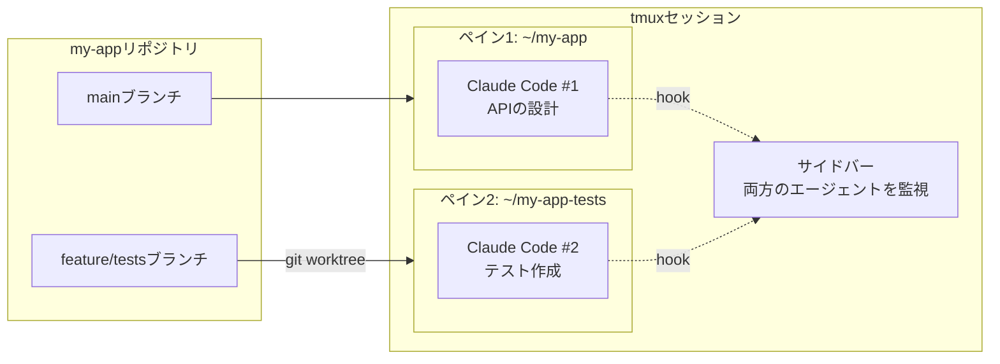

### 手順

```bash
# 1. tmuxセッションを開始
tmux new -s dev

# 2. メインのリポジトリで作業（mainブランチ）
cd ~/Developments/my-app

# 3. git worktreeで別ブランチを展開
git worktree add ../my-app-tests feature/tests

# 4. tmuxペインを横に分割
# Ctrl-b → %

# 5. 右ペインでworktreeに移動
cd ~/Developments/my-app-tests

# 6. 左ペインでClaude Codeを起動
# Ctrl-b → 左矢印（左ペインに移動）
claude

# 7. 右ペインでもClaude Codeを起動
# Ctrl-b → 右矢印（右ペインに移動）
claude

# 8. サイドバーを表示
# Ctrl-b → e
```

これで以下のような画面になります。

```
┌ sidebar ──┬─────────────────┬─────────────────┐
│           │ ~/my-app        │ ~/my-app-tests   │
│ ● claude  │ (main)          │ (feature/tests)  │
│   main    │ $ claude        │ $ claude         │
│           │ > APIを設計して  │ > テストを書いて  │
│ ● claude  │                 │                  │
│   feature │                 │                  │
│           │                 │                  │
└───────────┴─────────────────┴─────────────────┘
```

### 作業完了後の片付け

```bash
# worktreeの変更をコミット・プッシュした後
git worktree remove ../my-app-tests

# worktree一覧を確認（残っていないことを確認）
git worktree list
```

---

## よくある質問

### Q. 同じディレクトリで異なるブランチを同時にチェックアウトできる？

**できません。** gitの仕組み上、1つのディレクトリには1つのブランチしかチェックアウトできません。複数ブランチを同時に触りたい場合は`git worktree`を使います。

### Q. tmuxを閉じたらAIエージェントは止まる？

`Ctrl-b` → `d`（デタッチ）で抜けた場合は**止まりません**。ターミナルの`×`ボタンで閉じた場合も、tmuxセッションは裏で動き続けます。`tmux attach`で再接続できます。

### Q. worktreeとcloneの違いは？

| 項目 | git worktree | git clone |
|---|---|---|
| `.git`データ | 共有（1つ） | 独立（コピー） |
| ディスク使用量 | 少ない | 多い（全履歴をコピー） |
| コミット履歴 | リアルタイムで共有 | fetch/pullが必要 |
| 用途 | 同じリポジトリの並行作業 | 別の場所で独立した作業 |

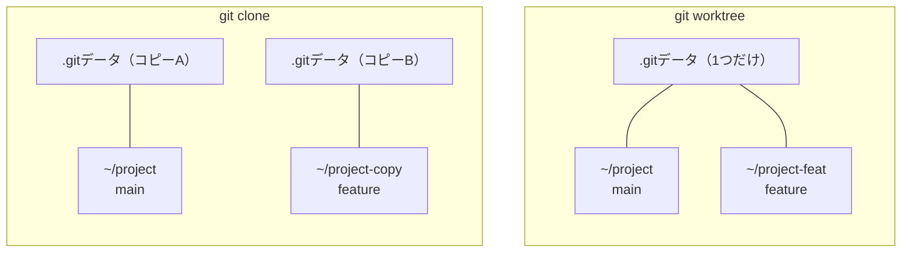

### Q. サイドバーが表示されない場合は？

以下を確認してください。

```bash
# バイナリが正しくインストールされているか
~/.tmux/plugins/tmux-agent-sidebar/bin/tmux-agent-sidebar --version

# キーバインドが登録されているか
tmux list-keys | grep sidebar

# 手動でサイドバーを起動してみる
~/.tmux/plugins/tmux-agent-sidebar/bin/tmux-agent-sidebar toggle "$(tmux display -p '#{window_id}')" "$(pwd)"
```

---

## まとめ

| ツール | 解決する問題 |
|---|---|
| tmux | ターミナルを分割して複数の作業を同時に行えるようにする |
| git worktree | 1つのリポジトリで複数ブランチを同時に展開できるようにする |
| tmux-agent-sidebar | tmux内のAIエージェントの状態を一覧で監視できるようにする |

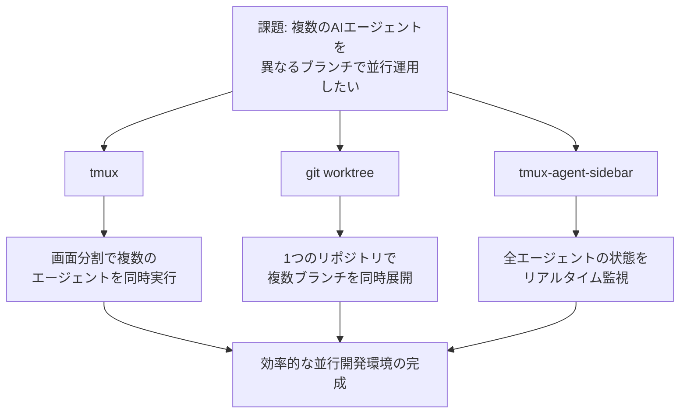

この3つを組み合わせることで、複数のAIエージェントに異なるブランチで並行して作業させ、その進捗をリアルタイムで確認できる開発環境が構築できます。

導入の順番としては以下がおすすめです。

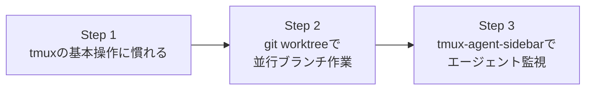

まずはtmuxの基本操作に慣れるところから始めて、慣れてきたらgit worktreeとtmux-agent-sidebarを導入してみてください。

---

## 参考リンク

- [tmux公式リポジトリ](https://github.com/tmux/tmux)
- [git-worktree公式ドキュメント](https://git-scm.com/docs/git-worktree)
- [tmux-agent-sidebar](https://github.com/hiroppy/tmux-agent-sidebar)
- [TPM（tmux Plugin Manager）](https://github.com/tmux-plugins/tpm)
