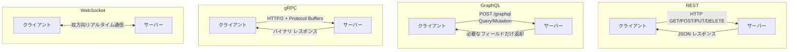
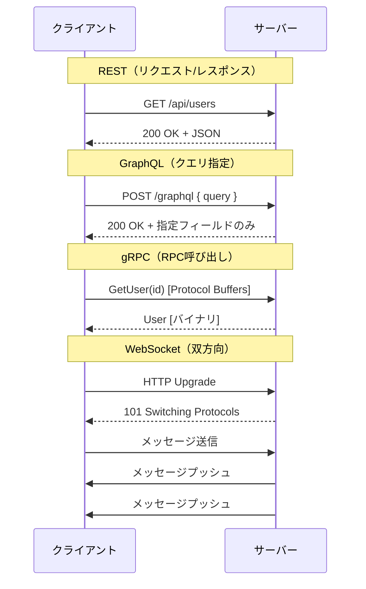
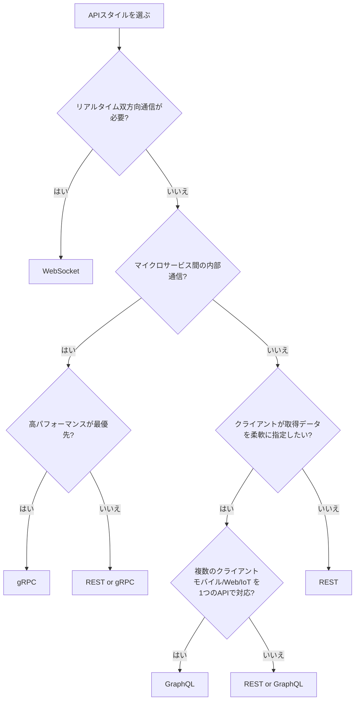

# API スタイル比較（REST vs GraphQL vs gRPC vs WebSocket）

## はじめに

API（Application Programming Interface）は、システム間の通信を実現する基盤技術である。しかし、すべてのAPIが同じ方法で通信するわけではない。用途や要件に応じて最適な「スタイル」が異なる。

本ページでは、現在主流の4つのAPIスタイル — **REST**、**GraphQL**、**gRPC**、**WebSocket** — を比較し、それぞれの誕生背景・仕組み・長所短所・ユースケースを整理する。

## 各スタイルの誕生背景

| スタイル | 登場年 | 提唱者/開発元 | 誕生の背景 |
| --- | --- | --- | --- |
| REST | 2000年 | Roy Fielding（博士論文） | SOAP/XML-RPCの複雑さからの脱却。Webの設計原則を活用 |
| GraphQL | 2015年（公開） | Facebook | モバイルアプリでの過剰取得・過少取得問題の解決 |
| gRPC | 2015年 | Google | マイクロサービス間の高速・型安全な通信の実現 |
| WebSocket | 2011年（RFC 6455） | IETF | HTTP のリクエスト/レスポンスモデルでは実現困難なリアルタイム双方向通信 |

## 各スタイルの全体像



## REST（Representational State Transfer）

### 仕組み

RESTはリソース指向のアーキテクチャスタイルである。URLで「リソース」を表現し、HTTPメソッドで「操作」を表す。

```
GET    /api/users          → ユーザー一覧取得
GET    /api/users/123      → 特定ユーザー取得
POST   /api/users          → ユーザー新規作成
PUT    /api/users/123      → ユーザー更新
DELETE /api/users/123      → ユーザー削除
```

### メリット

- **シンプルで直感的**: HTTPメソッドとURLの組み合わせが明快
- **キャッシュが容易**: HTTPキャッシュ機構をそのまま利用可能
- **ツール/ライブラリが豊富**: ほぼすべての言語・フレームワークで対応
- **ステートレス**: スケーラビリティが高い

### デメリット

- **Over-fetching**: 不要なフィールドも含めて全データが返される
- **Under-fetching**: 関連データを取得するために複数リクエストが必要
- **バージョニングが課題**: `/v1/users`、`/v2/users` のように管理が煩雑化しやすい

### ユースケース

- 公開API（外部サービス向けAPI）
- CRUD中心のWebアプリケーション
- シンプルなモバイルアプリのバックエンド

## GraphQL

### 仕組み

GraphQLは「クライアントが必要なデータの形を指定する」クエリ言語である。単一エンドポイントに対してクエリを投げる。

```graphql
# クライアントが欲しいデータだけを指定
query {
  user(id: "123") {
    name
    email
    posts {
      title
      createdAt
    }
  }
}
```

```json
{
  "data": {
    "user": {
      "name": "田中太郎",
      "email": "tanaka@example.com",
      "posts": [
        { "title": "GraphQL入門", "createdAt": "2025-01-15" }
      ]
    }
  }
}
```

### メリット

- **必要なデータだけ取得**: Over-fetching / Under-fetching を解消
- **単一エンドポイント**: `/graphql` だけで全操作が可能
- **型システム**: スキーマで型が定義され、自己文書化される
- **リアルタイム対応**: Subscriptionで変更通知が可能

### デメリット

- **キャッシュが難しい**: POSTリクエストが中心のためHTTPキャッシュが効きにくい
- **N+1問題**: ネストされたクエリでデータベースへの大量アクセスが発生しやすい
- **学習コスト**: スキーマ定義、リゾルバ実装など独自の概念を習得する必要がある
- **セキュリティ**: 複雑なクエリによるDoS攻撃のリスク（クエリ深さ制限が必要）

### ユースケース

- 複雑な関連データを持つアプリケーション（SNS、ECサイト）
- モバイルアプリ（帯域幅を最小化したい）
- BFF（Backend for Frontend）パターン

## gRPC（gRPC Remote Procedure Call）

### 仕組み

gRPCはProtocol Buffersでスキーマを定義し、HTTP/2上でバイナリデータを送受信するRPCフレームワークである。

```protobuf
// user.proto
service UserService {
  rpc GetUser (GetUserRequest) returns (User);
  rpc ListUsers (ListUsersRequest) returns (stream User);
}

message GetUserRequest {
  string id = 1;
}

message User {
  string id = 1;
  string name = 2;
  string email = 3;
}
```

### メリット

- **高速**: バイナリシリアライゼーション + HTTP/2 により低レイテンシ
- **型安全**: `.proto`ファイルからコードを自動生成。コンパイル時にエラー検出
- **ストリーミング対応**: サーバーストリーミング、クライアントストリーミング、双方向ストリーミング
- **多言語対応**: Go, Java, Python, C++, Rust など主要言語に対応

### デメリット

- **ブラウザから直接利用不可**: gRPC-Webなどのプロキシが必要
- **人間が読めない**: バイナリプロトコルのためデバッグが難しい
- **学習コスト**: Protocol Buffers、HTTP/2の理解が必要
- **ツールの成熟度**: RESTと比較するとエコシステムが限定的

### ユースケース

- マイクロサービス間通信（内部API）
- 低レイテンシが求められるシステム（金融、ゲーム）
- IoTデバイスとサーバー間通信

## WebSocket

### 仕組み

WebSocketはHTTPハンドシェイク後にTCPコネクションを維持し、サーバー・クライアント間で双方向リアルタイム通信を行うプロトコルである。

```
1. クライアント → サーバー: HTTP Upgrade リクエスト
   GET /chat HTTP/1.1
   Upgrade: websocket
   Connection: Upgrade

2. サーバー → クライアント: 101 Switching Protocols

3. 以降は双方向でメッセージを自由に送受信
   クライアント ⇄ サーバー
```

### メリット

- **リアルタイム双方向通信**: サーバーからクライアントへのプッシュが可能
- **低オーバーヘッド**: HTTP ヘッダーが毎回不要（初回ハンドシェイク後）
- **永続接続**: コネクションを維持するため再接続コストが不要

### デメリット

- **ステートフル**: サーバーが接続状態を保持するためスケーリングが難しい
- **ロードバランシングが複雑**: Sticky Sessionの考慮が必要
- **ファイアウォール/プロキシの制約**: WebSocket接続がブロックされることがある
- **エラーハンドリング**: 接続切断時の再接続ロジックの実装が必要

### ユースケース

- チャットアプリケーション
- リアルタイムダッシュボード・株価表示
- オンラインゲーム
- 共同編集（Google Docsのような）

## 通信パターンの比較



## 総合比較表

| 項目 | REST | GraphQL | gRPC | WebSocket |
| --- | --- | --- | --- | --- |
| **プロトコル** | HTTP/1.1 | HTTP/1.1 | HTTP/2 | WebSocket (TCP) |
| **データ形式** | JSON/XML | JSON | Protocol Buffers（バイナリ） | 任意（テキスト/バイナリ） |
| **通信方向** | リクエスト/レスポンス | リクエスト/レスポンス | 単方向/双方向ストリーミング | 双方向 |
| **型安全性** | なし（OpenAPIで補完） | スキーマで保証 | .protoで保証 | なし |
| **パフォーマンス** | 中 | 中 | 高 | 高（リアルタイム） |
| **キャッシュ** | HTTPキャッシュ容易 | 難しい | 難しい | 不可 |
| **ブラウザ対応** | 完全対応 | 完全対応 | gRPC-Web必要 | 完全対応 |
| **学習コスト** | 低 | 中 | 高 | 中 |
| **デバッグ容易性** | 高（curl等） | 中（Playground） | 低（バイナリ） | 中 |

## 選定フローチャート



## 組み合わせパターン

実際のプロダクトでは、1つのスタイルだけでなく複数を組み合わせることが多い。

| パターン | 構成 | 例 |
| --- | --- | --- |
| 外部REST + 内部gRPC | 公開APIはREST、マイクロサービス間はgRPC | Netflix, Google |
| REST + WebSocket | CRUD操作はREST、通知・チャットはWebSocket | Slack, Discord |
| GraphQL + REST | BFFにGraphQL、バックエンドサービスはREST | Shopify, GitHub |
| GraphQL + gRPC | BFFにGraphQL、内部通信はgRPC | 大規模SaaS |

## 技術選定チェックリスト

1. **対象ユーザー**: 外部開発者向けか、内部サービスか
2. **データ構造**: フラットか、深くネストされているか
3. **リアルタイム性**: 即座の更新が必要か
4. **パフォーマンス要件**: レイテンシ・スループットの要件
5. **チーム経験**: 各技術の習熟度
6. **クライアント種別**: ブラウザ、モバイル、IoT、サーバー
7. **運用コスト**: モニタリング、デバッグのしやすさ

## まとめ

- **REST**: 最もシンプルで汎用的。迷ったらまずREST
- **GraphQL**: クライアントがデータを柔軟に指定したい場合に最適
- **gRPC**: 内部マイクロサービス間の高速通信に最適
- **WebSocket**: リアルタイム双方向通信が必須の場合に最適

「銀の弾丸」は存在しない。要件に応じて適切なスタイルを選択し、必要であれば複数を組み合わせることが重要である。

## 参考文献

- [Fielding, R. (2000). Architectural Styles and the Design of Network-based Software Architectures](https://www.ics.uci.edu/~fielding/pubs/dissertation/top.htm)
- [GraphQL 公式ドキュメント](https://graphql.org/learn/)
- [gRPC 公式ドキュメント](https://grpc.io/docs/)
- [RFC 6455 - The WebSocket Protocol](https://tools.ietf.org/html/rfc6455)
- [MDN Web Docs - HTTP](https://developer.mozilla.org/ja/docs/Web/HTTP)
- [Protocol Buffers ドキュメント](https://protobuf.dev/)
- [GraphQL vs REST - Apollo Blog](https://www.apollographql.com/blog/graphql-vs-rest)
- [gRPC vs REST - Google Cloud Blog](https://cloud.google.com/blog/products/api-management/understanding-grpc-openapi-and-rest-and-when-to-use-them)
