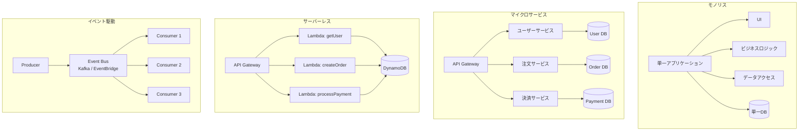
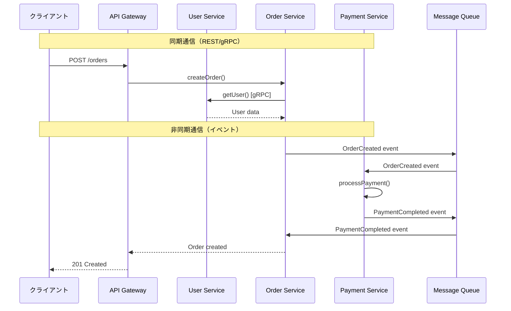
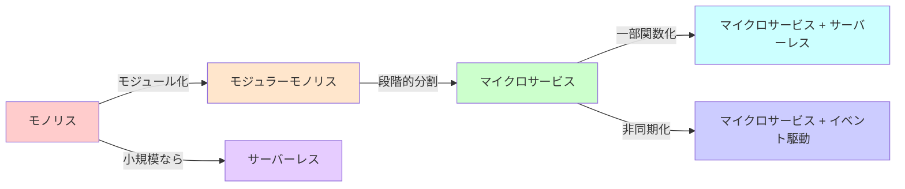
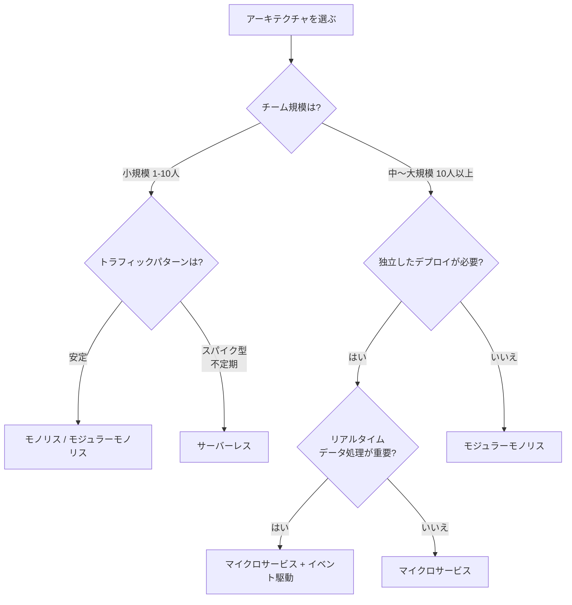

# アーキテクチャパターン比較（モノリス vs マイクロサービス vs サーバーレス vs イベント駆動）

## はじめに

ソフトウェアアーキテクチャの選択は、システムの開発速度・スケーラビリティ・運用コスト・チーム構成に大きな影響を与える。本ページでは、現代のソフトウェア開発で採用される4つの主要なアーキテクチャパターン — **モノリス**、**マイクロサービス**、**サーバーレス**、**イベント駆動** — を比較する。

## 各パターンの歴史的背景

| パターン | 登場/普及時期 | 背景 |
| --- | --- | --- |
| モノリス | 〜2000年代 | ソフトウェア開発の基本形。単一のデプロイ単位 |
| SOA | 2000年代 | エンタープライズ統合。ESB（Enterprise Service Bus）中心 |
| マイクロサービス | 2014年〜 | Martin Fowler & James Lewisが定義。Netflix, Amazonの実践から普及 |
| サーバーレス | 2014年〜 | AWS Lambda登場。インフラ管理からの解放 |
| イベント駆動 | 2010年代〜 | Apache Kafka登場(2011)。リアルタイムデータ処理の需要拡大 |

## 各パターンの全体像



## モノリスアーキテクチャ

### 概要

すべての機能が単一のアプリケーションとして構築・デプロイされるパターン。最もシンプルで理解しやすい構造。

```
my-app/
├── src/
│   ├── controllers/    # リクエスト処理
│   ├── services/       # ビジネスロジック
│   ├── models/         # データモデル
│   ├── repositories/   # データアクセス
│   └── utils/          # ユーティリティ
├── tests/
└── package.json
```

### メリット

| メリット | 説明 |
| --- | --- |
| **シンプル** | コードベースが一つ。理解・デバッグが容易 |
| **開発速度が速い** | 初期段階ではサービス分割のオーバーヘッドがない |
| **テストが容易** | 統合テストがシンプル。E2Eテストも書きやすい |
| **デプロイが簡単** | 1つのアーティファクトをデプロイするだけ |
| **トランザクション管理** | 単一DBのACIDトランザクションが使える |

### デメリット

| デメリット | 説明 |
| --- | --- |
| **スケーリングの制約** | 全体を一括でスケールする必要がある |
| **デプロイリスク** | 小さな変更でも全体をデプロイ。影響範囲が大きい |
| **技術的負債の蓄積** | コードベースが巨大化し、変更が困難になりやすい |
| **チーム間の競合** | 複数チームが同一コードベースで作業すると衝突が増加 |
| **技術スタックの固定** | 言語・フレームワークを変更しにくい |

### モジュラーモノリス

モノリスの利点を活かしつつ、内部をモジュール化する中間的アプローチ。

```
my-app/
├── modules/
│   ├── users/          # ユーザーモジュール
│   │   ├── controller.ts
│   │   ├── service.ts
│   │   └── repository.ts
│   ├── orders/         # 注文モジュール
│   └── payments/       # 決済モジュール
├── shared/             # 共有コード
└── package.json
```

モジュール間の依存関係を明確に管理し、将来的なマイクロサービス化への移行を容易にする。

## マイクロサービスアーキテクチャ

### 概要

システムを小さな独立したサービスに分割し、それぞれが独自のデータベースを持ち、APIを通じて通信するパターン。

### メリット

| メリット | 説明 |
| --- | --- |
| **独立したデプロイ** | 各サービスを個別にデプロイ。影響範囲が限定的 |
| **技術の多様性** | サービスごとに最適な言語・DBを選択可能 |
| **スケーラビリティ** | 負荷の高いサービスだけを個別にスケール |
| **チーム自律性** | 小規模チームがサービスを所有（2 Pizza Rule） |
| **障害分離** | 1つのサービス障害が全体に波及しにくい（適切な設計の場合） |

### デメリット

| デメリット | 説明 |
| --- | --- |
| **分散システムの複雑さ** | ネットワーク障害、レイテンシ、データ整合性の課題 |
| **運用負荷** | サービスごとの監視、ログ、デプロイパイプラインが必要 |
| **デバッグの困難さ** | 分散トレーシングが必須（OpenTelemetry等） |
| **データ整合性** | 分散トランザクション、Sagaパターンの実装が必要 |
| **初期コストが高い** | インフラ、CI/CD、サービスメッシュ等の構築が必要 |

### サービス間通信パターン



## サーバーレスアーキテクチャ

### 概要

サーバーの管理をクラウドプロバイダーに完全に委ね、関数（Function）単位でコードを実行するパターン。使った分だけ課金される。

### 構成例（AWS）

```
API Gateway
    ├── GET /users    → Lambda (getUsers)    → DynamoDB
    ├── POST /users   → Lambda (createUser)  → DynamoDB
    ├── POST /orders  → Lambda (createOrder) → DynamoDB
    │                                           ↓
    │                                    DynamoDB Streams
    │                                           ↓
    │                                    Lambda (processOrder)
    │                                           ↓
    │                                    SES (メール送信)
    └── GET /reports  → Lambda (getReport)   → S3
```

### メリット

| メリット | 説明 |
| --- | --- |
| **運用不要** | サーバー管理、パッチ適用、スケーリングが自動 |
| **従量課金** | リクエストがなければ費用ゼロ |
| **自動スケーリング** | 0から数千同時実行まで自動的にスケール |
| **高可用性** | マルチAZ対応が自動的に組み込まれる |
| **開発集中** | ビジネスロジックに集中できる |

### デメリット

| デメリット | 説明 |
| --- | --- |
| **コールドスタート** | 初回起動に数百ミリ秒〜数秒のレイテンシ |
| **実行時間制限** | AWS Lambda: 最大15分 |
| **ベンダーロックイン** | AWS Lambda + DynamoDB + API Gateway等に依存 |
| **デバッグが困難** | ローカル開発環境の構築が複雑 |
| **コスト予測困難** | 高トラフィック時はEC2より高額になることがある |

## イベント駆動アーキテクチャ

### 概要

システムの各コンポーネントがイベント（出来事）を発行・購読することで疎結合に連携するパターン。

### イベント駆動の構成要素

| 要素 | 説明 | 例 |
| --- | --- | --- |
| **イベント** | 発生した事実 | `OrderPlaced`, `PaymentCompleted` |
| **Producer** | イベントを発行するコンポーネント | 注文サービス |
| **Event Bus** | イベントを仲介する基盤 | Kafka, EventBridge, SNS/SQS |
| **Consumer** | イベントを受信して処理するコンポーネント | 決済サービス、通知サービス |

### メリット

| メリット | 説明 |
| --- | --- |
| **疎結合** | Producerは Consumerを知らない。独立して開発・デプロイ可能 |
| **スケーラビリティ** | Consumerを個別にスケール可能 |
| **リアルタイム処理** | イベント発生時に即座に処理 |
| **監査/履歴** | イベントログがそのまま監査証跡になる |
| **拡張性** | 新しいConsumerを追加するだけで機能拡張 |

### デメリット

| デメリット | 説明 |
| --- | --- |
| **デバッグの複雑さ** | イベントフローの追跡が困難 |
| **結果整合性** | 即座に一貫性が保証されない |
| **イベント順序** | 順序保証が難しい（パーティション設計が必要） |
| **べき等性** | 重複イベント処理への対策が必要 |
| **テストの難しさ** | 非同期処理のテストが複雑 |

## 総合比較表

| 項目 | モノリス | マイクロサービス | サーバーレス | イベント駆動 |
| --- | --- | --- | --- | --- |
| **複雑さ** | 低 | 高 | 中 | 高 |
| **初期開発速度** | 最速 | 遅い | 速い | 遅い |
| **スケーラビリティ** | 制限あり | 高い | 非常に高い | 高い |
| **運用コスト** | 低〜中 | 高 | 低（従量課金） | 中〜高 |
| **デプロイ** | 全体一括 | サービス単位 | 関数単位 | サービス単位 |
| **データ整合性** | ACID | 結果整合性 | 結果整合性 | 結果整合性 |
| **チーム規模** | 1〜20人 | 20人以上 | 1〜10人 | 10人以上 |
| **技術的自由度** | 低 | 高 | 中（ベンダー依存） | 高 |
| **テスト容易性** | 高 | 中 | 低〜中 | 低 |
| **デバッグ容易性** | 高 | 低 | 低 | 低 |

## 移行パス



### 移行の原則

1. **Big Bang リライトは避ける**: 段階的に移行する（Strangler Fig パターン）
2. **境界を見極める**: ドメイン駆動設計（DDD）のBounded Contextを活用
3. **データの分離から始める**: 各サービスのデータベースを分離
4. **監視基盤を先に構築**: 分散トレーシング、集中ログを事前に用意
5. **チーム構成を合わせる**: コンウェイの法則を意識。組織とアーキテクチャを一致させる

### Strangler Fig パターン

```
Phase 1: モノリスの前にAPI Gatewayを配置
Phase 2: 新機能をマイクロサービスとして開発
Phase 3: 既存機能を段階的にマイクロサービスに移行
Phase 4: モノリスが不要になったら廃止
```

## 選定フローチャート



## 実際のアーキテクチャ選択例

| 企業/サービス | アーキテクチャ | 理由 |
| --- | --- | --- |
| スタートアップ初期 | モノリス | 開発速度最優先。機能を素早くリリース |
| Netflix | マイクロサービス | 数百のサービスを独立したチームが運用 |
| Amazon | マイクロサービス + イベント駆動 | 注文→在庫→配送を非同期イベントで連携 |
| Vercel Functions | サーバーレス | エッジでの関数実行。グローバル配信 |
| Shopify | モジュラーモノリス | Ruby on Railsのモノリスをモジュール化して維持 |

## まとめ

- **モノリス**: 小規模チーム、MVPに最適。まずはここから始める
- **マイクロサービス**: 大規模チーム、独立デプロイが必要な場合に検討
- **サーバーレス**: 運用負荷を最小化したい場合、スパイク型トラフィックに最適
- **イベント駆動**: リアルタイム処理、疎結合な非同期システムに最適

最も重要な原則は**「早すぎる最適化を避ける」**こと。モノリスから始め、実際のボトルネックが見えてから分割を検討するアプローチが推奨される。

## 参考文献

- [Martin Fowler - Microservices](https://martinfowler.com/articles/microservices.html)
- [Sam Newman - Building Microservices (O'Reilly)](https://www.oreilly.com/library/view/building-microservices-2nd/9781492034018/)
- [AWS Well-Architected Framework](https://aws.amazon.com/architecture/well-architected/)
- [Chris Richardson - Microservices Patterns](https://microservices.io/patterns/)
- [AWS Lambda 公式ドキュメント](https://docs.aws.amazon.com/lambda/)
- [Martin Fowler - Strangler Fig Application](https://martinfowler.com/bliki/StranglerFigApplication.html)
- [Eric Evans - Domain-Driven Design](https://www.domainlanguage.com/ddd/)
- [Confluent - Event-Driven Architecture](https://www.confluent.io/learn/event-driven-architecture/)
- [The Twelve-Factor App](https://12factor.net/ja/)
