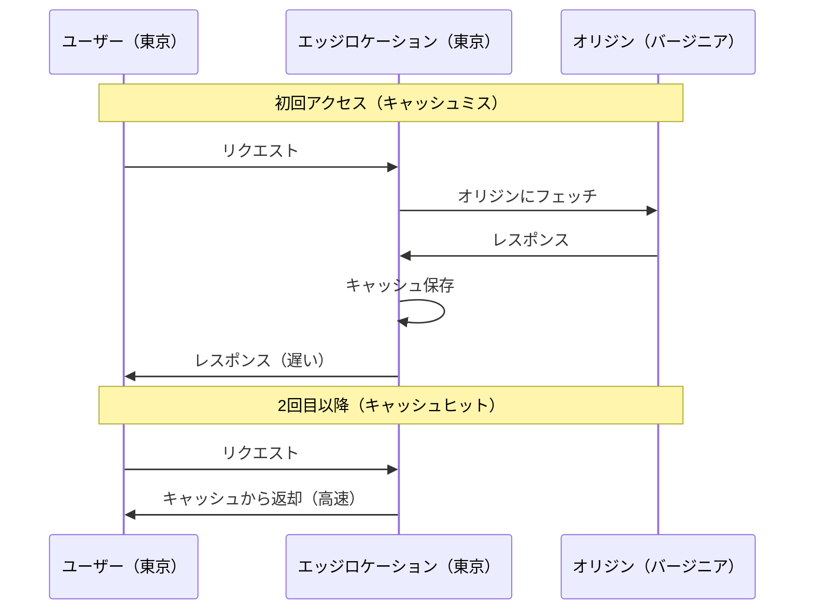
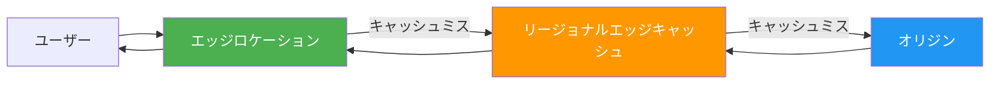
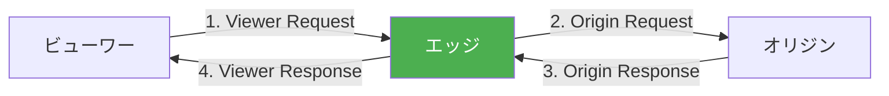

# AWS CloudFront

## CDNとは

CDN（Content Delivery Network）は、世界中に分散配置されたサーバー（エッジロケーション）を使って、コンテンツをユーザーに近い場所から配信するネットワーク。ユーザーとサーバーの物理的な距離が近いほどレイテンシが小さくなる原理を活用している。

### CDNがない場合 vs ある場合

| 項目 | CDNなし | CDNあり |
| --- | --- | --- |
| 配信元 | オリジンサーバー1箇所 | 世界中のエッジロケーション |
| レイテンシ | 遠いユーザーは遅い | どこからでも高速 |
| オリジン負荷 | 全リクエストがオリジンへ | キャッシュヒットでオリジン負荷激減 |
| 耐障害性 | 単一障害点 | 分散配置で高可用性 |
| DDoS対策 | 自前で対策が必要 | CDNが吸収 |

### CDNの仕組み



---

## Amazon CloudFrontとは

Amazon CloudFrontは、AWSが提供するCDN（Content Delivery Network）サービス。世界中に400以上のエッジロケーション（Points of Presence: PoP）を持ち、低レイテンシかつ高速なコンテンツ配信を実現する。

### CloudFrontの主な機能

| 機能 | 説明 |
| --- | --- |
| 静的コンテンツ配信 | HTML、CSS、JS、画像などのキャッシュ配信 |
| 動的コンテンツ配信 | APIレスポンスの高速化 |
| ライブ/オンデマンドストリーミング | 動画配信 |
| SSL/TLS終端 | HTTPS対応 |
| Lambda@Edge / CloudFront Functions | エッジでのコード実行 |
| WAF連携 | Webアプリケーションファイアウォール |
| DDoS防御 | AWS Shield Standard（無料）が自動適用 |

---

## エッジロケーション

### グローバルネットワーク

CloudFrontは以下の3層構成でコンテンツを配信する。

| 層 | 説明 | 数 |
| --- | --- | --- |
| エッジロケーション | ユーザーに最も近いキャッシュサーバー | 400以上 |
| リージョナルエッジキャッシュ | エッジとオリジンの間の中間キャッシュ | 13箇所 |
| オリジン | 実際のコンテンツ格納先 | S3、ALB、EC2等 |



### 日本のエッジロケーション

日本には東京と大阪にエッジロケーションが配置されており、国内ユーザーへの低レイテンシ配信が可能。

---

## ディストリビューション

CloudFrontのディストリビューションは、コンテンツ配信の設定単位。

### ディストリビューションの構成要素

| 要素 | 説明 |
| --- | --- |
| オリジン | コンテンツの取得元（S3、ALB、カスタムオリジン） |
| ビヘイビア | URLパスパターンに基づく配信ルール |
| キャッシュポリシー | キャッシュの動作を定義 |
| オリジンリクエストポリシー | オリジンに転送するヘッダー・クエリ文字列等 |
| レスポンスヘッダーポリシー | レスポンスに追加するヘッダー |
| 代替ドメイン名（CNAME） | 独自ドメイン |
| SSL証明書 | HTTPS用のACM証明書 |

### オリジンの種類

| オリジン | ユースケース | アクセス制御 |
| --- | --- | --- |
| S3バケット | 静的Webサイト、アセット配信 | OAC |
| ALB | 動的Webアプリケーション | カスタムヘッダー |
| API Gateway | REST/HTTP API | — |
| EC2 | カスタムWebサーバー | セキュリティグループ |
| MediaStore | メディアストリーミング | — |
| カスタムオリジン | 任意のHTTPサーバー | カスタムヘッダー |

### ビヘイビア（パスベースルーティング）

```
/* → S3オリジン（静的コンテンツ）
/api/* → ALBオリジン（APIサーバー）
/images/* → S3オリジン（画像、長いキャッシュTTL）
/stream/* → MediaStoreオリジン（動画配信）
```

---

## キャッシュ戦略

### キャッシュキー

CloudFrontは「キャッシュキー」に基づいてキャッシュの一意性を判定する。同じキャッシュキーのリクエストには同じキャッシュレスポンスが返される。

デフォルトのキャッシュキー: ディストリビューションのドメイン名 + URLパス

キャッシュキーに含められる要素:

| 要素 | 説明 | 例 |
| --- | --- | --- |
| URLパス | リクエストのパス | `/images/logo.png` |
| クエリ文字列 | URLパラメータ | `?size=large&format=webp` |
| HTTPヘッダー | リクエストヘッダー | `Accept-Language`, `Accept-Encoding` |
| Cookie | リクエストCookie | `session_id`, `language` |

### キャッシュポリシーの設定

```json
{
  "DefaultTTL": 86400,
  "MaxTTL": 31536000,
  "MinTTL": 0,
  "ParametersInCacheKeyAndForwardedToOrigin": {
    "EnableAcceptEncodingGzip": true,
    "EnableAcceptEncodingBrotli": true,
    "HeadersConfig": {
      "HeaderBehavior": "none"
    },
    "CookiesConfig": {
      "CookieBehavior": "none"
    },
    "QueryStringsConfig": {
      "QueryStringBehavior": "none"
    }
  }
}
```

### TTL（Time To Live）の設定

| 設定 | 説明 |
| --- | --- |
| MinTTL | オリジンの`Cache-Control`で指定されたTTLより短くならない最低値 |
| DefaultTTL | オリジンがキャッシュヘッダーを返さない場合のデフォルト値 |
| MaxTTL | オリジンの`Cache-Control`で指定されたTTLを超えない最大値 |

### コンテンツ別の推奨TTL

| コンテンツ | TTL | 理由 |
| --- | --- | --- |
| 静的アセット（CSS/JS/画像） | 1年（31536000秒） | ファイル名にハッシュを含める前提 |
| HTMLページ | 短め（60〜300秒） | 更新頻度が高い |
| API レスポンス | 0〜60秒 | リアルタイム性が重要 |
| 動画/大容量ファイル | 1日〜1年 | 更新頻度による |

### キャッシュの無効化（Invalidation）

キャッシュを強制的に削除する。

```bash
aws cloudfront create-invalidation \
  --distribution-id E1234567890 \
  --paths "/index.html" "/css/*"
```

| 方法 | コスト | 速度 | 推奨度 |
| --- | --- | --- | --- |
| Invalidation | 1,000パスまで無料、以降$0.005/パス | 数分 | 緊急時のみ |
| バージョニング | 無料 | 即座 | 推奨 |

**バージョニング**（ファイル名にハッシュを含める）が推奨。

```
/assets/app.abc123.js  ← バージョン1
/assets/app.def456.js  ← バージョン2（新しいファイル名 = 新しいキャッシュ）
```

---

## Lambda@Edge と CloudFront Functions

エッジロケーションでコードを実行する2つの機能。

### 比較

| 項目 | CloudFront Functions | Lambda@Edge |
| --- | --- | --- |
| 実行場所 | エッジロケーション（全400以上） | リージョナルエッジキャッシュ（13箇所） |
| ランタイム | JavaScript（ECMAScript 5.1） | Node.js, Python |
| 実行時間 | 1ミリ秒以下 | 最大5秒（Viewer）/ 30秒（Origin） |
| メモリ | 2MB | 128〜10,240MB |
| ネットワークアクセス | 不可 | 可能 |
| ボディアクセス | 不可 | 可能 |
| 料金 | $0.10 / 100万リクエスト | $0.60 / 100万リクエスト + 実行時間 |
| ユースケース | 軽量なヘッダー操作 | 複雑なロジック、外部API呼び出し |

### 実行タイミング



| イベント | タイミング | ユースケース |
| --- | --- | --- |
| Viewer Request | ユーザー → エッジ | URL書き換え、認証チェック、リダイレクト |
| Origin Request | エッジ → オリジン | オリジン選択、ヘッダー追加 |
| Origin Response | オリジン → エッジ | レスポンスヘッダー追加、エラーページ差替 |
| Viewer Response | エッジ → ユーザー | セキュリティヘッダー追加 |

### CloudFront Functions の例

```javascript
// URL末尾にindex.htmlを追加（SPA対応）
function handler(event) {
  var request = event.request;
  var uri = request.uri;

  // /about → /about/index.html
  if (uri.endsWith('/')) {
    request.uri += 'index.html';
  } else if (!uri.includes('.')) {
    request.uri += '/index.html';
  }

  return request;
}
```

```javascript
// セキュリティヘッダーの追加
function handler(event) {
  var response = event.response;
  var headers = response.headers;

  headers['strict-transport-security'] = {
    value: 'max-age=63072000; includeSubdomains; preload',
  };
  headers['x-content-type-options'] = { value: 'nosniff' };
  headers['x-frame-options'] = { value: 'DENY' };
  headers['x-xss-protection'] = { value: '1; mode=block' };
  headers['referrer-policy'] = { value: 'strict-origin-when-cross-origin' };

  return response;
}
```

### Lambda@Edge の例

```javascript
// Basic認証の実装
export const handler = async (event) => {
  const request = event.Records[0].cf.request;
  const headers = request.headers;

  const authString = 'Basic ' + Buffer.from('user:password').toString('base64');

  if (
    !headers.authorization ||
    headers.authorization[0].value !== authString
  ) {
    return {
      status: '401',
      statusDescription: 'Unauthorized',
      headers: {
        'www-authenticate': [{ value: 'Basic realm="Enter credentials"' }],
      },
    };
  }

  return request;
};
```

---

## OAC（Origin Access Control）

OACは、CloudFrontからS3バケットへのアクセスを安全に制御する仕組み。S3バケットへの直接アクセスをブロックし、CloudFront経由でのみアクセスを許可する。

### OAC vs OAI

| 項目 | OAC（推奨） | OAI（旧方式） |
| --- | --- | --- |
| SSE-KMS暗号化 | 対応 | 非対応 |
| S3リクエスト形式 | すべて対応 | 一部非対応 |
| リージョン | すべて対応 | すべて対応 |
| 推奨度 | 推奨 | 非推奨（既存環境のみ） |

### OACの設定

1. CloudFrontでOACを作成
2. ディストリビューションのオリジン設定でOACを指定
3. S3バケットポリシーでCloudFrontからのアクセスを許可

```json
{
  "Version": "2012-10-17",
  "Statement": [
    {
      "Sid": "AllowCloudFrontServicePrincipalReadOnly",
      "Effect": "Allow",
      "Principal": {
        "Service": "cloudfront.amazonaws.com"
      },
      "Action": "s3:GetObject",
      "Resource": "arn:aws:s3:::my-bucket/*",
      "Condition": {
        "StringEquals": {
          "AWS:SourceArn": "arn:aws:cloudfront::123456789012:distribution/E1234567890"
        }
      }
    }
  ]
}
```

---

## SSL/TLS

### HTTPS設定

| 設定 | 説明 |
| --- | --- |
| デフォルトCloudFront証明書 | `*.cloudfront.net` の証明書（無料） |
| カスタムSSL証明書 | 独自ドメイン用のACM証明書（無料） |
| HTTPからHTTPSへのリダイレクト | HTTP → HTTPSへ自動転送 |
| HTTPSのみ | HTTPを拒否 |

### ACM証明書の要件

- CloudFrontで使用するACM証明書は**バージニア北部（us-east-1）**で発行する必要がある
- ACM証明書は無料で発行・更新が自動

### TLSバージョンとセキュリティポリシー

| ポリシー | 最低TLSバージョン | 推奨度 |
| --- | --- | --- |
| TLSv1.2_2021 | TLS 1.2 | 推奨 |
| TLSv1.2_2019 | TLS 1.2 | 許容 |
| TLSv1.1_2016 | TLS 1.1 | 非推奨 |
| TLSv1_2016 | TLS 1.0 | 非推奨 |

### オリジンとの通信

CloudFrontとオリジン間の通信も暗号化する。

| 設定 | 説明 |
| --- | --- |
| HTTPS Only | オリジンとの通信をHTTPSに限定 |
| Match Viewer | ビューワーの通信プロトコルに合わせる |
| HTTP Only | HTTPのみ（非推奨） |

---

## 料金体系

### 料金の構成要素

| 項目 | 説明 |
| --- | --- |
| データ転送（アウト） | エッジからユーザーへの転送量 |
| HTTPリクエスト | リクエスト数 |
| Invalidation | キャッシュ無効化（1,000パスまで無料） |
| Lambda@Edge | 実行回数 + 実行時間 |
| CloudFront Functions | 実行回数 |
| 専用IPカスタムSSL | $600/月（SNI利用なら無料） |

### 料金例（日本向け配信）

| データ転送量 | 料金 |
| --- | --- |
| 最初の10TB/月 | $0.114/GB |
| 次の40TB/月 | $0.089/GB |
| 次の100TB/月 | $0.086/GB |

| リクエスト種別 | 料金 |
| --- | --- |
| HTTPリクエスト | $0.0090/10,000リクエスト |
| HTTPSリクエスト | $0.0120/10,000リクエスト |

### 無料枠

毎月 1TB のデータ転送（アウト）と 10,000,000 件の HTTP/HTTPS リクエストが無料（Always Free）。

### コスト最適化

- キャッシュヒット率を最大化する（不要なクエリ文字列・ヘッダーをキャッシュキーから除外）
- CloudFront Security Savings Bundle（1年契約で最大30%割引）
- 価格クラスの設定で不要なリージョンからの配信を除外する

---

## 典型的な構成パターン

### パターン1: 静的Webサイト

```
Route 53 → CloudFront → S3（OAC）
```

### パターン2: SPA + API

```
Route 53 → CloudFront
              ├── /* → S3（フロントエンド）
              └── /api/* → ALB（バックエンド）
```

### パターン3: フルスタックアプリケーション

```
Route 53 → CloudFront（WAF + Shield）
              ├── /static/* → S3（静的アセット、長TTL）
              ├── /api/* → ALB → ECS/Lambda（API）
              └── /* → ALB → ECS（SSR）
```

---

## ベストプラクティス

### パフォーマンス

- キャッシュヒット率を監視し、最大化する（目標: 90%以上）
- 静的アセットはファイル名にハッシュを含め、長いTTLを設定する
- HTTP/2, HTTP/3を有効にする
- 圧縮（Gzip, Brotli）を有効にする
- 不要なCookie、クエリ文字列、ヘッダーをキャッシュキーから除外する

### セキュリティ

- OACを使ってS3への直接アクセスをブロックする
- HTTPSを強制する（HTTPリクエストをHTTPSにリダイレクト）
- TLS 1.2以上を使用する
- AWS WAFを連携してWebアプリケーションを保護する
- セキュリティヘッダーをCloudFront Functionsまたはレスポンスヘッダーポリシーで追加する
- Geo Restrictionで特定の国からのアクセスをブロックする

### 運用

- CloudWatchメトリクスでキャッシュヒット率、エラー率、レイテンシを監視する
- アクセスログを有効にしてS3に保存する（Athenaで分析可能）
- リアルタイムログを有効にして詳細な分析を行う
- CloudFront標準ログからアクセスパターンを分析する

### コスト

- 価格クラスを適切に設定する（日本向けのみならPrice Class 200）
- Invalidationよりバージョニングを使用する
- キャッシュヒット率を上げてオリジンへのリクエストを減らす
- Security Savings Bundleで年間コストを削減する

---

## IaC での定義

### Terraform

```hcl
resource "aws_cloudfront_distribution" "app" {
  enabled             = true
  is_ipv6_enabled     = true
  default_root_object = "index.html"
  aliases             = ["app.example.com"]
  price_class         = "PriceClass_200"
  http_version        = "http2and3"

  origin {
    domain_name              = aws_s3_bucket.app.bucket_regional_domain_name
    origin_id                = "s3-app"
    origin_access_control_id = aws_cloudfront_origin_access_control.app.id
  }

  origin {
    domain_name = aws_lb.app.dns_name
    origin_id   = "alb-api"

    custom_origin_config {
      http_port              = 80
      https_port             = 443
      origin_protocol_policy = "https-only"
      origin_ssl_protocols   = ["TLSv1.2"]
    }
  }

  default_cache_behavior {
    allowed_methods        = ["GET", "HEAD"]
    cached_methods         = ["GET", "HEAD"]
    target_origin_id       = "s3-app"
    viewer_protocol_policy = "redirect-to-https"
    compress               = true

    cache_policy_id            = aws_cloudfront_cache_policy.static.id
    response_headers_policy_id = aws_cloudfront_response_headers_policy.security.id

    function_association {
      event_type   = "viewer-request"
      function_arn = aws_cloudfront_function.url_rewrite.arn
    }
  }

  ordered_cache_behavior {
    path_pattern           = "/api/*"
    allowed_methods        = ["DELETE", "GET", "HEAD", "OPTIONS", "PATCH", "POST", "PUT"]
    cached_methods         = ["GET", "HEAD"]
    target_origin_id       = "alb-api"
    viewer_protocol_policy = "https-only"

    cache_policy_id          = data.aws_cloudfront_cache_policy.disabled.id
    origin_request_policy_id = data.aws_cloudfront_origin_request_policy.all_viewer.id
  }

  restrictions {
    geo_restriction {
      restriction_type = "none"
    }
  }

  viewer_certificate {
    acm_certificate_arn      = aws_acm_certificate.app.arn
    ssl_support_method       = "sni-only"
    minimum_protocol_version = "TLSv1.2_2021"
  }

  web_acl_id = aws_wafv2_web_acl.app.arn
}

resource "aws_cloudfront_origin_access_control" "app" {
  name                              = "app-oac"
  origin_access_control_origin_type = "s3"
  signing_behavior                  = "always"
  signing_protocol                  = "sigv4"
}
```

---

## 参考リンク

- [Amazon CloudFront 公式ドキュメント](https://docs.aws.amazon.com/cloudfront/)
- [CloudFront 料金](https://aws.amazon.com/cloudfront/pricing/)
- [CloudFront キャッシュポリシー](https://docs.aws.amazon.com/AmazonCloudFront/latest/DeveloperGuide/controlling-the-cache-key.html)
- [CloudFront Functions](https://docs.aws.amazon.com/AmazonCloudFront/latest/DeveloperGuide/cloudfront-functions.html)
- [Lambda@Edge](https://docs.aws.amazon.com/AmazonCloudFront/latest/DeveloperGuide/lambda-at-the-edge.html)
- [OAC（Origin Access Control）](https://docs.aws.amazon.com/AmazonCloudFront/latest/DeveloperGuide/private-content-restricting-access-to-s3.html)
- [CloudFront ベストプラクティス](https://docs.aws.amazon.com/AmazonCloudFront/latest/DeveloperGuide/best-practices.html)
- [CloudFront Security Savings Bundle](https://aws.amazon.com/cloudfront/pricing/)
