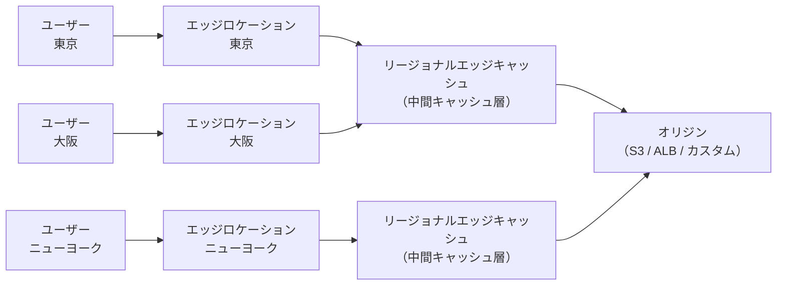
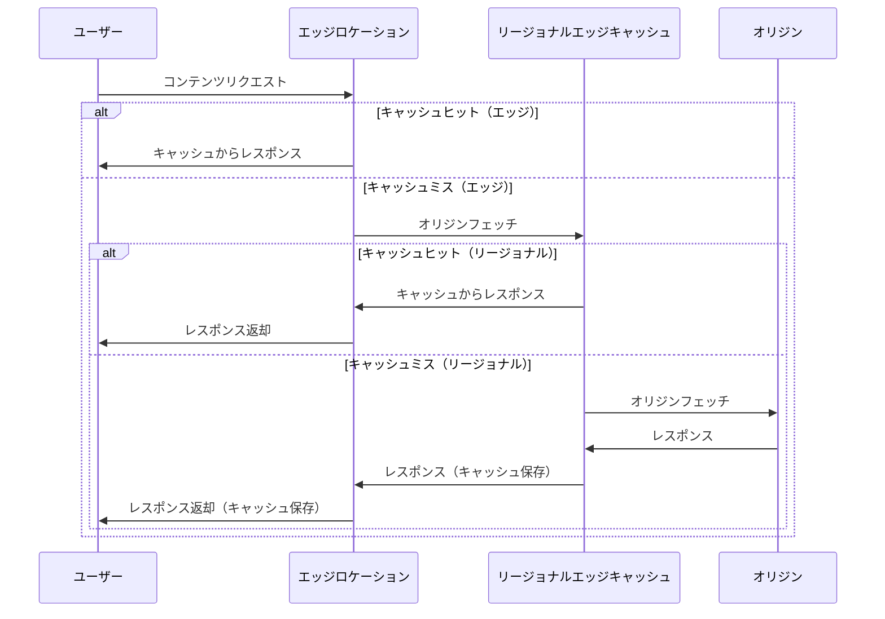
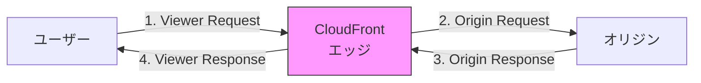

# AWS CloudFront

## CDN（Content Delivery Network）とは

CDNは、世界中に分散配置されたサーバー群（エッジロケーション）を使い、ユーザーに最も近い場所からコンテンツを配信する仕組み。これにより、レイテンシの削減、オリジンサーバーの負荷軽減、大量トラフィックへの耐性向上を実現する。

### CDNがない場合とある場合の比較

| 項目 | CDNなし | CDNあり |
| --- | --- | --- |
| コンテンツ配信元 | オリジンサーバー（1箇所） | エッジロケーション（世界中） |
| ユーザーからの距離 | 遠い場合がある | 常に最寄り |
| レイテンシ | 高い（物理的距離に依存） | 低い |
| オリジン負荷 | 全リクエストがオリジンに到達 | キャッシュヒット分は到達しない |
| 耐障害性 | SPOFになりやすい | 分散されている |
| DDoS耐性 | 低い | 高い（AWS Shield統合） |

---

## CloudFrontとは

Amazon CloudFrontは、AWSが提供するCDNサービス。S3、ALB、EC2、カスタムオリジンなど任意のHTTPサーバーをオリジンとして、グローバルに分散されたエッジロケーションからコンテンツを高速配信する。

### CloudFrontの全体像



---

## エッジロケーションとPOP

### エッジロケーション

CloudFrontのコンテンツをキャッシュし、ユーザーに配信する拠点。世界中に450箇所以上（2025年時点）存在する。

| 用語 | 説明 |
| --- | --- |
| エッジロケーション | ユーザーに最も近いキャッシュサーバー |
| POP（Point of Presence） | エッジロケーションが設置されたデータセンター群 |
| リージョナルエッジキャッシュ | エッジロケーションとオリジンの間にある中間キャッシュ層 |

### リクエストの流れ



### 日本のエッジロケーション

日本には東京と大阪にエッジロケーションが複数存在する。日本国内のユーザーへの配信は非常に低レイテンシで実現可能。

---

## キャッシュ戦略

### TTL（Time to Live）

キャッシュの有効期間を制御するパラメータ。

| 設定 | 説明 | デフォルト |
| --- | --- | --- |
| Minimum TTL | キャッシュの最小有効期間 | 0秒 |
| Maximum TTL | キャッシュの最大有効期間 | 31536000秒（1年） |
| Default TTL | オリジンがCache-Controlヘッダーを返さない場合のTTL | 86400秒（24時間） |

### Cache-Controlヘッダーとの関係

オリジンが返すCache-Controlヘッダーの値と、CloudFrontのTTL設定の関係:

```
オリジンのレスポンス: Cache-Control: max-age=3600

CloudFront側の設定:
  Minimum TTL = 60
  Maximum TTL = 86400
  Default TTL = 86400

結果: キャッシュTTL = 3600秒（max-ageがMin〜Maxの範囲内なので採用）
```

| シナリオ | 結果 |
| --- | --- |
| max-age < Minimum TTL | Minimum TTLが採用 |
| Minimum TTL <= max-age <= Maximum TTL | max-ageが採用 |
| max-age > Maximum TTL | Maximum TTLが採用 |
| Cache-Controlヘッダーなし | Default TTLが採用 |

### コンテンツ種別ごとの推奨TTL

| コンテンツ種別 | 推奨TTL | 理由 |
| --- | --- | --- |
| 静的アセット（CSS/JS/画像） | 1年（31536000秒） | ファイル名にハッシュを含めてバージョニング |
| HTMLページ | 短め（60〜300秒） | 頻繁に更新される可能性 |
| APIレスポンス | 0〜60秒 | リアルタイム性が求められる |
| 動画・大容量ファイル | 1日〜1週間 | 更新頻度が低い |

### キャッシュ無効化（Invalidation）

キャッシュの有効期限前に強制的にキャッシュを削除する操作。

```
# 特定のファイルを無効化
aws cloudfront create-invalidation \
  --distribution-id E1234567890 \
  --paths "/index.html" "/css/style.css"

# ディレクトリ配下を一括無効化
aws cloudfront create-invalidation \
  --distribution-id E1234567890 \
  --paths "/images/*"

# 全キャッシュの無効化（非推奨：コスト大）
aws cloudfront create-invalidation \
  --distribution-id E1234567890 \
  --paths "/*"
```

**Invalidationの注意点:**

- 月間1,000パスまでは無料。超過分は1パスあたり$0.005
- `/*`は1パスとしてカウントされる
- 全エッジロケーションへの反映には数分〜十数分かかる
- 頻繁なInvalidationよりもファイル名バージョニング（例: `style.abc123.css`）を推奨

### キャッシュキー

CloudFrontがキャッシュを一意に識別するためのキー。デフォルトではURLパスだが、以下をキャッシュキーに含めるよう設定可能。

| キャッシュキー要素 | 説明 | 例 |
| --- | --- | --- |
| URLパス | デフォルトで含まれる | `/images/logo.png` |
| クエリ文字列 | 指定したパラメータのみ含める推奨 | `?size=large&format=webp` |
| ヘッダー | Accept-Encoding等を含められる | gzip/brotli分岐 |
| Cookie | 指定したCookieのみ含める推奨 | セッションID等 |

**ベストプラクティス:** キャッシュキーに含める要素は最小限にする。含める要素が多いほどキャッシュヒット率が下がる。

---

## オリジン

### オリジンの種類

| オリジンの種類 | 説明 | ユースケース |
| --- | --- | --- |
| S3バケット | 静的ファイルの配信 | 静的Webサイト、画像、CSS/JS |
| ALB / ELB | 動的コンテンツの配信 | Webアプリケーション、API |
| EC2 | 直接EC2インスタンスから配信 | カスタムWebサーバー |
| MediaStore / MediaPackage | メディアコンテンツ | 動画ストリーミング |
| カスタムオリジン | 任意のHTTPサーバー | オンプレミスサーバー、他社CDN |

### S3オリジンの設定

S3をオリジンとして使用する場合、2つの方式がある。

| 方式 | 説明 | 推奨 |
| --- | --- | --- |
| OAC（Origin Access Control） | 新しい方式。S3へのアクセスをCloudFrontのみに制限 | 推奨 |
| OAI（Origin Access Identity） | 旧方式。レガシー | 非推奨 |

### オリジングループ（フェイルオーバー）

プライマリオリジンが障害の際にセカンダリオリジンへ自動フェイルオーバーする機能。

```
CloudFront → オリジングループ
              ├── プライマリ: S3バケット（東京リージョン）
              └── セカンダリ: S3バケット（大阪リージョン）

プライマリが5xx/4xxを返した場合 → 自動でセカンダリにフェイルオーバー
```

---

## OAC（Origin Access Control）

### OACとは

CloudFrontディストリビューションからのみS3バケットへのアクセスを許可する仕組み。S3バケットのURLを直接叩いてもアクセスできないようにする。

### OACの設定手順

1. CloudFrontディストリビューションのオリジン設定でOACを作成
2. S3バケットポリシーにCloudFrontからのアクセスを許可する記述を追加

**S3バケットポリシーの例:**

```json
{
  "Version": "2012-10-17",
  "Statement": [
    {
      "Sid": "AllowCloudFrontServicePrincipal",
      "Effect": "Allow",
      "Principal": {
        "Service": "cloudfront.amazonaws.com"
      },
      "Action": "s3:GetObject",
      "Resource": "arn:aws:s3:::my-bucket/*",
      "Condition": {
        "StringEquals": {
          "AWS:SourceArn": "arn:aws:cloudfront::123456789012:distribution/E1234567890"
        }
      }
    }
  ]
}
```

### OAC vs OAI

| 項目 | OAC（推奨） | OAI（レガシー） |
| --- | --- | --- |
| SSE-KMS対応 | 対応 | 非対応 |
| S3バケットポリシー | 標準的なIAMポリシー | 特殊なCanonicalUser記法 |
| リージョン制限 | なし | 一部リージョンで非対応 |
| 署名バージョン | SigV4 | SigV2/SigV4 |

---

## Lambda@Edge と CloudFront Functions

### 概要

CloudFrontのエッジでコードを実行する機能。リクエスト/レスポンスの加工、認証、リダイレクト、A/Bテストなどを実現する。

### Lambda@Edge vs CloudFront Functions

| 項目 | CloudFront Functions | Lambda@Edge |
| --- | --- | --- |
| 実行場所 | エッジロケーション（218+箇所） | リージョナルエッジキャッシュ（13箇所） |
| 対応イベント | Viewer Request / Viewer Response | 4つ全て |
| ランタイム | JavaScript (ECMAScript 5.1) | Node.js, Python |
| 最大実行時間 | 1ミリ秒 | 5秒（Viewer）/ 30秒（Origin） |
| 最大メモリ | 2MB | 128〜10,240MB |
| ネットワークアクセス | 不可 | 可能 |
| リクエストボディアクセス | 不可 | 可能 |
| 料金 | 非常に安価 | Lambda@Edgeの料金 |
| 用途 | 軽量な変換、ヘッダー操作 | 複雑な処理、外部API呼び出し |

### イベントトリガーのタイミング



| イベント | 説明 | ユースケース |
| --- | --- | --- |
| Viewer Request | ユーザーからのリクエスト受信時 | URL書き換え、認証、リダイレクト |
| Origin Request | オリジンへのリクエスト送信前 | オリジン選択、ヘッダー追加 |
| Origin Response | オリジンからのレスポンス受信後 | レスポンスヘッダー追加、エラーページカスタマイズ |
| Viewer Response | ユーザーへのレスポンス送信前 | セキュリティヘッダー追加 |

### CloudFront Functionsの例

**URLリライト（SPAのルーティング対応）:**

```javascript
function handler(event) {
  var request = event.request;
  var uri = request.uri;

  // 拡張子のないパスは index.html にリライト
  if (!uri.includes('.')) {
    request.uri = '/index.html';
  }

  return request;
}
```

**セキュリティヘッダーの追加:**

```javascript
function handler(event) {
  var response = event.response;
  var headers = response.headers;

  headers['strict-transport-security'] = {
    value: 'max-age=63072000; includeSubdomains; preload'
  };
  headers['x-content-type-options'] = { value: 'nosniff' };
  headers['x-frame-options'] = { value: 'DENY' };
  headers['x-xss-protection'] = { value: '1; mode=block' };
  headers['content-security-policy'] = {
    value: "default-src 'self'; script-src 'self'"
  };

  return response;
}
```

### Lambda@Edgeの例

**Basic認証:**

```javascript
export const handler = async (event) => {
  const request = event.Records[0].cf.request;
  const headers = request.headers;

  const authUser = 'admin';
  const authPass = 'password123';
  const authString = 'Basic ' + Buffer.from(authUser + ':' + authPass).toString('base64');

  if (
    !headers.authorization ||
    headers.authorization[0].value !== authString
  ) {
    return {
      status: '401',
      statusDescription: 'Unauthorized',
      headers: {
        'www-authenticate': [{ value: 'Basic realm="Restricted"' }],
      },
      body: 'Unauthorized',
    };
  }

  return request;
};
```

---

## SSL/TLS

### カスタムドメインでのHTTPS

CloudFrontでカスタムドメインを使用する場合、SSL/TLS証明書が必要。

| 方式 | 説明 | 費用 |
| --- | --- | --- |
| ACM証明書 | AWS Certificate Managerで発行（**us-east-1リージョン必須**） | 無料 |
| カスタム証明書 | IAMにアップロードした証明書 | 証明書の購入費用 |
| デフォルト証明書 | `*.cloudfront.net`のワイルドカード証明書 | 無料 |

**重要:** CloudFrontで使用するACM証明書は、必ず**us-east-1（バージニア北部）**リージョンで発行する必要がある。

### TLSバージョン

| 設定 | 説明 |
| --- | --- |
| TLSv1.2_2021（推奨） | TLS 1.2以上を要求。最もセキュア |
| TLSv1.2_2019 | TLS 1.2以上。古いクライアントも一部対応 |
| TLSv1.1_2016 | TLS 1.1以上。レガシー互換 |
| SSLv3（非推奨） | セキュリティ上の問題あり |

### SNI（Server Name Indication）

| 方式 | 説明 | 費用 |
| --- | --- | --- |
| SNI | 大半のブラウザが対応 | 無料 |
| 専用IP | SNI非対応の古いクライアント向け | $600/月 |

---

## WAF連携

### AWS WAFとの統合

CloudFrontにAWS WAF（Web Application Firewall）のWeb ACLを関連付けることで、不正なリクエストをエッジで遮断できる。

| WAFルールの種類 | 説明 | 例 |
| --- | --- | --- |
| マネージドルール | AWSやサードパーティが提供する定義済みルール | SQLインジェクション、XSS防御 |
| レートベースルール | 一定期間内のリクエスト数で制限 | IPあたり5分間に1000リクエスト |
| IPセットルール | 特定IPのブロック/許可 | 社内IPのみ許可 |
| Geo matchルール | 国や地域でブロック/許可 | 日本からのアクセスのみ許可 |

### AWS Shield

CloudFrontには自動的にAWS Shield Standardが適用され、一般的なDDoS攻撃（L3/L4）から保護される。Shield Advancedを有効にすると、より高度なDDoS防御とDDoSレスポンスチームのサポートが利用可能。

---

## 実務での構成パターン

### パターン1: 静的Webサイトホスティング

```
Route 53 → CloudFront → S3（OAC）
              ↓
          ACM証明書（us-east-1）
          CloudFront Functions（URLリライト）
```

- S3のウェブサイトホスティングではなくCloudFront経由で配信
- OACでS3への直接アクセスを防止
- CloudFront FunctionsでSPAのルーティング対応

### パターン2: 動的Webアプリケーション

```
Route 53 → CloudFront → /api/*   → ALB → ECS
                       → /static/* → S3（OAC）
                       → /*        → S3（OAC）
              ↓
          WAF Web ACL
          ACM証明書
```

- Behavior（キャッシュ動作）でパスパターン別にオリジンを振り分け
- API通信はキャッシュなし（TTL=0）でALBに転送
- 静的アセットはS3から長期キャッシュで配信

### パターン3: マルチオリジン + フェイルオーバー

```
CloudFront → オリジングループ
              ├── プライマリ: ALB（東京リージョン）
              └── セカンダリ: ALB（大阪リージョン）
```

- プライマリオリジンが5xxを返した場合に自動フェイルオーバー
- リージョン障害時のDR対策

---

## 料金

### 課金の構成要素

| 項目 | 説明 |
| --- | --- |
| データ転送（エッジ→インターネット） | 配信したデータ量に応じて課金。リージョンごとに単価が異なる |
| HTTPリクエスト数 | HTTP: $0.0090/10,000リクエスト、HTTPS: $0.0120/10,000リクエスト（日本） |
| Invalidationリクエスト | 月間1,000パスまで無料。超過分$0.005/パス |
| Lambda@Edge | リクエスト数 + 実行時間 |
| CloudFront Functions | $0.10/100万呼び出し |
| オリジンへのデータ転送 | CloudFront → オリジンは無料 |

### コスト最適化のポイント

| 方法 | 効果 |
| --- | --- |
| キャッシュヒット率を上げる | オリジンフェッチ回数とデータ転送量を削減 |
| 圧縮（gzip/Brotli）を有効化 | 転送データ量を50〜80%削減 |
| CloudFront Security Savings Bundle | 1年コミットで最大30%割引 |
| 不要なInvalidationを減らす | ファイル名バージョニングで対応 |
| Price Classの設定 | 使用するエッジロケーションを限定（例: 日本・米国のみ） |

### Price Class

| Price Class | 対象リージョン | コスト |
| --- | --- | --- |
| Price Class All | 全エッジロケーション | 最高 |
| Price Class 200 | 主要リージョン（南米・オーストラリア除く） | 中 |
| Price Class 100 | 北米・ヨーロッパのみ | 最低 |

日本をターゲットにする場合は **Price Class 200** 以上が必要。

---

## CloudFrontの設定項目まとめ

### ディストリビューション設定

| 項目 | 説明 |
| --- | --- |
| Price Class | 使用するエッジロケーションの範囲 |
| WAF Web ACL | 関連付けるWAFルール |
| 代替ドメイン名（CNAME） | カスタムドメイン |
| SSL証明書 | ACMまたはカスタム証明書 |
| デフォルトルートオブジェクト | `/`アクセス時に返すファイル（例: `index.html`） |
| ログ記録 | S3にアクセスログを保存 |
| IPv6 | IPv6の有効/無効 |

### Behavior（キャッシュ動作）設定

| 項目 | 説明 |
| --- | --- |
| パスパターン | 対象のURLパス（例: `/api/*`, `*.jpg`） |
| オリジン | リクエストを転送するオリジン |
| ビューワープロトコルポリシー | HTTP/HTTPS/Redirect HTTP to HTTPS |
| キャッシュポリシー | TTL、キャッシュキー（ヘッダー、クエリ文字列、Cookie） |
| オリジンリクエストポリシー | オリジンに転送するヘッダー等 |
| レスポンスヘッダーポリシー | セキュリティヘッダー等の追加 |
| 関数の関連付け | CloudFront Functions / Lambda@Edge |

---

## 参考文献

- [Amazon CloudFront 公式ドキュメント](https://docs.aws.amazon.com/ja_jp/AmazonCloudFront/latest/DeveloperGuide/)
- [CloudFront の料金](https://aws.amazon.com/jp/cloudfront/pricing/)
- [CloudFront Functions の開発者ガイド](https://docs.aws.amazon.com/ja_jp/AmazonCloudFront/latest/DeveloperGuide/cloudfront-functions.html)
- [Lambda@Edge の開発者ガイド](https://docs.aws.amazon.com/ja_jp/AmazonCloudFront/latest/DeveloperGuide/lambda-at-the-edge.html)
- [OAC（Origin Access Control）](https://docs.aws.amazon.com/ja_jp/AmazonCloudFront/latest/DeveloperGuide/private-content-restricting-access-to-s3.html)
- [AWS WAF と CloudFront の統合](https://docs.aws.amazon.com/ja_jp/waf/latest/developerguide/cloudfront-features.html)
- [CloudFront キャッシュポリシー](https://docs.aws.amazon.com/ja_jp/AmazonCloudFront/latest/DeveloperGuide/controlling-the-cache-key.html)
- [CloudFront ベストプラクティス](https://docs.aws.amazon.com/ja_jp/AmazonCloudFront/latest/DeveloperGuide/best-practices.html)
- [AWS Well-Architected Framework - Performance Efficiency Pillar](https://docs.aws.amazon.com/ja_jp/wellarchitected/latest/performance-efficiency-pillar/welcome.html)
