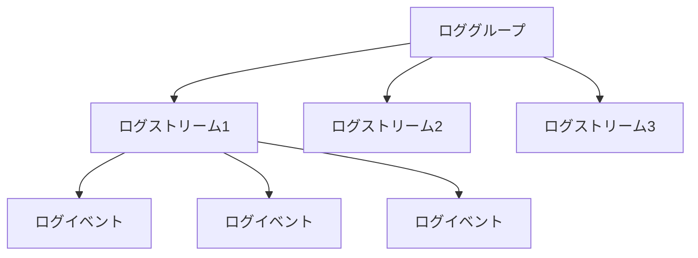
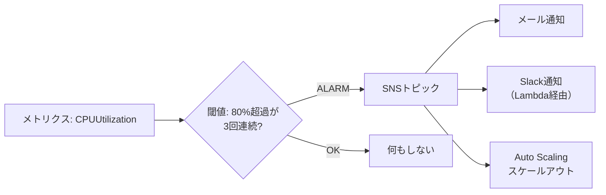
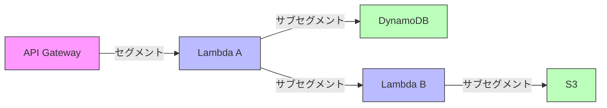

# AWS CloudWatch

## CloudWatchとは

Amazon CloudWatchは、AWSリソースとアプリケーションのモニタリング（監視）サービス。メトリクス（数値データ）の収集・可視化、ログの集約・分析、アラームによる異常検知、ダッシュボードによる一元監視を提供する。

AWSの運用において「何が起きているか」を把握するための中核サービス。サーバーの健康状態、アプリケーションのパフォーマンス、コストの異常など、あらゆる側面を監視できる。

### モニタリングの重要性

| 目的 | 説明 | CloudWatchの機能 |
| --- | --- | --- |
| 障害検知 | 問題をいち早く発見する | アラーム |
| パフォーマンス分析 | ボトルネックを特定する | メトリクス、X-Ray |
| キャパシティプランニング | 将来の需要を予測する | メトリクスの時系列分析 |
| コスト最適化 | リソースの無駄を検出する | メトリクス、アノマリー検出 |
| コンプライアンス | 操作の記録と監査 | ログ |
| デバッグ | 問題の根本原因を調査する | ログ、X-Ray |

---

## メトリクス

メトリクスは、CloudWatchに送信される時系列の数値データ。AWSサービスは自動的にメトリクスをCloudWatchに送信する。

### 主なAWSサービスのメトリクス

| サービス | メトリクス例 | 説明 |
| --- | --- | --- |
| EC2 | CPUUtilization | CPU使用率（%） |
| EC2 | NetworkIn / NetworkOut | ネットワーク通信量 |
| Lambda | Duration | 関数の実行時間 |
| Lambda | Errors | エラー数 |
| Lambda | Throttles | スロットリング数 |
| RDS | DatabaseConnections | DB接続数 |
| RDS | FreeStorageSpace | 空きストレージ |
| SQS | ApproximateNumberOfMessagesVisible | キュー内のメッセージ数 |
| ALB | RequestCount | リクエスト数 |
| ALB | TargetResponseTime | レスポンス時間 |

### メトリクスの構造

```
Namespace: AWS/EC2
MetricName: CPUUtilization
Dimensions:
  InstanceId: i-1234567890abcdef0
Period: 300（5分）
Statistic: Average
Value: 45.2
Timestamp: 2026-04-02T10:00:00Z
```

| 要素 | 説明 |
| --- | --- |
| Namespace | メトリクスのカテゴリ（例: `AWS/EC2`、`AWS/Lambda`） |
| MetricName | メトリクスの名前 |
| Dimensions | メトリクスを識別する属性（インスタンスID等） |
| Period | データポイントの集約期間（秒） |
| Statistic | 集約方法（Average、Sum、Minimum、Maximum、SampleCount） |

### カスタムメトリクス

独自のメトリクスをCloudWatchに送信できる。

```javascript
import {
  CloudWatchClient,
  PutMetricDataCommand,
} from '@aws-sdk/client-cloudwatch';

const client = new CloudWatchClient({ region: 'ap-northeast-1' });

await client.send(
  new PutMetricDataCommand({
    Namespace: 'MyApp/Orders',
    MetricData: [
      {
        MetricName: 'OrderProcessingTime',
        Value: 1250,
        Unit: 'Milliseconds',
        Dimensions: [
          { Name: 'Environment', Value: 'production' },
          { Name: 'OrderType', Value: 'premium' },
        ],
      },
      {
        MetricName: 'OrderCount',
        Value: 1,
        Unit: 'Count',
        Dimensions: [
          { Name: 'Environment', Value: 'production' },
        ],
      },
    ],
  })
);
```

### メトリクス解像度

| 解像度 | 間隔 | 料金 | ユースケース |
| --- | --- | --- | --- |
| 標準（Standard） | 60秒（1分） | 無料（AWSサービス標準） | 通常のモニタリング |
| 高解像度（High-Resolution） | 1秒 | 追加料金 | リアルタイム性が重要な場合 |
| 詳細モニタリング（EC2） | 60秒（1分） | 追加料金 | EC2の詳細データ |

EC2のデフォルトメトリクスは5分間隔。詳細モニタリングを有効にすると1分間隔になる。

### Metric Math

複数のメトリクスを演算して新しいメトリクスを生成できる。

```
# エラー率の計算
errorRate = errors / requests * 100

# 使用率の計算
utilizationPercent = (usedCapacity / totalCapacity) * 100
```

---

## CloudWatch Logs

CloudWatch Logsは、AWSサービスやアプリケーションのログを集約・保存・検索するサービス。

### ログの構造



| 概念 | 説明 | 例 |
| --- | --- | --- |
| ロググループ | ログの論理的なグループ | `/aws/lambda/my-function` |
| ログストリーム | ログの発生源ごとの時系列データ | Lambda実行環境ごとに1つ |
| ログイベント | 個々のログエントリ | タイムスタンプ + メッセージ |

### ログの送信元

| 送信元 | 自動/手動 | 説明 |
| --- | --- | --- |
| Lambda | 自動 | `console.log`の出力が自動送信 |
| ECS/Fargate | 設定で自動 | awslogsドライバーで送信 |
| EC2 | 手動（エージェント） | CloudWatch Agentをインストール |
| API Gateway | 設定で自動 | アクセスログ、実行ログ |
| VPC Flow Logs | 設定で自動 | ネットワークトラフィックログ |
| カスタムアプリ | SDK/CLI | PutLogEventsで送信 |

### 構造化ログの推奨

```javascript
// 非推奨: 平文ログ
console.log('Order processed: 12345, amount: 15000, status: success');

// 推奨: JSON構造化ログ
console.log(
  JSON.stringify({
    level: 'INFO',
    message: 'Order processed',
    orderId: '12345',
    amount: 15000,
    status: 'success',
    timestamp: new Date().toISOString(),
  })
);
```

構造化ログにすると、CloudWatch Logs InsightsやMetric Filterで効率的にクエリ・分析できる。

### ログの保持期間

ロググループごとに設定可能。デフォルトは「無期限」（永久保存）。

| 保持期間 | ユースケース |
| --- | --- |
| 1日〜7日 | 開発・テスト環境 |
| 30日〜90日 | 本番環境の通常ログ |
| 1年〜10年 | コンプライアンス要件のあるログ |
| S3エクスポート | 長期保存・低コスト |

**注意**: 保持期間を適切に設定しないと、ログのストレージ料金が膨れ上がる。

### サブスクリプションフィルター

ログをリアルタイムに別サービスに配信する。

```
CloudWatch Logs → サブスクリプションフィルター → Lambda（リアルタイム処理）
                                               → Kinesis Data Firehose → S3
                                               → Kinesis Data Streams
                                               → 他アカウントのCloudWatch Logs
```

---

## CloudWatch Logs Insights

CloudWatch Logs Insightsは、ログデータに対してSQLライクなクエリを実行できる分析ツール。大量のログから必要な情報を高速に検索・集計できる。

### クエリ構文

```sql
-- 直近のエラーログを検索
fields @timestamp, @message
| filter @message like /ERROR/
| sort @timestamp desc
| limit 20
```

```sql
-- Lambda関数の実行時間統計
filter @type = "REPORT"
| stats avg(@duration), max(@duration), min(@duration), count(*) by bin(5m)
```

```sql
-- APIエンドポイント別のエラー率
fields @timestamp, @message
| parse @message '"path":"*"' as path
| parse @message '"statusCode":*,' as statusCode
| filter statusCode >= 400
| stats count(*) as errorCount by path
| sort errorCount desc
```

### 主なコマンド

| コマンド | 説明 | 例 |
| --- | --- | --- |
| fields | 表示するフィールドを選択 | `fields @timestamp, @message` |
| filter | 条件でフィルタ | `filter @message like /ERROR/` |
| stats | 集計関数 | `stats count(*), avg(duration)` |
| sort | ソート | `sort @timestamp desc` |
| limit | 件数制限 | `limit 50` |
| parse | テキストからフィールド抽出 | `parse @message '"key":"*"' as value` |
| display | 最終出力のフィールド選択 | `display @timestamp, errorMessage` |

### 組み込みフィールド

| フィールド | 説明 |
| --- | --- |
| @timestamp | ログイベントのタイムスタンプ |
| @message | ログメッセージ本文 |
| @logStream | ログストリーム名 |
| @log | ロググループ名 |
| @ingestionTime | ログが取り込まれた時刻 |

### 実践的なクエリ例

```sql
-- 5xxエラーの発生頻度を5分単位で集計
fields @timestamp, @message
| filter @message like /HTTP\/1\.\d" 5\d{2}/
| stats count(*) as errorCount by bin(5m)
| sort @timestamp

-- 特定ユーザーのアクション追跡
fields @timestamp, @message
| filter @message like /userId.*USR-001/
| sort @timestamp
| limit 100

-- Lambdaのコールドスタート検出
filter @message like /Init Duration/
| parse @message "Init Duration: * ms" as initDuration
| stats avg(initDuration), max(initDuration), count(*) by bin(1h)

-- メモリ使用率の高いLambda実行を特定
filter @type = "REPORT"
| parse @message "Memory Size: * MB" as memorySize
| parse @message "Max Memory Used: * MB" as memoryUsed
| fields memoryUsed / memorySize * 100 as memoryUtil
| filter memoryUtil > 80
| sort memoryUtil desc
```

---

## CloudWatch アラーム

アラームは、メトリクスが特定の閾値を超えた場合にアクション（通知、Auto Scaling、Lambda実行等）をトリガーする機能。

### アラームの状態

| 状態 | 説明 |
| --- | --- |
| OK | メトリクスが閾値内 |
| ALARM | メトリクスが閾値を超過 |
| INSUFFICIENT_DATA | データが不足して判定不能 |

### アラームの設定例



### Terraform での定義例

```hcl
resource "aws_cloudwatch_metric_alarm" "high_cpu" {
  alarm_name          = "high-cpu-utilization"
  comparison_operator = "GreaterThanThreshold"
  evaluation_periods  = 3
  metric_name         = "CPUUtilization"
  namespace           = "AWS/EC2"
  period              = 300
  statistic           = "Average"
  threshold           = 80
  alarm_description   = "CPU使用率が80%を3回連続で超過"

  dimensions = {
    InstanceId = aws_instance.web.id
  }

  alarm_actions = [aws_sns_topic.alerts.arn]
  ok_actions    = [aws_sns_topic.alerts.arn]
}
```

### 複合アラーム（Composite Alarm）

複数のアラームを論理演算（AND/OR/NOT）で組み合わせた高度なアラーム。

```
複合アラーム = (CPUアラーム AND メモリアラーム) OR ディスクアラーム
```

アラームノイズを減らし、真に対応が必要な状況でのみ通知する。

### アノマリー検出

機械学習を使って、メトリクスの通常パターンから逸脱した異常を自動検出する。

```hcl
resource "aws_cloudwatch_metric_alarm" "anomaly_detection" {
  alarm_name          = "api-latency-anomaly"
  comparison_operator = "GreaterThanUpperThreshold"
  evaluation_periods  = 3
  threshold_metric_id = "ad1"

  metric_query {
    id          = "m1"
    return_data = true
    metric {
      metric_name = "TargetResponseTime"
      namespace   = "AWS/ApplicationELB"
      period      = 300
      stat        = "Average"
    }
  }

  metric_query {
    id          = "ad1"
    expression  = "ANOMALY_DETECTION_BAND(m1, 2)"
    label       = "Anomaly Detection Band"
    return_data = true
  }
}
```

---

## CloudWatch ダッシュボード

カスタマイズ可能な監視画面。複数のメトリクス、ログ、アラームを1つの画面に集約して表示する。

### ダッシュボードの構成要素

| ウィジェット | 説明 | ユースケース |
| --- | --- | --- |
| Line（折れ線グラフ） | 時系列データの推移 | CPU使用率、リクエスト数 |
| Stacked Area | 積み上げ面グラフ | 複数インスタンスの合計 |
| Number | 単一の数値 | 現在のエラー数 |
| Gauge | ゲージ | 使用率の可視化 |
| Bar | 棒グラフ | カテゴリ別の比較 |
| Text | テキスト/マークダウン | 説明、リンク集 |
| Alarm Status | アラームの状態表示 | 全アラームの一覧 |
| Logs Insights | ログクエリ結果 | エラーログの表示 |
| Explorer | メトリクスの探索 | タグベースのメトリクス集約 |

### ダッシュボード設計のポイント

- **レイヤー別**: インフラ層、アプリケーション層、ビジネス層に分けてダッシュボードを作成
- **1画面完結**: スクロールなしで重要な情報が見えるようにする
- **アラームを含める**: 現在のアラーム状態をダッシュボードに含める
- **クロスアカウント**: 複数アカウントのメトリクスを1つのダッシュボードに集約可能

---

## AWS X-Ray

X-Rayは、分散アプリケーションのトレーシングサービス。リクエストがシステム内をどのように流れるかを可視化し、パフォーマンスのボトルネックやエラーの発生箇所を特定する。

### X-Rayの基本概念



| 概念 | 説明 |
| --- | --- |
| トレース | 1つのリクエストの全体的な流れ |
| セグメント | 各サービスの処理単位 |
| サブセグメント | サービス内の個別処理（DB呼び出し、外部API呼び出し等） |
| サービスマップ | サービス間の依存関係の可視化 |
| アノテーション | トレースに付与するキーバリューペア（検索可能） |
| メタデータ | トレースに付与する追加情報（検索不可） |

### X-Rayの有効化（Lambda）

LambdaではX-Rayのアクティブトレーシングを有効にするだけで自動的にトレースが収集される。

```javascript
import { DynamoDBClient, GetItemCommand } from '@aws-sdk/client-dynamodb';

// AWS SDK v3は自動的にX-Rayトレースを生成
const client = new DynamoDBClient({ region: 'ap-northeast-1' });

export const handler = async (event) => {
  // このDynamoDB呼び出しが自動的にサブセグメントとして記録される
  const result = await client.send(
    new GetItemCommand({
      TableName: 'Orders',
      Key: { OrderId: { S: event.orderId } },
    })
  );

  return result.Item;
};
```

### CloudWatch ServiceLens

X-Ray、CloudWatch Logs、CloudWatchメトリクスを統合して、アプリケーションの健全性を一元的に把握するダッシュボード。サービスマップ上で各サービスのレイテンシ、エラー率、ログを確認できる。

---

## CloudWatch Agent

EC2インスタンスやオンプレミスサーバーからメトリクスとログを収集するエージェント。

### 収集できるデータ

| データ | 標準メトリクスでは取得不可 | Agent で取得可能 |
| --- | --- | --- |
| メモリ使用率 | 不可 | 可能 |
| ディスク使用率 | 不可 | 可能 |
| プロセス情報 | 不可 | 可能 |
| アプリケーションログ | 不可 | 可能 |
| カスタムメトリクス | 不可 | 可能 |

**注意**: EC2の標準メトリクスにはメモリ使用率とディスク使用率が含まれない。CloudWatch Agentをインストールして取得する必要がある。

### Agent設定ファイルの例

```json
{
  "metrics": {
    "namespace": "MyApp/EC2",
    "metrics_collected": {
      "mem": {
        "measurement": ["mem_used_percent"],
        "metrics_collection_interval": 60
      },
      "disk": {
        "measurement": ["disk_used_percent"],
        "resources": ["/"],
        "metrics_collection_interval": 60
      }
    }
  },
  "logs": {
    "logs_collected": {
      "files": {
        "collect_list": [
          {
            "file_path": "/var/log/my-app/app.log",
            "log_group_name": "/myapp/application",
            "log_stream_name": "{instance_id}",
            "timezone": "UTC"
          }
        ]
      }
    }
  }
}
```

---

## Metric Filter

ログデータからメトリクスを自動生成する機能。特定のパターンにマッチするログイベントをカウントしたり、ログ内の数値を抽出してメトリクスにできる。

### 使用例

```
ログ: {"level":"ERROR","message":"Payment failed","orderId":"12345"}

Metric Filter Pattern: { $.level = "ERROR" }
→ カスタムメトリクス: ErrorCount に +1
→ アラーム: エラー数が閾値を超えたら通知
```

### フィルターパターンの構文

| パターン | 説明 | 例 |
| --- | --- | --- |
| 単語一致 | 特定の文字列を含む | `ERROR` |
| JSON | JSONフィールドでフィルタ | `{ $.level = "ERROR" }` |
| スペース区切り | 位置ベースの値抽出 | `[ip, user, timestamp, request]` |

---

## 料金体系

### 主な料金項目

| 項目 | 無料枠 | 料金 |
| --- | --- | --- |
| カスタムメトリクス | 10個 | $0.30/メトリクス/月 |
| ダッシュボード | 3つ（50メトリクスまで） | $3.00/ダッシュボード/月 |
| アラーム（標準） | 10個 | $0.10/アラーム/月 |
| ログ取り込み | 5GB | $0.76/GB（東京） |
| ログ保存 | 5GB | $0.033/GB/月（東京） |
| Logs Insightsクエリ | — | $0.0076/GBスキャン |
| API呼び出し | 100万 | $0.01/1,000リクエスト |

### コスト最適化のポイント

- ログの保持期間を適切に設定する（デフォルトの「無期限」を避ける）
- 不要なメトリクスの送信を止める
- ログをS3にエクスポートして長期保存する（CloudWatch Logsより安い）
- Embedded Metric Formatを使って効率的にカスタムメトリクスを送信する

---

## ベストプラクティス

### メトリクス

- AWSサービスの標準メトリクスを活用する（追加料金なし）
- EC2ではCloudWatch Agentでメモリ・ディスクメトリクスを取得する
- Metric Mathでビジネスメトリクスを計算する（エラー率、成功率等）
- 高解像度メトリクスは本当に必要な場合のみ使用する

### ログ

- 構造化ログ（JSON）を出力する
- ログレベルを適切に設定する（本番ではINFO以上）
- 保持期間を設定してコストを管理する
- 機密情報（パスワード、トークン）をログに含めない

### アラーム

- アラームの閾値を適切に設定する（誤検知を減らす）
- 複合アラームでノイズを減らす
- アノマリー検出を活用して動的な閾値を設定する
- アラーム発火時の対応手順（ランブック）を事前に用意する

### 全体

- ダッシュボードを作成して重要なメトリクスを一元管理する
- X-Rayを有効にして分散トレーシングを実現する
- CloudWatch Logs InsightsでログのAd-hoc分析を行う
- Embedded Metric Formatでログとメトリクスを同時に送信する

---

## 参考リンク

- [Amazon CloudWatch 公式ドキュメント](https://docs.aws.amazon.com/cloudwatch/)
- [CloudWatch 料金](https://aws.amazon.com/cloudwatch/pricing/)
- [CloudWatch Logs Insights クエリ構文](https://docs.aws.amazon.com/AmazonCloudWatch/latest/logs/CWL_QuerySyntax.html)
- [CloudWatch Agent 設定ガイド](https://docs.aws.amazon.com/AmazonCloudWatch/latest/monitoring/CloudWatch-Agent-Configuration-File-Details.html)
- [AWS X-Ray ドキュメント](https://docs.aws.amazon.com/xray/)
- [CloudWatch アラーム ベストプラクティス](https://docs.aws.amazon.com/AmazonCloudWatch/latest/monitoring/Best_Practices_Alarms.html)
- [Embedded Metric Format](https://docs.aws.amazon.com/AmazonCloudWatch/latest/monitoring/CloudWatch_Embedded_Metric_Format.html)
- [CloudWatch ダッシュボード](https://docs.aws.amazon.com/AmazonCloudWatch/latest/monitoring/CloudWatch_Dashboards.html)
