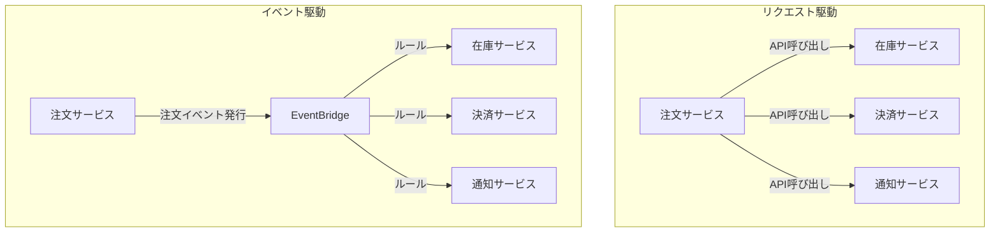
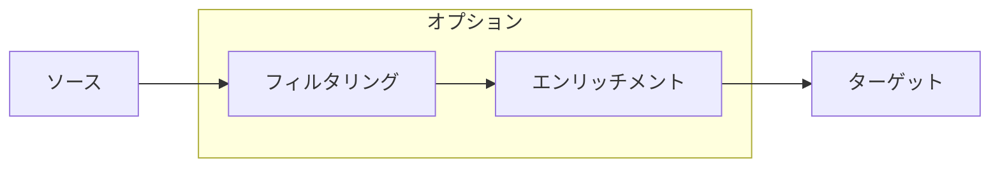
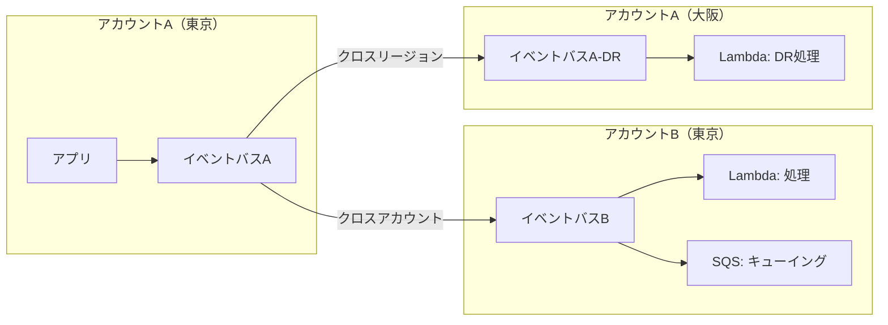

# AWS EventBridge

## イベント駆動アーキテクチャとは

イベント駆動アーキテクチャ（EDA: Event-Driven Architecture）は、システムの状態変化（イベント）を契機として処理を実行するアーキテクチャパターン。サービス間の通信をイベントを介して行うことで、疎結合で拡張性の高いシステムを構築できる。

### リクエスト駆動 vs イベント駆動

| 項目 | リクエスト駆動 | イベント駆動 |
| --- | --- | --- |
| 通信方式 | 同期（リクエスト/レスポンス） | 非同期（イベント発行/受信） |
| 結合度 | 密結合（呼び出し先を知っている） | 疎結合（発行者は受信者を知らない） |
| 障害影響 | 呼び出し先の障害が直接影響 | 障害の影響が局所化 |
| スケーラビリティ | 呼び出し先に依存 | 独立してスケール可能 |
| 追加の処理 | 呼び出し元の変更が必要 | 新しいサブスクライバーを追加するだけ |



---

## Amazon EventBridgeとは

Amazon EventBridgeは、AWSが提供するサーバーレスのイベントバスサービス。AWSサービス、SaaSアプリケーション、独自アプリケーションからのイベントを受信し、ルールに基づいてターゲットにルーティングする。

旧名はCloudWatch Events。2019年にEventBridgeとしてリブランドされ、大幅に機能が拡張された。

### EventBridgeの構成要素

| 構成要素 | 説明 |
| --- | --- |
| イベントバス | イベントを受信するパイプライン |
| ルール | イベントパターンに基づいてターゲットにルーティング |
| ターゲット | イベントを受信して処理するAWSサービス |
| イベントパターン | どのイベントをマッチさせるかの条件 |
| スキーマレジストリ | イベントの構造を管理 |
| Pipe | ソースからターゲットへのポイントツーポイント接続 |
| Scheduler | スケジュールベースのイベント発行 |

---

## Rule（ルール）

ルールは、EventBridgeの中核機能。イベントパターンに一致するイベントをターゲットにルーティングする。

### ルールの種類

| 種類 | 説明 | ユースケース |
| --- | --- | --- |
| イベントパターンルール | イベントの内容に基づいてマッチ | 特定のイベントに反応する処理 |
| スケジュールルール | 定期的にイベントを生成（※非推奨、Schedulerへ移行） | 定期バッチ処理 |

### イベントパターンの書き方

#### 基本構造

```json
{
  "source": ["aws.ec2"],
  "detail-type": ["EC2 Instance State-change Notification"],
  "detail": {
    "state": ["stopped", "terminated"]
  }
}
```

#### 高度なフィルタリング

```json
{
  "source": ["my-app.orders"],
  "detail-type": ["OrderCreated"],
  "detail": {
    "amount": [{ "numeric": [">=", 10000] }],
    "region": [{ "prefix": "ap-" }],
    "status": [{ "anything-but": ["cancelled"] }],
    "metadata": {
      "priority": [{ "exists": true }]
    }
  }
}
```

| フィルタ演算子 | 説明 | 例 |
| --- | --- | --- |
| 完全一致 | 値が完全に一致 | `["value"]` |
| prefix | 前方一致 | `[{"prefix": "ap-"}]` |
| suffix | 後方一致 | `[{"suffix": ".json"}]` |
| numeric | 数値比較 | `[{"numeric": [">=", 100]}]` |
| anything-but | 指定値以外 | `[{"anything-but": ["test"]}]` |
| exists | フィールドの存在確認 | `[{"exists": true}]` |
| wildcard | ワイルドカード | `[{"wildcard": "order-*-premium"}]` |

### ターゲットの種類

1つのルールに最大5つのターゲットを設定可能。

| ターゲット | ユースケース |
| --- | --- |
| Lambda | イベント処理 |
| Step Functions | ワークフロー起動 |
| SQS | キューイング |
| SNS | 通知配信 |
| Kinesis Data Streams | ストリーミング |
| ECS タスク | コンテナ処理 |
| API Gateway | HTTP API呼び出し |
| CloudWatch Logs | ログ記録 |
| EventBridge（他アカウント/リージョン） | クロスアカウント/リージョン |
| API Destinations | 外部HTTP API呼び出し |

### 入力トランスフォーマー

イベントをターゲットに渡す前に形式を変換できる。

```json
{
  "InputPathsMap": {
    "orderId": "$.detail.orderId",
    "amount": "$.detail.amount",
    "timestamp": "$.time"
  },
  "InputTemplate": "{\"message\": \"Order <orderId> created with amount <amount>\", \"time\": <timestamp>}"
}
```

---

## Pipe（パイプ）

EventBridge Pipesは、ソースからターゲットへのポイントツーポイント統合を提供する。ソースからイベントを取得し、オプションでフィルタリング・エンリッチメントを行い、ターゲットに配信する。

### Pipeの構成



| ステージ | 必須 | 説明 |
| --- | --- | --- |
| ソース | はい | イベントの取得元 |
| フィルタリング | いいえ | イベントパターンでフィルタ |
| エンリッチメント | いいえ | Lambda/Step Functions/API Gateway/API Destinationsでデータ補完 |
| ターゲット | はい | イベントの配信先 |

### サポートされるソース

| ソース | 説明 |
| --- | --- |
| SQS | キューからのメッセージ |
| DynamoDB Streams | テーブルの変更イベント |
| Kinesis Data Streams | ストリームデータ |
| Amazon MQ | メッセージブローカー |
| Apache Kafka (MSK) | Kafkaトピック |

### Rule vs Pipe の使い分け

| 項目 | Rule | Pipe |
| --- | --- | --- |
| 接続パターン | 1対多（ファンアウト） | 1対1（ポイントツーポイント） |
| ソース | イベントバスに送信されたイベント | SQS、DynamoDB Streams、Kinesis等 |
| エンリッチメント | なし | Lambda等で補完可能 |
| ターゲット数 | 最大5つ/ルール | 1つ |
| ユースケース | イベントルーティング | ソースとターゲットの統合 |

### Pipe の実装例

```json
{
  "Name": "order-processing-pipe",
  "Source": "arn:aws:sqs:ap-northeast-1:123456789:order-queue",
  "SourceParameters": {
    "SqsQueueParameters": {
      "BatchSize": 10
    },
    "FilterCriteria": {
      "Filters": [
        {
          "Pattern": "{\"body\":{\"orderType\":[\"premium\"]}}"
        }
      ]
    }
  },
  "Enrichment": "arn:aws:lambda:ap-northeast-1:123456789:function:enrich-order",
  "Target": "arn:aws:states:ap-northeast-1:123456789:stateMachine:process-order",
  "TargetParameters": {
    "StepFunctionStateMachineParameters": {
      "InvocationType": "FIRE_AND_FORGET"
    }
  }
}
```

---

## Scheduler（スケジューラー）

EventBridge Schedulerは、定期的またはワンタイムのタスク実行をスケジュールするサービス。従来のEventBridgeスケジュールルールの後継で、より高機能。

### スケジュールの種類

| 種類 | 説明 | 例 |
| --- | --- | --- |
| Rate式 | 一定間隔 | `rate(5 minutes)` |
| Cron式 | 細かい時刻指定 | `cron(0 9 * * ? *)` 毎日9時 |
| ワンタイム | 1回だけ実行 | `at(2026-04-01T09:00:00)` |

### Cron式の形式

```
cron(分 時 日 月 曜日 年)
```

| フィールド | 値 | 例 |
| --- | --- | --- |
| 分 | 0-59 | 0 |
| 時 | 0-23 | 9（UTC） |
| 日 | 1-31 | * |
| 月 | 1-12 or JAN-DEC | * |
| 曜日 | 1-7 or SUN-SAT | MON-FRI |
| 年 | 1970-2199 | * |

### Scheduler vs EventBridge スケジュールルール

| 項目 | Scheduler | スケジュールルール（旧） |
| --- | --- | --- |
| ワンタイムスケジュール | 対応 | 非対応 |
| タイムゾーン指定 | 対応 | 非対応（UTCのみ） |
| スケジュール数の制限 | 100万 | 300 |
| リトライポリシー | 設定可能 | 限定的 |
| DLQ設定 | 可能 | 可能 |
| 推奨度 | 推奨 | 既存環境のみ |

### Scheduler の実装例

```json
{
  "Name": "daily-report-schedule",
  "ScheduleExpression": "cron(0 0 * * ? *)",
  "ScheduleExpressionTimezone": "Asia/Tokyo",
  "FlexibleTimeWindow": {
    "Mode": "FLEXIBLE",
    "MaximumWindowInMinutes": 15
  },
  "Target": {
    "Arn": "arn:aws:lambda:ap-northeast-1:123456789:function:GenerateDailyReport",
    "RoleArn": "arn:aws:iam::123456789:role/scheduler-role",
    "RetryPolicy": {
      "MaximumRetryAttempts": 3,
      "MaximumEventAgeInSeconds": 3600
    },
    "DeadLetterConfig": {
      "Arn": "arn:aws:sqs:ap-northeast-1:123456789:scheduler-dlq"
    }
  }
}
```

---

## イベントバス

### イベントバスの種類

| 種類 | 説明 |
| --- | --- |
| デフォルトイベントバス | 各AWSアカウントに自動作成。AWSサービスのイベントはここに送信される |
| カスタムイベントバス | アプリケーション独自のイベント用に作成 |
| パートナーイベントバス | SaaSパートナー（Datadog、Zendesk等）からのイベント受信用 |

### カスタムイベントの発行

```javascript
import {
  EventBridgeClient,
  PutEventsCommand,
} from '@aws-sdk/client-eventbridge';

const client = new EventBridgeClient({ region: 'ap-northeast-1' });

await client.send(
  new PutEventsCommand({
    Entries: [
      {
        EventBusName: 'my-app-events',
        Source: 'my-app.orders',
        DetailType: 'OrderCreated',
        Detail: JSON.stringify({
          orderId: 'ORD-12345',
          customerId: 'CUST-001',
          amount: 15000,
          items: [
            { productId: 'PROD-A', quantity: 2 },
            { productId: 'PROD-B', quantity: 1 },
          ],
        }),
      },
    ],
  })
);
```

### イベントの構造

```json
{
  "version": "0",
  "id": "12345678-1234-1234-1234-123456789012",
  "source": "my-app.orders",
  "account": "123456789012",
  "time": "2026-04-02T10:00:00Z",
  "region": "ap-northeast-1",
  "detail-type": "OrderCreated",
  "detail": {
    "orderId": "ORD-12345",
    "customerId": "CUST-001",
    "amount": 15000
  }
}
```

`version`、`id`、`account`、`time`、`region`はEventBridgeが自動的に付与する。開発者が設定するのは`source`、`detail-type`、`detail`。

---

## 多段構成（マルチステージ）

複数のEventBridgeルールやバスを組み合わせて、段階的なイベント処理パイプラインを構築するパターン。

### マルチアカウント・マルチリージョン構成



### イベントチェーンパターン

```
イベントA → Lambda 1 → EventBridge → イベントB → Lambda 2 → EventBridge → イベントC → Lambda 3
```

各Lambdaが処理結果をイベントとしてEventBridgeに発行し、次の処理がそれをトリガーとして動く。

### アーカイブとリプレイ

EventBridgeはイベントをアーカイブし、後で再生（リプレイ）できる。

| 機能 | 説明 |
| --- | --- |
| アーカイブ | 特定のイベントパターンに合致するイベントを保存 |
| リプレイ | アーカイブしたイベントを指定時間範囲で再生 |
| 保持期間 | 無制限または日数指定 |

障害復旧やデバッグに非常に有用。本番環境のイベントをテスト環境にリプレイすることも可能。

---

## API Destinations

外部のHTTP APIをEventBridgeのターゲットとして呼び出す機能。

### サポートされる認証方式

| 方式 | 説明 |
| --- | --- |
| Basic認証 | ユーザー名/パスワード |
| OAuth | クライアントクレデンシャル |
| API Key | ヘッダーにAPIキーを付与 |

### 設定例

```json
{
  "Name": "slack-webhook",
  "HttpMethod": "POST",
  "InvocationEndpoint": "https://hooks.slack.com/services/xxx/yyy/zzz",
  "InvocationRateLimitPerSecond": 10,
  "ConnectionArn": "arn:aws:events:ap-northeast-1:123456789:connection/slack-connection"
}
```

---

## スキーマレジストリ

EventBridgeスキーマレジストリは、イベントの構造（スキーマ）を管理・検索できる機能。

### 機能

- **スキーマ検出**: イベントバスに流れるイベントから自動的にスキーマを生成
- **コード生成**: スキーマからイベントの型定義（TypeScript、Python、Java等）を自動生成
- **バージョン管理**: スキーマの変更履歴を追跡

イベント駆動アーキテクチャにおいて、イベントの「契約」を明確にするために重要。

---

## 料金体系

### EventBridge ルール

| 項目 | 料金 |
| --- | --- |
| カスタムイベント | $1.00 / 100万イベント |
| AWSサービスイベント | 無料 |
| パートナーイベント | $1.00 / 100万イベント |
| クロスアカウント/リージョン | $1.00 / 100万イベント |

### EventBridge Pipes

```
料金 = リクエスト料金 + 実行時間料金
リクエスト料金 = $0.40 / 100万リクエスト
実行時間料金（64KB単位） = $0.000012 / GB秒
```

### EventBridge Scheduler

```
料金 = $1.00 / 100万スケジュール呼び出し
無料枠 = 月1,400万呼び出し
```

---

## ベストプラクティス

### イベント設計

- イベント名は`source`と`detail-type`で一意に識別できるように設計する
- `source`は逆ドメイン表記を推奨（例: `com.mycompany.orders`）
- イベントには必要十分な情報を含める（過多でも過少でもなく）
- スキーマレジストリを活用してイベントの構造を管理する
- イベントのバージョニング戦略を事前に決める

### 信頼性

- DLQを設定して配信失敗を捕捉する
- アーカイブを有効にして障害復旧に備える
- リトライポリシーを適切に設定する
- CloudWatchメトリクスで配信失敗を監視する（`FailedInvocations`）

### セキュリティ

- イベントバスにリソースポリシーを設定して、許可されたソースのみ受信する
- IAMポリシーで`events:PutEvents`を最小限のイベントバス・ソースに制限する
- 機密情報はイベントに含めず、参照IDのみを含める

### コスト

- イベントパターンのフィルタリングを活用して不要なターゲット呼び出しを削減する
- Pipesのフィルタリング機能で不要な処理を除外する
- AWSサービスのイベント（EC2状態変更など）は無料なので積極的に活用する

---

## IaC での定義

### Terraform

```hcl
resource "aws_cloudwatch_event_bus" "orders" {
  name = "orders-event-bus"
}

resource "aws_cloudwatch_event_rule" "order_created" {
  name           = "order-created-rule"
  event_bus_name = aws_cloudwatch_event_bus.orders.name

  event_pattern = jsonencode({
    source      = ["my-app.orders"]
    detail-type = ["OrderCreated"]
    detail = {
      amount = [{ numeric = [">=", 10000] }]
    }
  })
}

resource "aws_cloudwatch_event_target" "process_order" {
  rule           = aws_cloudwatch_event_rule.order_created.name
  event_bus_name = aws_cloudwatch_event_bus.orders.name
  arn            = aws_lambda_function.process_order.arn
}

resource "aws_pipes_pipe" "sqs_to_sfn" {
  name     = "sqs-to-step-functions"
  role_arn = aws_iam_role.pipe_role.arn
  source   = aws_sqs_queue.orders.arn
  target   = aws_sfn_state_machine.process.arn

  source_parameters {
    sqs_queue_parameters {
      batch_size = 10
    }
    filter_criteria {
      filter {
        pattern = jsonencode({
          body = {
            orderType = ["premium"]
          }
        })
      }
    }
  }
}

resource "aws_scheduler_schedule" "daily_report" {
  name       = "daily-report"

  flexible_time_window {
    mode                      = "FLEXIBLE"
    maximum_window_in_minutes = 15
  }

  schedule_expression          = "cron(0 0 * * ? *)"
  schedule_expression_timezone = "Asia/Tokyo"

  target {
    arn      = aws_lambda_function.report.arn
    role_arn = aws_iam_role.scheduler_role.arn

    retry_policy {
      maximum_retry_attempts       = 3
      maximum_event_age_in_seconds = 3600
    }

    dead_letter_config {
      arn = aws_sqs_queue.scheduler_dlq.arn
    }
  }
}
```

---

## 参考リンク

- [Amazon EventBridge 公式ドキュメント](https://docs.aws.amazon.com/eventbridge/)
- [Amazon EventBridge 料金](https://aws.amazon.com/eventbridge/pricing/)
- [EventBridge Pipes ドキュメント](https://docs.aws.amazon.com/eventbridge/latest/userguide/eb-pipes.html)
- [EventBridge Scheduler ドキュメント](https://docs.aws.amazon.com/scheduler/latest/UserGuide/what-is-scheduler.html)
- [EventBridge イベントパターン](https://docs.aws.amazon.com/eventbridge/latest/userguide/eb-event-patterns.html)
- [EventBridge スキーマレジストリ](https://docs.aws.amazon.com/eventbridge/latest/userguide/eb-schema.html)
- [イベント駆動アーキテクチャ - AWS](https://aws.amazon.com/event-driven-architecture/)
- [Serverless Land - EventBridge パターン集](https://serverlessland.com/patterns?services=eventbridge)
