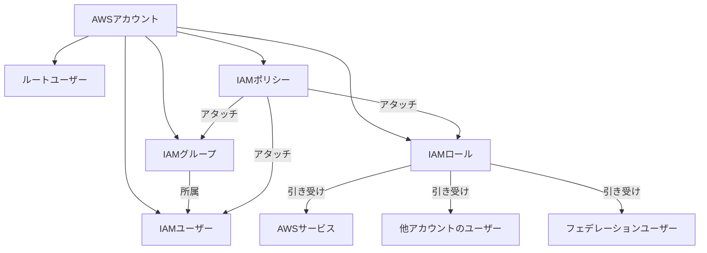
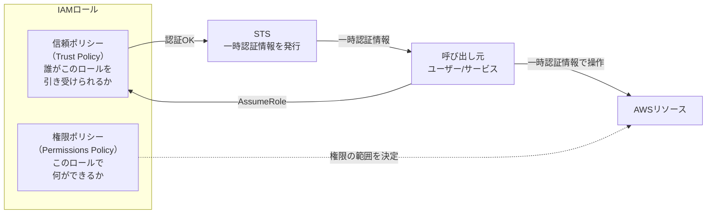
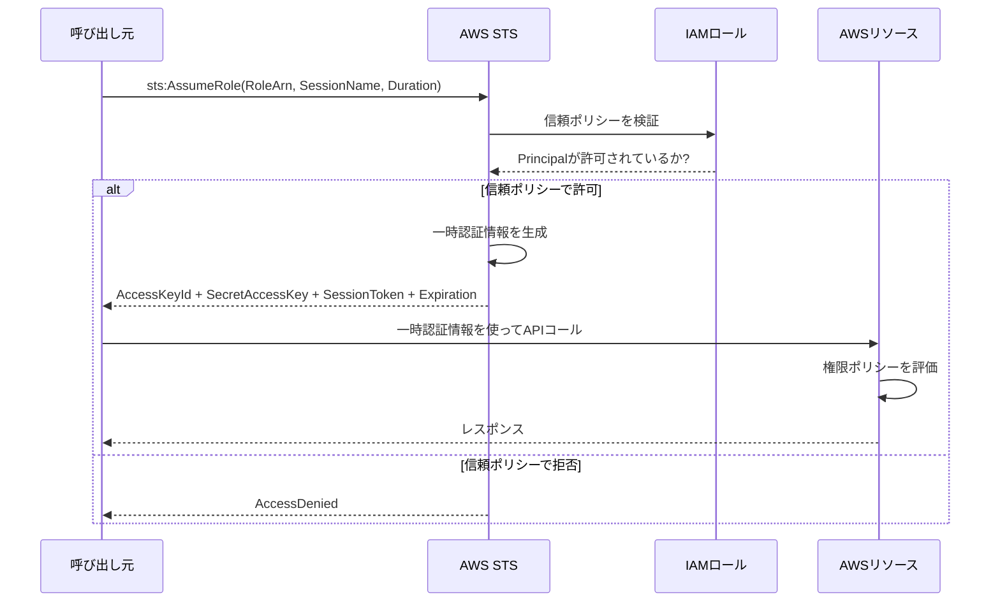
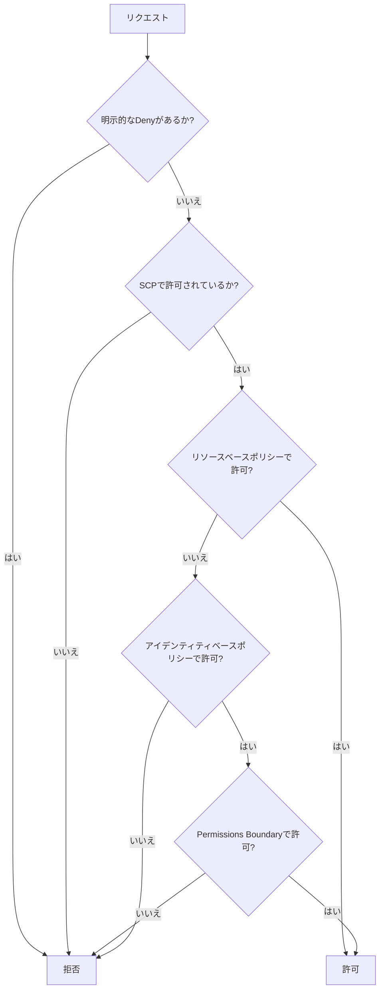
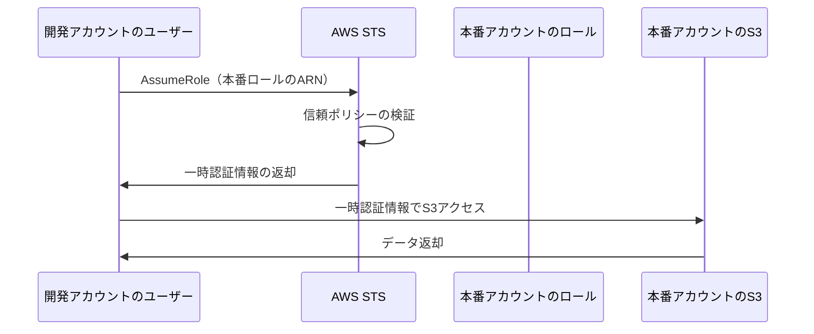
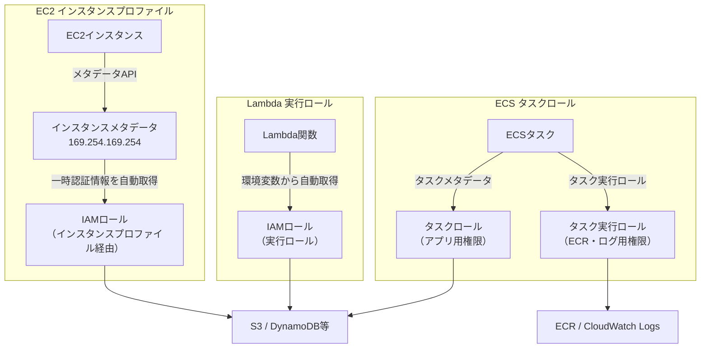
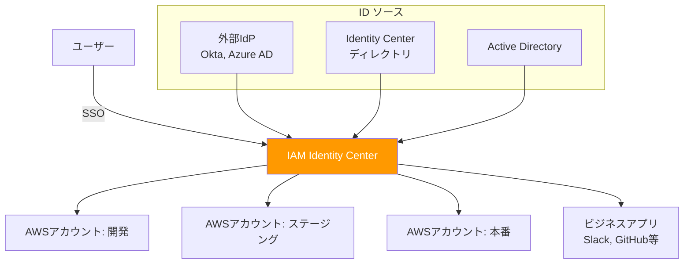
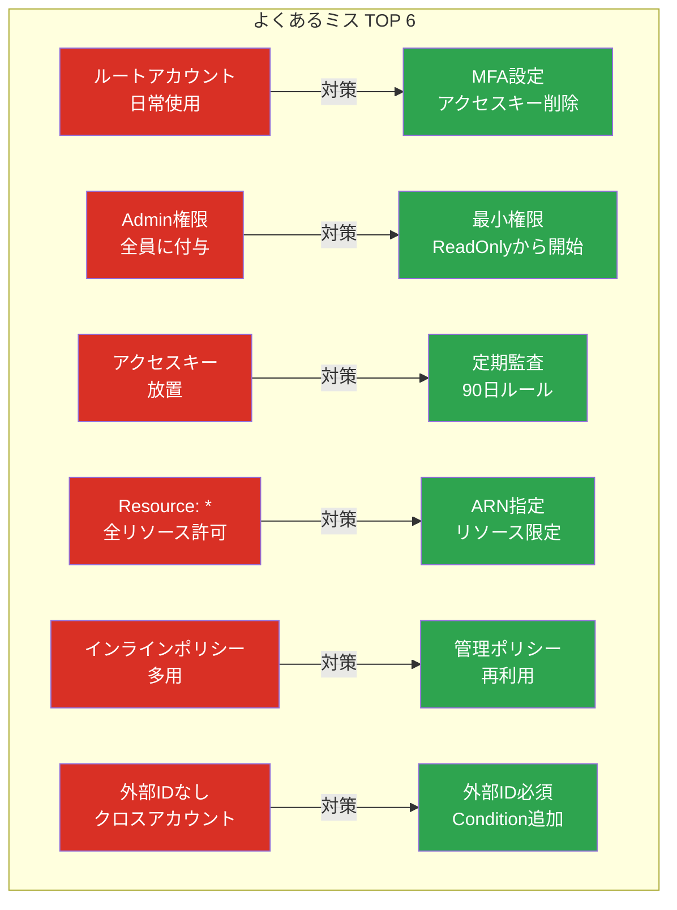

# AWS IAM

## IAMとは

IAM（Identity and Access Management）は、AWSリソースへのアクセスを安全に管理するためのサービス。「誰が」「何に」「何をできるか」を制御する、AWSセキュリティの根幹を担うサービス。

IAMは無料で利用できる。IAM自体に料金は発生せず、IAMで制御されたAWSリソースの利用に対してのみ課金される。

### なぜIAMが重要か

| リスク | 対策 |
| --- | --- |
| 不正アクセス | 認証（Authentication）で身元確認 |
| 過剰な権限 | 認可（Authorization）で最小権限を付与 |
| 認証情報の漏洩 | 一時認証情報（STS）の活用 |
| 操作の追跡不能 | CloudTrailとの連携で全操作を記録 |
| 複数アカウントの管理困難 | クロスアカウントロールで統合管理 |

---

## IAMの基本構成要素

### 全体像



### ルートユーザー

AWSアカウント作成時に生成される、全ての権限を持つユーザー。メールアドレスとパスワードでログインする。

**ルートユーザーのルール:**

- 日常業務では絶対に使わない
- MFA（多要素認証）を必ず有効にする
- アクセスキーを作成しない
- ルートユーザーが必要な操作（アカウント設定変更、請求情報のアクセス設定等）のみで使用

### IAMユーザー

AWSを利用する個人やアプリケーションを表すエンティティ。ユーザー名とパスワード（コンソールアクセス用）、またはアクセスキー（API/CLIアクセス用）で認証する。

| 認証方式 | 用途 | セキュリティ |
| --- | --- | --- |
| パスワード | AWSマネジメントコンソール | MFA必須にする |
| アクセスキー | AWS CLI / SDK | 定期ローテーション、可能なら使用しない |

**推奨事項**: IAMユーザーの代わりにIAM Identity Center（旧AWS SSO）を使い、フェデレーション認証を導入する。長期的な認証情報（パスワードやアクセスキー）の管理が不要になる。

### IAMグループ

IAMユーザーの集合。グループにポリシーをアタッチすると、所属する全ユーザーにそのポリシーが適用される。

```
開発者グループ → 開発者ポリシー
  ├── ユーザーA
  ├── ユーザーB
  └── ユーザーC

管理者グループ → 管理者ポリシー
  ├── ユーザーD
  └── ユーザーE
```

- ユーザーは複数のグループに所属可能
- グループのネスト（グループの中にグループ）は不可
- ユーザーに直接ポリシーをアタッチするのではなく、グループを経由するのがベストプラクティス

### IAMロール

AWSサービスや他のAWSアカウント、フェデレーションユーザーが一時的に引き受ける（Assume）ことで権限を取得するエンティティ。ロール自体は認証情報を持たない。

| ロールの種類 | 説明 | 例 |
| --- | --- | --- |
| AWSサービスロール | AWSサービスが引き受ける | EC2がS3にアクセス、LambdaがDynamoDBにアクセス |
| クロスアカウントロール | 他のAWSアカウントが引き受ける | 本番アカウントのS3を開発アカウントから参照 |
| フェデレーションロール | 外部IdP認証ユーザーが引き受ける | SAML/OIDC連携 |
| サービスリンクドロール | AWSサービスに紐づく自動作成ロール | Auto Scaling、ELBなど |

**ロールを使うべき場面:**

- EC2上のアプリからAWSサービスにアクセスする場合（アクセスキーを使わない）
- Lambda関数からDynamoDBにアクセスする場合
- 別アカウントのリソースにアクセスする場合

### IAMロールの深掘り: AssumeRoleと信頼ポリシー

IAMロールには2つのポリシーがアタッチされる。この2つの役割を正確に理解することが、IAMロールを使いこなす鍵。



**信頼ポリシー（Trust Policy）**: 「誰が」このロールを引き受けられるかを定義するリソースベースポリシー。`Principal`要素で引き受け元を指定する。

```json
{
  "Version": "2012-10-17",
  "Statement": [
    {
      "Effect": "Allow",
      "Principal": {
        "Service": "lambda.amazonaws.com"
      },
      "Action": "sts:AssumeRole"
    }
  ]
}
```

**Principalの種類:**

| Principal | 記法 | 用途 |
| --- | --- | --- |
| AWSサービス | `"Service": "lambda.amazonaws.com"` | サービスロール |
| AWSアカウント | `"AWS": "arn:aws:iam::111111111111:root"` | クロスアカウント |
| 特定IAMユーザー | `"AWS": "arn:aws:iam::111111111111:user/username"` | 特定ユーザーのみ許可 |
| 特定IAMロール | `"AWS": "arn:aws:iam::111111111111:role/rolename"` | ロールチェイニング |
| フェデレーテッドユーザー | `"Federated": "cognito-identity.amazonaws.com"` | SAML/OIDC連携 |

**権限ポリシー（Permissions Policy）**: ロールを引き受けた後に「何ができるか」を定義する。通常のアイデンティティベースポリシーと同じ構造。

### AssumeRoleの流れ（詳細）



**ロールチェイニング**: あるロールを引き受けた後、そのロールからさらに別のロールを引き受けることが可能。ただし、チェイニングされたセッションの最大有効期限は1時間に制限される。

---

## IAMポリシー

### ポリシーの種類

| 種類 | 説明 | 管理主体 |
| --- | --- | --- |
| AWS管理ポリシー | AWSが事前定義したポリシー | AWS |
| カスタマー管理ポリシー | ユーザーが自分で作成したポリシー | ユーザー |
| インラインポリシー | ユーザー/グループ/ロールに直接埋め込むポリシー | ユーザー |

**推奨**: カスタマー管理ポリシーを使用する。再利用性が高く、変更管理がしやすい。インラインポリシーは特殊なケースを除き使用しない。

### 管理ポリシー vs インラインポリシー（詳細比較）

| 比較項目 | AWS管理ポリシー | カスタマー管理ポリシー | インラインポリシー |
| --- | --- | --- | --- |
| 作成者 | AWS | ユーザー | ユーザー |
| 再利用性 | 複数エンティティにアタッチ可 | 複数エンティティにアタッチ可 | 1つのエンティティに直接埋め込み |
| バージョン管理 | AWSが更新（最大5バージョン） | ユーザーが更新（最大5バージョン） | バージョン管理なし |
| 一覧表示 | 管理画面で一覧可能 | 管理画面で一覧可能 | 各エンティティを個別に確認 |
| 削除 | 不可 | エンティティからデタッチ後に削除 | エンティティ削除時に自動削除 |
| 上限 | - | アカウントあたり1,500個 | ユーザー/ロールあたり合計サイズ制限 |
| ユースケース | 標準的な権限セット | 組織固有の権限セット | 特定エンティティ専用の例外的権限 |

**インラインポリシーを使う正当な場面:**

- ポリシーとエンティティを厳密に1対1で紐づけたい場合（エンティティ削除時にポリシーも確実に削除される）
- Permissions Boundaryと組み合わせて、特定のロールだけに適用する例外的な制限を設ける場合

**カスタマー管理ポリシーのバージョン管理:**

```
ポリシー: MyAppS3Policy
├── v1 (作成時): s3:GetObject のみ
├── v2: s3:GetObject + s3:PutObject 追加
├── v3: s3:DeleteObject 追加
├── v4: Condition追加（IP制限）
└── v5 (現行): Resource を特定バケットに限定  ← デフォルトバージョン
```

最大5バージョンまで保持可能。ロールバックが必要な場合は過去のバージョンをデフォルトに変更するだけで済む。

### アイデンティティベースポリシー vs リソースベースポリシー

| | アイデンティティベースポリシー | リソースベースポリシー |
| --- | --- | --- |
| アタッチ先 | IAMユーザー/グループ/ロール | AWSリソース（S3、SQS、KMS等） |
| Principal要素 | 不要（アタッチ先が暗黙のPrincipal） | 必須（誰に許可するか） |
| クロスアカウント | 両アカウントでの許可が必要 | リソース側の許可のみで可能な場合がある |
| 例 | IAMポリシー | S3バケットポリシー、SQSキューポリシー |

### ポリシーの構造（JSON）

```json
{
  "Version": "2012-10-17",
  "Statement": [
    {
      "Sid": "AllowS3ReadAccess",
      "Effect": "Allow",
      "Action": [
        "s3:GetObject",
        "s3:ListBucket"
      ],
      "Resource": [
        "arn:aws:s3:::my-bucket",
        "arn:aws:s3:::my-bucket/*"
      ],
      "Condition": {
        "IpAddress": {
          "aws:SourceIp": "203.0.113.0/24"
        }
      }
    }
  ]
}
```

### ポリシー要素の詳細

| 要素 | 必須 | 説明 |
| --- | --- | --- |
| Version | はい | ポリシー言語のバージョン（`"2012-10-17"`を使用） |
| Statement | はい | 1つ以上のステートメントの配列 |
| Sid | いいえ | ステートメントの識別子（任意の文字列） |
| Effect | はい | `Allow`または`Deny` |
| Action | はい | 許可/拒否するアクション（`s3:GetObject`等） |
| Resource | はい | 対象リソースのARN |
| Condition | いいえ | 条件（IPアドレス、時間帯、MFA有無等） |
| Principal | 場合による | リソースベースポリシーで必須。対象のエンティティ |

### ポリシーの評価ロジック



**重要な原則:**

1. デフォルトは全て拒否（暗黙的Deny）
2. 明示的なAllowがあれば許可
3. 明示的なDenyは全てに優先する（Allow + Deny → Deny）

### 条件（Condition）の活用

```json
{
  "Condition": {
    "StringEquals": {
      "aws:RequestedRegion": "ap-northeast-1"
    },
    "Bool": {
      "aws:MultiFactorAuthPresent": "true"
    },
    "DateGreaterThan": {
      "aws:CurrentTime": "2026-01-01T00:00:00Z"
    },
    "IpAddress": {
      "aws:SourceIp": ["203.0.113.0/24", "198.51.100.0/24"]
    }
  }
}
```

| 条件キー | 説明 |
| --- | --- |
| aws:SourceIp | リクエスト元のIPアドレス |
| aws:CurrentTime | 現在時刻 |
| aws:MultiFactorAuthPresent | MFA認証済みか |
| aws:RequestedRegion | リクエスト先のリージョン |
| aws:PrincipalTag/xxx | プリンシパルのタグ値 |
| aws:ResourceTag/xxx | リソースのタグ値 |

---

## 最小権限の原則

### 原則

「必要な権限だけを、必要なリソースに、必要な期間だけ付与する。」

これはIAMの最も重要な原則であり、セキュリティインシデントの被害を最小限に抑えるための基本。

### 実践方法

| ステップ | 説明 | ツール |
| --- | --- | --- |
| 1. 広い権限で開始 | 開発初期は動作確認のために広めの権限を付与 | AWS管理ポリシー |
| 2. アクセス分析 | 実際に使用された権限を分析 | IAM Access Analyzer |
| 3. 権限の絞り込み | 未使用の権限を削除 | 最終アクセス情報 |
| 4. 継続的な監視 | 定期的に権限を見直す | Access Analyzer + CloudTrail |

### IAM Access Analyzer

IAM Access Analyzerは、外部エンティティと共有されているリソースを検出し、ポリシーの検証を行うツール。

主な機能:

- **外部アクセス分析**: S3バケット、IAMロール、KMSキーなどが外部と共有されていないか検出
- **未使用アクセス分析**: 未使用のロール、アクセスキー、パスワード、権限を検出
- **ポリシー生成**: CloudTrailのアクティビティログから最小権限のポリシーを自動生成
- **ポリシー検証**: ポリシーのベストプラクティス違反をチェック

### 悪い例と良い例

**悪い例（過剰な権限）:**

```json
{
  "Effect": "Allow",
  "Action": "s3:*",
  "Resource": "*"
}
```

**良い例（最小権限）:**

```json
{
  "Effect": "Allow",
  "Action": [
    "s3:GetObject",
    "s3:PutObject"
  ],
  "Resource": "arn:aws:s3:::my-app-uploads/*"
}
```

---

## AWS STS（Security Token Service）

STSは、一時的な認証情報を発行するサービス。IAMロールを引き受ける（AssumeRole）際に使用される。

### 一時認証情報のメリット

| 項目 | 長期認証情報（アクセスキー） | 一時認証情報（STS） |
| --- | --- | --- |
| 有効期限 | 手動で削除するまで有効 | 自動的に失効（15分〜12時間） |
| ローテーション | 手動で行う必要がある | 自動的に更新 |
| 漏洩リスク | 高い（永久に使える） | 低い（有効期限切れで無効化） |
| 管理コスト | ローテーション運用が必要 | ほぼ不要 |

### STSの主要APIアクション

| アクション | 説明 | ユースケース |
| --- | --- | --- |
| **AssumeRole** | IAMロールを引き受けて一時認証情報を取得 | クロスアカウント、サービスロール |
| **AssumeRoleWithSAML** | SAML認証後にロールを引き受ける | エンタープライズSSO |
| **AssumeRoleWithWebIdentity** | OIDC認証後にロールを引き受ける | GitHub Actions、モバイルアプリ |
| **GetSessionToken** | 現在のIAMユーザーの一時認証情報を取得 | MFA認証の強制 |
| **GetCallerIdentity** | 現在の呼び出し元の情報を取得 | デバッグ、アカウントID確認 |

### AssumeRole

```javascript
import { STSClient, AssumeRoleCommand } from '@aws-sdk/client-sts';

const stsClient = new STSClient({ region: 'ap-northeast-1' });

const response = await stsClient.send(
  new AssumeRoleCommand({
    RoleArn: 'arn:aws:iam::987654321098:role/CrossAccountRole',
    RoleSessionName: 'my-session',
    DurationSeconds: 3600,
  })
);

// 取得した一時認証情報を使って他のAWSサービスにアクセス
const { AccessKeyId, SecretAccessKey, SessionToken } = response.Credentials;
```

### GetSessionToken（MFA認証付き一時認証情報の取得）

IAMユーザーが自身のMFAデバイスで認証し、一時認証情報を取得するために使用する。MFA必須のポリシーと組み合わせることで、重要な操作にMFAを強制できる。

```bash
# AWS CLIでMFA付き一時認証情報を取得
aws sts get-session-token \
  --serial-number arn:aws:iam::123456789012:mfa/my-mfa-device \
  --token-code 123456 \
  --duration-seconds 3600
```

**AssumeRole vs GetSessionToken:**

| | AssumeRole | GetSessionToken |
| --- | --- | --- |
| 目的 | 別のロールの権限を取得 | 自分自身の一時認証情報を取得 |
| MFA | Conditionで要求可能 | MFAトークンコードを直接渡す |
| 権限 | ロールの権限ポリシーに従う | 元のIAMユーザーの権限を継承 |
| 有効期限 | 15分〜12時間（デフォルト1時間） | 15分〜36時間（デフォルト12時間） |
| 主な用途 | クロスアカウント、権限の切り替え | MFA強制、一時認証情報への切り替え |

### フェデレーション

外部のIDプロバイダー（IdP）で認証されたユーザーに、AWSの一時認証情報を付与する仕組み。

| 方式 | 説明 | ユースケース |
| --- | --- | --- |
| SAML 2.0 | エンタープライズIdP連携 | Active Directory、Okta |
| OIDC | OpenID Connect連携 | Google、GitHub Actions |
| IAM Identity Center | AWS統合SSO | 組織内の全AWSアカウントへのSSO |

### GitHub Actions での OIDC連携例

```yaml
# .github/workflows/deploy.yml
permissions:
  id-token: write
  contents: read

jobs:
  deploy:
    runs-on: ubuntu-latest
    steps:
      - uses: aws-actions/configure-aws-credentials@v4
        with:
          role-to-assume: arn:aws:iam::123456789012:role/GitHubActionsRole
          aws-region: ap-northeast-1

      - run: aws s3 sync ./dist s3://my-bucket/
```

---

## クロスアカウントアクセス

複数のAWSアカウント間でリソースにアクセスする仕組み。

### クロスアカウントロールの設定



### 本番アカウント側の信頼ポリシー

```json
{
  "Version": "2012-10-17",
  "Statement": [
    {
      "Effect": "Allow",
      "Principal": {
        "AWS": "arn:aws:iam::111111111111:root"
      },
      "Action": "sts:AssumeRole",
      "Condition": {
        "Bool": {
          "aws:MultiFactorAuthPresent": "true"
        },
        "StringEquals": {
          "sts:ExternalId": "unique-external-id"
        }
      }
    }
  ]
}
```

### 開発アカウント側のポリシー

```json
{
  "Version": "2012-10-17",
  "Statement": [
    {
      "Effect": "Allow",
      "Action": "sts:AssumeRole",
      "Resource": "arn:aws:iam::999999999999:role/ProductionReadOnlyRole"
    }
  ]
}
```

---

## サービスロール

AWSサービスがユーザーに代わって他のAWSサービスにアクセスするためのロール。

### 主なサービスロール

| サービス | ロールの用途 | 信頼ポリシーのPrincipal |
| --- | --- | --- |
| EC2 | S3やDynamoDBへのアクセス | `ec2.amazonaws.com` |
| Lambda | DynamoDB、S3、SQSへのアクセス | `lambda.amazonaws.com` |
| ECS | ECRからのイメージ取得 | `ecs-tasks.amazonaws.com` |
| Step Functions | Lambda呼び出し | `states.amazonaws.com` |
| CloudFormation | スタック内リソースの作成 | `cloudformation.amazonaws.com` |

### Lambda/EC2/ECSからのロール利用パターン

各サービスがロールを利用する仕組みは微妙に異なる。以下に実務でよく使うパターンをまとめる。



#### EC2: インスタンスプロファイル

EC2インスタンスにIAMロールを割り当てるには「インスタンスプロファイル」を使用する。EC2上のアプリケーションはインスタンスメタデータサービス（IMDS）から自動的に一時認証情報を取得する。

```json
// 信頼ポリシー
{
  "Version": "2012-10-17",
  "Statement": [
    {
      "Effect": "Allow",
      "Principal": { "Service": "ec2.amazonaws.com" },
      "Action": "sts:AssumeRole"
    }
  ]
}
```

**重要**: EC2上にアクセスキーをハードコードしてはならない。必ずインスタンスプロファイル経由でロールを使用する。IMDSv2（トークン必須）を有効にしてセキュリティを強化する。

#### Lambda: 実行ロール

Lambda関数には必ず1つの実行ロールが必要。関数実行時にAWSが自動的にAssumeRoleを行い、一時認証情報を環境変数にセットする。

```json
// 信頼ポリシー
{
  "Version": "2012-10-17",
  "Statement": [
    {
      "Effect": "Allow",
      "Principal": { "Service": "lambda.amazonaws.com" },
      "Action": "sts:AssumeRole"
    }
  ]
}
```

**権限ポリシー（例: DynamoDB + CloudWatch Logs）:**

```json
{
  "Version": "2012-10-17",
  "Statement": [
    {
      "Effect": "Allow",
      "Action": [
        "dynamodb:GetItem",
        "dynamodb:PutItem",
        "dynamodb:Query"
      ],
      "Resource": "arn:aws:dynamodb:ap-northeast-1:123456789:table/Orders"
    },
    {
      "Effect": "Allow",
      "Action": [
        "logs:CreateLogGroup",
        "logs:CreateLogStream",
        "logs:PutLogEvents"
      ],
      "Resource": "arn:aws:logs:ap-northeast-1:123456789:*"
    }
  ]
}
```

#### ECS: タスクロールとタスク実行ロール

ECSでは2種類のロールを区別する必要がある。これはよく混同されるポイント。

| ロール | Principal | 用途 | 例 |
| --- | --- | --- | --- |
| **タスクロール** | `ecs-tasks.amazonaws.com` | コンテナ内のアプリが使う権限 | S3読み書き、DynamoDBアクセス |
| **タスク実行ロール** | `ecs-tasks.amazonaws.com` | ECSエージェントが使う権限 | ECRからのイメージ取得、Secrets Managerからの秘密取得、CloudWatch Logsへのログ送信 |

```json
// タスク実行ロールの権限ポリシー（典型例）
{
  "Version": "2012-10-17",
  "Statement": [
    {
      "Effect": "Allow",
      "Action": [
        "ecr:GetAuthorizationToken",
        "ecr:BatchCheckLayerAvailability",
        "ecr:GetDownloadUrlForLayer",
        "ecr:BatchGetImage"
      ],
      "Resource": "*"
    },
    {
      "Effect": "Allow",
      "Action": [
        "logs:CreateLogStream",
        "logs:PutLogEvents"
      ],
      "Resource": "arn:aws:logs:ap-northeast-1:123456789:log-group:/ecs/my-app:*"
    },
    {
      "Effect": "Allow",
      "Action": [
        "secretsmanager:GetSecretValue"
      ],
      "Resource": "arn:aws:secretsmanager:ap-northeast-1:123456789:secret:my-app/*"
    }
  ]
}
```

---

## Permissions Boundary

Permissions Boundary（権限の境界）は、IAMユーザーやロールに設定できる権限の上限。管理者が「この範囲内で自由にポリシーを作成してよい」という枠組みを定義できる。

### 仕組み

```
有効な権限 = アイデンティティベースポリシー ∩ Permissions Boundary
```

両方で許可されている場合のみアクセスが許可される。

### ユースケース

開発者にIAMロールの作成を許可しつつ、権限エスカレーション（自分より強い権限のロールを作成すること）を防ぐ。

```json
{
  "Version": "2012-10-17",
  "Statement": [
    {
      "Effect": "Allow",
      "Action": [
        "s3:*",
        "dynamodb:*",
        "lambda:*",
        "logs:*",
        "sqs:*",
        "sns:*"
      ],
      "Resource": "*"
    },
    {
      "Effect": "Deny",
      "Action": [
        "iam:*",
        "organizations:*",
        "account:*"
      ],
      "Resource": "*"
    }
  ]
}
```

---

## AWS Organizations と SCP

### SCP（Service Control Policy）

AWS Organizationsのメンバーアカウントに適用する権限の上限。Permissions Boundaryがユーザー/ロール単位なのに対し、SCPはアカウント単位。

```json
{
  "Version": "2012-10-17",
  "Statement": [
    {
      "Sid": "DenyNonTokyoRegion",
      "Effect": "Deny",
      "Action": "*",
      "Resource": "*",
      "Condition": {
        "StringNotEquals": {
          "aws:RequestedRegion": ["ap-northeast-1", "us-east-1"]
        }
      }
    }
  ]
}
```

この例では、東京リージョンとバージニア北部（グローバルサービス用）以外のリージョンでの操作を全て拒否する。

---

## 実務でのIAMベストプラクティス一覧

### 認証

| # | プラクティス | 重要度 | 説明 |
| --- | --- | --- | --- |
| 1 | ルートユーザーにMFA設定 | 必須 | ルートアカウントのMFAは最初にやるべき設定 |
| 2 | ルートユーザーを日常業務で使わない | 必須 | アクセスキーも作成しない |
| 3 | IAMユーザーにMFAを強制 | 必須 | ポリシーでMFA未設定ユーザーの操作を拒否 |
| 4 | IAM Identity Center導入 | 強く推奨 | 人間のユーザーはSSO経由にする |
| 5 | 長期アクセスキーを廃止 | 強く推奨 | ロールベースに移行し、やむを得ない場合のみ定期ローテーション |
| 6 | パスワードポリシー強化 | 推奨 | 最小14文字、複雑性要件、90日ローテーション |

### 認可

| # | プラクティス | 重要度 | 説明 |
| --- | --- | --- | --- |
| 1 | 最小権限の原則 | 必須 | 必要な権限だけを必要なリソースに付与 |
| 2 | IAM Access Analyzer活用 | 強く推奨 | ポリシーの検証・未使用権限の検出・ポリシー自動生成 |
| 3 | グループ/ロール経由でポリシー付与 | 必須 | ユーザーへの直接アタッチを避ける |
| 4 | Permissions Boundary設定 | 推奨 | 開発者によるロール作成時の権限エスカレーション防止 |
| 5 | 条件キーの活用 | 推奨 | IP制限、MFA要求、リージョン制限、タグベースアクセス制御 |
| 6 | Resource ARNの具体的指定 | 必須 | `"Resource": "*"` の使用を最小限にする |
| 7 | カスタマー管理ポリシーの使用 | 推奨 | インラインポリシーではなく再利用可能な管理ポリシーを作成 |

### 監査・運用

| # | プラクティス | 重要度 | 説明 |
| --- | --- | --- | --- |
| 1 | CloudTrail有効化 | 必須 | 全API呼び出しを記録し、全リージョンで有効にする |
| 2 | 最終アクセス情報の定期確認 | 強く推奨 | 未使用の権限を特定し削除する |
| 3 | 未使用リソースの削除 | 強く推奨 | 90日以上未使用のユーザー、ロール、アクセスキーを無効化・削除 |
| 4 | Access Analyzerの定期レポート | 推奨 | 外部アクセスの検出、ポリシーのベストプラクティス違反チェック |
| 5 | AWS Configルール | 推奨 | IAMポリシーのコンプライアンスを自動監視 |
| 6 | IAMクレデンシャルレポート | 推奨 | 全IAMユーザーの認証情報ステータスを定期的にダウンロード・確認 |

### マルチアカウント

| # | プラクティス | 重要度 | 説明 |
| --- | --- | --- | --- |
| 1 | AWS Organizations導入 | 必須 | 組織構造（OU）で論理的にアカウントを管理 |
| 2 | SCPで権限上限を設定 | 強く推奨 | アカウントレベルでリージョン制限やサービス制限を適用 |
| 3 | ロールベースのクロスアカウントアクセス | 必須 | アクセスキーの共有は絶対に避ける |
| 4 | 外部IDの使用 | 推奨 | サードパーティへの委任時に混乱した代理問題を防ぐ |
| 5 | 専用セキュリティアカウント | 推奨 | CloudTrailログ、Config、GuardDutyを集約 |

---

## MFA（多要素認証）

### MFAとは

MFA（Multi-Factor Authentication）は、パスワードに加えて追加の認証要素を求める仕組みである。IAMユーザーやルートアカウントに対して設定でき、不正アクセスのリスクを大幅に低減する。

### MFAの種類

| 種類 | デバイス | 特徴 |
|:---|:---|:---|
| **仮想MFA** | スマートフォンアプリ（Google Authenticator, Authy等） | 無料、最も一般的 |
| **FIDO2セキュリティキー** | YubiKey等のハードウェアキー | フィッシング耐性が高い |
| **ハードウェアMFA** | AWS提供の物理トークン | オフライン環境でも使用可能 |

### MFAの強制

IAMポリシーで「MFAを有効にしていないユーザーの操作を拒否」するパターンが一般的。

```json
{
  "Sid": "DenyAllExceptMFAManagement",
  "Effect": "Deny",
  "NotAction": [
    "iam:CreateVirtualMFADevice",
    "iam:EnableMFADevice",
    "iam:GetUser",
    "iam:ListMFADevices",
    "sts:GetSessionToken"
  ],
  "Resource": "*",
  "Condition": {
    "BoolIfExists": {
      "aws:MultiFactorAuthPresent": "false"
    }
  }
}
```

**ベストプラクティス**: ルートアカウントには必ずMFAを設定する。IAMユーザーにもMFAを必須とするポリシーを適用する。

---

## IAM Identity Center（旧AWS SSO）

### IAM Identity Centerとは

IAM Identity Center（旧AWS Single Sign-On）は、複数のAWSアカウントやビジネスアプリケーションへのシングルサインオンを提供するサービス。AWS Organizationsと統合して、組織全体のアクセス管理を一元化する。



### IAMユーザー vs IAM Identity Center

| | IAMユーザー | IAM Identity Center |
|:---|:---|:---|
| アクセスキー | 長期的（ローテーション必要） | 一時的（自動ローテーション） |
| マルチアカウント | アカウントごとにユーザー作成 | 一元管理 |
| SSO | なし | あり |
| 推奨用途 | 自動化・CI/CD（サービスアカウント） | 人間のユーザー |

**現在のベストプラクティス**: 人間のユーザーにはIAM Identity Centerを使い、IAMユーザーの作成は最小限にする。

---

## よくあるIAMのミスと対策

### 1. ルートアカウントの日常使用

**ミス**: ルートアカウントで日常の開発作業を行う。

**対策**: ルートアカウントにはMFAを設定し、アクセスキーを作成しない。日常業務はIAMユーザーまたはIAM Identity Center経由で行う。

### 2. AdministratorAccessの乱用

**ミス**: 全員に`AdministratorAccess`ポリシーを付与する。

**対策**: 最小権限の原則に従い、業務に必要な権限だけを付与する。まずReadOnlyAccessから始め、必要に応じて権限を追加する。

### 3. アクセスキーの放置

**ミス**: 退職者や使われなくなったアクセスキーがアクティブなまま残っている。

**対策**: IAM Access Analyzerで未使用のアクセスキーを定期的に確認する。90日以上未使用のキーは無効化する。

### 4. ポリシーのResource: "*"

**ミス**: すべてのリソースに対して権限を付与する `"Resource": "*"` を安易に使う。

**対策**: 可能な限りリソースARNを具体的に指定する。特にS3バケットやDynamoDBテーブルは名前で限定する。

### 5. インラインポリシーの多用

**ミス**: 管理ポリシーを使わず、各ユーザー/ロールにインラインポリシーを直接記述する。

**対策**: 管理ポリシー（カスタマーマネージド）を作成して再利用する。インラインポリシーは例外的なケースのみ。

### 6. クロスアカウントで外部IDを使わない

**ミス**: サードパーティにロールを委任する際、外部IDなしで信頼ポリシーを設定する。

**対策**: 外部IDを`Condition`に含めることで、混乱した代理（Confused Deputy）問題を防ぐ。



---

## 参考文献

### 公式ドキュメント

- [AWS IAM 公式ドキュメント](https://docs.aws.amazon.com/iam/)
- [IAM ベストプラクティス](https://docs.aws.amazon.com/IAM/latest/UserGuide/best-practices.html)
- [IAM ポリシーリファレンス](https://docs.aws.amazon.com/IAM/latest/UserGuide/reference_policies.html)
- [IAM ポリシー評価ロジック](https://docs.aws.amazon.com/IAM/latest/UserGuide/reference_policies_evaluation-logic.html)
- [AWS STS ドキュメント](https://docs.aws.amazon.com/STS/latest/APIReference/)
- [IAM Access Analyzer](https://docs.aws.amazon.com/IAM/latest/UserGuide/what-is-access-analyzer.html)
- [AWS IAM Identity Center](https://docs.aws.amazon.com/singlesignon/latest/userguide/what-is.html)
- [AWS Organizations SCP](https://docs.aws.amazon.com/organizations/latest/userguide/orgs_manage_policies_scps.html)
- [Permissions Boundary](https://docs.aws.amazon.com/IAM/latest/UserGuide/access_policies_boundaries.html)
- [IAMロールの信頼ポリシー](https://docs.aws.amazon.com/IAM/latest/UserGuide/id_roles_terms-and-concepts.html)
- [EC2 インスタンスプロファイル](https://docs.aws.amazon.com/IAM/latest/UserGuide/id_roles_use_switch-role-ec2.html)
- [ECS タスクロール](https://docs.aws.amazon.com/AmazonECS/latest/developerguide/task-iam-roles.html)
- [Lambda 実行ロール](https://docs.aws.amazon.com/lambda/latest/dg/lambda-intro-execution-role.html)

### AWS公式ブログ・ガイド

- [IAM ポリシータイプの使い分け](https://docs.aws.amazon.com/IAM/latest/UserGuide/access_policies.html)
- [条件キーの一覧（グローバル）](https://docs.aws.amazon.com/IAM/latest/UserGuide/reference_policies_condition-keys.html)
- [混乱した代理問題の防止](https://docs.aws.amazon.com/IAM/latest/UserGuide/confused-deputy.html)
- [MFA を使用した安全なAPIアクセス](https://docs.aws.amazon.com/IAM/latest/UserGuide/id_credentials_mfa_configure-api-require.html)
- [AWS Well-Architected Framework - Security Pillar](https://docs.aws.amazon.com/ja_jp/wellarchitected/latest/security-pillar/welcome.html)
