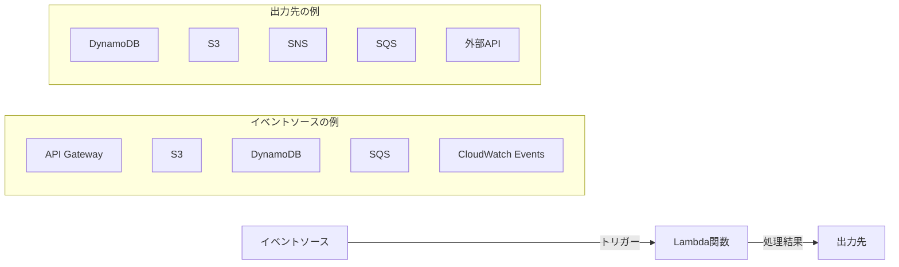
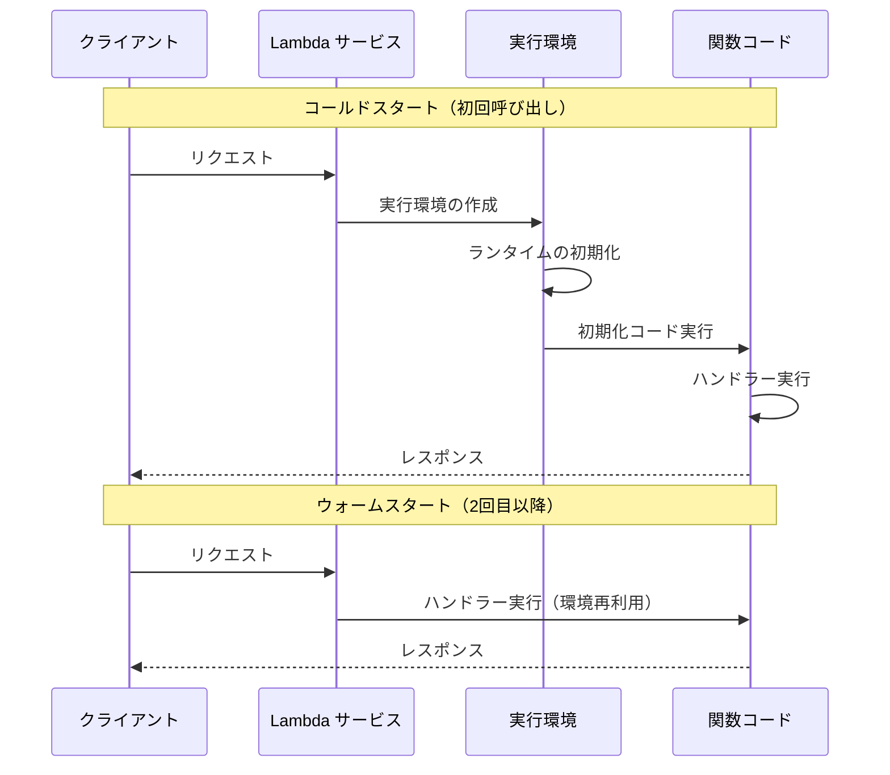
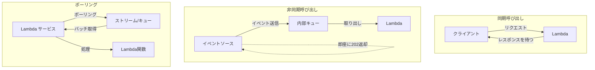
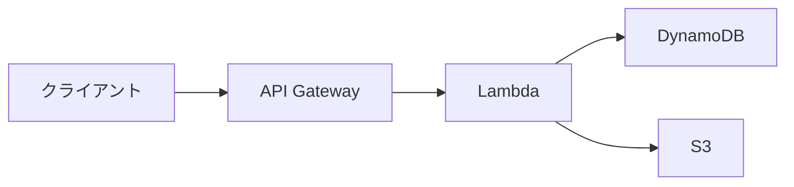
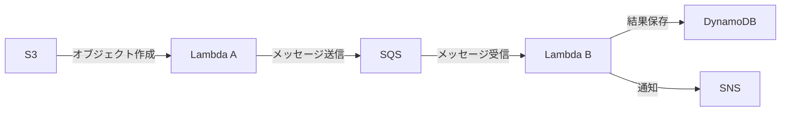

# AWS Lambda

## サーバーレスとは

サーバーレスとは、サーバーの管理をクラウドプロバイダーに完全に任せ、開発者はコードの記述だけに集中できるコンピューティングモデル。サーバーが「ない」わけではなく、サーバーの存在を「意識しなくてよい」という意味。

### 従来のサーバー運用との比較

| 項目 | 従来のサーバー運用（EC2等） | サーバーレス（Lambda等） |
| --- | --- | --- |
| サーバー管理 | OS更新、パッチ適用が必要 | 不要 |
| スケーリング | Auto Scalingの設定が必要 | 自動 |
| 料金 | 起動中は常に課金 | 実行した分だけ課金 |
| 可用性 | 自分で冗長構成を組む | 自動で高可用性 |
| 起動時間 | 数分（インスタンス起動） | ミリ秒〜数秒 |
| 制御の自由度 | 高い（OS・ミドルウェア自由） | 制限あり（ランタイム指定） |

サーバーレスは「小さな処理を大量にこなす」ユースケースに特に向いている。一方、長時間動き続けるバッチ処理や、高い計算リソースを必要とする処理には不向きな場合がある。

---

## AWS Lambdaとは

AWS Lambdaは、AWSが提供するサーバーレスコンピューティングサービス。コードをアップロードするだけで、AWSが実行に必要なインフラ（サーバーの起動、スケーリング、パッチ適用）をすべて管理してくれる。

2014年にリリースされたAWS Lambdaは、サーバーレスコンピューティングの代名詞とも言えるサービスで、イベント駆動型のアーキテクチャを構築する際の中核を担う。

### Lambdaの基本構造



### 対応ランタイム

| ランタイム | サポートバージョン | 用途 |
| --- | --- | --- |
| Node.js | 18.x, 20.x, 22.x | Web API、軽量処理 |
| Python | 3.9〜3.13 | データ処理、ML推論 |
| Java | 11, 17, 21 | エンタープライズアプリ |
| .NET | 6, 8 | Windowsエコシステム |
| Go | provided.al2023 | 高パフォーマンス処理 |
| Ruby | 3.2, 3.3 | Webアプリ |
| カスタムランタイム | provided.al2023 | Rust、C++など任意の言語 |

---

## 実行モデル

### コールドスタートとウォームスタート

Lambda関数の実行は、大きく2つのフェーズに分かれる。



**コールドスタート**は、Lambda関数が初めて呼び出されたとき、または一定時間アイドル状態だった後に再び呼び出されたときに発生する。実行環境の作成、ランタイムの起動、初期化コードの実行が行われるため、レイテンシが増加する。

**ウォームスタート**は、既に作成された実行環境が再利用されるケース。コールドスタートに比べてレイテンシが大幅に短縮される。

### コールドスタートの所要時間の目安

| ランタイム | コールドスタート時間 |
| --- | --- |
| Python | 200〜500ms |
| Node.js | 200〜500ms |
| Go | 100〜300ms |
| Java | 1〜5秒 |
| .NET | 500ms〜2秒 |

### コールドスタートの対策

1. **Provisioned Concurrency**: 事前に指定数の実行環境を暖めておく（追加料金あり）
2. **軽量なランタイムを選ぶ**: Python、Node.js、Goはコールドスタートが速い
3. **デプロイパッケージを小さくする**: 不要な依存関係を排除する
4. **初期化コードを最適化する**: ハンドラー外のコードを最小限にする
5. **SnapStart（Java向け）**: Java関数の初期化スナップショットを事前に取得する

---

## Lambda関数の作成

### 基本的なLambda関数（Node.js）

```javascript
// index.mjs
export const handler = async (event, context) => {
  console.log('Event:', JSON.stringify(event, null, 2));

  // イベントデータの処理
  const name = event.queryStringParameters?.name || 'World';

  const response = {
    statusCode: 200,
    headers: {
      'Content-Type': 'application/json',
    },
    body: JSON.stringify({
      message: `Hello, ${name}!`,
      requestId: context.awsRequestId,
      timestamp: new Date().toISOString(),
    }),
  };

  return response;
};
```

### 基本的なLambda関数（Python）

```python
import json
import logging

logger = logging.getLogger()
logger.setLevel(logging.INFO)

def handler(event, context):
    logger.info(f"Event: {json.dumps(event)}")

    name = event.get('queryStringParameters', {}).get('name', 'World')

    return {
        'statusCode': 200,
        'headers': {
            'Content-Type': 'application/json'
        },
        'body': json.dumps({
            'message': f'Hello, {name}!',
            'requestId': context.aws_request_id
        })
    }
```

### handlerとcontextオブジェクト

`handler`はLambdaが呼び出すエントリーポイント関数。2つの引数を受け取る。

| 引数 | 説明 |
| --- | --- |
| event | トリガー元から渡されるイベントデータ（JSON） |
| context | 実行環境に関するメタ情報（リクエストID、残り実行時間など） |

`context`オブジェクトの主なプロパティ:

| プロパティ | 説明 |
| --- | --- |
| awsRequestId | リクエストの一意識別子 |
| functionName | 関数名 |
| memoryLimitInMB | 割り当てメモリ量 |
| getRemainingTimeInMillis() | 残りの実行可能時間（ミリ秒） |

---

## トリガーとイベントソース

Lambda関数は様々なAWSサービスからのイベントによってトリガーされる。

### 主なトリガー

| トリガー | ユースケース | 呼び出しモデル |
| --- | --- | --- |
| API Gateway | REST/HTTP API | 同期 |
| S3 | ファイルアップロード処理 | 非同期 |
| DynamoDB Streams | データ変更の検知 | ポーリング |
| SQS | メッセージキューの処理 | ポーリング |
| SNS | 通知の処理 | 非同期 |
| CloudWatch Events / EventBridge | 定期実行、イベント駆動 | 非同期 |
| Kinesis Data Streams | リアルタイムデータ処理 | ポーリング |
| Cognito | 認証フロー中のカスタム処理 | 同期 |
| ALB | HTTPロードバランシング | 同期 |

### 呼び出しモデルの違い



- **同期呼び出し**: 呼び出し元がレスポンスを待つ。エラー時のリトライは呼び出し元が行う
- **非同期呼び出し**: イベントを内部キューに入れて即座に返却。Lambdaが最大2回リトライ。DLQ設定可能
- **ポーリング**: Lambdaサービスがストリームやキューをポーリングしてバッチ処理

### API Gatewayとの連携例

```yaml
# SAM テンプレート
AWSTemplateFormatVersion: '2010-09-09'
Transform: AWS::Serverless-2016-10-31

Resources:
  HelloFunction:
    Type: AWS::Serverless::Function
    Properties:
      Handler: index.handler
      Runtime: nodejs20.x
      MemorySize: 256
      Timeout: 30
      Events:
        HelloApi:
          Type: Api
          Properties:
            Path: /hello
            Method: get
```

---

## 環境変数とシークレット管理

### 環境変数の利用

Lambda関数では環境変数を使って設定値を外出しできる。

```javascript
// 環境変数の参照
const tableName = process.env.TABLE_NAME;
const region = process.env.AWS_REGION;
const stage = process.env.STAGE;
```

### シークレットの管理

機密情報は環境変数に直接入れるのではなく、以下のサービスと組み合わせる。

| サービス | 用途 | 料金 |
| --- | --- | --- |
| AWS Systems Manager Parameter Store | 設定値、シークレット | 無料（Standardパラメータ） |
| AWS Secrets Manager | DB認証情報、APIキー | $0.40/シークレット/月 |
| AWS KMS | 暗号化キー管理 | $1/キー/月 |

```python
import boto3
import json

def get_secret(secret_name):
    client = boto3.client('secretsmanager')
    response = client.get_secret_value(SecretId=secret_name)
    return json.loads(response['SecretString'])

# ハンドラー外で初期化（ウォームスタート時に再利用）
db_credentials = get_secret('prod/db/credentials')

def handler(event, context):
    # db_credentialsを使用してDB接続
    pass
```

---

## Lambdaレイヤー

Lambdaレイヤーは、複数のLambda関数で共有したいライブラリやコードをパッケージ化する仕組み。

### レイヤーの構造

```
layer.zip
└── nodejs/          # Node.jsの場合
    └── node_modules/
        └── axios/
        └── lodash/

layer.zip
└── python/          # Pythonの場合
    └── lib/
        └── python3.12/
            └── site-packages/
                └── requests/
```

### レイヤーのメリット

- デプロイパッケージのサイズを削減
- 共通ライブラリの一元管理
- 関数間で依存関係を共有
- 最大5つまでのレイヤーを1つの関数にアタッチ可能

---

## 料金体系

Lambdaの料金は「リクエスト数」と「実行時間」の2つで決まる。

### 料金の計算式

```
月額料金 = リクエスト料金 + 実行時間料金

リクエスト料金 = リクエスト数 × $0.20 / 100万リクエスト
実行時間料金 = (メモリ割当 × 実行時間) × $0.0000166667 / GB秒
```

### 無料枠（毎月）

| 項目 | 無料枠 |
| --- | --- |
| リクエスト数 | 100万リクエスト |
| 実行時間 | 40万GB秒 |

### 料金例

| シナリオ | リクエスト数/月 | メモリ | 平均実行時間 | 月額料金（概算） |
| --- | --- | --- | --- | --- |
| 小規模API | 100万 | 256MB | 200ms | 約$1.00 |
| 中規模API | 1,000万 | 512MB | 500ms | 約$45 |
| 大規模バッチ | 5,000万 | 1024MB | 1秒 | 約$840 |

EC2（t3.small: 約$20/月・24時間稼働）と比較すると、リクエスト数が少ない場合はLambdaが圧倒的に安い。逆に常時高負荷な場合はEC2のほうが安くなるケースがある。

---

## ユースケース

### 適しているユースケース

| ユースケース | 説明 |
| --- | --- |
| REST API | API Gatewayと組み合わせたWebバックエンド |
| ファイル処理 | S3アップロード時のサムネイル生成、CSV変換 |
| データ変換 | ETLパイプラインの一部 |
| 定期実行タスク | CloudWatch Eventsによるcron的な定期処理 |
| Webhook処理 | 外部サービスからの通知を受けて処理 |
| IoTバックエンド | デバイスからのデータ受信・処理 |
| チャットボット | メッセージの受信と応答 |

### 適していないユースケース

| ユースケース | 理由 | 代替サービス |
| --- | --- | --- |
| 長時間バッチ処理 | 15分のタイムアウト制限 | ECS/Fargate, Step Functions |
| WebSocket常時接続 | 常時起動が必要 | EC2, ECS, AppRunner |
| 高性能コンピューティング | メモリ・CPU制限 | EC2, ECS |
| ステートフル処理 | 実行環境が共有されない | EC2, ECS |

---

## 設計パターン

### パターン1: APIバックエンド



最も一般的なパターン。API GatewayがHTTPリクエストを受け、Lambdaがビジネスロジックを処理し、DynamoDBやS3にデータを保存する。

### パターン2: イベント駆動処理



S3へのファイルアップロードをトリガーにして、キューを経由して段階的に処理するパターン。各Lambdaの責務が明確で、エラー時の再処理もしやすい。

### パターン3: ファンアウトパターン

```
SNSトピック → Lambda A（メール送信）
           → Lambda B（Slack通知）
           → Lambda C（ログ記録）
```

1つのイベントを複数のLambda関数に同時に配信する。SNSトピックを使えば、新しい処理の追加が容易。

### パターン4: ストリーム処理

```
DynamoDB Streams → Lambda → Elasticsearch（検索インデックス更新）
                         → S3（変更ログ保存）
```

DynamoDBのデータ変更をリアルタイムに検知して、検索インデックスの更新やログの保存を行う。

---

## Lambda関数のテスト

### ローカルテスト

```bash
# SAM CLIを使ったローカル実行
sam local invoke HelloFunction --event event.json

# ローカルAPIの起動
sam local start-api
```

### テストイベントの例

```json
{
  "resource": "/hello",
  "path": "/hello",
  "httpMethod": "GET",
  "queryStringParameters": {
    "name": "Lambda"
  },
  "headers": {
    "Content-Type": "application/json"
  }
}
```

### ユニットテスト（Node.js）

```javascript
import { handler } from './index.mjs';

describe('Lambda Handler', () => {
  test('returns greeting with name', async () => {
    const event = {
      queryStringParameters: { name: 'Test' },
    };
    const context = { awsRequestId: 'test-id' };

    const result = await handler(event, context);

    expect(result.statusCode).toBe(200);
    const body = JSON.parse(result.body);
    expect(body.message).toBe('Hello, Test!');
  });
});
```

---

## 制限事項

### 主な制限

| 項目 | 制限値 |
| --- | --- |
| 最大実行時間 | 15分（900秒） |
| メモリ割り当て | 128MB〜10,240MB |
| デプロイパッケージ（zip） | 50MB（直接アップロード） |
| デプロイパッケージ（展開後） | 250MB |
| コンテナイメージ | 10GB |
| 環境変数 | 4KB（合計） |
| 同時実行数（デフォルト） | 1,000（リージョン単位） |
| /tmp ディスク容量 | 512MB〜10,240MB |
| レイヤー数 | 最大5つ |

### 制限の対策

- **15分の実行制限**: Step Functionsで複数のLambdaを連携させる
- **同時実行数の制限**: Reserved Concurrencyで重要な関数を保護、Service Quotasで上限緩和を申請
- **デプロイサイズの制限**: Lambdaコンテナイメージ（最大10GB）を使用する
- **/tmpの制限**: 大きなファイルはS3にストリーミング処理する

---

## ベストプラクティス

### パフォーマンス

- 関数のメモリを増やすとCPUも比例して増加する（メモリ増 = CPU増）
- 初期化コード（ハンドラー外）でDB接続やSDKクライアントを作成し、ウォームスタート時に再利用する
- 不要な依存関係を削除してデプロイパッケージを軽量に保つ
- ARM64（Graviton2）を選択すると料金が20%安くなり、性能も向上する場合がある

### セキュリティ

- IAMロールには最小権限の原則を適用する
- 環境変数に機密情報を直接保存せず、Secrets ManagerやParameter Storeを使用する
- VPC内のリソースにアクセスする場合はVPC Lambdaを設定する（コールドスタートに注意）
- 関数URLを使う場合はIAM認証またはCORS設定を適切に行う

### 運用

- CloudWatch Logsで構造化ログを出力する
- X-Rayでトレーシングを有効化する
- Dead Letter Queue（DLQ）を設定して失敗したイベントを捕捉する
- Provisioned Concurrencyは本番環境のレイテンシ要件が厳しい場合にのみ使用する
- 関数ごとにCloudWatchアラームを設定する（エラー率、スロットリング、期間）

### コスト最適化

- Power Tuningツールを使って最適なメモリサイズを見つける
- 無料枠を活用する（月100万リクエスト、40万GB秒）
- 実行時間を短縮する（SDKクライアントの再利用、不要な処理の排除）
- ARM64アーキテクチャを使用する（20%の料金割引）

---

## IaC（Infrastructure as Code）での定義

### AWS SAM

```yaml
AWSTemplateFormatVersion: '2010-09-09'
Transform: AWS::Serverless-2016-10-31

Globals:
  Function:
    Timeout: 30
    Runtime: nodejs20.x
    MemorySize: 256
    Architectures:
      - arm64

Resources:
  MyFunction:
    Type: AWS::Serverless::Function
    Properties:
      CodeUri: src/
      Handler: index.handler
      Environment:
        Variables:
          TABLE_NAME: !Ref MyTable
      Policies:
        - DynamoDBCrudPolicy:
            TableName: !Ref MyTable
      Events:
        Api:
          Type: Api
          Properties:
            Path: /items
            Method: get

  MyTable:
    Type: AWS::Serverless::SimpleTable
```

### Terraform

```hcl
resource "aws_lambda_function" "my_function" {
  filename         = "lambda.zip"
  function_name    = "my-function"
  role             = aws_iam_role.lambda_role.arn
  handler          = "index.handler"
  runtime          = "nodejs20.x"
  memory_size      = 256
  timeout          = 30
  architectures    = ["arm64"]

  environment {
    variables = {
      TABLE_NAME = aws_dynamodb_table.my_table.name
    }
  }
}
```

---

## 参考リンク

- [AWS Lambda 公式ドキュメント](https://docs.aws.amazon.com/lambda/)
- [AWS Lambda 料金](https://aws.amazon.com/lambda/pricing/)
- [AWS Lambda クォータ](https://docs.aws.amazon.com/lambda/latest/dg/gettingstarted-limits.html)
- [AWS Lambda オペレーターガイド](https://docs.aws.amazon.com/lambda/latest/operatorguide/intro.html)
- [AWS SAM 開発者ガイド](https://docs.aws.amazon.com/serverless-application-model/latest/developerguide/)
- [AWS Lambda Power Tuning](https://docs.aws.amazon.com/lambda/latest/operatorguide/profile-functions.html)
- [AWS Lambda ベストプラクティス](https://docs.aws.amazon.com/lambda/latest/dg/best-practices.html)
- [Serverless Land パターン集](https://serverlessland.com/patterns)
