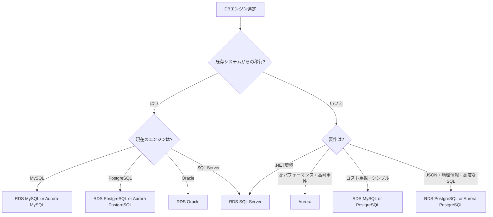
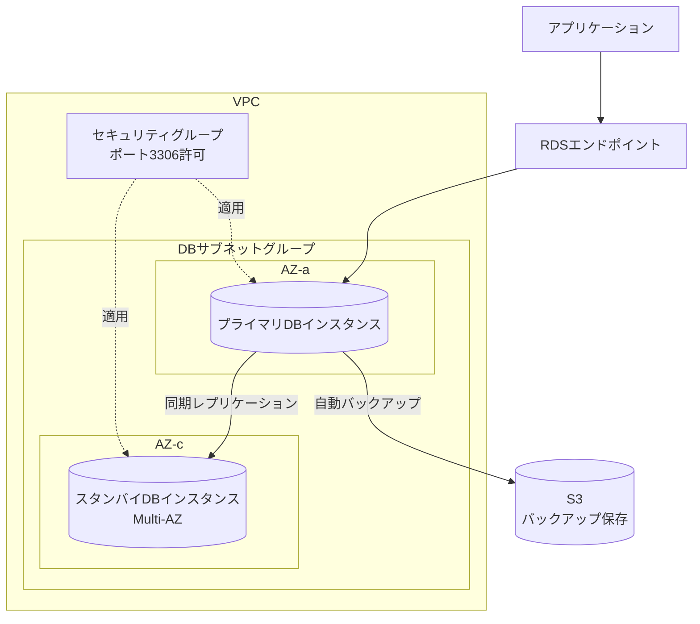
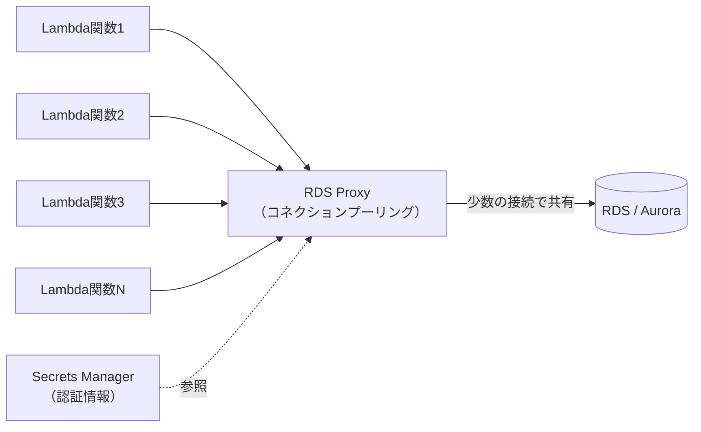

# AWS RDS（Relational Database Service）

## RDSとは

Amazon RDSは、クラウド上でリレーショナルデータベースを簡単にセットアップ、運用、スケーリングできるマネージドサービス。ハードウェアのプロビジョニング、データベースのセットアップ、パッチ適用、バックアップなどの煩雑な管理作業をAWSが代行してくれる。

### RDSを使うメリット

| 項目 | 自前運用（EC2上にDB構築） | RDS |
| --- | --- | --- |
| OSパッチ適用 | 自分で対応 | AWSが自動対応 |
| DBエンジンのアップデート | 自分で対応 | マネジメントコンソールから実行 |
| バックアップ | 自分でcronなどで設定 | 自動バックアップ機能あり |
| 高可用性 | 自分でレプリケーション構築 | Multi-AZワンクリック |
| スケーリング | 手動でサーバー追加 | リードレプリカ・インスタンスクラス変更 |
| 監視 | 自分でモニタリング構築 | CloudWatch統合済み |
| 障害対応 | 自分でフェイルオーバー構築 | 自動フェイルオーバー |

---

## 対応データベースエンジン

RDSは6つのデータベースエンジンに対応している。

### エンジン一覧

| エンジン | バージョン例 | 特徴 | ユースケース |
| --- | --- | --- | --- |
| **MySQL** | 5.7, 8.0 | 世界で最も普及したOSSデータベース | Webアプリケーション全般 |
| **PostgreSQL** | 13, 14, 15, 16 | 高機能なOSSデータベース、JSON対応 | 複雑なクエリ、地理情報、分析 |
| **MariaDB** | 10.6, 10.11 | MySQLから派生したOSS | MySQLの代替、OSSライセンス重視 |
| **Oracle** | 19c, 21c | エンタープライズ向け商用DB | レガシーシステム、Oracle依存アプリ |
| **SQL Server** | 2019, 2022 | Microsoft製の商用DB | .NETアプリケーション、Windows環境 |
| **Amazon Aurora** | MySQL互換 / PostgreSQL互換 | AWS独自の高性能DB | 高いパフォーマンスと可用性が必要な場合 |

### エンジン選定の指針



---

## RDSの基本アーキテクチャ

### コンポーネント



### DBインスタンスクラス

RDSのインスタンスクラスはEC2のインスタンスタイプに類似しており、CPU・メモリの組み合わせで選択する。

| カテゴリ | プレフィックス | 特徴 | 用途 |
| --- | --- | --- | --- |
| 汎用 | db.m5, db.m6g, db.m7g | バランスの取れた性能 | 一般的なワークロード |
| メモリ最適化 | db.r5, db.r6g, db.r7g | メモリ重視 | 大量データのキャッシュ |
| バースト可能 | db.t3, db.t4g | ベースライン＋バースト | 開発・テスト、小規模ワークロード |

### DBサブネットグループ

RDSインスタンスを配置するサブネットの集合。少なくとも2つ以上のAZにまたがるサブネットが必要。

```
DBサブネットグループ
├── サブネット: subnet-aaa (AZ: ap-northeast-1a) - 10.0.10.0/24
├── サブネット: subnet-bbb (AZ: ap-northeast-1c) - 10.0.11.0/24
└── サブネット: subnet-ccc (AZ: ap-northeast-1d) - 10.0.12.0/24
```

---

## Multi-AZ（高可用性）

### Multi-AZデプロイメント

Multi-AZを有効にすると、プライマリインスタンスとは異なるAZにスタンバイインスタンスが自動的に作成される。プライマリに障害が発生した場合、自動的にスタンバイへフェイルオーバーする。

| 項目 | 説明 |
| --- | --- |
| レプリケーション | 同期レプリケーション |
| フェイルオーバー時間 | 通常60〜120秒 |
| スタンバイへの読み取り | 不可（フェイルオーバー専用） |
| DNSエンドポイント | 変更不要（自動切り替え） |
| 追加料金 | インスタンス料金が約2倍 |

### Multi-AZの動作

```
通常時:
  アプリ → RDSエンドポイント → プライマリ(AZ-a) ←同期→ スタンバイ(AZ-c)

障害発生時:
  1. プライマリ(AZ-a)に障害検知
  2. スタンバイ(AZ-c)をプライマリに昇格
  3. DNSレコードを新プライマリに自動変更
  4. アプリは同じエンドポイントで接続継続
```

### Multi-AZクラスター（新機能）

MySQL/PostgreSQLで利用可能な新しいMulti-AZデプロイメントオプション。1つのプライマリと2つのリーダーインスタンスで構成され、リーダーインスタンスへの読み取りが可能。

| 項目 | Multi-AZインスタンス | Multi-AZクラスター |
| --- | --- | --- |
| リーダー数 | 0（スタンバイのみ） | 2 |
| 読み取り負荷分散 | 不可 | 可能 |
| フェイルオーバー時間 | 60〜120秒 | 約35秒以下 |
| レプリケーション | 同期 | 準同期（セミシンクロナス） |

---

## リードレプリカ

### リードレプリカとは

プライマリインスタンスの読み取り専用コピー。非同期レプリケーションで、読み取りトラフィックをスケールアウトできる。

| 項目 | 説明 |
| --- | --- |
| 最大数 | MySQL/MariaDB/PostgreSQL: 15個、Oracle: 5個、SQL Server: 5個 |
| レプリケーション | 非同期 |
| 読み取り | 可能 |
| 書き込み | 不可 |
| クロスリージョン | 対応（MySQL, MariaDB, PostgreSQL） |
| プライマリへの昇格 | 可能（手動操作） |

### リードレプリカの使い方

```
書き込み（INSERT/UPDATE/DELETE）:
  アプリ → プライマリエンドポイント → プライマリDB

読み取り（SELECT）:
  アプリ → リーダーエンドポイント → リードレプリカ1
                                  → リードレプリカ2
                                  → リードレプリカ3
```

### リードレプリカのユースケース

- **読み取り負荷の分散**: レポーティングやBI用のクエリをレプリカに振り分け
- **DRサイト**: クロスリージョンレプリカをDR用に活用
- **マイグレーション**: レプリカを昇格させてエンジンアップグレード

---

## Amazon Aurora

### Auroraとは

AWSが独自に開発したクラウドネイティブなリレーショナルデータベース。MySQL及びPostgreSQLと互換性があり、標準的なRDSと比較して最大5倍（MySQL）/ 3倍（PostgreSQL）のスループットを実現する。

### Auroraのアーキテクチャ

Auroraは従来のRDSとは根本的に異なるストレージアーキテクチャを持つ。

| 項目 | 通常のRDS | Aurora |
| --- | --- | --- |
| ストレージ | EBSボリューム | 分散ストレージ（6コピー/3AZ） |
| レプリケーション | ストリーミング | ストレージレベル |
| フェイルオーバー | 60〜120秒 | 通常30秒以下 |
| 最大ストレージ | 64TB（gp3） | 128TB（自動拡張） |
| リードレプリカ | 最大5〜15個 | 最大15個（低レイテンシ） |

### Auroraの特徴的な機能

**Aurora Serverless v2:**

- 需要に応じてコンピュートキャパシティが自動スケーリング
- ACU（Aurora Capacity Unit）単位でのスケーリング（0.5 ACU〜128 ACU）
- 開発/テスト環境や変動するワークロードに最適
- プロビジョンドインスタンスとServerlessの混在が可能

**Aurora Global Database:**

- 最大5つのリージョンにまたがるレプリケーション
- リージョン間レプリケーション遅延は通常1秒未満
- DRシナリオで別リージョンへ1分以内にフェイルオーバー可能

**Aurora Cloning:**

- プロダクションデータベースのクローンを数分で作成
- Copy-on-Write方式で追加のストレージコストを抑制
- テスト環境やデバッグ用に活用

---

## RDS Proxy

### RDS Proxyとは

RDSのためのフルマネージドデータベースプロキシ。データベース接続のプーリングと共有を行い、アプリケーションのスケーラビリティと可用性を向上させる。

### RDS Proxyが解決する問題

| 問題 | RDS Proxyによる解決 |
| --- | --- |
| Lambda同時実行時のDB接続数爆発 | コネクションプーリングで接続を共有 |
| フェイルオーバー時のダウンタイム | フェイルオーバーを自動的に処理し接続を維持 |
| 認証情報の管理 | Secrets Managerと統合 |
| DB接続のオーバーヘッド | 接続の再利用でオーバーヘッド削減 |

### RDS Proxyのアーキテクチャ



### RDS Proxyの設定ポイント

- **対応エンジン**: MySQL、PostgreSQL、MariaDB、SQL Server（Aurora含む）
- **接続プーリング**: `MaxConnectionsPercent`でプール可能な接続数の割合を設定（デフォルト100%）
- **IAM認証**: RDS ProxyへのアクセスにIAM認証が利用可能
- **Secrets Manager統合**: DB認証情報をSecrets Managerで安全に管理
- **ピン留め（Pinning）**: セッション固有の状態を使う接続はプーリングから除外される

---

## バックアップとリストア

### 自動バックアップ

RDSはデフォルトで自動バックアップが有効。

| 項目 | 説明 |
| --- | --- |
| バックアップウィンドウ | 毎日指定した時間帯にスナップショット取得 |
| 保持期間 | 1〜35日（デフォルト7日、0で無効化） |
| バックアップ方式 | スナップショット + トランザクションログ |
| リストア | 任意の時点に復元可能（ポイントインタイムリカバリ） |
| 保存先 | S3（ユーザーからは不可視） |
| パフォーマンス影響 | Multi-AZの場合はスタンバイから取得するため最小限 |

### 手動スナップショット

ユーザーが任意のタイミングで作成するスナップショット。自動バックアップと異なり、明示的に削除するまで保持される。

**ユースケース:**
- メジャーバージョンアップグレード前
- 大規模なデータマイグレーション前
- 本番環境のスナップショットを別アカウントに共有

### ポイントインタイムリカバリ（PITR）

自動バックアップの保持期間内の任意の時点にデータベースを復元できる機能。5分前までの復元が可能。

```
バックアップの仕組み:
  日次スナップショット + 5分ごとのトランザクションログ → 任意時点に復元可能

リストア時の注意:
  - 復元先は新しいDBインスタンスとして作成される
  - 既存のインスタンスに上書き復元はできない
  - 復元後にエンドポイントが変わるため、アプリケーション側の設定変更が必要
```

---

## パラメータグループとオプショングループ

### パラメータグループ

データベースエンジンの設定パラメータを管理するコンテナ。

| 種類 | 説明 |
| --- | --- |
| デフォルトパラメータグループ | AWSが提供する初期設定。変更不可 |
| カスタムパラメータグループ | ユーザーが作成し自由に変更可能 |
| DBクラスターパラメータグループ | Aurora用、クラスター全体に適用 |

**よく変更するパラメータ例（MySQL）:**

| パラメータ | 説明 | デフォルト |
| --- | --- | --- |
| `max_connections` | 最大接続数 | インスタンスクラスに依存 |
| `character_set_server` | 文字コード | latin1 → utf8mb4に変更推奨 |
| `slow_query_log` | スロークエリログ | 0（無効）→ 1に変更推奨 |
| `long_query_time` | スロークエリ閾値（秒） | 10 → 1〜2に変更推奨 |
| `innodb_buffer_pool_size` | バッファプールサイズ | インスタンスメモリの75% |
| `time_zone` | タイムゾーン | UTC → Asia/Tokyoに変更可能 |

### 適用タイミング

| タイプ | 説明 | 再起動 |
| --- | --- | --- |
| dynamic | 即座に適用可能 | 不要 |
| static | 再起動後に適用 | 必要 |

---

## セキュリティ

### ネットワークセキュリティ

```
インターネット
    ↓ ×（プライベートサブネットなのでアクセス不可）
VPC
├── パブリックサブネット
│   └── EC2（アプリケーション）
│       ↓ ポート3306許可（セキュリティグループ）
├── プライベートサブネット
│   └── RDSインスタンス（パブリックアクセス: 無効）
└── セキュリティグループ: アプリのSGからのみ3306許可
```

**ベストプラクティス:**

- RDSはプライベートサブネットに配置する
- パブリックアクセスは原則無効にする
- セキュリティグループでアプリケーションのSGからのみポート許可
- NACLで追加のネットワーク制御

### 暗号化

| 暗号化の種類 | 説明 |
| --- | --- |
| 保管時の暗号化（At Rest） | AES-256。KMSのキーを使用。インスタンス作成時に有効化 |
| 転送中の暗号化（In Transit） | SSL/TLSによる接続の暗号化 |
| スナップショットの暗号化 | 暗号化されたインスタンスのスナップショットは自動で暗号化 |

**注意点:**

- 暗号化は作成時にのみ設定可能。既存の非暗号化インスタンスを暗号化するには、スナップショットを取得→暗号化コピー→復元が必要
- リードレプリカはプライマリと同じ暗号化設定を継承する

### IAM認証

RDSはIAM認証もサポートしている。パスワードの代わりにIAMの認証トークンを使用してデータベースに接続できる。

- MySQL、PostgreSQL、MariaDBで対応
- トークンの有効期限は15分
- パスワード管理が不要になりセキュリティが向上
- Secrets Managerとの併用も推奨

---

## 監視とメンテナンス

### CloudWatch メトリクス

| メトリクス | 説明 | 注意すべき閾値 |
| --- | --- | --- |
| CPUUtilization | CPU使用率 | 80%超えが続く場合はスケールアップ検討 |
| FreeableMemory | 利用可能メモリ | 低下傾向の場合はメモリ不足の兆候 |
| DatabaseConnections | 現在の接続数 | max_connectionsに近づいたら対処 |
| ReadIOPS / WriteIOPS | 読み書きIOPS | ストレージ性能のボトルネック確認 |
| FreeStorageSpace | 残りストレージ容量 | 枯渇前にスケーリング |
| ReplicaLag | レプリケーション遅延 | リードレプリカの遅延確認 |

### Enhanced Monitoring

- OS レベルのメトリクス（プロセス、メモリ、ファイルシステム等）を1秒間隔で取得
- CloudWatch Logsに送信
- 標準のCloudWatchメトリクスでは見えないOS内部の情報を確認可能

### Performance Insights

- SQLクエリレベルのパフォーマンス分析ツール
- 「データベースの負荷（DB Load）」を時系列で可視化
- Top SQLでボトルネックとなっているクエリを特定
- 待機イベント分析で何がパフォーマンスを制限しているか把握

### メンテナンスウィンドウ

- AWSによるパッチ適用やマイナーバージョンアップグレードの時間帯
- 週次で30分のウィンドウを指定
- Multi-AZの場合、スタンバイ→プライマリの順で適用しダウンタイムを最小化

---

## 料金

### 課金の構成要素

| 項目 | 説明 |
| --- | --- |
| インスタンス時間 | DBインスタンスの起動時間（秒単位） |
| ストレージ | 確保したストレージ容量（GB/月） |
| IOPS | io1/io2の場合はプロビジョンドIOPSに対して課金 |
| バックアップストレージ | 保持期間分の自動バックアップ + 手動スナップショット |
| データ転送 | リージョン外へのデータ転送 |

### コスト最適化のポイント

| 方法 | 節約率 | 適用条件 |
| --- | --- | --- |
| リザーブドインスタンス（1年） | 約30〜40% | 長期利用が確定している場合 |
| リザーブドインスタンス（3年） | 約50〜60% | 長期利用が確定している場合 |
| Aurora Serverless v2 | 変動 | ワークロードが変動する場合 |
| ストレージタイプの見直し | 変動 | gp3はgp2より安価な場合がある |
| リードレプリカの適正化 | 変動 | 不要なレプリカの削除 |
| インスタンスクラスの適正化 | 変動 | Performance Insightsで分析 |

### 無料利用枠（12か月）

- db.t2.micro / db.t3.micro / db.t4g.micro: 月750時間
- ストレージ: 20GB（gp2）
- バックアップストレージ: 20GB

---

## 実務でのRDS設計パターン

### パターン1: Webアプリケーション標準構成

```
ALB → EC2(Auto Scaling) → RDS(Multi-AZ) + リードレプリカ
                                ↓
                         Secrets Manager（認証情報管理）
```

- Multi-AZで高可用性を確保
- リードレプリカで読み取り負荷を分散
- Secrets Managerでパスワードのローテーション自動化

### パターン2: サーバーレス構成

```
API Gateway → Lambda → RDS Proxy → Aurora Serverless v2
                           ↓
                     Secrets Manager
```

- Lambda同時実行による接続数爆発をRDS Proxyで解決
- Aurora Serverless v2でコスト最適化
- Secrets Manager統合でセキュアな認証

### パターン3: マルチリージョンDR構成

```
東京リージョン:
  Aurora MySQL（プライマリクラスター）
    ├── ライターインスタンス
    └── リーダーインスタンス x 2
        ↓ グローバルデータベース（<1秒遅延）
大阪リージョン:
  Aurora MySQL（セカンダリクラスター）
    └── リーダーインスタンス x 1
```

- Aurora Global Databaseでクロスリージョンレプリケーション
- 大阪リージョンで読み取りリクエストを処理（レイテンシ低減）
- 東京リージョン障害時に大阪へフェイルオーバー

---

## マイグレーション

### AWS Database Migration Service（DMS）

既存のデータベースをRDSに移行するためのサービス。

| 移行パターン | 説明 |
| --- | --- |
| 同種移行 | MySQL → RDS MySQL、PostgreSQL → Aurora PostgreSQL |
| 異種移行 | Oracle → Aurora PostgreSQL、SQL Server → RDS MySQL |
| 継続的レプリケーション | CDC（Change Data Capture）で差分を継続的に同期 |

### 移行のステップ

1. **AWS Schema Conversion Tool（SCT）** でスキーマを変換（異種移行の場合）
2. **DMS レプリケーションインスタンス** を作成
3. **ソースエンドポイント**（移行元DB）と**ターゲットエンドポイント**（RDS）を設定
4. **タスク** を作成して移行を実行
5. 全データ移行完了後、CDC（差分同期）で同期を継続
6. アプリケーションの接続先をRDSに切り替え

---

## トラブルシューティング

### よくある問題と対処法

| 問題 | 原因 | 対処法 |
| --- | --- | --- |
| 接続できない | セキュリティグループ設定 | インバウンドルールでDBポートを許可 |
| 接続数超過 | max_connectionsに到達 | インスタンスクラス変更 or RDS Proxy導入 |
| ストレージ不足 | データ増加 | ストレージのオートスケーリング有効化 |
| パフォーマンス低下 | スロークエリ | Performance Insightsで特定・チューニング |
| レプリカラグ増大 | 書き込み負荷過多 | インスタンスクラスの見直し |
| フェイルオーバーが遅い | Multi-AZインスタンス | Multi-AZクラスターへの移行検討 |

---

## 参考文献

- [Amazon RDS 公式ドキュメント](https://docs.aws.amazon.com/ja_jp/AmazonRDS/latest/UserGuide/)
- [Amazon Aurora 公式ドキュメント](https://docs.aws.amazon.com/ja_jp/AmazonRDS/latest/AuroraUserGuide/)
- [RDS Proxy 公式ドキュメント](https://docs.aws.amazon.com/ja_jp/AmazonRDS/latest/UserGuide/rds-proxy.html)
- [RDS の料金](https://aws.amazon.com/jp/rds/pricing/)
- [Aurora の料金](https://aws.amazon.com/jp/rds/aurora/pricing/)
- [AWS Database Migration Service](https://docs.aws.amazon.com/ja_jp/dms/latest/userguide/Welcome.html)
- [RDS ベストプラクティス](https://docs.aws.amazon.com/ja_jp/AmazonRDS/latest/UserGuide/CHAP_BestPractices.html)
- [Performance Insights](https://docs.aws.amazon.com/ja_jp/AmazonRDS/latest/UserGuide/USER_PerfInsights.html)
- [AWS Well-Architected Framework - Reliability Pillar](https://docs.aws.amazon.com/ja_jp/wellarchitected/latest/reliability-pillar/welcome.html)
