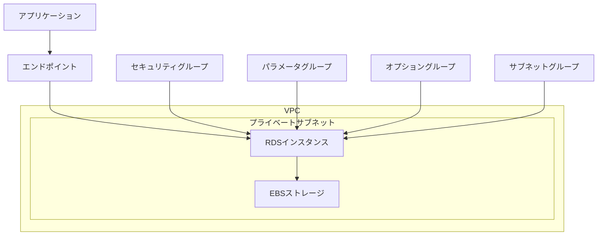
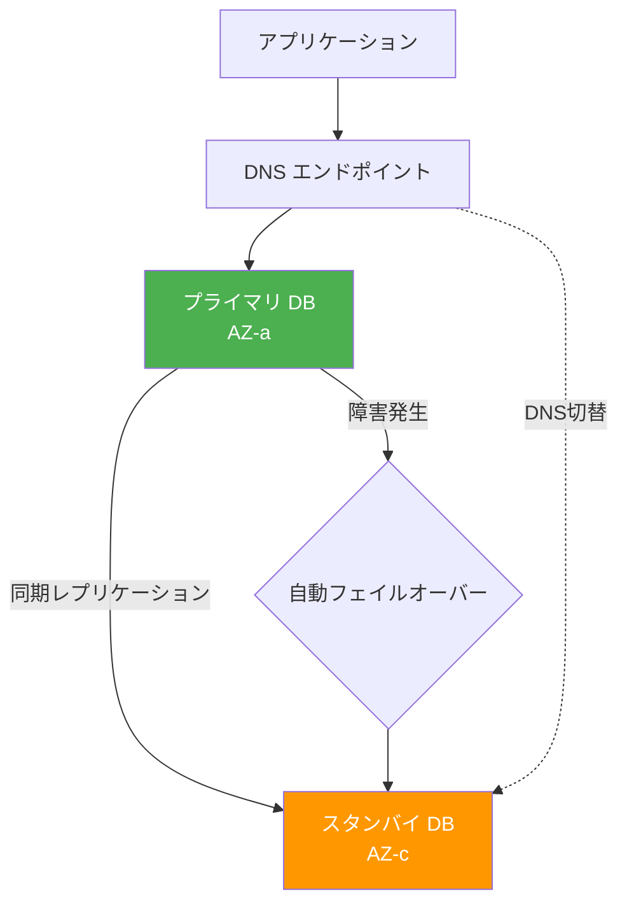
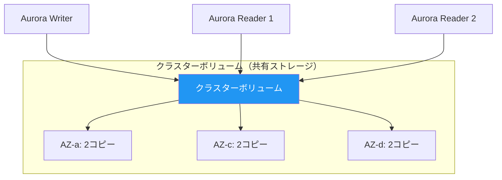

# AWS RDS

## マネージドデータベースとは

Amazon RDS（Relational Database Service）は、AWSが提供するフルマネージドなリレーショナルデータベースサービス。データベースの運用に必要な面倒な作業（パッチ適用、バックアップ、レプリケーション、フェイルオーバー）をAWSが自動で行ってくれる。

### セルフマネージド vs マネージド

| 作業 | セルフマネージド（EC2上にDB構築） | マネージド（RDS） |
| --- | --- | --- |
| OSのインストール | 自分で行う | 不要 |
| DBエンジンのインストール | 自分で行う | 不要 |
| パッチ適用 | 自分で行う | 自動（メンテナンスウィンドウ） |
| バックアップ | 自分で設定 | 自動（設定のみ） |
| レプリケーション | 自分で構築 | ボタン1つ |
| フェイルオーバー | 自分で構築 | 自動 |
| スケーリング | 自分で実施 | ボタン1つ（ダウンタイムあり） |
| 監視 | 自分で設定 | CloudWatch統合済み |

### 対応データベースエンジン

| エンジン | バージョン例 | 特徴 |
| --- | --- | --- |
| MySQL | 8.0, 8.4 | 最も広く使われるOSS DB |
| PostgreSQL | 14, 15, 16, 17 | 高機能なOSS DB |
| MariaDB | 10.6, 10.11 | MySQLのフォーク |
| Oracle | 19c, 21c | エンタープライズ向け |
| SQL Server | 2019, 2022 | Microsoft製DB |
| Amazon Aurora | MySQL/PostgreSQL互換 | AWS独自の高性能DB |

---

## RDSの基本構成

### アーキテクチャ



### 主要な設定要素

| 要素 | 説明 |
| --- | --- |
| DBインスタンスクラス | CPU、メモリのスペック（例: db.t3.medium） |
| ストレージタイプ | gp3（汎用SSD）、io1/io2（高性能SSD）、magnetic |
| セキュリティグループ | ネットワークアクセス制御 |
| パラメータグループ | DBエンジンの設定パラメータ |
| オプショングループ | DBエンジン固有の追加機能 |
| サブネットグループ | RDSを配置するサブネットの集合 |
| メンテナンスウィンドウ | パッチ適用などの自動メンテナンス時間帯 |

### インスタンスクラス

```
db.r6g.xlarge
│  │  │  │
│  │  │  └── サイズ
│  │  └───── 世代
│  └──────── ファミリー
└─────────── DBインスタンスプレフィックス
```

| ファミリー | 用途 | 特徴 |
| --- | --- | --- |
| db.t3/t4g | 開発・テスト、小規模本番 | バースト可能、低コスト |
| db.r6g/r7g | メモリ最適化 | 大規模本番DB向け |
| db.m6g/m7g | 汎用 | バランスの良いスペック |
| db.x2g | メモリ集約型 | 超大規模DB向け |

**Graviton（gシリーズ）**: ARM ベースのインスタンス。同等のx86インスタンスより20%程度安く、性能も同等以上。新規構築ではGravitonを推奨。

---

## Multi-AZ配置

Multi-AZ（Multi-Availability Zone）は、プライマリDBインスタンスとは別のAZにスタンバイレプリカを自動作成し、障害時に自動フェイルオーバーする高可用性構成。

### Multi-AZの仕組み



### Multi-AZの種類

| 構成 | インスタンス数 | フェイルオーバー時間 | 読み取りの分散 |
| --- | --- | --- | --- |
| Multi-AZ（インスタンス） | 2（プライマリ + スタンバイ） | 60〜120秒 | 不可 |
| Multi-AZ（クラスター） | 3（ライター1 + リーダー2） | 35秒以下 | 可能 |

### Multi-AZ DBクラスター（新機能）

MySQL/PostgreSQLで利用可能。3つのインスタンスで構成され、2つのリーダーインスタンスからの読み取りが可能。

```
ライターエンドポイント → ライターインスタンス（AZ-a）
リーダーエンドポイント → リーダーインスタンス1（AZ-c）
                       → リーダーインスタンス2（AZ-d）
```

---

## リードレプリカ

リードレプリカは、プライマリDBの読み取り専用コピー。読み取り負荷をリードレプリカに分散することで、プライマリDBの負荷を軽減する。

### リードレプリカの特徴

| 項目 | 説明 |
| --- | --- |
| レプリケーション | 非同期 |
| 読み取り | 可能 |
| 書き込み | 不可（読み取り専用） |
| 最大数 | 5台（Aurora: 15台） |
| クロスリージョン | 可能 |
| 昇格 | スタンドアロンDBに昇格可能 |

### 活用パターン

```
書き込み → プライマリDB（ライターエンドポイント）
読み取り → リードレプリカ（リーダーエンドポイント）

例:
  INSERT/UPDATE/DELETE → プライマリDB
  SELECT（レポート、分析） → リードレプリカ
  SELECT（通常の読み取り） → リードレプリカ
```

### レプリカラグ

非同期レプリケーションのため、プライマリとリードレプリカの間にわずかな遅延（ラグ）が生じる。

| ユースケース | レプリカラグの許容度 |
| --- | --- |
| レポート・分析 | 数秒のラグは許容可能 |
| ユーザー向け読み取り | 注意が必要（書き込み直後の読み取り） |
| リアルタイム性が必要 | リードレプリカ不向き→プライマリを使用 |

**Read After Write問題**: ユーザーがデータを書き込んだ直後に読み取ると、リードレプリカにはまだ反映されていない可能性がある。この場合は書き込み直後の読み取りをプライマリに向ける設計が必要。

---

## Amazon Aurora

AuroraはAWSが独自開発したクラウドネイティブなリレーショナルデータベース。MySQL互換とPostgreSQL互換の2つのエディションがある。

### Auroraの特徴

| 項目 | RDS（標準） | Aurora |
| --- | --- | --- |
| 性能 | 標準的 | MySQLの5倍、PostgreSQLの3倍 |
| ストレージ | EBS（手動拡張） | 自動拡張（最大128TB） |
| レプリカ数 | 最大5 | 最大15 |
| フェイルオーバー | 60〜120秒 | 30秒以下 |
| ストレージ冗長性 | 2AZ | 3AZ（6コピー） |
| バックトラック | 非対応 | 対応（MySQL互換のみ） |
| 料金 | 標準 | 約20%高い |

### Auroraのストレージアーキテクチャ



Auroraのストレージは3つのAZに6つのコピーが自動的に保存される。4つのコピーに書き込みが成功すれば書き込み完了とみなされ（4/6 quorum write）、3つのコピーから読み取れれば読み取り成功（3/6 quorum read）。

### Aurora Serverless v2

ワークロードに応じてキャパシティ（ACU: Aurora Capacity Unit）を自動スケーリングするサーバーレスオプション。

| 項目 | 説明 |
| --- | --- |
| 最小ACU | 0.5 ACU |
| 最大ACU | 256 ACU（設定可能） |
| スケーリング | 秒単位で自動スケール |
| 料金 | ACU使用量に応じた従量課金 |
| ユースケース | 予測困難なワークロード、開発環境 |

1 ACU = 約2GB メモリ + 対応するCPU + ネットワーク

### Aurora Global Database

リージョン間でデータベースをレプリケーションする機能。1つのプライマリリージョンと最大5つのセカンダリリージョンで構成。

| 項目 | 説明 |
| --- | --- |
| レプリケーション遅延 | 通常1秒以下 |
| セカンダリリージョン | 読み取り専用（災害時にライターに昇格可能） |
| RPO | 通常1秒以下 |
| RTO | 1分以下 |

---

## RDS Proxy

RDS Proxyは、アプリケーションとRDSの間に配置するフルマネージドなデータベースプロキシ。接続プーリングとフェイルオーバーの高速化を提供する。

### なぜRDS Proxyが必要か

Lambda関数は同時に数百〜数千のインスタンスが起動する可能性があり、それぞれがDBに接続すると接続数が爆発する。

```
Lambda × 1000同時実行 → 1000 DB接続 → DBが接続上限に達してエラー
```

RDS Proxyが接続プーリングを行い、DB接続を効率的に管理する。

```
Lambda × 1000同時実行 → RDS Proxy（接続プール）→ 100 DB接続 → RDS
```

### RDS Proxyの特徴

| 項目 | 説明 |
| --- | --- |
| 接続プーリング | アイドル接続を共有して接続数を削減 |
| フェイルオーバー高速化 | DNS切替なしでフェイルオーバー（最大66%高速化） |
| IAM認証 | DB認証にIAMを使用可能 |
| Secrets Manager連携 | DB認証情報をSecrets Managerで管理 |
| 対応エンジン | MySQL、PostgreSQL、SQL Server |

### RDS Proxyの構成

```
アプリケーション → RDS Proxy エンドポイント → ターゲットグループ → RDS / Aurora
                                              │
                                              └── Secrets Manager（認証情報）
```

### Terraform での定義例

```hcl
resource "aws_db_proxy" "app_proxy" {
  name                   = "app-db-proxy"
  debug_logging          = false
  engine_family          = "POSTGRESQL"
  idle_client_timeout    = 1800
  require_tls            = true
  role_arn               = aws_iam_role.proxy_role.arn
  vpc_security_group_ids = [aws_security_group.proxy.id]
  vpc_subnet_ids         = aws_subnet.private[*].id

  auth {
    auth_scheme = "SECRETS"
    iam_auth    = "REQUIRED"
    secret_arn  = aws_secretsmanager_secret.db_credentials.arn
  }
}

resource "aws_db_proxy_default_target_group" "app" {
  db_proxy_name = aws_db_proxy.app_proxy.name

  connection_pool_config {
    max_connections_percent      = 100
    max_idle_connections_percent = 50
    connection_borrow_timeout    = 120
  }
}

resource "aws_db_proxy_target" "app" {
  db_proxy_name          = aws_db_proxy.app_proxy.name
  target_group_name      = aws_db_proxy_default_target_group.app.name
  db_cluster_identifier  = aws_rds_cluster.app.id
}
```

---

## バックアップとリストア

### 自動バックアップ

| 項目 | 説明 |
| --- | --- |
| 種類 | 自動スナップショット + トランザクションログ |
| 保持期間 | 1〜35日（デフォルト7日） |
| バックアップウィンドウ | 指定した時間帯に自動実行 |
| リストア | 任意の時点に復元（Point-in-Time Recovery） |
| ストレージ | バックアップストレージはDBサイズ分まで無料 |

### 手動スナップショット

| 項目 | 説明 |
| --- | --- |
| 保持期間 | 手動で削除するまで無期限 |
| クロスリージョンコピー | 可能（災害復旧用） |
| 共有 | 他のAWSアカウントと共有可能 |
| 暗号化 | KMSで暗号化可能 |

### Point-in-Time Recovery

トランザクションログを使って、バックアップ保持期間内の任意の時点（秒単位）の状態にデータベースを復元できる。

```
バックアップウィンドウ: 02:00-03:00
保持期間: 7日

復元可能な範囲: 7日前〜直近5分前
→ 例: 3日前の14:32:15 の状態に復元
```

**注意**: 復元は常に新しいDBインスタンスとして作成される。元のインスタンスに上書き復元はできない。

### Aurora バックトラック

Aurora MySQL互換で利用可能。データベースを過去の任意の時点に「巻き戻す」機能。新しいインスタンスを作成せずに、既存のインスタンスの状態を戻せる。

```
通常のリストア: 新規インスタンス作成（数十分〜数時間）
バックトラック: 既存インスタンスを巻き戻し（数秒〜数分）
```

---

## セキュリティ

### ネットワークセキュリティ

- プライベートサブネットに配置する（パブリックアクセスを無効化）
- セキュリティグループで接続元を制限する（アプリケーションサーバーのみ）
- VPC内からのみアクセスを許可する

### 暗号化

| 対象 | 方法 | 設定タイミング |
| --- | --- | --- |
| 保存データ（At Rest） | AWS KMSによる暗号化 | インスタンス作成時 |
| 通信データ（In Transit） | SSL/TLS | パラメータグループで設定 |
| バックアップ | 暗号化インスタンスのバックアップは自動的に暗号化 | 自動 |

**注意**: 暗号化は後から有効化できない。暗号化が必要な場合はインスタンス作成時に設定する。既存の非暗号化インスタンスを暗号化するには、スナップショット → 暗号化コピー → リストアが必要。

### 認証

| 方法 | 説明 |
| --- | --- |
| パスワード認証 | 従来のユーザー名/パスワード |
| IAM DB認証 | IAMロールベースの認証（一時トークン） |
| Kerberos認証 | Active Directory連携 |

---

## 料金体系

### 料金の構成要素

| 項目 | 説明 |
| --- | --- |
| インスタンス料金 | DBインスタンスクラスに応じた時間課金 |
| ストレージ料金 | ストレージの種類と容量に応じた月額課金 |
| I/O料金（Aurora） | 読み書きのI/Oリクエストに応じた課金 |
| バックアップストレージ | DBサイズを超える分に課金 |
| データ転送 | リージョン外へのデータ転送に課金 |

### 料金例（東京リージョン、参考値）

| インスタンス | オンデマンド（/時間） | 月額概算 |
| --- | --- | --- |
| db.t3.micro | $0.026 | 約$19 |
| db.t3.medium | $0.104 | 約$76 |
| db.r6g.large | $0.314 | 約$229 |
| db.r6g.xlarge | $0.628 | 約$458 |

### コスト最適化

- リザーブドインスタンスで長期利用のコストを削減（最大60%オフ）
- 開発環境ではAurora Serverless v2を使って非使用時のコストを抑える
- リードレプリカは必要な時だけ起動する（レポート実行時のみ等）
- Gravitonインスタンス（gシリーズ）で同等性能を20%安く
- 適切なストレージタイプを選択する（gp3がコストパフォーマンス最良）

---

## ベストプラクティス

### 可用性

- 本番環境では必ずMulti-AZ配置にする
- AuroraではAurora Replicaを少なくとも1つ別AZに配置する
- フェイルオーバーテストを定期的に実施する
- メンテナンスウィンドウを業務影響の少ない時間帯に設定する

### パフォーマンス

- RDS Performance Insightsを有効にしてボトルネックを特定する
- リードレプリカで読み取り負荷を分散する
- RDS Proxyで接続管理を効率化する（特にLambdaとの組み合わせ）
- パラメータグループでエンジン固有のチューニングを行う

### セキュリティ

- プライベートサブネットに配置し、パブリックアクセスを無効にする
- 暗号化を有効にする（保存データ + 通信データ）
- IAM DB認証を使用する
- Secrets Managerで認証情報を管理し、自動ローテーションを設定する

### バックアップ

- 自動バックアップの保持期間を要件に合わせて設定する（最大35日）
- 重要なマイルストーン前に手動スナップショットを取得する
- クロスリージョンバックアップを設定してDR対策とする
- 定期的にリストアテストを実施する

---

## 参考リンク

- [Amazon RDS 公式ドキュメント](https://docs.aws.amazon.com/rds/)
- [Amazon Aurora 公式ドキュメント](https://docs.aws.amazon.com/AmazonRDS/latest/AuroraUserGuide/)
- [Amazon RDS 料金](https://aws.amazon.com/rds/pricing/)
- [RDS Proxy ドキュメント](https://docs.aws.amazon.com/AmazonRDS/latest/UserGuide/rds-proxy.html)
- [RDS Performance Insights](https://docs.aws.amazon.com/AmazonRDS/latest/UserGuide/USER_PerfInsights.html)
- [RDS ベストプラクティス](https://docs.aws.amazon.com/AmazonRDS/latest/UserGuide/CHAP_BestPractices.html)
- [Aurora Serverless v2](https://docs.aws.amazon.com/AmazonRDS/latest/AuroraUserGuide/aurora-serverless-v2.html)
- [Aurora Global Database](https://docs.aws.amazon.com/AmazonRDS/latest/AuroraUserGuide/aurora-global-database.html)
