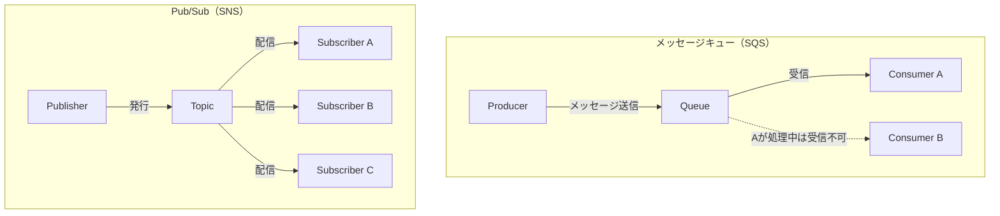
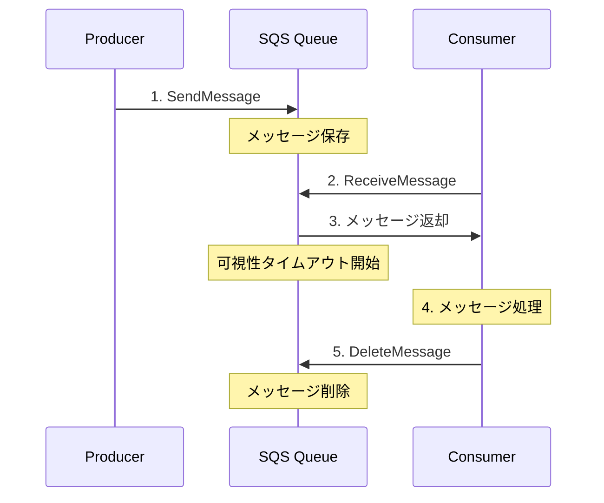
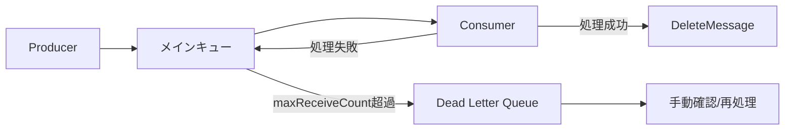
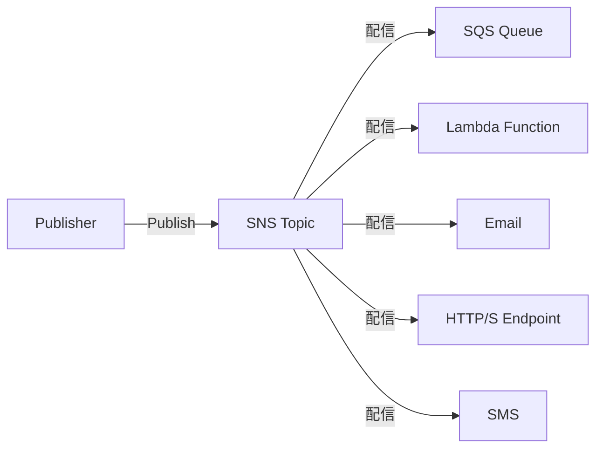
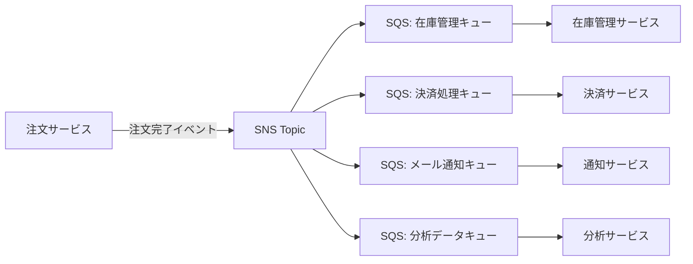

# AWS SQS / SNS

## メッセージングの基本概念

分散システムにおいて、サービス間の通信を疎結合に保つためにメッセージングは欠かせない。メッセージングには大きく2つのパターンがある。

### メッセージキュー vs Pub/Sub

| 項目 | メッセージキュー（SQS） | Pub/Sub（SNS） |
| --- | --- | --- |
| モデル | ポイント・ツー・ポイント | パブリッシュ/サブスクライブ |
| 消費者 | 1つのメッセージは1つの消費者が処理 | 1つのメッセージが全サブスクライバーに配信 |
| メッセージの保持 | キューに保持される（最大14日） | 保持されない（配信したら消える） |
| 用途 | 非同期タスクの処理、負荷分散 | イベント通知、ファンアウト |
| 例え | 郵便受け（手紙は1人が取る） | 放送（全員に届く） |



---

## Amazon SQS（Simple Queue Service）

Amazon SQSは、AWSが提供するフルマネージドなメッセージキューサービス。2006年にリリースされたAWS最古のサービスの1つ。メッセージの送受信を通じて、システム間の非同期通信を実現する。

### SQSの基本的な動作



### Standard vs FIFO キュー

| 項目 | Standard キュー | FIFO キュー |
| --- | --- | --- |
| スループット | ほぼ無制限 | 300件/秒（バッチで3,000件/秒） |
| 配信保証 | 最低1回（重複の可能性あり） | 正確に1回 |
| 順序保証 | ベストエフォート（順序保証なし） | 厳密な先入れ先出し |
| 料金 | $0.40 / 100万リクエスト | $0.50 / 100万リクエスト |
| キュー名 | 任意 | `.fifo` サフィックスが必須 |
| ユースケース | 高スループット処理、順序不問 | 決済処理、順序が重要な処理 |

### FIFO キューのメッセージグループ

FIFOキューでは `MessageGroupId` を使ってメッセージをグループ化できる。同じグループ内では順序が保証されるが、異なるグループのメッセージは並列に処理可能。

```
MessageGroupId: "user-001" → メッセージA → メッセージB → メッセージC（順序保証）
MessageGroupId: "user-002" → メッセージD → メッセージE（順序保証、上と並列処理可能）
```

### 可視性タイムアウト

メッセージを受信した消費者が処理中に、他の消費者が同じメッセージを受信しないようにする仕組み。

```
1. Consumer AがReceiveMessage → メッセージが「不可視」になる
2. 可視性タイムアウト（デフォルト30秒）内に処理完了 → DeleteMessage
3. タイムアウト内に処理が終わらない → メッセージが再び「可視」になり、別のConsumerが受信可能
```

タイムアウト値は処理時間より十分長く設定する。処理に時間がかかる場合は `ChangeMessageVisibility` で延長できる。

### SQSの主要設定

| 設定項目 | デフォルト | 範囲 | 説明 |
| --- | --- | --- | --- |
| 可視性タイムアウト | 30秒 | 0秒〜12時間 | メッセージが不可視になる時間 |
| メッセージ保持期間 | 4日 | 1分〜14日 | メッセージがキューに残る期間 |
| 最大メッセージサイズ | 256KB | 1byte〜256KB | 1メッセージの最大サイズ |
| 受信待機時間 | 0秒 | 0〜20秒 | ロングポーリングの待機時間 |
| 配信遅延 | 0秒 | 0〜15分 | メッセージの配信を遅延させる時間 |

### ロングポーリング vs ショートポーリング

| 方式 | 動作 | コスト | レイテンシ |
| --- | --- | --- | --- |
| ショートポーリング | 即座に返却（空でも） | 高い（空レスポンスにも課金） | 低い |
| ロングポーリング | メッセージが来るまで待機 | 低い（無駄なリクエスト削減） | 最大20秒 |

**ロングポーリングを推奨**。`WaitTimeSeconds` を1〜20秒に設定する。

### SQSの操作例（AWS SDK for JavaScript v3）

```javascript
import {
  SQSClient,
  SendMessageCommand,
  ReceiveMessageCommand,
  DeleteMessageCommand,
} from '@aws-sdk/client-sqs';

const client = new SQSClient({ region: 'ap-northeast-1' });
const queueUrl = 'https://sqs.ap-northeast-1.amazonaws.com/123456789/my-queue';

// メッセージ送信
await client.send(
  new SendMessageCommand({
    QueueUrl: queueUrl,
    MessageBody: JSON.stringify({ orderId: '12345', action: 'process' }),
    MessageAttributes: {
      OrderType: {
        DataType: 'String',
        StringValue: 'standard',
      },
    },
  })
);

// メッセージ受信（ロングポーリング）
const { Messages } = await client.send(
  new ReceiveMessageCommand({
    QueueUrl: queueUrl,
    MaxNumberOfMessages: 10,
    WaitTimeSeconds: 20,
    MessageAttributeNames: ['All'],
  })
);

// メッセージ処理・削除
if (Messages) {
  for (const message of Messages) {
    const body = JSON.parse(message.Body);
    console.log('Processing:', body);

    await client.send(
      new DeleteMessageCommand({
        QueueUrl: queueUrl,
        ReceiptHandle: message.ReceiptHandle,
      })
    );
  }
}
```

---

## Dead Letter Queue（DLQ）

DLQは、処理に失敗したメッセージを退避させるための特別なキュー。何度リトライしても失敗するメッセージ（ポイズンメッセージ）がメインキューを詰まらせることを防ぐ。

### DLQの仕組み



### DLQ設定（リドライブポリシー）

```json
{
  "deadLetterTargetArn": "arn:aws:sqs:ap-northeast-1:123456789:my-queue-dlq",
  "maxReceiveCount": 3
}
```

`maxReceiveCount`は、メッセージがDLQに移動するまでの最大受信回数。3回受信されて処理に失敗すると、4回目にはDLQに移動する。

### DLQリドライブ

DLQに溜まったメッセージをメインキューに戻して再処理する機能。AWSコンソールまたはAPIから実行可能。

---

## Amazon SNS（Simple Notification Service）

Amazon SNSは、AWSが提供するフルマネージドなPub/Sub型メッセージングサービス。1つのメッセージを複数のサブスクライバーに同時配信できる。

### SNSの基本的な動作



### サポートされるサブスクリプションプロトコル

| プロトコル | 説明 | ユースケース |
| --- | --- | --- |
| SQS | SQSキューに配信 | 非同期処理への連携 |
| Lambda | Lambda関数を呼び出し | イベント駆動処理 |
| HTTP/HTTPS | HTTPエンドポイントに配信 | 外部サービス連携 |
| Email | メール送信 | 通知 |
| SMS | ショートメッセージ | モバイル通知 |
| Kinesis Data Firehose | ストリーム配信 | ログ集約 |
| SQS（他アカウント） | クロスアカウント配信 | マルチアカウント構成 |

### Standard vs FIFO トピック

| 項目 | Standard トピック | FIFO トピック |
| --- | --- | --- |
| スループット | ほぼ無制限 | 300件/秒（バッチで3,000件/秒） |
| 順序保証 | なし | あり |
| 重複排除 | なし | あり |
| サブスクライバー | 全プロトコル対応 | SQS FIFOキューのみ |

### メッセージフィルタリング

サブスクライバーごとにフィルタポリシーを設定して、必要なメッセージだけを受信できる。

```json
{
  "orderType": ["premium"],
  "amount": [{ "numeric": [">=", 10000] }]
}
```

この場合、`orderType`が"premium"かつ`amount`が10000以上のメッセージのみ配信される。不要なメッセージの処理を削減し、コスト効率が向上する。

### SNSの操作例

```javascript
import { SNSClient, PublishCommand } from '@aws-sdk/client-sns';

const client = new SNSClient({ region: 'ap-northeast-1' });

await client.send(
  new PublishCommand({
    TopicArn: 'arn:aws:sns:ap-northeast-1:123456789:order-events',
    Message: JSON.stringify({
      orderId: '12345',
      status: 'completed',
      amount: 15000,
    }),
    MessageAttributes: {
      orderType: {
        DataType: 'String',
        StringValue: 'premium',
      },
    },
  })
);
```

---

## ファンアウトパターン（SNS + SQS）

ファンアウトパターンは、SNSとSQSを組み合わせた最も一般的なアーキテクチャパターン。1つのイベントを複数のキューに配信し、それぞれ独立して処理する。

### ファンアウトの構成



### ファンアウトのメリット

| メリット | 説明 |
| --- | --- |
| 疎結合 | 各サービスが独立して動作 |
| 信頼性 | SQSがバッファとなり、サービス障害時もメッセージを保持 |
| スケーラビリティ | 各キューの消費者を独立にスケール |
| 拡張性 | 新しいサブスクライバーの追加が容易 |
| 障害分離 | 1つのサービスの障害が他に影響しない |

---

## EventBridge Pipes との連携

Amazon EventBridge Pipesは、SQSからのメッセージを変換・フィルタリングしてターゲットに配信するポイントツーポイント統合サービス。

### SQS → EventBridge Pipes → ターゲット

```
SQS Queue → [フィルタリング] → [エンリッチメント(Lambda)] → [ターゲット(Step Functions)]
```

EventBridge Pipesを使うと、SQSのメッセージを受信するためのポーリング用Lambdaが不要になり、アーキテクチャがシンプルになる。

### Pipesの活用例

```json
{
  "Source": "arn:aws:sqs:ap-northeast-1:123456789:order-queue",
  "SourceParameters": {
    "SqsQueueParameters": {
      "BatchSize": 10
    },
    "FilterCriteria": {
      "Filters": [
        {
          "Pattern": "{\"body\": {\"orderType\": [\"premium\"]}}"
        }
      ]
    }
  },
  "Enrichment": "arn:aws:lambda:ap-northeast-1:123456789:function:EnrichOrder",
  "Target": "arn:aws:states:ap-northeast-1:123456789:stateMachine:ProcessPremiumOrder"
}
```

---

## 大きなメッセージの処理

SQSの最大メッセージサイズは256KB。それを超えるメッセージを扱う方法。

### Extended Client Library

S3にメッセージ本体を保存し、SQSにはS3へのポインタのみを入れるパターン。

```
Producer → S3（大きなデータ） + SQS（S3ポインタ）
Consumer → SQSからポインタ取得 → S3からデータ取得
```

Java SDK、Python（boto3拡張）で公式ライブラリが提供されている。最大2GBまでのメッセージを扱える。

---

## ベストプラクティス

### SQS

- ロングポーリングを使用する（WaitTimeSeconds: 20）
- メッセージの冪等性を確保する（同じメッセージを複数回処理しても結果が同じ）
- DLQを必ず設定する
- 可視性タイムアウトは処理時間の6倍を目安にする
- FIFOキューは本当に順序が必要な場合のみ使用する
- バッチ操作（SendMessageBatch、ReceiveMessage MaxNumberOfMessages）でコスト削減

### SNS

- メッセージフィルタリングを活用して不要な配信を減らす
- DLQ（配信失敗時のリドライブポリシー）を設定する
- メッセージ暗号化（SSE-KMS）を有効にする
- アクセスポリシーで最小権限を設定する

### 共通

- CloudWatchメトリクスを監視する
  - SQS: `ApproximateNumberOfMessagesVisible`、`ApproximateAgeOfOldestMessage`
  - SNS: `NumberOfNotificationsFailed`
- メッセージにトレースID（X-Ray）を含めて追跡可能にする
- 本番環境ではメッセージの暗号化を有効にする

---

## 参考リンク

- [Amazon SQS 公式ドキュメント](https://docs.aws.amazon.com/sqs/)
- [Amazon SNS 公式ドキュメント](https://docs.aws.amazon.com/sns/)
- [Amazon SQS 料金](https://aws.amazon.com/sqs/pricing/)
- [Amazon SNS 料金](https://aws.amazon.com/sns/pricing/)
- [SQS ベストプラクティス](https://docs.aws.amazon.com/AWSSimpleQueueService/latest/SQSDeveloperGuide/sqs-best-practices.html)
- [SNS メッセージフィルタリング](https://docs.aws.amazon.com/sns/latest/dg/sns-message-filtering.html)
- [Amazon EventBridge Pipes](https://docs.aws.amazon.com/eventbridge/latest/userguide/eb-pipes.html)
- [ファンアウトパターン](https://docs.aws.amazon.com/sns/latest/dg/sns-common-scenarios.html)
