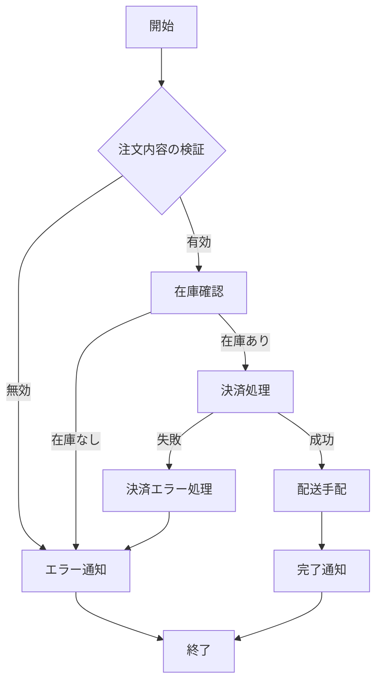
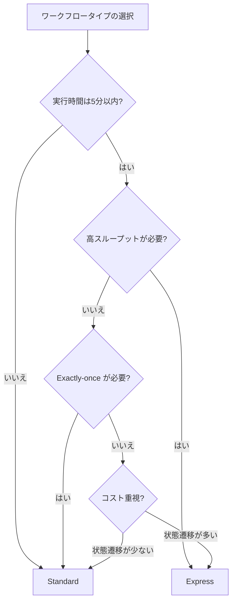
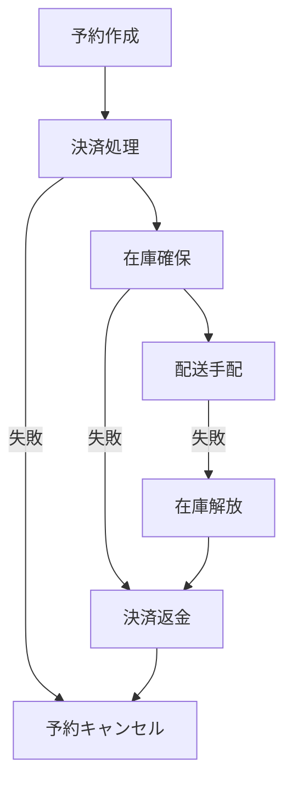

# AWS Step Functions

## ワークフローオーケストレーションとは

ワークフローオーケストレーションとは、複数の処理ステップを定義された順序で実行し、ステップ間のデータ受け渡し、エラー処理、リトライなどを管理する仕組み。オーケストラの指揮者（オーケストレーター）が各楽器の演奏タイミングを制御するように、複数のサービスの実行を調整する。

### なぜオーケストレーションが必要か

単一のLambda関数で全てを処理すると以下の問題が発生する。

| 問題 | 説明 |
| --- | --- |
| タイムアウト | Lambda15分制限では長い処理が完了しない |
| エラー処理の複雑化 | try-catchのネストが深くなり可読性が低下 |
| リトライの管理 | どのステップまで成功したか追跡が困難 |
| 状態の管理 | 中間結果の受け渡しが煩雑になる |
| 可視性の欠如 | 処理のどこで止まったか把握しにくい |

Step Functionsはこれらの課題を解決する。

---

## AWS Step Functionsとは

AWS Step Functionsは、AWSが提供するサーバーレスのワークフローオーケストレーションサービス。視覚的なワークフローを使って、複数のAWSサービスを組み合わせた分散アプリケーションを構築できる。

ステートマシンと呼ばれるワークフローを定義し、各ステート（状態）がLambda関数の呼び出し、DynamoDBへの書き込み、SNS通知などの処理を実行する。

### Step Functionsの全体像



このようなワークフローをJSON（ASL: Amazon States Language）で定義し、Step Functionsが自動的にステップ間の遷移、エラー処理、リトライを管理する。

---

## Standard vs Express ワークフロー

Step Functionsには2つのワークフロータイプがある。

### 比較表

| 項目 | Standard | Express |
| --- | --- | --- |
| 最大実行時間 | 1年 | 5分 |
| 実行モデル | 正確に1回（Exactly-once） | 最低1回（At-least-once）または最大1回 |
| 実行履歴 | Step Functions コンソールで確認可能 | CloudWatch Logsに出力 |
| 料金モデル | 状態遷移ごとに課金 | 実行回数×実行時間で課金 |
| 料金 | $0.025 / 1,000状態遷移 | $1.00 / 100万リクエスト + 実行時間 |
| 実行開始レート | 2,000/秒 | 100,000/秒以上 |
| 適したユースケース | 長時間・低頻度の処理 | 短時間・高頻度の処理 |

### Express ワークフローのサブタイプ

| タイプ | 説明 | ユースケース |
| --- | --- | --- |
| 同期（Synchronous） | 呼び出し元がレスポンスを待つ | API Gatewayのバックエンド |
| 非同期（Asynchronous） | 即座に実行IDを返す | イベント駆動処理 |

### 選択の指針



---

## ステートの種類

Step Functionsのワークフローは、様々な種類のステート（状態）で構成される。

### 全ステート一覧

| ステート | 説明 | 用途 |
| --- | --- | --- |
| Task | 処理を実行する | Lambda呼び出し、AWS API実行 |
| Choice | 条件分岐 | if-else的なロジック |
| Parallel | 並列実行 | 複数の処理を同時実行 |
| Map | 反復処理 | 配列の各要素を並列処理 |
| Wait | 待機 | 一定時間待つ、特定時刻まで待つ |
| Pass | パススルー | データの変換、デバッグ |
| Succeed | 成功終了 | ワークフローの正常終了 |
| Fail | 失敗終了 | ワークフローの異常終了 |

### Task ステート

最も重要なステート。AWSサービスの呼び出しを行う。

```json
{
  "Type": "Task",
  "Resource": "arn:aws:states:::lambda:invoke",
  "Parameters": {
    "FunctionName": "arn:aws:lambda:ap-northeast-1:123456789:function:ProcessOrder",
    "Payload.$": "$"
  },
  "ResultPath": "$.orderResult",
  "Next": "CheckResult"
}
```

#### SDK統合（直接AWS APIを呼び出す）

Lambda関数を経由せずにAWSサービスを直接呼び出せる。200以上のAWSサービスに対応。

```json
{
  "Type": "Task",
  "Resource": "arn:aws:states:::dynamodb:putItem",
  "Parameters": {
    "TableName": "Orders",
    "Item": {
      "OrderId": { "S.$": "$.orderId" },
      "Status": { "S": "CREATED" },
      "CreatedAt": { "S.$": "$$.State.EnteredTime" }
    }
  },
  "Next": "NotifyUser"
}
```

### Choice ステート

```json
{
  "Type": "Choice",
  "Choices": [
    {
      "Variable": "$.orderTotal",
      "NumericGreaterThan": 10000,
      "Next": "ApplyDiscount"
    },
    {
      "Variable": "$.memberType",
      "StringEquals": "PREMIUM",
      "Next": "PremiumProcessing"
    }
  ],
  "Default": "StandardProcessing"
}
```

### Parallel ステート

```json
{
  "Type": "Parallel",
  "Branches": [
    {
      "StartAt": "SendEmail",
      "States": {
        "SendEmail": {
          "Type": "Task",
          "Resource": "arn:aws:states:::sns:publish",
          "Parameters": {
            "TopicArn": "arn:aws:sns:ap-northeast-1:123456789:OrderNotification",
            "Message.$": "$.message"
          },
          "End": true
        }
      }
    },
    {
      "StartAt": "UpdateInventory",
      "States": {
        "UpdateInventory": {
          "Type": "Task",
          "Resource": "arn:aws:states:::lambda:invoke",
          "Parameters": {
            "FunctionName": "UpdateInventory",
            "Payload.$": "$"
          },
          "End": true
        }
      }
    }
  ],
  "Next": "OrderComplete"
}
```

### Map ステート

配列の各要素に対して同じ処理を実行する。Inline Map（小規模）とDistributed Map（大規模）がある。

```json
{
  "Type": "Map",
  "ItemsPath": "$.orderItems",
  "ItemProcessor": {
    "ProcessorConfig": {
      "Mode": "INLINE"
    },
    "StartAt": "ProcessItem",
    "States": {
      "ProcessItem": {
        "Type": "Task",
        "Resource": "arn:aws:states:::lambda:invoke",
        "Parameters": {
          "FunctionName": "ProcessItem",
          "Payload.$": "$"
        },
        "End": true
      }
    }
  },
  "MaxConcurrency": 10,
  "Next": "AggregateResults"
}
```

**Distributed Map**は、S3バケット内の数百万オブジェクトを対象とした大規模並列処理に対応する。最大10,000の並列実行が可能。

---

## Amazon States Language（ASL）

ASLは、Step Functionsのワークフローを定義するためのJSONベースの仕様。

### 完全なワークフロー例

```json
{
  "Comment": "注文処理ワークフロー",
  "StartAt": "ValidateOrder",
  "States": {
    "ValidateOrder": {
      "Type": "Task",
      "Resource": "arn:aws:states:::lambda:invoke",
      "Parameters": {
        "FunctionName": "ValidateOrder",
        "Payload.$": "$"
      },
      "ResultPath": "$.validation",
      "Next": "IsOrderValid",
      "Catch": [
        {
          "ErrorEquals": ["States.ALL"],
          "Next": "OrderFailed",
          "ResultPath": "$.error"
        }
      ]
    },
    "IsOrderValid": {
      "Type": "Choice",
      "Choices": [
        {
          "Variable": "$.validation.Payload.isValid",
          "BooleanEquals": true,
          "Next": "ProcessPayment"
        }
      ],
      "Default": "OrderFailed"
    },
    "ProcessPayment": {
      "Type": "Task",
      "Resource": "arn:aws:states:::lambda:invoke",
      "Parameters": {
        "FunctionName": "ProcessPayment",
        "Payload.$": "$"
      },
      "ResultPath": "$.payment",
      "Retry": [
        {
          "ErrorEquals": ["States.TaskFailed"],
          "IntervalSeconds": 3,
          "MaxAttempts": 3,
          "BackoffRate": 2.0
        }
      ],
      "Next": "FulfillOrder",
      "Catch": [
        {
          "ErrorEquals": ["States.ALL"],
          "Next": "RefundPayment",
          "ResultPath": "$.error"
        }
      ]
    },
    "FulfillOrder": {
      "Type": "Task",
      "Resource": "arn:aws:states:::lambda:invoke",
      "Parameters": {
        "FunctionName": "FulfillOrder",
        "Payload.$": "$"
      },
      "Next": "OrderSucceeded"
    },
    "RefundPayment": {
      "Type": "Task",
      "Resource": "arn:aws:states:::lambda:invoke",
      "Parameters": {
        "FunctionName": "RefundPayment",
        "Payload.$": "$"
      },
      "Next": "OrderFailed"
    },
    "OrderSucceeded": {
      "Type": "Succeed"
    },
    "OrderFailed": {
      "Type": "Fail",
      "Error": "OrderProcessingError",
      "Cause": "Order processing failed"
    }
  }
}
```

### 入出力処理

ASLでは各ステートの入出力を制御するフィールドがある。

| フィールド | 説明 | 例 |
| --- | --- | --- |
| InputPath | ステートに渡す入力をフィルタ | `"$.order"` |
| Parameters | 入力を加工してタスクに渡す | キーを組み替える |
| ResultSelector | タスク結果をフィルタ | 必要なフィールドだけ抽出 |
| ResultPath | 結果を元の入力のどこに格納するか | `"$.taskResult"` |
| OutputPath | 次のステートに渡す出力をフィルタ | `"$.taskResult"` |

データフローの順序:

```
入力 → InputPath → Parameters → [Task実行] → ResultSelector → ResultPath → OutputPath → 出力
```

---

## エラー処理

### Retry（リトライ）

```json
"Retry": [
  {
    "ErrorEquals": ["CustomTransientError"],
    "IntervalSeconds": 1,
    "MaxAttempts": 5,
    "BackoffRate": 2.0,
    "JitterStrategy": "FULL"
  },
  {
    "ErrorEquals": ["States.ALL"],
    "IntervalSeconds": 5,
    "MaxAttempts": 2,
    "BackoffRate": 1.5
  }
]
```

| パラメータ | 説明 |
| --- | --- |
| ErrorEquals | リトライ対象のエラー名リスト |
| IntervalSeconds | 初回リトライまでの待機秒数 |
| MaxAttempts | 最大リトライ回数（デフォルト3） |
| BackoffRate | リトライ間隔の増加率（デフォルト2.0） |
| JitterStrategy | ジッターの適用戦略（FULL or NONE） |

### Catch（キャッチ）

リトライ後も失敗した場合のフォールバック先を定義する。

```json
"Catch": [
  {
    "ErrorEquals": ["PaymentDeclined"],
    "Next": "HandleDeclinedPayment",
    "ResultPath": "$.error"
  },
  {
    "ErrorEquals": ["States.ALL"],
    "Next": "HandleUnknownError",
    "ResultPath": "$.error"
  }
]
```

### 定義済みエラー

| エラー名 | 説明 |
| --- | --- |
| States.ALL | すべてのエラーにマッチ |
| States.Timeout | タイムアウト |
| States.TaskFailed | タスク実行の失敗 |
| States.Permissions | 権限不足 |
| States.ResultPathMatchFailure | ResultPathの適用失敗 |
| States.ParameterPathFailure | Parametersのパス解決失敗 |
| States.BranchFailed | Parallel/Mapのブランチ失敗 |
| States.NoChoiceMatched | Choiceでマッチする条件なし |
| States.IntrinsicFailure | 組み込み関数の失敗 |

---

## 料金体系

### Standard ワークフロー

```
料金 = 状態遷移数 × $0.025 / 1,000遷移
無料枠: 月4,000遷移
```

### Express ワークフロー

```
料金 = リクエスト料金 + 実行時間料金
リクエスト料金 = $1.00 / 100万リクエスト
実行時間料金 = メモリ使用量 × 実行時間 × 単価
```

### 料金例

| シナリオ | タイプ | 状態遷移/月 | 月額料金（概算） |
| --- | --- | --- | --- |
| 小規模注文処理 | Standard | 10万遷移 | 約$2.50 |
| 中規模データパイプライン | Standard | 100万遷移 | 約$25 |
| 高頻度API処理 | Express | 1,000万リクエスト | 約$10 + 実行時間 |

---

## 実践的な設計パターン

### Sagaパターン（補償トランザクション）

分散トランザクションにおいて、途中でエラーが発生した場合に、それまでに実行した処理を逆順で取り消す（補償する）パターン。



### 人間承認パターン

ワークフローの途中で人間の承認を待つパターン。タスクトークンを使用する。

```json
{
  "WaitForApproval": {
    "Type": "Task",
    "Resource": "arn:aws:states:::lambda:invoke.waitForTaskToken",
    "Parameters": {
      "FunctionName": "SendApprovalRequest",
      "Payload": {
        "taskToken.$": "$$.Task.Token",
        "orderId.$": "$.orderId"
      }
    },
    "TimeoutSeconds": 86400,
    "Next": "ProcessApprovedOrder"
  }
}
```

承認者がAPI経由で`SendTaskSuccess`または`SendTaskFailure`を呼び出すと、ワークフローが再開される。

### 動的並列処理パターン

Distributed Mapを使ったS3内の大量ファイル処理。

```json
{
  "ProcessFiles": {
    "Type": "Map",
    "ItemProcessor": {
      "ProcessorConfig": {
        "Mode": "DISTRIBUTED",
        "ExecutionType": "STANDARD"
      },
      "StartAt": "TransformFile",
      "States": {
        "TransformFile": {
          "Type": "Task",
          "Resource": "arn:aws:states:::lambda:invoke",
          "Parameters": {
            "FunctionName": "TransformFile",
            "Payload.$": "$"
          },
          "End": true
        }
      }
    },
    "ItemReader": {
      "Resource": "arn:aws:states:::s3:listObjectsV2",
      "Parameters": {
        "Bucket": "my-input-bucket",
        "Prefix": "input/"
      }
    },
    "MaxConcurrency": 1000,
    "Next": "Done"
  }
}
```

---

## ベストプラクティス

### 設計

- Standardワークフローを基本とし、高スループットが必要な場合のみExpressを検討する
- ステートマシンは1つの責務に集中させる（マイクロサービス的に分割）
- Lambda関数ではなくSDK統合を積極的に使う（コスト削減・シンプル化）
- 補償トランザクション（Sagaパターン）を使って分散トランザクションを管理する

### エラー処理

- すべてのTaskステートにRetryとCatchを設定する
- 一時的なエラーには指数バックオフ付きリトライを設定する
- JitterStrategy: FULLを設定してリトライの集中を避ける
- States.ALLのCatchを最後に配置する（最後のフォールバック）

### 運用

- CloudWatch Logsを有効化してデバッグ情報を記録する
- X-Rayトレーシングを有効にして全体のレイテンシを把握する
- 実行履歴の保持期間に注意する（Standard: 90日）
- ステートマシンのバージョニングにはエイリアスを活用する

### コスト

- 不要な状態遷移を減らす（PassステートやWaitステートの乱用を避ける）
- 短時間・高頻度の処理にはExpressワークフローを使う
- SDK統合でLambda関数を削減すると、Lambdaの料金も節約できる

---

## IaC での定義

### AWS SAM

```yaml
Resources:
  OrderStateMachine:
    Type: AWS::Serverless::StateMachine
    Properties:
      DefinitionUri: statemachine/order-processing.asl.json
      DefinitionSubstitutions:
        ValidateOrderFunctionArn: !GetAtt ValidateOrderFunction.Arn
        ProcessPaymentFunctionArn: !GetAtt ProcessPaymentFunction.Arn
      Policies:
        - LambdaInvokePolicy:
            FunctionName: !Ref ValidateOrderFunction
        - LambdaInvokePolicy:
            FunctionName: !Ref ProcessPaymentFunction
      Logging:
        Destinations:
          - CloudWatchLogsLogGroup:
              LogGroupArn: !GetAtt StateMachineLogGroup.Arn
        Level: ALL
        IncludeExecutionData: true
```

### Terraform

```hcl
resource "aws_sfn_state_machine" "order_processing" {
  name     = "order-processing"
  role_arn = aws_iam_role.sfn_role.arn

  definition = templatefile("${path.module}/statemachine/order-processing.asl.json", {
    validate_order_arn  = aws_lambda_function.validate_order.arn
    process_payment_arn = aws_lambda_function.process_payment.arn
  })

  logging_configuration {
    log_destination        = "${aws_cloudwatch_log_group.sfn.arn}:*"
    include_execution_data = true
    level                  = "ALL"
  }

  tracing_configuration {
    enabled = true
  }
}
```

---

## 参考リンク

- [AWS Step Functions 公式ドキュメント](https://docs.aws.amazon.com/step-functions/)
- [AWS Step Functions 料金](https://aws.amazon.com/step-functions/pricing/)
- [Amazon States Language 仕様](https://states-language.net/spec.html)
- [AWS Step Functions ワークフロースタジオ](https://docs.aws.amazon.com/step-functions/latest/dg/workflow-studio.html)
- [AWS Step Functions サービス統合一覧](https://docs.aws.amazon.com/step-functions/latest/dg/supported-services-awssdk.html)
- [Step Functions ベストプラクティス](https://docs.aws.amazon.com/step-functions/latest/dg/sfn-best-practices.html)
- [Serverless Land - Step Functions パターン集](https://serverlessland.com/workflows)
