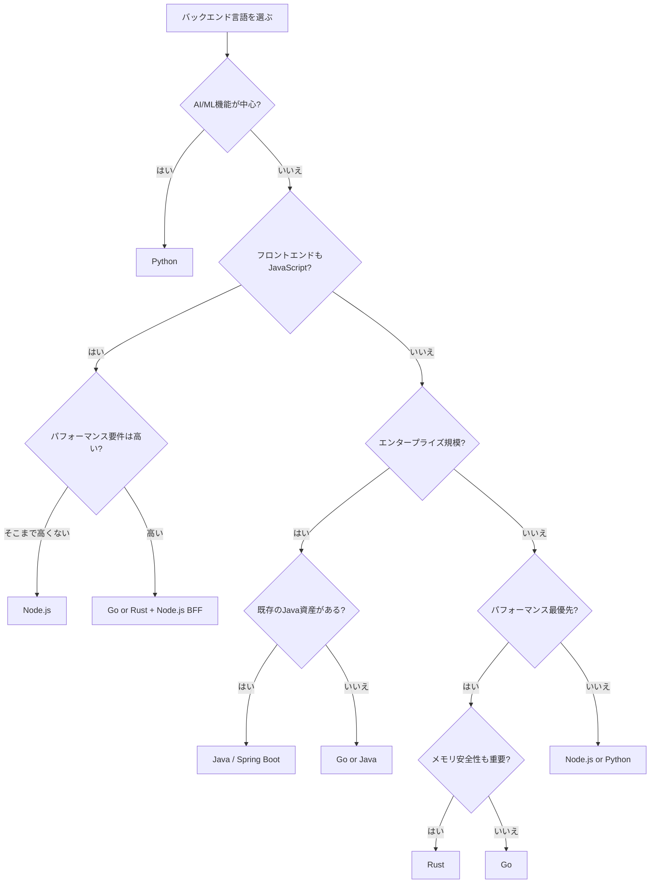

# バックエンド言語比較（Node.js vs Python vs Go vs Java vs Rust）

## はじめに

バックエンド開発における言語選択は、パフォーマンス、開発速度、採用力、長期的な保守性に直結する。本ページでは、現在バックエンド開発で主流の5つの言語/ランタイム — **Node.js**、**Python**、**Go**、**Java**、**Rust** — を多角的に比較する。

## 各言語の誕生背景

| 言語 | 登場年 | 開発者/組織 | 誕生の背景 |
| --- | --- | --- | --- |
| Node.js | 2009年 | Ryan Dahl | ブラウザ外でJavaScriptを実行。非同期I/Oによるスケーラブルなサーバー |
| Python | 1991年 | Guido van Rossum | 読みやすさを重視した汎用言語。「Pythonic」な記述スタイル |
| Go | 2009年 | Google（Robert Griesemer, Rob Pike, Ken Thompson） | C++のコンパイル速度・依存管理への不満から。シンプルで並行処理に強い言語 |
| Java | 1995年 | Sun Microsystems（James Gosling） | "Write Once, Run Anywhere"。プラットフォーム非依存の実行環境 |
| Rust | 2015年（1.0） | Mozilla（Graydon Hoare） | C/C++のメモリ安全性問題を型システムで解決。ゼロコスト抽象化 |

## 各言語の位置づけ


## Node.js

### 概要

Node.jsはV8エンジン上でJavaScriptを実行するランタイム環境。イベントループベースの非同期I/Oが特徴。

```javascript
// Express.js でのREST API
const express = require('express');
const app = express();

app.get('/api/users', async (req, res) => {
  const users = await db.query('SELECT * FROM users');
  res.json(users);
});

app.listen(3000);
```

### 得意分野

- リアルタイムアプリケーション（チャット、通知）
- I/O集約型のAPI
- BFF（Backend for Frontend）
- フロントエンドと同一言語で開発（フルスタックJS）

### 主要フレームワーク

| フレームワーク | 特徴 |
| --- | --- |
| Express | 最も広く使われる。ミニマル |
| Fastify | Express の2-3倍高速 |
| NestJS | Angular風の構造化されたFW。エンタープライズ向け |
| Hono | 超軽量。Edge Runtime対応 |

## Python

### 概要

Pythonは読みやすさと書きやすさを重視した汎用言語。データサイエンス・AI/ML分野では圧倒的な存在感を持つ。

```python
# FastAPI でのREST API
from fastapi import FastAPI

app = FastAPI()

@app.get("/api/users")
async def get_users():
    users = await db.fetch_all("SELECT * FROM users")
    return users
```

### 得意分野

- AI/ML・データサイエンス
- Web API（Django, FastAPI）
- スクリプト・自動化
- プロトタイピング

### 主要フレームワーク

| フレームワーク | 特徴 |
| --- | --- |
| Django | バッテリー同梱のフルスタックFW |
| FastAPI | 型ヒント活用。高速。自動ドキュメント生成 |
| Flask | ミニマルなマイクロFW |
| Litestar | FastAPIの代替。パフォーマンス重視 |

## Go

### 概要

GoはGoogleが開発したコンパイル言語。シンプルな構文、高速なコンパイル、ゴルーチンによる軽量並行処理が特徴。

```go
// net/http でのREST API
func main() {
    http.HandleFunc("/api/users", func(w http.ResponseWriter, r *http.Request) {
        users, _ := db.Query("SELECT * FROM users")
        json.NewEncoder(w).Encode(users)
    })
    http.ListenAndServe(":3000", nil)
}
```

### 得意分野

- マイクロサービス
- CLI ツール
- インフラツール（Docker, Kubernetes, Terraform）
- 高並行処理が必要なシステム

### 主要フレームワーク

| フレームワーク | 特徴 |
| --- | --- |
| net/http（標準ライブラリ） | フレームワーク不要で十分な機能 |
| Gin | 高速なHTTPルーター |
| Echo | ミニマルで高機能 |
| Fiber | Express風のAPI。高パフォーマンス |

## Java

### 概要

JavaはJVM（Java Virtual Machine）上で動作するオブジェクト指向言語。エンタープライズ分野で長年の実績を持つ。

```java
// Spring Boot でのREST API
@RestController
@RequestMapping("/api/users")
public class UserController {
    @Autowired
    private UserService userService;

    @GetMapping
    public List<User> getUsers() {
        return userService.findAll();
    }
}
```

### 得意分野

- エンタープライズシステム（銀行、保険、大企業）
- Android アプリケーション（Kotlin も含む）
- 大規模分散システム
- バッチ処理

### 主要フレームワーク

| フレームワーク | 特徴 |
| --- | --- |
| Spring Boot | デファクトスタンダード。膨大なエコシステム |
| Quarkus | GraalVM ネイティブ対応。起動が高速 |
| Micronaut | コンパイル時DI。低メモリ使用 |
| Jakarta EE | 旧 Java EE。標準仕様ベース |

## Rust

### 概要

Rustは所有権システムによりコンパイル時にメモリ安全性を保証する言語。C/C++に匹敵するパフォーマンスをメモリ安全に実現する。

```rust
// Axum でのREST API
#[tokio::main]
async fn main() {
    let app = Router::new()
        .route("/api/users", get(get_users));

    let listener = tokio::net::TcpListener::bind("0.0.0.0:3000")
        .await.unwrap();
    axum::serve(listener, app).await.unwrap();
}

async fn get_users() -> Json<Vec<User>> {
    let users = db::fetch_all_users().await;
    Json(users)
}
```

### 得意分野

- システムプログラミング
- WebAssembly
- 高パフォーマンスが求められるバックエンド
- セキュリティ重視のシステム

### 主要フレームワーク

| フレームワーク | 特徴 |
| --- | --- |
| Axum | Tokioベース。型安全なルーティング |
| Actix Web | 非常に高速。アクターモデル |
| Rocket | 使いやすさ重視 |
| Warp | フィルター合成ベースのAPI |

## パフォーマンス比較

### ベンチマーク傾向（Web APIシナリオ）

| 指標 | Rust | Go | Java | Node.js | Python |
| --- | --- | --- | --- | --- | --- |
| **リクエスト/秒** | 最高 | 高 | 高 | 中 | 低 |
| **レイテンシ (p99)** | 最低 | 低 | 中 | 中 | 高 |
| **メモリ使用量** | 最少 | 少 | 多 | 中 | 中 |
| **起動時間** | 高速 | 最速 | 遅い（JVM） | 高速 | 高速 |
| **CPU使用率** | 最低 | 低 | 中 | 中 | 高 |

> ベンチマーク結果はフレームワークや設定により大きく異なる。上記は一般的な傾向を示す。

### 並行処理モデルの比較


## 総合比較表

| 項目 | Node.js | Python | Go | Java | Rust |
| --- | --- | --- | --- | --- | --- |
| **型システム** | 動的（TSで静的可） | 動的（型ヒントあり） | 静的 | 静的 | 静的 |
| **実行速度** | 中 | 低 | 高 | 高 | 最高 |
| **開発速度** | 高 | 最高 | 中〜高 | 中 | 低 |
| **学習コスト** | 低 | 最低 | 低〜中 | 中〜高 | 高 |
| **パッケージ管理** | npm | pip / Poetry / uv | go modules | Maven / Gradle | Cargo |
| **メモリ管理** | GC | GC | GC | GC | 所有権システム |
| **並行処理** | イベントループ | asyncio / multiprocess | ゴルーチン | スレッド / Virtual Threads | async/await + Tokio |
| **エコシステム** | 非常に豊富 | 非常に豊富 | 充実 | 非常に豊富 | 成長中 |
| **求人数** | 多い | 多い | 増加中 | 最多 | 少ない（増加中） |

## ユースケース別の推奨

| ユースケース | 推奨言語 | 理由 |
| --- | --- | --- |
| スタートアップMVP | Node.js / Python | 開発速度重視。フルスタックJS or 豊富なライブラリ |
| AI/MLバックエンド | Python | TensorFlow, PyTorch, scikit-learn のエコシステム |
| マイクロサービス | Go | 軽量バイナリ、高速起動、低メモリ消費 |
| エンタープライズ | Java | 豊富な実績、Spring エコシステム、人材確保 |
| ハイパフォーマンス | Rust | メモリ安全 + C/C++並みの性能 |
| リアルタイムAPI | Node.js / Go | 非同期I/O / ゴルーチンによる大量接続処理 |
| CLIツール | Go / Rust | シングルバイナリ配布、クロスコンパイル |
| インフラツール | Go | Docker, K8s, Terraform 等の実績 |

## 選定フローチャート



## クラウドサービスとの相性

| クラウドサービス | Node.js | Python | Go | Java | Rust |
| --- | --- | --- | --- | --- | --- |
| **AWS Lambda** | 最適 | 最適 | 良好 | コールドスタート課題 | 良好 |
| **Google Cloud Run** | 良好 | 良好 | 最適 | 良好 | 最適 |
| **Cloudflare Workers** | 最適 | 非対応 | 非対応 | 非対応 | WASM対応 |
| **コンテナ (ECS/EKS)** | 良好 | 良好 | 最適 | 良好 | 最適 |

## 2025-2026年のトレンド

- **Rust の採用拡大**: AWS, Microsoft, Google がインフラ層でRust採用を加速
- **Python の高速化**: Faster CPython プロジェクト、Mojo 言語の登場
- **Java の復権**: Virtual Threads (Project Loom)、GraalVM ネイティブイメージ
- **Go の安定成長**: ジェネリクス導入後のエコシステム成熟
- **Node.js の進化**: Bun, Deno との競争による高速化

## まとめ

- **Node.js**: フルスタックJS開発、リアルタイムアプリに最適
- **Python**: AI/ML・データサイエンス、プロトタイピングに最適
- **Go**: マイクロサービス・インフラツール、並行処理に最適
- **Java**: エンタープライズ、大規模チーム開発に最適
- **Rust**: ハイパフォーマンス・メモリ安全性が求められるシステムに最適

「最強の言語」は存在しない。プロジェクトの要件、チームのスキルセット、長期的な保守性を考慮して選択することが重要である。

## 参考文献

- [Node.js 公式ドキュメント](https://nodejs.org/docs/latest/api/)
- [Python 公式ドキュメント](https://docs.python.org/ja/3/)
- [Go 公式ドキュメント](https://go.dev/doc/)
- [Java (OpenJDK) 公式ドキュメント](https://openjdk.org/)
- [Rust 公式ドキュメント](https://doc.rust-lang.org/book/)
- [TechEmpower Framework Benchmarks](https://www.techempower.com/benchmarks/)
- [Stack Overflow Developer Survey](https://survey.stackoverflow.co/)
- [The State of Developer Ecosystem (JetBrains)](https://www.jetbrains.com/lp/devecosystem/)
- [TIOBE Programming Community Index](https://www.tiobe.com/tiobe-index/)
