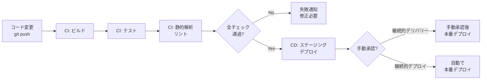
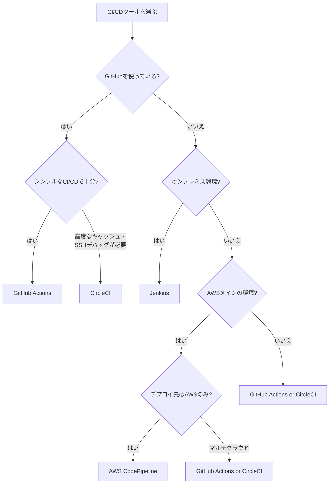

# CI/CD比較（GitHub Actions vs CircleCI vs Jenkins vs AWS CodePipeline）

## はじめに

CI/CD（継続的インテグレーション / 継続的デリバリー）は、コードの変更を自動的にビルド・テスト・デプロイするプラクティスである。手動リリースに伴うヒューマンエラーを排除し、リリースサイクルを短縮することで、ソフトウェアの品質と開発速度を両立させる。

本ページでは、現在主流の4つのCI/CDツール — **GitHub Actions**、**CircleCI**、**Jenkins**、**AWS CodePipeline** — を比較する。

## CI/CDとは

### CI（継続的インテグレーション）

開発者がコードを頻繁にメインブランチに統合し、その都度自動でビルド・テストを実行する手法。

### CD（継続的デリバリー / デプロイ）

- **継続的デリバリー**: 本番リリース可能な状態を常に維持（リリースは手動承認）
- **継続的デプロイ**: テスト通過後に自動で本番環境にデプロイ



## 各ツールの誕生背景

| ツール | 登場年 | 開発元 | 背景 |
| --- | --- | --- | --- |
| Jenkins | 2011年 | コミュニティ（元Hudson） | オンプレミスCI/CDの草分け。プラグインによる拡張性 |
| CircleCI | 2011年 | CircleCI Inc. | クラウドネイティブなCI/CD。設定の簡素化 |
| AWS CodePipeline | 2015年 | AWS | AWSサービスとの統合。マネージドCI/CD |
| GitHub Actions | 2019年 | GitHub (Microsoft) | GitHubリポジトリとの統合。YAMLベースのワークフロー |

## 各ツールの全体像

```mermaid
graph TB
    subgraph GitHub Actions
        GA1[GitHub リポジトリ] --> GA2[.github/workflows/*.yml]
        GA2 --> GA3[GitHub-hosted Runner<br/>or Self-hosted Runner]
        GA3 --> GA4[Marketplace Actions]
    end

    subgraph CircleCI
        CC1[GitHub/Bitbucket] --> CC2[.circleci/config.yml]
        CC2 --> CC3[CircleCI Cloud<br/>or Self-hosted]
        CC3 --> CC4[Orbs<br/>再利用可能パッケージ]
    end

    subgraph Jenkins
        JK1[任意のSCM] --> JK2[Jenkinsfile]
        JK2 --> JK3[Jenkins Server<br/>セルフホスト]
        JK3 --> JK4[1800+ Plugins]
    end

    subgraph AWS CodePipeline
        CP1[CodeCommit/GitHub] --> CP2[パイプライン定義]
        CP2 --> CP3[CodeBuild]
        CP3 --> CP4[CodeDeploy]
    end
```



## GitHub Actions

### 概要

GitHub ActionsはGitHubに統合されたCI/CDサービス。リポジトリ内の`.github/workflows/`にYAMLファイルを配置するだけでワークフローが動作する。

### 設定例

```yaml
# .github/workflows/ci.yml
name: CI

on:
  push:
    branches: [main]
  pull_request:
    branches: [main]

jobs:
  test:
    runs-on: ubuntu-latest
    steps:
      - uses: actions/checkout@v4
      - uses: actions/setup-node@v4
        with:
          node-version: '20'
          cache: 'npm'
      - run: npm ci
      - run: npm run lint
      - run: npm test
      - run: npm run build

  deploy:
    needs: test
    if: github.ref == 'refs/heads/main'
    runs-on: ubuntu-latest
    steps:
      - uses: actions/checkout@v4
      - uses: aws-actions/configure-aws-credentials@v4
        with:
          role-to-assume: ${{ secrets.AWS_ROLE_ARN }}
          aws-region: ap-northeast-1
      - run: |
          docker build -t my-app .
          docker push $ECR_URI/my-app:latest
```

### メリット

| メリット | 説明 |
| --- | --- |
| **GitHub統合** | PR、Issue、リリースとシームレスに連携 |
| **Marketplace** | 20,000以上の再利用可能なAction |
| **無料枠が充実** | Public リポジトリは無制限。Privateも2,000分/月（Free） |
| **設定が簡単** | YAMLベースで直感的 |
| **Matrix Build** | 複数の言語バージョン・OSでの並列テストが容易 |

### デメリット

| デメリット | 説明 |
| --- | --- |
| **GitHub依存** | GitHubから移行する場合にワークフロー書き直し |
| **デバッグが難しい** | ローカルでのテスト実行が困難（act等で部分的に可能） |
| **実行時間制限** | ジョブ最大6時間、ワークフロー最大35日 |
| **同時実行制限** | Freeプランで20ジョブ同時 |

## CircleCI

### 概要

CircleCIはクラウドネイティブなCI/CDプラットフォーム。高速なビルドと柔軟なキャッシュ機構が特徴。

### 設定例

```yaml
# .circleci/config.yml
version: 2.1

orbs:
  node: circleci/node@5.2.0

jobs:
  test:
    docker:
      - image: cimg/node:20.0
      - image: cimg/postgres:16.0
    steps:
      - checkout
      - node/install-packages
      - run: npm run lint
      - run: npm test
      - store_test_results:
          path: test-results

  deploy:
    docker:
      - image: cimg/base:current
    steps:
      - checkout
      - setup_remote_docker
      - run: |
          docker build -t my-app .
          docker push $ECR_URI/my-app:latest

workflows:
  build-and-deploy:
    jobs:
      - test
      - deploy:
          requires:
            - test
          filters:
            branches:
              only: main
```

### メリット

| メリット | 説明 |
| --- | --- |
| **高速ビルド** | Docker Layer Caching、並列実行による高速化 |
| **Orbs** | 再利用可能な設定パッケージ。設定の簡素化 |
| **柔軟なキャッシュ** | 依存関係のキャッシュが細かく制御可能 |
| **SSH デバッグ** | ビルド環境にSSH接続してデバッグ可能 |
| **Insights** | ビルド時間、成功率のダッシュボード |

### デメリット

| デメリット | 説明 |
| --- | --- |
| **料金** | 大規模プロジェクトではGitHub Actionsより高額になりやすい |
| **設定の複雑さ** | 高度な設定は複雑になりがち |
| **GitHub統合の深さ** | GitHub Actionsほどのシームレスな統合はない |
| **サードパーティ** | GitHub/GitLabの追加サービスという位置づけ |

## Jenkins

### 概要

Jenkinsはオープンソースの自動化サーバー。自前のサーバーにインストールして運用する。1800以上のプラグインにより、あらゆるCI/CDパイプラインを構築可能。

### 設定例

```groovy
// Jenkinsfile (Declarative Pipeline)
pipeline {
    agent any

    stages {
        stage('Build') {
            steps {
                sh 'npm ci'
                sh 'npm run build'
            }
        }
        stage('Test') {
            parallel {
                stage('Unit Tests') {
                    steps {
                        sh 'npm run test:unit'
                    }
                }
                stage('Integration Tests') {
                    steps {
                        sh 'npm run test:integration'
                    }
                }
            }
        }
        stage('Deploy') {
            when {
                branch 'main'
            }
            steps {
                sh 'docker build -t my-app .'
                sh 'docker push $ECR_URI/my-app:latest'
            }
        }
    }

    post {
        failure {
            slackSend(message: "Build Failed: ${env.JOB_NAME}")
        }
    }
}
```

### メリット

| メリット | 説明 |
| --- | --- |
| **完全な制御** | サーバー、ネットワーク、プラグインを自由に設定 |
| **プラグイン** | 1800以上のプラグイン。ほぼ何でも対応可能 |
| **オンプレミス対応** | インターネット非接続環境でも利用可能 |
| **無料** | オープンソース。ライセンス費用なし |
| **歴史と実績** | 最も広く使われたCI/CDツール。情報が豊富 |

### デメリット

| デメリット | 説明 |
| --- | --- |
| **運用負荷** | サーバー管理、アップデート、セキュリティパッチが必要 |
| **UIが古い** | 他のツールと比べてUIが洗練されていない |
| **設定の複雑さ** | Groovy DSLの学習コスト。プラグインの互換性問題 |
| **スケーリング** | マスター/エージェント構成の管理が必要 |
| **初期構築コスト** | ゼロから構築する場合の時間と労力 |

## AWS CodePipeline

### 概要

AWS CodePipelineはAWSのマネージドCI/CDサービス。CodeCommit（ソース管理）、CodeBuild（ビルド）、CodeDeploy（デプロイ）と組み合わせて使う。

### 構成

```
CodePipeline（オーケストレーション）
├── Source Stage: GitHub / CodeCommit
├── Build Stage: CodeBuild
│   ├── buildspec.yml
│   ├── Docker Build
│   └── テスト実行
├── Approval Stage: 手動承認（任意）
└── Deploy Stage: CodeDeploy / ECS / CloudFormation
```

### buildspec.yml の例

```yaml
# buildspec.yml (CodeBuild)
version: 0.2

phases:
  install:
    runtime-versions:
      nodejs: 20
  pre_build:
    commands:
      - npm ci
      - echo Logging in to Amazon ECR...
      - aws ecr get-login-password | docker login --username AWS --password-stdin $ECR_URI
  build:
    commands:
      - npm run lint
      - npm test
      - docker build -t $ECR_URI/my-app:$CODEBUILD_RESOLVED_SOURCE_VERSION .
  post_build:
    commands:
      - docker push $ECR_URI/my-app:$CODEBUILD_RESOLVED_SOURCE_VERSION

artifacts:
  files:
    - imagedefinitions.json
```

### メリット

| メリット | 説明 |
| --- | --- |
| **AWS統合** | ECS, EKS, Lambda, S3等へのデプロイが容易 |
| **IAMセキュリティ** | きめ細かいアクセス制御 |
| **マネージド** | サーバー管理不要 |
| **パイプラインの可視化** | ステージごとの進捗を視覚的に確認 |

### デメリット

| デメリット | 説明 |
| --- | --- |
| **AWSロックイン** | AWS以外の環境では利用不可 |
| **柔軟性の制約** | GitHub Actionsほどの柔軟なワークフロー定義ができない |
| **エコシステム** | Marketplace / Orbsのような再利用パッケージが乏しい |
| **コスト** | パイプライン数に応じた課金（$1/月/パイプライン + CodeBuild費用） |
| **学習コスト** | CodePipeline + CodeBuild + CodeDeploy の複数サービスの理解が必要 |

## 総合比較表

| 項目 | GitHub Actions | CircleCI | Jenkins | AWS CodePipeline |
| --- | --- | --- | --- | --- |
| **ホスティング** | クラウド（+セルフホスト） | クラウド（+セルフホスト） | セルフホスト | クラウド（AWS） |
| **設定形式** | YAML | YAML | Groovy (Jenkinsfile) | YAML + Console |
| **学習コスト** | 低 | 低〜中 | 高 | 中 |
| **運用コスト** | 低 | 中 | 高（サーバー管理） | 低〜中 |
| **カスタマイズ性** | 高 | 高 | 非常に高 | 中 |
| **エコシステム** | Marketplace (20K+) | Orbs (3K+) | Plugins (1800+) | 限定的 |
| **Git統合** | 最高（GitHub） | 良好 | 良好 | 良好 |
| **デバッグ** | やや困難 | SSHデバッグ可能 | 完全に制御可能 | CloudWatch Logs |
| **セキュリティ** | GitHub Secrets / OIDC | Contexts | 自前管理 | IAM |

## 料金比較

| プラン | GitHub Actions | CircleCI | Jenkins | AWS CodePipeline |
| --- | --- | --- | --- | --- |
| **無料枠** | Public: 無制限<br/>Private: 2,000分/月 | 6,000分/月<br/>(30クレジット) | 無料（OSS） | 1パイプライン無料 |
| **有料プラン** | Team: $4/user/月<br/>+ 追加分$0.008/分 | Performance: $15/月〜<br/>(クレジット制) | サーバー費用のみ | $1/パイプライン/月<br/>+ CodeBuild費用 |
| **大規模利用** | Enterprise: 見積 | Scale: 見積 | サーバー費用 | 利用量に応じて |

> 料金は2025年時点の概算。最新の料金は各公式サイトを参照。

## CI/CDパイプラインのベストプラクティス

| カテゴリ | ベストプラクティス |
| --- | --- |
| **速度** | キャッシュ活用、並列実行、不要なステップ削除 |
| **信頼性** | テストの安定化（Flaky Test排除）、べき等なデプロイ |
| **セキュリティ** | シークレット管理、OIDC認証、最小権限の原則 |
| **可視化** | ビルドステータスバッジ、Slack通知、ダッシュボード |
| **保守性** | 再利用可能なワークフロー/Orbs、設定のDRY化 |

## 選定フローチャート



## 組み合わせパターン

実際のプロジェクトでは、複数のツールを組み合わせることもある。

| パターン | 構成 | 用途 |
| --- | --- | --- |
| GitHub Actions + CodeDeploy | CI: GitHub Actions<br/>CD: AWS CodeDeploy | GitHub でCI、AWSへの安全なデプロイ |
| GitHub Actions + ArgoCD | CI: GitHub Actions<br/>CD: ArgoCD | GitOps。K8s環境への宣言的デプロイ |
| Jenkins + GitHub Actions | 重い処理: Jenkins (self-hosted)<br/>軽い処理: GitHub Actions | コスト最適化 |

## まとめ

- **GitHub Actions**: GitHubユーザーにとって最も手軽で強力。第一選択肢
- **CircleCI**: 高度なキャッシュ・デバッグ機能。大規模CI向け
- **Jenkins**: 完全な制御が必要な場合、オンプレミス環境に最適
- **AWS CodePipeline**: AWSにフルコミットしている場合のネイティブ選択肢

2025年現在、新規プロジェクトの多くは**GitHub Actions**を第一選択とし、特殊な要件がある場合に他のツールを検討するのが一般的である。

## 参考文献

- [GitHub Actions 公式ドキュメント](https://docs.github.com/ja/actions)
- [CircleCI 公式ドキュメント](https://circleci.com/docs/)
- [Jenkins 公式ドキュメント](https://www.jenkins.io/doc/)
- [AWS CodePipeline ユーザーガイド](https://docs.aws.amazon.com/codepipeline/latest/userguide/)
- [AWS CodeBuild ユーザーガイド](https://docs.aws.amazon.com/codebuild/latest/userguide/)
- [Martin Fowler - Continuous Integration](https://martinfowler.com/articles/continuousIntegration.html)
- [Jez Humble - Continuous Delivery](https://continuousdelivery.com/)
- [DORA Metrics (Google Cloud)](https://cloud.google.com/blog/products/devops-sre/using-the-four-keys-to-measure-your-devops-performance)
- [GitHub Actions Marketplace](https://github.com/marketplace?type=actions)
