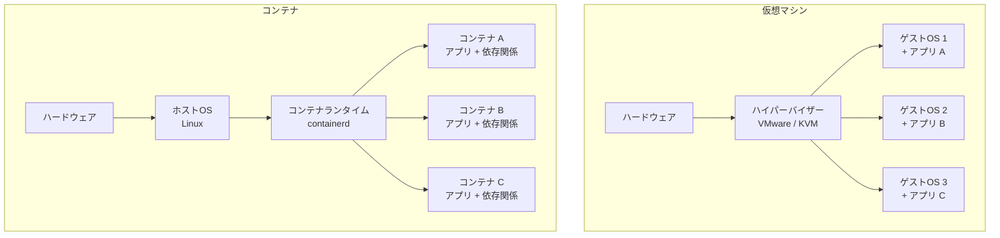
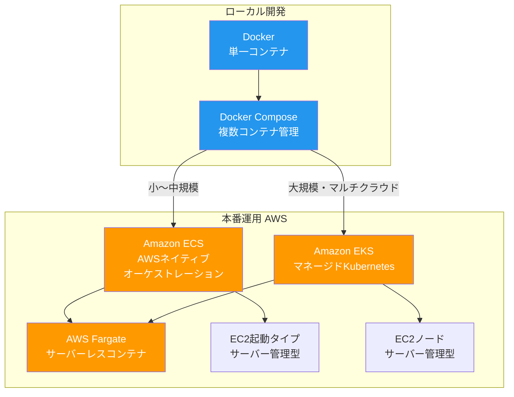
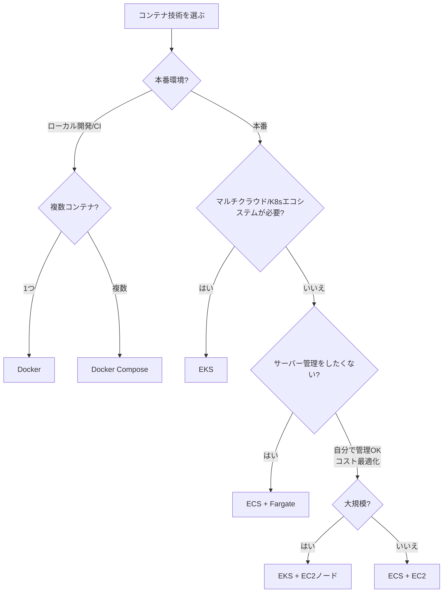

# コンテナ技術比較（Docker vs Docker Compose vs ECS vs EKS vs Fargate）

## はじめに

コンテナ技術は現代のソフトウェア開発・デプロイにおいて不可欠な存在となった。「開発環境では動くのに本番で動かない」という問題を解決し、アプリケーションの移植性と再現性を飛躍的に向上させた。本ページでは、コンテナの基礎から各技術の位置づけ、選定基準までを整理する。

## コンテナ技術の歴史

| 年 | 出来事 |
| --- | --- |
| 1979年 | chroot登場（UNIX V7）。プロセスのルートディレクトリを変更 |
| 2000年 | FreeBSD Jail。より完全なプロセス分離 |
| 2006年 | Google が cgroups を Linux カーネルに提案 |
| 2008年 | LXC（Linux Containers）登場。cgroups + namespaces を活用 |
| 2013年 | **Docker** 登場。コンテナ技術を一般開発者に普及 |
| 2014年 | **Kubernetes** Google がOSS公開 |
| 2014年 | **Amazon ECS** 発表 |
| 2015年 | Docker Compose 登場（旧 Fig） |
| 2017年 | **AWS Fargate** 発表。サーバーレスコンテナ |
| 2018年 | **Amazon EKS** 一般提供開始 |
| 2020年 | Kubernetes が Docker ランタイムを非推奨化（containerd推奨） |

## コンテナ vs 仮想マシン



| 項目 | 仮想マシン | コンテナ |
| --- | --- | --- |
| **分離レベル** | OSレベル（完全分離） | プロセスレベル |
| **起動時間** | 分単位 | 秒〜ミリ秒単位 |
| **サイズ** | GB単位 | MB単位 |
| **リソース効率** | 低い（ゲストOS分のオーバーヘッド） | 高い（カーネル共有） |
| **移植性** | 低い | 高い |
| **セキュリティ** | 高い（完全分離） | 中（カーネル共有） |

## 各技術の位置づけ



## Docker

### 概要

Dockerはコンテナの作成・実行・配布を行うプラットフォーム。Dockerfileからイメージを構築し、そのイメージからコンテナを起動する。

### 基本概念

| 概念 | 説明 |
| --- | --- |
| **Dockerfile** | イメージの設計図。ベースイメージ、依存関係、実行コマンドを記述 |
| **イメージ** | コンテナの「テンプレート」。読み取り専用のファイルシステム |
| **コンテナ** | イメージから起動された実行中のプロセス |
| **レジストリ** | イメージの保管場所（Docker Hub, ECR, GCR） |
| **ボリューム** | データの永続化。コンテナ外にデータを保持 |

### Dockerfile の例

```dockerfile
# Node.js アプリケーション
FROM node:20-slim AS builder
WORKDIR /app
COPY package*.json ./
RUN npm ci
COPY . .
RUN npm run build

FROM node:20-slim
WORKDIR /app
COPY --from=builder /app/dist ./dist
COPY --from=builder /app/node_modules ./node_modules
EXPOSE 3000
USER node
CMD ["node", "dist/index.js"]
```

### よく使うコマンド

```bash
# イメージのビルド
docker build -t my-app:latest .

# コンテナの起動
docker run -d -p 3000:3000 --name my-app my-app:latest

# 実行中のコンテナ確認
docker ps

# ログ確認
docker logs my-app

# コンテナに入る
docker exec -it my-app /bin/sh

# イメージの配布
docker push my-registry/my-app:latest
```

## Docker Compose

### 概要

Docker Composeは、複数のコンテナをまとめて定義・管理するツール。`docker-compose.yml`に全サービスの設定を記述し、1コマンドで環境全体を起動・停止できる。

### docker-compose.yml の例

```yaml
services:
  app:
    build: .
    ports:
      - "3000:3000"
    environment:
      - DATABASE_URL=postgresql://user:pass@db:5432/mydb
      - REDIS_URL=redis://cache:6379
    depends_on:
      db:
        condition: service_healthy
      cache:
        condition: service_started

  db:
    image: postgres:16
    volumes:
      - postgres_data:/var/lib/postgresql/data
    environment:
      POSTGRES_USER: user
      POSTGRES_PASSWORD: pass
      POSTGRES_DB: mydb
    healthcheck:
      test: ["CMD-SHELL", "pg_isready -U user"]
      interval: 5s
      timeout: 5s
      retries: 5

  cache:
    image: redis:7-alpine
    ports:
      - "6379:6379"

volumes:
  postgres_data:
```

### よく使うコマンド

```bash
# 全サービス起動
docker compose up -d

# ログ確認
docker compose logs -f app

# 全サービス停止・削除
docker compose down

# ボリュームも含めて削除
docker compose down -v

# 特定サービスの再ビルド
docker compose build app
```

## Amazon ECS（Elastic Container Service）

### 概要

ECSはAWSネイティブのコンテナオーケストレーションサービス。AWSサービスとの統合が深く、Kubernetes を必要としないシンプルなコンテナ管理を提供する。

### 基本概念

| 概念 | 説明 |
| --- | --- |
| **クラスター** | コンテナを実行する論理的なグループ |
| **タスク定義** | コンテナの設計図（イメージ、CPU/メモリ、ポート、環境変数） |
| **タスク** | タスク定義から起動されたコンテナの実行単位 |
| **サービス** | タスクの数を維持・管理する仕組み（常に3つ起動等） |
| **起動タイプ** | EC2（自分でサーバー管理）or Fargate（サーバーレス） |

### メリット

- AWSサービスとの深い統合（ALB, CloudWatch, IAM, VPC）
- Kubernetesより学習コストが低い
- Fargateとの組み合わせで運用負荷が極めて低い

### デメリット

- AWSロックイン
- Kubernetesほどの柔軟性・エコシステムがない
- マルチクラウドには不向き

## Amazon EKS（Elastic Kubernetes Service）

### 概要

EKSはAWSが提供するマネージドKubernetesサービス。Kubernetesのコントロールプレーンの運用をAWSが担い、ユーザーはワーカーノードとアプリケーションの管理に集中できる。

### Kubernetes の基本概念

| 概念 | 説明 |
| --- | --- |
| **Pod** | 1つ以上のコンテナのグループ。最小デプロイ単位 |
| **Deployment** | Podのレプリカ数管理、ローリングアップデート |
| **Service** | Podへのネットワークアクセスを提供（ロードバランシング） |
| **Ingress** | 外部からのHTTPルーティング |
| **ConfigMap / Secret** | 設定情報・機密情報の管理 |
| **Namespace** | リソースの論理的な分離 |

### メリット

- Kubernetesエコシステムの活用（Helm, ArgoCD, Istio等）
- マルチクラウド・オンプレミスとのポータビリティ
- きめ細かいリソース制御
- 大規模クラスタの運用に実績

### デメリット

- 学習コストが非常に高い
- 運用の複雑さ（ノード管理、アップグレード）
- 小規模チームにはオーバースペック
- コントロールプレーンの固定費用（約$73/月）

## AWS Fargate

### 概要

FargateはECS / EKSの「サーバーレスコンテナ」起動タイプ。EC2インスタンスの管理が不要で、コンテナに必要なCPU/メモリを指定するだけで実行できる。

### EC2起動タイプ vs Fargate

| 項目 | EC2起動タイプ | Fargate |
| --- | --- | --- |
| **サーバー管理** | 必要（パッチ適用、スケーリング） | 不要 |
| **料金** | EC2インスタンス料金 | vCPU + メモリの従量課金 |
| **起動速度** | インスタンス起動分遅い | 数十秒〜 |
| **GPU対応** | 対応 | 非対応 |
| **カスタマイズ** | 高い（カーネルパラメータ等） | 制限あり |
| **コスト効率** | 大規模で効率的 | 小〜中規模で効率的 |

### Fargateが適するケース

- サーバー管理を一切したくない
- トラフィックが可変（スケールアップ/ダウンが頻繁）
- 小〜中規模のマイクロサービス
- バッチ処理（必要な時だけ起動）

## 総合比較表

| 項目 | Docker | Docker Compose | ECS | EKS | Fargate |
| --- | --- | --- | --- | --- | --- |
| **用途** | コンテナ構築・実行 | ローカル複数コンテナ | 本番オーケストレーション | 本番K8sオーケストレーション | サーバーレスコンテナ |
| **環境** | ローカル/CI | ローカル/CI | AWS本番 | AWS本番 | AWS本番 |
| **学習コスト** | 低 | 低 | 中 | 高 | 中 |
| **運用コスト** | — | — | 中 | 高 | 低 |
| **スケーラビリティ** | 単一ホスト | 単一ホスト | 高 | 非常に高 | 高 |
| **マルチクラウド** | — | — | 不可 | 可能（K8s互換） | 不可 |
| **最小月額費用** | 無料 | 無料 | Fargate利用分 | ~$73 + ノード費用 | 利用分のみ |

## 選定フローチャート



## 構成パターン例

### パターン1: スタートアップ（小規模）

```
開発: Docker Compose
本番: ECS + Fargate
CI/CD: GitHub Actions → ECR → ECS
```

- サーバー管理不要
- 初期費用が低い
- 必要に応じてスケール

### パターン2: 中規模サービス

```
開発: Docker Compose
本番: ECS + Fargate + EC2（コスト最適化）
CI/CD: GitHub Actions → ECR → ECS
監視: CloudWatch + X-Ray
```

- ベースラインはEC2で、スパイクはFargateで吸収
- コスト効率と柔軟性のバランス

### パターン3: 大規模エンタープライズ

```
開発: Docker Compose + Skaffold
本番: EKS + EC2ノード + Fargate
CI/CD: ArgoCD (GitOps)
サービスメッシュ: Istio
監視: Prometheus + Grafana
```

- Kubernetesエコシステムをフル活用
- GitOpsによる宣言的デプロイ
- 高度な監視・トレーシング

## コンテナセキュリティのベストプラクティス

| カテゴリ | ベストプラクティス |
| --- | --- |
| **イメージ** | 公式ベースイメージを使用。不要なパッケージを含めない |
| **権限** | rootユーザーで実行しない（`USER node`） |
| **スキャン** | イメージの脆弱性スキャン（Trivy, Snyk, ECR Scan） |
| **シークレット** | 環境変数やDockerfile にシークレットを含めない。Secrets Manager使用 |
| **ネットワーク** | 必要なポートだけ公開。VPC内で通信 |
| **更新** | ベースイメージを定期的に更新 |

## まとめ

- **Docker**: コンテナ技術の基礎。全てのスタート地点
- **Docker Compose**: ローカル開発での複数コンテナ管理に最適
- **ECS**: AWSネイティブのシンプルなオーケストレーション
- **EKS**: Kubernetesが必要な大規模・マルチクラウド環境向け
- **Fargate**: サーバー管理不要のサーバーレスコンテナ実行環境

「まずはDocker → Docker Compose → ECS + Fargateの順に習得し、必要に応じてEKSへ」が推奨の学習パスである。

## 参考文献

- [Docker 公式ドキュメント](https://docs.docker.com/)
- [Docker Compose 公式ドキュメント](https://docs.docker.com/compose/)
- [Amazon ECS 開発者ガイド](https://docs.aws.amazon.com/AmazonECS/latest/developerguide/)
- [Amazon EKS ユーザーガイド](https://docs.aws.amazon.com/eks/latest/userguide/)
- [AWS Fargate ドキュメント](https://docs.aws.amazon.com/AmazonECS/latest/developerguide/AWS_Fargate.html)
- [Kubernetes 公式ドキュメント](https://kubernetes.io/ja/docs/home/)
- [The Twelve-Factor App](https://12factor.net/ja/)
- [CNCF Cloud Native Landscape](https://landscape.cncf.io/)
- [Docker セキュリティベストプラクティス](https://docs.docker.com/develop/security-best-practices/)
