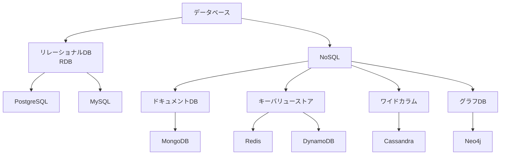
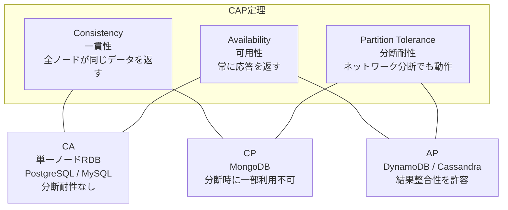
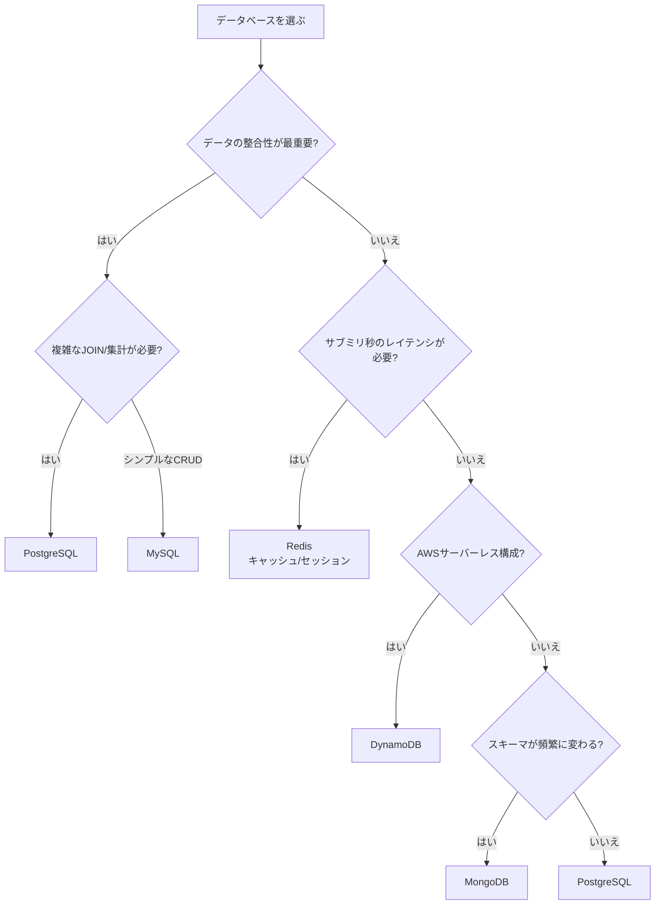

# データベース比較（PostgreSQL vs MySQL vs MongoDB vs DynamoDB vs Redis）

## はじめに

データベースはアプリケーションの基盤であり、その選択はシステムのパフォーマンス、スケーラビリティ、開発体験に大きく影響する。本ページでは、**RDB（PostgreSQL, MySQL）**、**ドキュメントDB（MongoDB）**、**マネージドNoSQL（DynamoDB）**、**インメモリKVS（Redis）** の5つを比較する。

## データベースの分類



## 各データベースの誕生背景

| DB | 登場年 | 開発元 | 誕生の背景 |
| --- | --- | --- | --- |
| PostgreSQL | 1996年 | PostgreSQL Global Dev Group | Ingresプロジェクトの後継。学術的に正しいRDBの実現 |
| MySQL | 1995年 | MySQL AB → Oracle | 高速で手軽なRDB。Web開発のデファクト |
| MongoDB | 2009年 | MongoDB Inc. | スキーマレスで柔軟なドキュメント指向DB。アジャイル開発向け |
| DynamoDB | 2012年 | AWS | Amazon社内のDynamoペーパーに基づくフルマネージドNoSQL |
| Redis | 2009年 | Salvatore Sanfilippo | 超高速インメモリデータストア。キャッシュ・セッション管理 |

## RDB vs NoSQL

### 基本概念

| 項目 | RDB (PostgreSQL / MySQL) | NoSQL (MongoDB / DynamoDB / Redis) |
| --- | --- | --- |
| **データモデル** | テーブル（行と列） | ドキュメント / キーバリュー / グラフ 等 |
| **スキーマ** | 固定（事前定義が必要） | 柔軟（スキーマレス or スキーマオンリード） |
| **クエリ言語** | SQL | 独自API / クエリ言語 |
| **トランザクション** | ACID完全サポート | 製品により異なる（BASEモデルが多い） |
| **スケーリング** | 垂直スケーリングが基本 | 水平スケーリングが得意 |
| **結合（JOIN）** | 得意 | 苦手（非推奨のことが多い） |

### ACID vs BASE

| 特性 | ACID（RDB） | BASE（NoSQL） |
| --- | --- | --- |
| **A** | Atomicity（原子性） | **B**asically **A**vailable（基本的に利用可能） |
| **C** | Consistency（一貫性） | **S**oft state（柔軟な状態） |
| **I** | Isolation（分離性） | **E**ventual consistency（結果整合性） |
| **D** | Durability（永続性） | — |

## CAP定理

分散システムにおいて、以下の3つのうち同時に2つまでしか保証できないという定理。



> 実際にはネットワーク分断は不可避なため、CP か AP の選択となることが多い。

## 各データベースの詳細

### PostgreSQL

**「世界で最も先進的なオープンソースRDB」**

```sql
-- PostgreSQLの特徴的な機能
-- JSONB型：RDB内でNoSQL的なデータ保持
CREATE TABLE products (
  id SERIAL PRIMARY KEY,
  name VARCHAR(100),
  attributes JSONB  -- 柔軟な属性をJSONで保持
);

-- JSONB検索
SELECT * FROM products
WHERE attributes->>'color' = 'red';

-- 全文検索
SELECT * FROM products
WHERE to_tsvector('japanese', name) @@ to_tsquery('japanese', 'スマホ');
```

| 項目 | 内容 |
| --- | --- |
| **強み** | 高度なSQL準拠、JSONB、全文検索、拡張性（PostGIS等）、MVCC |
| **弱み** | MySQL比で設定が複雑、レプリケーション設定がやや煩雑 |
| **最大データ量** | 理論上無制限（テーブル32TB） |
| **マネージドサービス** | Amazon RDS / Aurora、Google Cloud SQL、Supabase |

### MySQL

**「世界で最も普及しているオープンソースRDB」**

```sql
-- MySQLの特徴
-- InnoDBストレージエンジン（デフォルト）
CREATE TABLE users (
  id BIGINT AUTO_INCREMENT PRIMARY KEY,
  name VARCHAR(100) NOT NULL,
  email VARCHAR(255) UNIQUE,
  created_at TIMESTAMP DEFAULT CURRENT_TIMESTAMP
) ENGINE=InnoDB;
```

| 項目 | 内容 |
| --- | --- |
| **強み** | 高速な読み取り、シンプルな設定、豊富な情報、レプリケーション容易 |
| **弱み** | PostgreSQL比でSQL準拠度が低い、JSONB相当機能が弱い |
| **最大データ量** | InnoDB: 64TB |
| **マネージドサービス** | Amazon RDS / Aurora MySQL、Google Cloud SQL、PlanetScale |

### MongoDB

**「最も人気のあるドキュメント指向NoSQL」**

```javascript
// MongoDBのドキュメント
db.users.insertOne({
  name: "田中太郎",
  email: "tanaka@example.com",
  address: {
    city: "東京",
    zip: "100-0001"
  },
  tags: ["developer", "nodejs"],
  createdAt: new Date()
});

// 柔軟なクエリ
db.users.find({
  "address.city": "東京",
  tags: { $in: ["developer"] }
});

// Aggregation Pipeline
db.orders.aggregate([
  { $match: { status: "completed" } },
  { $group: { _id: "$userId", total: { $sum: "$amount" } } },
  { $sort: { total: -1 } }
]);
```

| 項目 | 内容 |
| --- | --- |
| **強み** | スキーマレス、水平スケーリング、Aggregation Pipeline、柔軟なデータモデル |
| **弱み** | JOINが苦手（$lookup）、トランザクションサポートが限定的、メモリ消費大 |
| **最大データ量** | ドキュメント16MB、コレクション無制限 |
| **マネージドサービス** | MongoDB Atlas、Amazon DocumentDB |

### DynamoDB

**「AWSのフルマネージド NoSQL」**

```python
# DynamoDB操作例（boto3）
import boto3

dynamodb = boto3.resource('dynamodb')
table = dynamodb.Table('Users')

# 書き込み
table.put_item(Item={
    'userId': 'user-123',
    'name': '田中太郎',
    'email': 'tanaka@example.com'
})

# 読み取り（キー指定）
response = table.get_item(Key={'userId': 'user-123'})

# クエリ（GSI使用）
response = table.query(
    IndexName='email-index',
    KeyConditionExpression=Key('email').eq('tanaka@example.com')
)
```

| 項目 | 内容 |
| --- | --- |
| **強み** | フルマネージド、自動スケーリング、単桁ミリ秒レイテンシ、サーバーレス連携 |
| **弱み** | クエリの柔軟性が低い、アクセスパターン事前設計必須、コスト予測困難 |
| **料金モデル** | オンデマンド or プロビジョンドキャパシティ |
| **統合サービス** | Lambda, API Gateway, AppSync との統合が容易 |

### Redis

**「世界で最も速いインメモリデータストア」**

```bash
# Redis操作例
# 文字列
SET user:123:name "田中太郎"
GET user:123:name

# ハッシュ
HSET user:123 name "田中太郎" email "tanaka@example.com"
HGETALL user:123

# ソート済みセット（ランキング）
ZADD leaderboard 100 "user:123"
ZADD leaderboard 200 "user:456"
ZREVRANGE leaderboard 0 9 WITHSCORES

# Pub/Sub
PUBLISH chat:room1 "Hello!"

# TTL（有効期限）
SET session:abc123 "user-data" EX 3600  # 1時間で自動削除
```

| 項目 | 内容 |
| --- | --- |
| **強み** | 超低レイテンシ（サブミリ秒）、豊富なデータ構造、Pub/Sub、Lua スクリプト |
| **弱み** | メモリ制約、永続化に注意が必要、複雑なクエリ不可 |
| **主な用途** | キャッシュ、セッション管理、ランキング、リアルタイムカウンター、メッセージキュー |
| **マネージドサービス** | Amazon ElastiCache、Redis Cloud、Upstash |

## 総合比較表

| 項目 | PostgreSQL | MySQL | MongoDB | DynamoDB | Redis |
| --- | --- | --- | --- | --- | --- |
| **カテゴリ** | RDB | RDB | ドキュメントDB | KVS/ドキュメント | インメモリKVS |
| **データモデル** | テーブル | テーブル | ドキュメント(JSON) | KV/ドキュメント | KV/複合データ構造 |
| **スキーマ** | 固定 | 固定 | 柔軟 | 柔軟 | スキーマなし |
| **トランザクション** | 完全ACID | 完全ACID | マルチドキュメント対応 | 制限あり | 制限あり |
| **スケーリング** | 垂直+論理レプリカ | 垂直+レプリカ | 水平シャーディング | 自動水平 | クラスタリング |
| **レイテンシ** | ミリ秒 | ミリ秒 | ミリ秒 | 単桁ミリ秒 | サブミリ秒 |
| **学習コスト** | 中 | 低 | 低〜中 | 中 | 低 |
| **運用コスト** | 中 | 低〜中 | 中 | 低（マネージド） | 低〜中 |
| **ライセンス** | PostgreSQL License | GPL v2 | SSPL | プロプライエタリ | BSD/SSPL |

## ユースケース別の推奨

| ユースケース | 推奨DB | 理由 |
| --- | --- | --- |
| 一般的なWebアプリ | PostgreSQL / MySQL | ACID、SQL、実績豊富 |
| コンテンツ管理(CMS) | MongoDB / PostgreSQL | 柔軟なスキーマ or JSONB |
| ECサイト | PostgreSQL | 複雑なクエリ、トランザクション |
| IoTデータ収集 | DynamoDB | 大量書き込み、自動スケーリング |
| セッション/キャッシュ | Redis | サブミリ秒のレイテンシ |
| リアルタイムランキング | Redis | ソート済みセット |
| サーバーレスアプリ | DynamoDB | Lambda統合、マネージド |
| 地理空間データ | PostgreSQL (PostGIS) | 高度なGIS機能 |
| ログ分析 | MongoDB / Elasticsearch | スキーマレス、集約処理 |

## 選定フローチャート



## 組み合わせパターン

実際のシステムでは、複数のデータベースを組み合わせて使うことが一般的（Polyglot Persistence）。

| パターン | 構成 | 用途 |
| --- | --- | --- |
| RDB + Redis | PostgreSQL + Redis | メインDB + キャッシュ層 |
| RDB + MongoDB | PostgreSQL + MongoDB | トランザクション + ログ/メタデータ |
| DynamoDB + Redis | DynamoDB + ElastiCache | サーバーレス + ホットデータキャッシュ |
| RDB + Elasticsearch | PostgreSQL + ES | メインDB + 全文検索 |

## マイグレーション時の注意点

1. **RDB → NoSQL**: JOINをどう解決するか。データの非正規化が必要
2. **NoSQL → RDB**: スキーマの設計。既存データの変換
3. **MySQL → PostgreSQL**: データ型の違い、AUTO_INCREMENT → SERIAL/IDENTITY
4. **オンプレ → マネージド**: 接続方式、バックアップ戦略、料金モデルの検討

## まとめ

- **PostgreSQL**: 最も汎用的。迷ったらPostgreSQL
- **MySQL**: シンプルで高速。WordPress/LAMP構成の定番
- **MongoDB**: スキーマが流動的なアプリケーションに最適
- **DynamoDB**: AWSサーバーレス構成のベストパートナー
- **Redis**: キャッシュ・セッション管理の第一選択肢

多くの場合、「メインDB（RDB） + キャッシュ（Redis）」の組み合わせが基本構成となる。

## 参考文献

- [PostgreSQL 公式ドキュメント](https://www.postgresql.org/docs/)
- [MySQL 公式ドキュメント](https://dev.mysql.com/doc/)
- [MongoDB 公式ドキュメント](https://www.mongodb.com/docs/)
- [Amazon DynamoDB 開発者ガイド](https://docs.aws.amazon.com/amazondynamodb/latest/developerguide/)
- [Redis 公式ドキュメント](https://redis.io/docs/)
- [Brewer, E. (2000). CAP Theorem](https://www.infoq.com/articles/cap-twelve-years-later-how-the-rules-have-changed/)
- [Martin Kleppmann - Designing Data-Intensive Applications](https://dataintensive.net/)
- [DB-Engines Ranking](https://db-engines.com/en/ranking)
