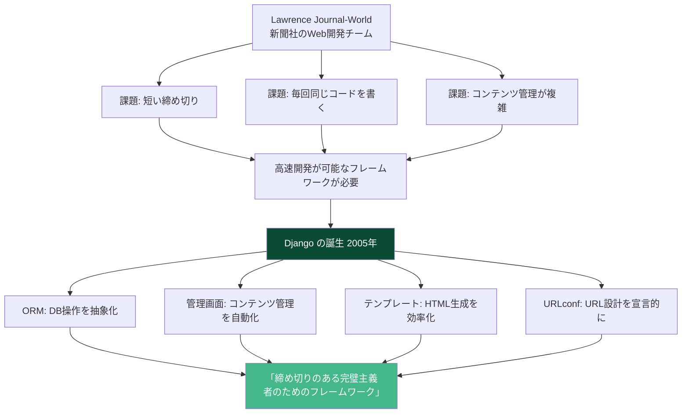
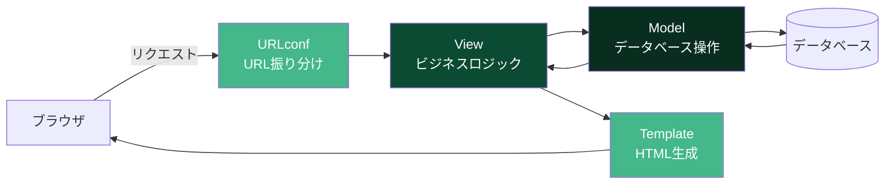

# Django

## Djangoとは何か

Djangoは**Pythonで書かれたフルスタックWebフレームワーク**。2005年にKansas州Lawrence市の新聞社「Lawrence Journal-World」のWeb開発チームが開発・公開した。「バッテリー同梱（Batteries Included）」の哲学を掲げ、Webアプリケーション開発に必要な機能を一通り標準で備えている。

たとえるなら、Djangoは「システムキッチン」。シンク、コンロ、冷蔵庫、食洗機が最初から一体化しており、すぐに料理（開発）を始められる。Express.jsが「好きな調理器具を自分で揃える」スタイルなら、Djangoは「全部揃った状態で始める」スタイル。

### Djangoの核心的な特徴

| 特徴 | 説明 | たとえ |
| --- | --- | --- |
| バッテリー同梱 | ORM、認証、管理画面、フォーム処理等が標準装備 | 全部入りのシステムキッチン |
| MTV（Model-Template-View） | Djangoの設計パターン。MVCの変形 | 役割分担が明確な組織 |
| ORM | SQLを書かずにPythonコードでDBを操作 | 通訳者。Python語をSQL語に翻訳 |
| 管理画面の自動生成 | モデル定義から管理画面が自動で作られる | 設計図から管理室が自動建設される |
| セキュリティ | CSRF、XSS、SQLインジェクション対策が標準 | 最初から防犯装置付きの家 |

---

## なぜDjangoが生まれたのか

### 新聞社の開発ニーズ

2003年頃、Lawrence Journal-WorldのWebチーム（Adrian Holovaty、Simon Willison等）は、新聞社の記事管理システムやWebアプリを**非常に短い締め切り**で開発する必要があった。新聞社では「明日までにこの機能を作って」という要求が日常的だった。

当時のPython Web開発環境は断片的で、プロジェクトごとに同じような基盤コードを書き直していた。彼らは共通のフレームワークを内部で構築し、それが2005年にオープンソースとして公開された。



### 名前の由来

DjangoはジャズギタリストのDjango Reinhardtに由来する。開発者のAdrian Holovatyがジャズ音楽のファンだったことから名付けられた。

### Djangoの進化の歴史

| バージョン | 年 | 主な機能追加 |
| --- | --- | --- |
| 0.95 | 2006 | 初の公式リリース |
| 1.0 | 2008 | API安定版、管理画面のリファクタリング |
| 1.3 | 2011 | クラスベースビュー |
| 1.7 | 2014 | マイグレーションフレームワーク（South統合） |
| 2.0 | 2017 | Python 3専用化、URLパス簡素化 |
| 3.0 | 2019 | ASGIサポート（非同期対応の基盤） |
| 3.1 | 2020 | 非同期ビュー |
| 4.0 | 2021 | Redisキャッシュバックエンド、`async` ORM操作 |
| 5.0 | 2023 | フィールドのデフォルト値に式、非同期シグナル |

---

## MTV（Model-Template-View）アーキテクチャ

Djangoは**MTV**パターンを採用している。一般的なMVC（Model-View-Controller）とは用語が異なるが、概念は似ている。

| Django（MTV） | 一般的なMVC | 役割 |
| --- | --- | --- |
| Model | Model | データ構造とビジネスロジック |
| Template | View | HTMLの表示 |
| View | Controller | リクエスト処理とレスポンス生成 |



---

## コアコンポーネント

### Model（モデル）

Djangoのモデルは**Pythonのクラス**として定義する。各クラスがデータベースのテーブルに対応する。

```python
from django.db import models

class Author(models.Model):
    name = models.CharField(max_length=100)
    email = models.EmailField(unique=True)
    bio = models.TextField(blank=True)
    created_at = models.DateTimeField(auto_now_add=True)

    def __str__(self):
        return self.name

    class Meta:
        ordering = ['name']


class Article(models.Model):
    STATUS_CHOICES = [
        ('draft', '下書き'),
        ('published', '公開'),
    ]

    title = models.CharField(max_length=200)
    slug = models.SlugField(unique=True)
    content = models.TextField()
    author = models.ForeignKey(Author, on_delete=models.CASCADE, related_name='articles')
    status = models.CharField(max_length=10, choices=STATUS_CHOICES, default='draft')
    published_at = models.DateTimeField(null=True, blank=True)
    created_at = models.DateTimeField(auto_now_add=True)
    updated_at = models.DateTimeField(auto_now=True)

    def __str__(self):
        return self.title

    class Meta:
        ordering = ['-published_at']
```

### ORM（Object-Relational Mapping）

DjangoのORMを使えば、SQLを直接書かずにPythonコードでデータベースを操作できる。

```python
# 作成
author = Author.objects.create(name='太郎', email='taro@example.com')

# 取得
article = Article.objects.get(slug='my-first-post')

# フィルタリング
published = Article.objects.filter(status='published')
recent = Article.objects.filter(published_at__gte='2025-01-01')
by_author = Article.objects.filter(author__name='太郎')

# 集約
from django.db.models import Count, Avg
stats = Author.objects.annotate(article_count=Count('articles'))

# チェーン
results = (
    Article.objects
    .filter(status='published')
    .select_related('author')
    .order_by('-published_at')[:10]
)

# 更新
Article.objects.filter(status='draft').update(status='published')

# 削除
Article.objects.filter(published_at__lt='2020-01-01').delete()
```

### マイグレーション

モデルの変更をデータベースに反映するための仕組み。

```bash
# モデルの変更からマイグレーションファイルを生成
python manage.py makemigrations

# マイグレーションを実行（DBに反映）
python manage.py migrate

# マイグレーションの状態確認
python manage.py showmigrations
```

### View（ビュー）

```python
# 関数ベースビュー
from django.http import JsonResponse
from django.shortcuts import render, get_object_or_404

def article_list(request):
    articles = Article.objects.filter(status='published')
    return render(request, 'articles/list.html', {'articles': articles})

def article_detail(request, slug):
    article = get_object_or_404(Article, slug=slug, status='published')
    return render(request, 'articles/detail.html', {'article': article})
```

```python
# クラスベースビュー
from django.views.generic import ListView, DetailView

class ArticleListView(ListView):
    model = Article
    template_name = 'articles/list.html'
    context_object_name = 'articles'
    queryset = Article.objects.filter(status='published')
    paginate_by = 10

class ArticleDetailView(DetailView):
    model = Article
    template_name = 'articles/detail.html'
    slug_field = 'slug'
```

### Template（テンプレート）

```html
<!-- templates/articles/list.html -->


記事一覧


<h1>記事一覧</h1>


<article>
    <h2><a href="">{{ article.title }}</a></h2>
    <p>著者: {{ article.author.name }}</p>
    <p>公開日: {{ article.published_at|date:"Y年m月d日" }}</p>
    <p>{{ article.content|truncatewords:30 }}</p>
</article>

<p>記事がありません。</p>



<nav>
    
    <a href="?page={{ page_obj.previous_page_number }}">前のページ</a>
    
    <span>{{ page_obj.number }} / {{ paginator.num_pages }}</span>
    
    <a href="?page={{ page_obj.next_page_number }}">次のページ</a>
    
</nav>


```

### URLconf

```python
# urls.py
from django.urls import path
from . import views

urlpatterns = [
    path('articles/', views.ArticleListView.as_view(), name='article_list'),
    path('articles/<slug:slug>/', views.ArticleDetailView.as_view(), name='article_detail'),
]
```

### 管理画面

Djangoの最も特徴的な機能の一つが、**自動生成される管理画面**。

```python
# admin.py
from django.contrib import admin
from .models import Author, Article

@admin.register(Author)
class AuthorAdmin(admin.ModelAdmin):
    list_display = ['name', 'email', 'created_at']
    search_fields = ['name', 'email']

@admin.register(Article)
class ArticleAdmin(admin.ModelAdmin):
    list_display = ['title', 'author', 'status', 'published_at']
    list_filter = ['status', 'author']
    search_fields = ['title', 'content']
    prepopulated_fields = {'slug': ('title',)}
    date_hierarchy = 'published_at'
```

これだけの定義で、記事の一覧表示、検索、フィルタリング、作成、編集、削除が可能な管理画面が自動生成される。

---

## プロジェクトの始め方

```bash
# Djangoのインストール
pip install django

# プロジェクトの作成
django-admin startproject myproject
cd myproject

# アプリケーションの作成
python manage.py startapp articles

# 開発サーバーの起動
python manage.py runserver
```

### プロジェクト構成

```
myproject/
├── manage.py              # 管理コマンド
├── myproject/
│   ├── __init__.py
│   ├── settings.py        # プロジェクト設定
│   ├── urls.py            # ルートURLconf
│   ├── asgi.py            # ASGI設定
│   └── wsgi.py            # WSGI設定
├── articles/
│   ├── __init__.py
│   ├── admin.py           # 管理画面の設定
│   ├── apps.py            # アプリ設定
│   ├── models.py          # データモデル
│   ├── views.py           # ビュー
│   ├── urls.py            # URL定義
│   ├── templates/         # テンプレート
│   ├── tests.py           # テスト
│   └── migrations/        # マイグレーション
└── requirements.txt
```

---

## メリットとデメリット

### メリット

| メリット | 詳細 |
| --- | --- |
| バッテリー同梱 | 認証、管理画面、ORM、フォーム、セッション等が標準装備 |
| 管理画面 | モデル定義から自動生成。非エンジニアでもデータを管理できる |
| セキュリティ | CSRF、XSS、SQLインジェクション、クリックジャッキング対策が標準 |
| ドキュメント | 公式ドキュメントが非常に充実（チュートリアルも秀逸） |
| スケーラビリティ | Instagram、Pinterest、Disqusなどの大規模サービスで実績あり |
| Pythonの生産性 | Pythonの読みやすさと豊富なライブラリを活用できる |

### デメリット

| デメリット | 詳細 |
| --- | --- |
| モノリシック | 標準機能が多い分、不要な機能もバンドルされる |
| 非同期対応が発展途上 | ASGI対応はされたが、ORMの完全な非同期化はまだ途中 |
| フロントエンド | SPAやモダンなフロントエンドとの統合にはDRF等の追加ツールが必要 |
| ORM | 複雑なクエリではraw SQLに頼る場面がある |
| 学習コスト | フレームワーク全体を理解するには時間がかかる |
| パフォーマンス | Go/Rust等のコンパイル言語と比較するとスループットが低い |

---

## 代替フレームワークとの比較

| 観点 | Django | Flask | FastAPI | Ruby on Rails |
| --- | --- | --- | --- | --- |
| 哲学 | バッテリー同梱 | マイクロフレームワーク | API特化 | Convention over Configuration |
| ORM | 標準装備 | SQLAlchemy等を選択 | SQLAlchemy等を選択 | Active Record標準装備 |
| 管理画面 | 標準装備 | Flask-Admin等 | なし | 標準ではなし |
| API開発 | DRF（別途） | Flask-RESTful等 | ネイティブ対応 | API modeあり |
| 非同期 | 部分対応 | 部分対応 | ネイティブ対応 | 非対応 |
| 学習コスト | 中 | 低 | 中 | 中 |
| 適した場面 | フルスタックWebアプリ | 小規模API、プロトタイプ | 高速API、マイクロサービス | フルスタックWebアプリ |

---

## Django REST Framework（DRF）

現代のDjango開発では、フロントエンドをReactやVue.jsで構築し、バックエンドAPIをDjangoで提供するケースが多い。その際に使われるのが**Django REST Framework（DRF）**。

```python
# serializers.py
from rest_framework import serializers
from .models import Article

class ArticleSerializer(serializers.ModelSerializer):
    author_name = serializers.CharField(source='author.name', read_only=True)

    class Meta:
        model = Article
        fields = ['id', 'title', 'content', 'author', 'author_name', 'status', 'published_at']

# views.py
from rest_framework import viewsets
from .models import Article
from .serializers import ArticleSerializer

class ArticleViewSet(viewsets.ModelViewSet):
    queryset = Article.objects.filter(status='published')
    serializer_class = ArticleSerializer

# urls.py
from rest_framework.routers import DefaultRouter
from .views import ArticleViewSet

router = DefaultRouter()
router.register('articles', ArticleViewSet)
urlpatterns = router.urls
```

---

## 参考文献

- [Django 公式ドキュメント](https://docs.djangoproject.com/) - 公式リファレンスとチュートリアル
- [Django 公式チュートリアル](https://docs.djangoproject.com/en/stable/intro/tutorial01/) - 公式の入門チュートリアル
- [Django REST Framework](https://www.django-rest-framework.org/) - API開発用の拡張フレームワーク
- [Django GitHub](https://github.com/django/django) - ソースコードとIssue
- [Two Scoops of Django](https://www.feldroy.com/books/two-scoops-of-django-3-x) - Djangoのベストプラクティス書籍
- [Django Girls Tutorial](https://tutorial.djangogirls.org/ja/) - 初心者向けの日本語チュートリアル
- [Flask 公式ドキュメント](https://flask.palletsprojects.com/) - Pythonのマイクロフレームワーク
- [FastAPI 公式ドキュメント](https://fastapi.tiangolo.com/) - Python製の高速APIフレームワーク
