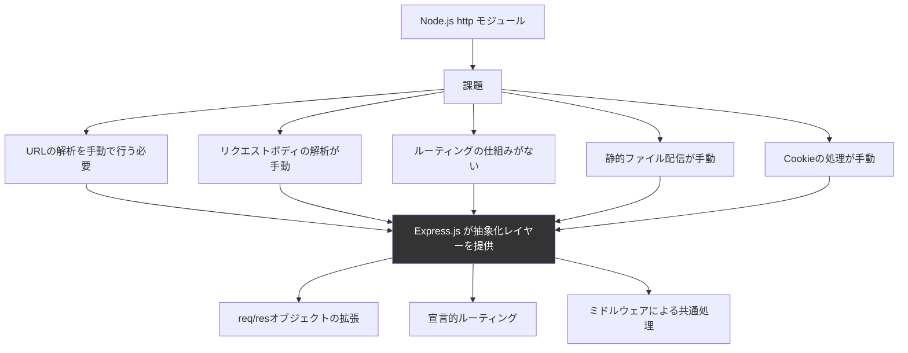

# Express.js

## Express.jsとは何か

Express.jsは**Node.js用の最小主義（ミニマリスト）Webアプリケーションフレームワーク**。2010年にTJ Holowaychukが開発・公開した。Node.jsの標準`http`モジュールは低レベルすぎて、実用的なWebアプリを構築するには多くのボイラープレートコードが必要だった。Expressはその課題を解決し、HTTPリクエスト/レスポンスの処理をシンプルかつ柔軟にするために生まれた。

たとえるなら、Node.jsの`http`モジュールが「鉄鉱石」だとすれば、Expressは「工具セット」。鉄鉱石から直接何かを作ることもできるが、工具があれば遥かに効率的。

### Express.jsの核心的な特徴

| 特徴 | 説明 | たとえ |
| --- | --- | --- |
| ミニマリスト | コア機能は最小限。必要なものだけを追加する | 素の部屋に好きな家具だけを置く |
| ミドルウェアパターン | リクエスト処理を小さな関数の連鎖で構成 | 工場のベルトコンベア。各工程が1つの加工を担当 |
| ルーティング | URLパスとHTTPメソッドに応じた処理の振り分け | 郵便局の仕分け。宛先ごとに適切な窓口へ |
| 非固執的（Unopinionated） | 設計パターンやフォルダ構成を強制しない | 自由帳。ルールなしに好きに使える |

---

## なぜExpress.jsが生まれたのか

### 2010年のNode.jsの状況

Node.jsは2009年にRyan Dahlが公開した。サーバーサイドでJavaScriptを実行できるという革命的な技術だったが、Webアプリケーションを構築するためのツールは未整備だった。



### 素のNode.js vs Express.js

素のNode.jsでサーバーを書く場合:

```javascript
// 素のNode.js: 煩雑で冗長
const http = require('http')
const url = require('url')

const server = http.createServer((req, res) => {
  const parsedUrl = url.parse(req.url, true)

  if (parsedUrl.pathname === '/api/users' && req.method === 'GET') {
    res.writeHead(200, { 'Content-Type': 'application/json' })
    res.end(JSON.stringify([{ id: 1, name: '太郎' }]))
  } else if (parsedUrl.pathname === '/api/users' && req.method === 'POST') {
    let body = ''
    req.on('data', chunk => { body += chunk })
    req.on('end', () => {
      const user = JSON.parse(body)
      res.writeHead(201, { 'Content-Type': 'application/json' })
      res.end(JSON.stringify(user))
    })
  } else {
    res.writeHead(404)
    res.end('Not Found')
  }
})

server.listen(3000)
```

Express.jsで同じことを書く場合:

```javascript
// Express.js: シンプルで読みやすい
const express = require('express')
const app = express()

app.use(express.json()) // JSONボディの解析ミドルウェア

app.get('/api/users', (req, res) => {
  res.json([{ id: 1, name: '太郎' }])
})

app.post('/api/users', (req, res) => {
  res.status(201).json(req.body)
})

app.listen(3000)
```

### TJ Holowaychukとその影響

TJ Holowaychukはオープンソースコミュニティで最も多産な開発者の一人。Express.jsだけでなく、Mocha（テストフレームワーク）、Jade/Pug（テンプレートエンジン）、Commander.js（CLIツール）など、多くのNode.jsライブラリを開発した。

ExpressはRubyの**Sinatra**フレームワークに強く影響を受けている。Sinatraの「最小限のDSLでWebアプリを書く」という思想をNode.jsに持ち込んだ。

---

## ミドルウェアパターン

Express.jsの最も重要な設計概念が**ミドルウェア**。リクエストが到着してからレスポンスを返すまでの間に、複数の関数が順番に処理を行う仕組み。


### ミドルウェアの種類

```javascript
const express = require('express')
const app = express()

// 1. アプリケーションレベルのミドルウェア
// すべてのリクエストに適用
app.use((req, res, next) => {
  console.log(`${req.method} ${req.url} - ${new Date().toISOString()}`)
  next() // 次のミドルウェアへ
})

// 2. 特定パスに限定したミドルウェア
app.use('/api', (req, res, next) => {
  // /api で始まるリクエストのみ
  const token = req.headers.authorization
  if (!token) {
    return res.status(401).json({ error: '認証が必要です' })
  }
  next()
})

// 3. サードパーティミドルウェア
const cors = require('cors')
const helmet = require('helmet')
app.use(cors())       // CORS設定
app.use(helmet())     // セキュリティヘッダー

// 4. 組み込みミドルウェア
app.use(express.json())                         // JSONボディ解析
app.use(express.urlencoded({ extended: true }))  // URLエンコードボディ解析
app.use(express.static('public'))                // 静的ファイル配信

// 5. ルーター（モジュール化）
const userRouter = express.Router()
userRouter.get('/', (req, res) => { /* ... */ })
userRouter.post('/', (req, res) => { /* ... */ })
app.use('/api/users', userRouter)

// 6. エラーハンドリングミドルウェア（引数が4つ）
app.use((err, req, res, next) => {
  console.error(err.stack)
  res.status(500).json({ error: 'サーバーエラーが発生しました' })
})

app.listen(3000)
```

### ミドルウェアの`next()`の仕組み

ミドルウェア関数は3つの引数を受け取る: `req`（リクエスト）、`res`（レスポンス）、`next`（次のミドルウェアを呼ぶ関数）。

- `next()` を呼ぶ: 次のミドルウェアに処理を渡す
- `next()` を呼ばない: そこで処理が止まる（レスポンスを返す場合）
- `next(err)` を呼ぶ: エラーハンドリングミドルウェアにジャンプ

---

## ルーティング

### 基本的なルーティング

```javascript
// HTTPメソッドに対応するメソッド
app.get('/users', (req, res) => { /* GET /users */ })
app.post('/users', (req, res) => { /* POST /users */ })
app.put('/users/:id', (req, res) => { /* PUT /users/123 */ })
app.patch('/users/:id', (req, res) => { /* PATCH /users/123 */ })
app.delete('/users/:id', (req, res) => { /* DELETE /users/123 */ })

// パラメータの取得
app.get('/users/:id', (req, res) => {
  const userId = req.params.id        // URLパラメータ
  const page = req.query.page         // クエリパラメータ (?page=2)
  res.json({ userId, page })
})

// ルートチェーン
app.route('/articles')
  .get((req, res) => { /* 一覧取得 */ })
  .post((req, res) => { /* 新規作成 */ })
```

### Routerによるモジュール分割

```javascript
// routes/users.js
const express = require('express')
const router = express.Router()

router.get('/', async (req, res) => {
  const users = await User.findAll()
  res.json(users)
})

router.get('/:id', async (req, res) => {
  const user = await User.findByPk(req.params.id)
  if (!user) return res.status(404).json({ error: 'ユーザーが見つかりません' })
  res.json(user)
})

router.post('/', async (req, res) => {
  const user = await User.create(req.body)
  res.status(201).json(user)
})

module.exports = router
```

```javascript
// app.js
const userRoutes = require('./routes/users')
const articleRoutes = require('./routes/articles')

app.use('/api/users', userRoutes)
app.use('/api/articles', articleRoutes)
```

---

## 典型的なプロジェクト構成

```
my-express-app/
├── src/
│   ├── routes/           # ルート定義
│   │   ├── users.js
│   │   ├── articles.js
│   │   └── index.js
│   ├── middleware/        # カスタムミドルウェア
│   │   ├── auth.js
│   │   ├── validation.js
│   │   └── errorHandler.js
│   ├── controllers/      # ビジネスロジック
│   │   ├── userController.js
│   │   └── articleController.js
│   ├── models/           # データモデル
│   │   ├── User.js
│   │   └── Article.js
│   ├── services/         # 外部サービス連携
│   ├── utils/            # ユーティリティ
│   └── app.js            # Expressアプリ設定
├── tests/
├── .env
├── package.json
└── README.md
```

Express.jsはフォルダ構成を強制しないため、チームで規約を決める必要がある。上記はMVC的な一般的構成。

---

## メリットとデメリット

### メリット

| メリット | 詳細 |
| --- | --- |
| シンプル | APIが少なく、学習コストが低い |
| 柔軟 | 設計パターンやライブラリを自由に選べる |
| 巨大なエコシステム | npm上のミドルウェアが豊富 |
| 実績 | 10年以上の歴史と膨大な利用実績 |
| 軽量 | コアが小さく、不要な機能のオーバーヘッドがない |
| 情報量 | 書籍、チュートリアル、Stack Overflowの回答が豊富 |

### デメリット

| デメリット | 詳細 |
| --- | --- |
| 構造の自由すぎ | 規約がないため、大規模プロジェクトでは設計力が必要 |
| コールバック地獄 | 古い書き方ではネストが深くなりがち（async/awaitで緩和） |
| セキュリティ | デフォルトのセキュリティ設定が最小限（helmetの導入が必須） |
| TypeScript | 公式のTypeScriptサポートが弱い |
| 開発の停滞 | 5.x系のリリースが長年遅延している |
| パフォーマンス | Fastify等の新世代フレームワークと比較すると遅い |

---

## 代替フレームワークとの比較

### Node.jsフレームワークの世代

| フレームワーク | 初版 | 特徴 | 適した場面 |
| --- | --- | --- | --- |
| Express.js | 2010 | ミニマリスト、最大のエコシステム | 汎用、学習用 |
| Koa | 2013 | Express作者の次世代版、async/await前提 | モダンなAPI |
| Hapi | 2012 | 設定ベース、エンタープライズ向け | 大規模API |
| Fastify | 2016 | 高速、スキーマバリデーション内蔵 | 高パフォーマンスAPI |
| NestJS | 2017 | Angular風のDI、TypeScript前提 | エンタープライズ |
| Hono | 2022 | Edge Runtime対応、超軽量 | Edge/Cloudflare Workers |

### Express.js vs Fastify

```javascript
// Express.js
app.get('/api/users', (req, res) => {
  res.json([{ id: 1, name: '太郎' }])
})

// Fastify: スキーマによるバリデーション・シリアライゼーションの最適化
fastify.get('/api/users', {
  schema: {
    response: {
      200: {
        type: 'array',
        items: {
          type: 'object',
          properties: {
            id: { type: 'integer' },
            name: { type: 'string' },
          },
        },
      },
    },
  },
}, async (request, reply) => {
  return [{ id: 1, name: '太郎' }]
})
```

Fastifyはレスポンスのスキーマを事前定義することで、JSONシリアライゼーションを最適化し、Expressの約2倍のスループットを実現する。

### Express.js vs Hono

```javascript
// Hono: Web Standard APIベース、Edge Runtime対応
import { Hono } from 'hono'

const app = new Hono()

app.get('/api/users', (c) => {
  return c.json([{ id: 1, name: '太郎' }])
})

export default app // Cloudflare Workersで動く
```

Honoは2022年に登場した超軽量フレームワーク。Cloudflare Workers、Deno Deploy、Bun等のEdge Runtimeで動作し、Express.jsの約10分の1のバンドルサイズ。

---

## 実践: REST APIサーバー

```javascript
const express = require('express')
const cors = require('cors')
const helmet = require('helmet')

const app = express()

// ミドルウェア設定
app.use(helmet())
app.use(cors())
app.use(express.json())

// インメモリデータストア（デモ用）
let todos = [
  { id: 1, title: 'Express.jsを学ぶ', completed: false },
  { id: 2, title: 'REST APIを作る', completed: false },
]
let nextId = 3

// CRUD操作
app.get('/api/todos', (req, res) => {
  res.json(todos)
})

app.get('/api/todos/:id', (req, res) => {
  const todo = todos.find(t => t.id === parseInt(req.params.id))
  if (!todo) return res.status(404).json({ error: 'Not found' })
  res.json(todo)
})

app.post('/api/todos', (req, res) => {
  const { title } = req.body
  if (!title) return res.status(400).json({ error: 'Title is required' })
  const todo = { id: nextId++, title, completed: false }
  todos.push(todo)
  res.status(201).json(todo)
})

app.put('/api/todos/:id', (req, res) => {
  const todo = todos.find(t => t.id === parseInt(req.params.id))
  if (!todo) return res.status(404).json({ error: 'Not found' })
  Object.assign(todo, req.body)
  res.json(todo)
})

app.delete('/api/todos/:id', (req, res) => {
  todos = todos.filter(t => t.id !== parseInt(req.params.id))
  res.status(204).end()
})

// エラーハンドリング
app.use((err, req, res, next) => {
  console.error(err.stack)
  res.status(500).json({ error: 'Internal Server Error' })
})

app.listen(3000, () => {
  console.log('Server running on http://localhost:3000')
})
```

---

## 参考文献

- [Express.js 公式ドキュメント](https://expressjs.com/) - 公式リファレンスとガイド
- [Express.js GitHub](https://github.com/expressjs/express) - ソースコードとIssue
- [Node.js 公式ドキュメント](https://nodejs.org/docs/) - Node.jsのHTTPモジュールリファレンス
- [Fastify 公式ドキュメント](https://fastify.dev/) - 高速なNode.jsフレームワーク
- [Hono 公式ドキュメント](https://hono.dev/) - Edge Runtime対応の超軽量フレームワーク
- [Koa 公式サイト](https://koajs.com/) - Express作者による次世代フレームワーク
- [NestJS 公式ドキュメント](https://docs.nestjs.com/) - TypeScriptベースのエンタープライズフレームワーク
- [helmet.js](https://helmetjs.github.io/) - Expressのセキュリティミドルウェア
