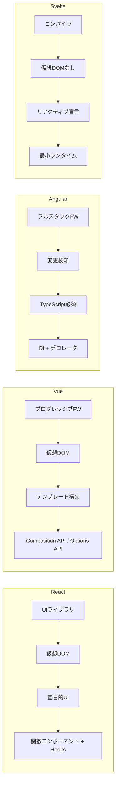
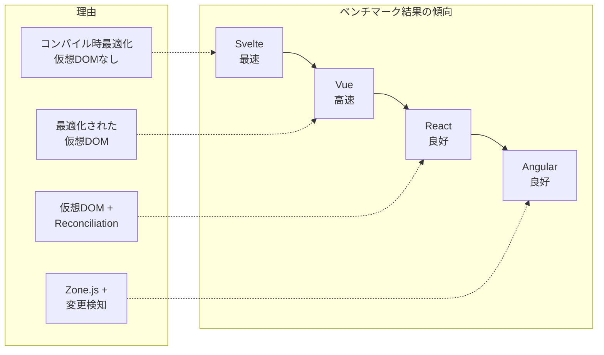
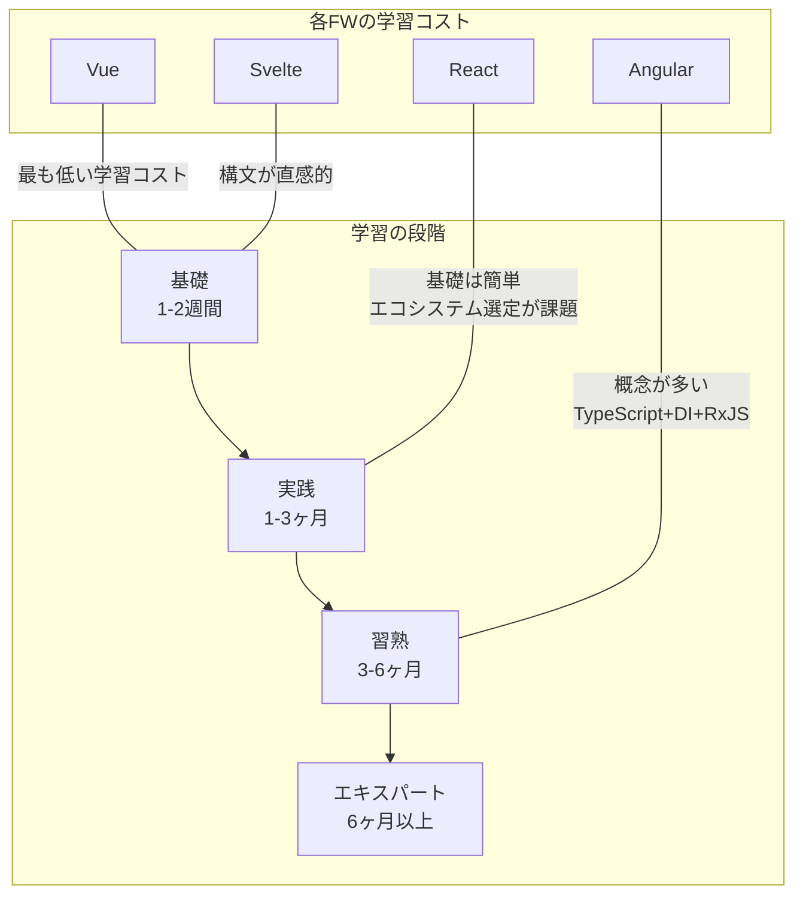
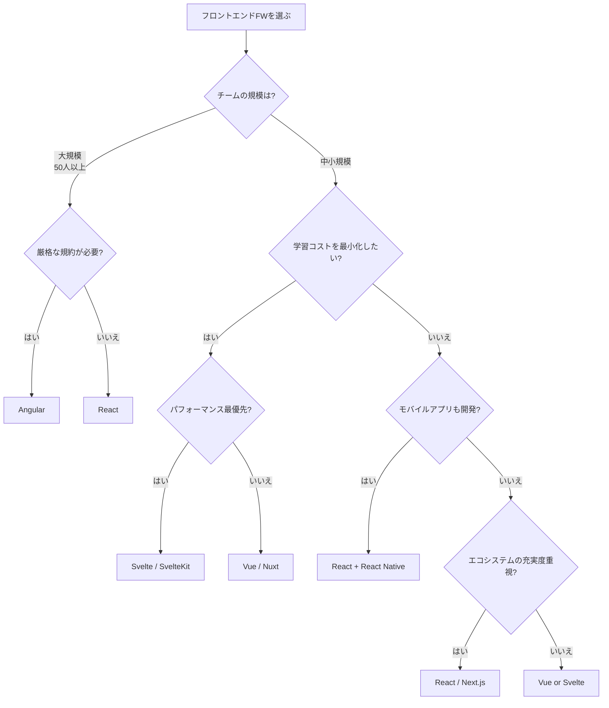

# フロントエンドフレームワーク比較（React vs Vue vs Angular vs Svelte）

## はじめに

フロントエンド開発において、フレームワーク（ライブラリ）の選択はプロジェクトの成功を大きく左右する。本ページでは、現在主流の4つのフロントエンドフレームワーク — **React**、**Vue**、**Angular**、**Svelte** — を多角的に比較する。

## 各フレームワークの誕生背景

| フレームワーク | 登場年 | 開発元 | 誕生の背景 |
| --- | --- | --- | --- |
| React | 2013年 | Facebook (Meta) | Facebookのニュースフィードの複雑なUI更新を効率化するため |
| Angular | 2016年 | Google | AngularJS (2010) の全面的な書き直し。大規模エンタープライズ向け |
| Vue | 2014年 | Evan You（個人） | AngularJSの良い部分を抽出し、シンプルで柔軟なFWを目指した |
| Svelte | 2016年 | Rich Harris（個人） | 仮想DOMのオーバーヘッドを排除。コンパイル時に最適化するアプローチ |

## 設計思想の違い



### React: UIライブラリ

Reactは自らを「UIを構築するためのライブラリ」と位置付けている。ルーティング、状態管理、フォーム処理などは外部ライブラリに委ねるスタンスである。

```jsx
// React: 関数コンポーネント + Hooks
function Counter() {
  const [count, setCount] = useState(0);
  return (
    <button onClick={() => setCount(count + 1)}>
      Count: {count}
    </button>
  );
}
```

### Vue: プログレッシブフレームワーク

Vueは「小さく始めて、必要に応じて拡張できる」設計思想を持つ。コア機能は最小限だが、公式のルーター（Vue Router）や状態管理（Pinia）が整備されている。

```vue
<!-- Vue: SFC (Single File Component) -->
<script setup>
import { ref } from 'vue'
const count = ref(0)
</script>

<template>
  <button @click="count++">Count: {{ count }}</button>
</template>
```

### Angular: フルスタックフレームワーク

AngularはDI（依存性注入）、ルーティング、フォーム、HTTPクライアントなどを包括的に提供する「バッテリー同梱」フレームワークである。

```typescript
// Angular: コンポーネント
@Component({
  selector: 'app-counter',
  template: `<button (click)="increment()">Count: {{count}}</button>`
})
export class CounterComponent {
  count = 0;
  increment() { this.count++; }
}
```

### Svelte: コンパイラ

Svelteはビルド時にコードをコンパイルし、最小限のJavaScriptを出力する。ランタイムライブラリが不要なため、バンドルサイズが極めて小さい。

```svelte
<!-- Svelte: シンプルなリアクティブ構文 -->
<script>
  let count = 0;
</script>

<button on:click={() => count++}>
  Count: {count}
</button>
```

## 総合比較表

| 項目 | React | Vue | Angular | Svelte |
| --- | --- | --- | --- | --- |
| **カテゴリ** | UIライブラリ | プログレッシブFW | フルスタックFW | コンパイラ |
| **言語** | JSX (JavaScript/TypeScript) | テンプレート + JS/TS | TypeScript（必須） | Svelte構文 + JS/TS |
| **状態管理** | useState / Redux / Zustand | ref / Pinia | Services + RxJS / Signals | $state (Runes) |
| **レンダリング** | 仮想DOM | 仮想DOM | 変更検知 (Zone.js / Signals) | コンパイル時DOM操作 |
| **バンドルサイズ** | 中（~40KB） | 小（~30KB） | 大（~80KB） | 極小（~5KB） |
| **学習コスト** | 中 | 低 | 高 | 低 |
| **TypeScript対応** | 良好 | 良好 | ネイティブ | 良好 |
| **SSR対応** | Next.js | Nuxt | Angular Universal | SvelteKit |
| **モバイル対応** | React Native | Capacitor / NativeScript | Ionic / NativeScript | Capacitor |

## パフォーマンス比較

### バンドルサイズ（Hello World相当）

| フレームワーク | gzip後サイズ（概算） |
| --- | --- |
| Svelte | ~2KB |
| Vue | ~16KB |
| React | ~40KB |
| Angular | ~65KB |

### ランタイムパフォーマンス



> ベンチマーク結果は条件により異なる。実際のアプリケーションでは、実装品質やデータ量の影響が大きい。

## エコシステム比較

| カテゴリ | React | Vue | Angular | Svelte |
| --- | --- | --- | --- | --- |
| **メタフレームワーク** | Next.js / Remix | Nuxt | Angular (SSR内蔵) | SvelteKit |
| **状態管理** | Redux / Zustand / Jotai | Pinia | NgRx / NGXS | 組み込み |
| **UIコンポーネント** | MUI / Ant Design / shadcn | Vuetify / PrimeVue | Angular Material | Skeleton UI |
| **テスト** | React Testing Library | Vue Test Utils | TestBed | Svelte Testing Library |
| **npm パッケージ数** | 非常に多い | 多い | 多い | 少ない（成長中） |
| **求人数** | 非常に多い | 多い | 多い | 少ない |
| **コミュニティ規模** | 最大 | 大 | 大 | 中（成長中） |

## 学習曲線の比較



### 各フレームワークで学ぶべきこと

**React で学ぶべきこと:**
- JSX、コンポーネント、Props
- useState、useEffect、カスタムHooks
- 状態管理ライブラリの選定（Redux / Zustand / Jotai）
- Next.js（SSR/SSG）

**Vue で学ぶべきこと:**
- テンプレート構文、SFC
- Composition API（ref, reactive, computed）
- Pinia（状態管理）
- Nuxt（SSR/SSG）

**Angular で学ぶべきこと:**
- TypeScript、デコレータ
- モジュール、コンポーネント、サービス
- 依存性注入（DI）
- RxJS（リアクティブプログラミング）
- Angular CLI、テスト

**Svelte で学ぶべきこと:**
- Svelte構文、リアクティブ宣言
- Runes（Svelte 5）
- ストア
- SvelteKit

## メリット・デメリット詳細

### React

| メリット | デメリット |
| --- | --- |
| 最大のコミュニティとエコシステム | ライブラリ選定に迷う（選択疲れ） |
| React Nativeでモバイル開発可能 | 頻繁なパラダイムシフト（Class→Hooks→Server Components） |
| Meta社がプロダクションで使用 | JSXの好み分かれる |
| 豊富な求人・学習リソース | 状態管理の複雑化 |

### Vue

| メリット | デメリット |
| --- | --- |
| 学習コストが最も低い | Reactほどの求人数がない（日本では多い） |
| 公式ツールが統一的に整備 | 大規模開発での事例がやや少ない |
| テンプレート構文が直感的 | Options APIとComposition APIの混在 |
| 日本語ドキュメントが充実 | Vue 2→3の移行期があった |

### Angular

| メリット | デメリット |
| --- | --- |
| フルスタック:追加ライブラリ不要 | 学習コストが高い |
| 大規模開発に強い | バンドルサイズが大きい |
| Google社がメンテナンス | 過度に複雑に感じることがある |
| 明確な規約でチーム開発しやすい | アップデートサイクルが早い |

### Svelte

| メリット | デメリット |
| --- | --- |
| バンドルサイズが最小 | エコシステムが未成熟 |
| ランタイムパフォーマンスが最速クラス | 求人数が少ない |
| 構文がシンプルで記述量が少ない | 大規模開発の実績が少ない |
| コンパイラなので未来の最適化に期待 | ブレイキングチェンジ（Svelte 5 Runes） |

## 選定フローチャート



## 2025-2026年のトレンド

| トレンド | 関連FW | 説明 |
| --- | --- | --- |
| **Server Components** | React (RSC) | サーバー側でコンポーネントをレンダリングし、バンドルサイズ削減 |
| **Signals** | Angular / Svelte / Vue | きめ細かいリアクティビティで不要な再レンダリングを削減 |
| **Islands Architecture** | Astro (全FW対応) | 静的HTMLに部分的にインタラクティブな「島」を配置 |
| **Edge Rendering** | Next.js / Nuxt / SvelteKit | CDNエッジでSSRを実行し、レイテンシ削減 |
| **AI統合** | 全FW | AI chatbot UI、コード生成ツールとの統合 |

## まとめ

- **React**: 最も安全な選択肢。求人数・エコシステムで他を圧倒
- **Vue**: 学習コストが低く、小〜中規模プロジェクトに最適。日本では人気
- **Angular**: 大規模エンタープライズ開発に強い。TypeScriptファースト
- **Svelte**: パフォーマンス最優先の場合に最適。今後の成長に期待

最終的な選定は、プロジェクト要件・チームスキル・長期的なメンテナンス性を総合的に考慮して判断すべきである。

## 参考文献

- [React 公式ドキュメント](https://react.dev/)
- [Vue.js 公式ドキュメント](https://vuejs.org/)
- [Angular 公式ドキュメント](https://angular.dev/)
- [Svelte 公式ドキュメント](https://svelte.dev/)
- [State of JavaScript Survey](https://stateofjs.com/)
- [Stack Overflow Developer Survey](https://survey.stackoverflow.co/)
- [JS Framework Benchmark](https://krausest.github.io/js-framework-benchmark/)
- [Next.js 公式ドキュメント](https://nextjs.org/docs)
- [Nuxt 公式ドキュメント](https://nuxt.com/docs)
- [SvelteKit 公式ドキュメント](https://kit.svelte.dev/docs)
