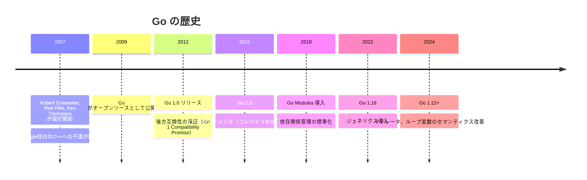
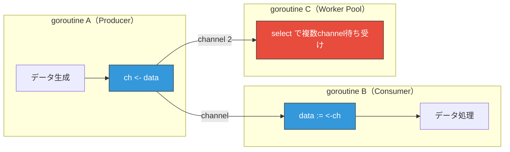

# Go -- なぜこの言語は生まれたのか

## はじめに

Go（別名Golang）は、2009年にGoogleが公開したオープンソースのプログラミング言語である。C言語の設計者の一人であるKen Thompson、UTF-8の設計者であるRob Pike、そしてRobert Griesemerの3人が中心となり設計された。

「**シンプルさ**」「**高速なコンパイル**」「**組み込みの並行処理**」を柱に据え、Googleが直面していた大規模ソフトウェア開発の課題を解決するために生まれた。

## 誕生の背景

### Googleが抱えていた問題

2007年頃、Googleのエンジニアたちは大規模ソフトウェア開発において深刻な課題に直面していた。

Rob Pikeは後に次のように語っている。

> 「Goは、Googleでのソフトウェア開発の苦痛から生まれた。その苦痛の大部分は複雑さに起因していた。」

具体的な課題は以下の通りである。

#### C++のビルド時間

Googleの主力言語はC++だったが、コードベースの巨大化に伴い**ビルドに数十分から数時間**かかるようになっていた。

```
# 当時のGoogleの状況
- コードベース: 数億行
- C++のビルド: 1時間超のケースも
- ビルド待ち時間 = 生産性の損失
```

#### 言語の複雑さ

C++は非常に強力だが、その複雑さは深刻な問題だった。

| C++の複雑さ | 具体例 |
| --- | --- |
| テンプレート | テンプレートメタプログラミングは難解 |
| 多重継承 | ダイヤモンド問題、vtableの複雑さ |
| ヘッダファイル | インクルードの依存関係管理が困難 |
| 未定義動作 | メモリ安全性の保証がない |
| 機能の肥大化 | C++11以降、毎規格で大量の機能が追加 |

#### 並行処理の難しさ

Googleのサービスは数千台のサーバーで動作しており、並行処理は必須だった。しかしC++やJavaのスレッドモデルは複雑で、デッドロックやレースコンディションなどのバグが頻発していた。

### 「引き算」の設計思想

Goの設計者たちは既存言語の**「足し算」**（機能を追加し続ける）とは逆に、**「引き算」**（不要な機能を削ぎ落とす）のアプローチを取った。


Goが**意図的に排除した**機能:

| 排除した機能 | 理由 |
| --- | --- |
| クラス・継承 | インターフェースと構造体の組み合わせで十分 |
| ジェネリクス（当初） | 複雑さを避けるため（2022年のGo 1.18で追加） |
| 例外（try-catch） | 明示的なエラーハンドリングを強制 |
| 暗黙の型変換 | バグの原因を排除 |
| 三項演算子 | 可読性を優先 |
| メソッドオーバーロード | インターフェースの単純さを維持 |



## Goが解決する課題

### 1. 高速なコンパイル

Goのコンパイラは非常に高速である。数万行のプログラムでも数秒でコンパイルできる。

高速コンパイルを実現する設計上の工夫:

- **パッケージの依存関係が明示的**: 使われていないimportはコンパイルエラー
- **循環importの禁止**: 依存関係がDAG（有向非巡回グラフ）になる
- **オブジェクトファイルに依存情報を含む**: 間接的な依存の再解析が不要

```go
// 使っていないimportはコンパイルエラーになる
package main

import (
    "fmt"
    // "os"  // 使わないなら削除が必須
)

func main() {
    fmt.Println("Hello, Go!")
}
```

### 2. 並行処理 -- goroutineとchannel

Goの最大の特徴は、言語レベルで並行処理を組み込んでいることである。

#### goroutine

goroutineは**軽量スレッド**である。OSスレッドよりはるかに軽量で、数十万のgoroutineを同時に実行できる。

```go
package main

import (
    "fmt"
    "time"
)

func fetchURL(url string) {
    // URLからデータを取得する処理（簡略化）
    time.Sleep(1 * time.Second)
    fmt.Printf("Fetched: %s\n", url)
}

func main() {
    urls := []string{
        "https://example.com/api/1",
        "https://example.com/api/2",
        "https://example.com/api/3",
    }

    // goキーワードでgoroutineを起動
    for _, url := range urls {
        go fetchURL(url) // 並行実行される
    }

    time.Sleep(2 * time.Second)
}
```

| 比較項目 | OSスレッド | goroutine |
| --- | --- | --- |
| 初期スタックサイズ | 1-8 MB | 数 KB |
| 切り替えコスト | 高い（カーネル空間） | 低い（ユーザー空間） |
| 同時実行数 | 数千が限界 | 数十万以上可能 |
| スケジューリング | OS | Goランタイム |

#### channel

channelはgoroutine間でデータを安全にやり取りするための仕組みである。Goの並行処理の哲学は以下の一言に集約される。

> **「メモリを共有して通信するのではなく、通信してメモリを共有せよ」** (Do not communicate by sharing memory; instead, share memory by communicating.)

```go
package main

import "fmt"

func producer(ch chan<- int) {
    for i := 0; i < 5; i++ {
        ch <- i // channelにデータを送信
    }
    close(ch)
}

func main() {
    ch := make(chan int)

    go producer(ch)

    // channelからデータを受信
    for value := range ch {
        fmt.Println(value) // 0, 1, 2, 3, 4
    }
}
```



### 3. 明示的なエラーハンドリング

Goには例外（try-catch）がない。代わりに、関数は**エラーを戻り値として返す**ことが慣習である。

```go
package main

import (
    "fmt"
    "os"
)

func readFile(path string) ([]byte, error) {
    data, err := os.ReadFile(path)
    if err != nil {
        return nil, fmt.Errorf("failed to read file %s: %w", path, err)
    }
    return data, nil
}

func main() {
    data, err := readFile("config.json")
    if err != nil {
        fmt.Fprintf(os.Stderr, "Error: %v\n", err)
        os.Exit(1)
    }
    fmt.Println(string(data))
}
```

この設計は「エラーを無視させない」という哲学に基づいている。`if err != nil` の繰り返しは冗長に見えるが、エラー処理の漏れが起きにくい。

### 4. シングルバイナリ

Goはプログラムを**単一のバイナリファイル**にコンパイルする。外部の依存（ランタイム、共有ライブラリ）が不要なため、デプロイが極めてシンプルになる。

```bash
# ビルド
go build -o myapp ./cmd/myapp

# デプロイ（バイナリをコピーするだけ）
scp myapp server:/usr/local/bin/

# クロスコンパイル（MacでLinux向けにビルド）
GOOS=linux GOARCH=amd64 go build -o myapp-linux ./cmd/myapp
```

### 5. 標準ツールチェーン

Goは開発に必要なツールを標準で提供している。

| ツール | 用途 |
| --- | --- |
| `go build` | コンパイル |
| `go test` | テスト実行 |
| `go fmt` | コード整形（フォーマット） |
| `go vet` | 静的解析 |
| `go mod` | 依存関係管理 |
| `go doc` | ドキュメント生成 |
| `go run` | コンパイル + 実行 |

特に `go fmt` は全てのGoコードを同一のスタイルに統一する。「タブ vs スペース」「括弧の位置」といった自転車置き場問題が存在しない。

## インターフェースと構造体

Goにはクラスも継承もない。代わりに**構造体（struct）**と**インターフェース（interface）**を使う。

### 暗黙的なインターフェース実装

Goのインターフェースは**暗黙的に実装**される。`implements`キーワードは存在しない。メソッドのシグネチャが一致すれば、自動的にそのインターフェースを実装したことになる。

```go
// インターフェース定義
type Writer interface {
    Write(data []byte) (int, error)
}

// FileWriterは Writer を暗黙的に実装
type FileWriter struct {
    Path string
}

func (fw *FileWriter) Write(data []byte) (int, error) {
    return os.WriteFile(fw.Path, data, 0644), nil
}

// ConsoleWriterも Writer を暗黙的に実装
type ConsoleWriter struct{}

func (cw *ConsoleWriter) Write(data []byte) (int, error) {
    return fmt.Print(string(data))
}
```

## メリットとデメリット

### メリット

| メリット | 詳細 |
| --- | --- |
| **シンプルさ** | 言語仕様が小さく、学習コストが低い。チーム全員が同じ書き方になる |
| **高速なコンパイル** | 大規模プロジェクトでも数秒でコンパイルが完了 |
| **並行処理** | goroutineとchannelによる直感的で安全な並行プログラミング |
| **シングルバイナリ** | 依存なしの単一バイナリでデプロイが容易 |
| **標準ツール** | フォーマッタ、テスト、依存管理が全て標準搭載 |
| **パフォーマンス** | C/C++には劣るが、Python/Rubyの数十倍の実行速度 |
| **クロスコンパイル** | 環境変数だけで他OS/アーキテクチャ向けにビルド可能 |
| **後方互換性** | Go 1.0以降の互換性保証により、アップデートの恐怖がない |

### デメリット

| デメリット | 詳細 |
| --- | --- |
| **ジェネリクスの歴史** | 長年ジェネリクスがなく、コードの重複を招いた（1.18で解決） |
| **エラーハンドリングの冗長さ** | `if err != nil` の繰り返しが煩雑 |
| **表現力の制約** | 意図的にシンプルにした代償として、表現の幅が狭い |
| **GUIアプリ** | デスクトップ/モバイルアプリ開発には不向き |
| **sum type がない** | 列挙型（enum）や判別共用体がなく、型安全な状態表現が難しい |
| **依存関係の肥大化** | go.sumファイルが巨大になりがち |

## 主な採用事例

| 企業/プロジェクト | 用途 |
| --- | --- |
| Google | 社内インフラ、Kubernetes |
| Docker | コンテナランタイム |
| Kubernetes | コンテナオーケストレーション |
| Terraform | インフラ自動化ツール |
| Prometheus | 監視・メトリクス収集 |
| Cloudflare | エッジコンピューティング |
| Uber | マイクロサービス基盤 |
| Twitch | チャット・動画配信基盤 |

Goは特に**インフラ/DevOps/クラウドネイティブ**領域で圧倒的な存在感を示している。Docker、Kubernetes、Terraform、Prometheus、etcdなど、クラウドネイティブの基盤技術のほとんどがGoで書かれている。

## まとめ

Goは「C++の複雑さとビルドの遅さに対するGoogleエンジニアの不満」から生まれた言語である。機能を足すのではなく削ることで、シンプルさ・高速コンパイル・組み込み並行処理という明確な強みを獲得した。

「書く楽しさ」よりも「読みやすさと保守しやすさ」を優先する設計哲学は、大規模なチーム開発やインフラソフトウェアの領域で大きな成功を収めている。クラウドネイティブ時代のインフラ言語としての地位は今後も揺るがないだろう。

## 参考文献

- [Go公式サイト](https://go.dev/)
- [Go公式ドキュメント](https://go.dev/doc/)
- [Effective Go](https://go.dev/doc/effective_go)
- [Go at Google: Language Design in the Service of Software Engineering (Rob Pike, 2012)](https://go.dev/talks/2012/splash.article)
- [Go Proverbs (Rob Pike)](https://go-proverbs.github.io/)
- [The Go Programming Language Specification](https://go.dev/ref/spec)
- [Go Blog](https://go.dev/blog/)
- [Go 1 and the Future of Go Programs](https://go.dev/doc/go1compat)
- [Why Generics? (The Go Blog, 2022)](https://go.dev/blog/why-generics)
