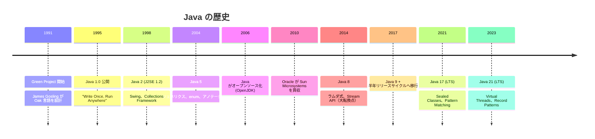
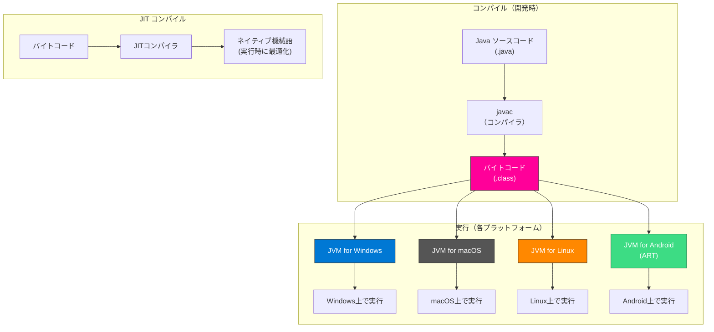

# Java -- なぜこの言語は生まれたのか

## はじめに

Javaは、1995年にSun Microsystems（現Oracle）が公開したオブジェクト指向プログラミング言語である。James Goslingが中心となって設計し、「**Write Once, Run Anywhere**（一度書けばどこでも動く）」というスローガンのもと、プラットフォーム非依存のソフトウェア開発を実現した。

公開から30年以上が経過した現在でも、エンタープライズ開発、Androidアプリ、金融システム、大規模Webサービスなど、ミッションクリティカルな領域で圧倒的な存在感を持つ。

## 誕生の背景

### 1990年代初頭のソフトウェア開発

1990年代初頭、ソフトウェア開発は大きな課題を抱えていた。

#### プラットフォーム依存の問題

当時のプログラミングでは、OSやCPUアーキテクチャごとにコードを書き直す、あるいは再コンパイルする必要があった。

| プラットフォーム | OS | CPU | コンパイラ |
| --- | --- | --- | --- |
| PC | Windows | x86 | MSVC |
| ワークステーション | Solaris | SPARC | Sun CC |
| サーバー | HP-UX | PA-RISC | HP CC |
| Mac | Mac OS | 68K/PPC | MPW |

同じプログラムを複数のプラットフォームで動かすには、それぞれの環境向けにコードを修正・コンパイルする必要があった。これは膨大なコストを生んでいた。

#### C/C++の課題

C/C++は当時の主力言語だったが、以下の問題があった。

- **メモリ管理**: 手動のmalloc/freeが必要で、メモリリークやセグメンテーション違反が頻発
- **ポインタ演算**: 安全でないメモリアクセスが可能
- **プラットフォーム依存**: 各OS向けに再コンパイルが必要
- **複雑な言語仕様**: 多重継承、演算子オーバーロードなど

### Greenプロジェクト

1991年、Sun MicrosystemsのJames Gosling、Mike Sheridan、Patrick Naughtonは「**Green Project**」を開始した。このプロジェクトの当初の目標は、**家電製品（テレビ、セットトップボックスなど）の組み込みソフトウェア**のための言語を開発することだった。

家電製品のプロセッサは多種多様であり、一つの言語で書いたプログラムが異なるプロセッサ上で動作する必要があった。これが**プラットフォーム非依存**という設計目標につながった。

最初に開発された言語は「**Oak**」と名付けられた（Goslingのオフィスの窓から見えたオークの木にちなむ）。しかし商標の問題からOakは使えず、最終的に**Java**（コーヒーの銘柄から）と改名された。

### Webの登場とJavaの転機

Greenプロジェクトの家電向け市場は思うように成長しなかった。しかし1993年、**World Wide Webの急速な普及**がJavaに新たな舞台を与えた。

当時のWebブラウザは静的なHTMLを表示するだけだった。Javaの「プラットフォーム非依存」という特性は、ブラウザ上で動的なプログラム（**Javaアプレット**）を実行するために最適だった。

1995年5月23日、Sun MicrosystemsはJavaを正式に公開。NetscapeがNavigatorブラウザにJavaを組み込んだことで、Javaは一気に注目を集めた。



## JVM -- Write Once, Run Anywhere

JavaのプラットフォームJVM非依存性の鍵は**JVM（Java Virtual Machine）**にある。

### 仕組み

Javaのソースコードは、直接機械語にコンパイルされるのではなく、**バイトコード**と呼ばれる中間表現にコンパイルされる。このバイトコードをJVMが各プラットフォーム上で実行する。



### JIT（Just-In-Time）コンパイル

JVMはバイトコードを逐次解釈するだけでなく、頻繁に実行されるコード（ホットスポット）を**実行時にネイティブ機械語にコンパイル**する。これにより、静的コンパイル言語に迫るパフォーマンスを実現している。

### GC（ガベージコレクション）

Javaは**自動メモリ管理**（ガベージコレクション）を提供する。C/C++のようにmalloc/freeを手動で管理する必要がなく、メモリリークのリスクを大幅に低減する。

| GCの種類 | 特徴 | 用途 |
| --- | --- | --- |
| G1 GC | バランス型（デフォルト） | 一般的な用途 |
| ZGC | 超低レイテンシ（停止時間1ms以下） | リアルタイムシステム |
| Shenandoah | 低レイテンシ | 大規模ヒープ |
| Serial GC | シングルスレッド | 組み込み・小規模 |

## Javaの設計思想

Javaの設計は「**白書（Java White Paper）**」に記された5つの目標に基づいている。

1. **シンプルでオブジェクト指向**
2. **堅牢で安全**
3. **アーキテクチャ中立でポータブル**
4. **高パフォーマンス**
5. **インタプリタ型でスレッド対応、動的**

### C++からの「引き算」

Javaは「**better C++**」として、C++の複雑で危険な機能を意図的に排除した。

| C++の機能 | Javaでの扱い |
| --- | --- |
| ポインタ演算 | 排除（参照のみ） |
| 多重継承 | 排除（インターフェースで代替） |
| 演算子オーバーロード | 排除 |
| ヘッダファイル | 排除 |
| 手動メモリ管理 | GCで自動化 |
| プリプロセッサ | 排除 |

## エンタープライズでの支配的地位

### Java EE（Jakarta EE）

Javaがエンタープライズ開発で支配的地位を確立した最大の要因は、**Java EE（Enterprise Edition）**（現Jakarta EE）の存在である。

Java EEは大規模業務システムに必要な機能を標準仕様として提供した。

| 仕様 | 用途 |
| --- | --- |
| Servlet / JSP | Webアプリケーション |
| EJB | ビジネスロジック |
| JPA | データベースアクセス（ORM） |
| JMS | メッセージキュー |
| JAX-RS | RESTful API |
| CDI | 依存性注入 |

### Spring Framework

2003年にRod Johnsonが公開した**Spring Framework**は、Java EEの複雑さを大幅に軽減し、Javaエンタープライズ開発のデファクトスタンダードとなった。

```java
// Spring Bootによるシンプルなスタート
@SpringBootApplication
public class Application {
    public static void main(String[] args) {
        SpringApplication.run(Application.class, args);
    }
}

// RESTful APIの定義
@RestController
@RequestMapping("/api/users")
public class UserController {

    @Autowired
    private UserService userService;

    @GetMapping("/{id}")
    public ResponseEntity<User> getUser(@PathVariable Long id) {
        return userService.findById(id)
            .map(ResponseEntity::ok)
            .orElse(ResponseEntity.notFound().build());
    }

    @PostMapping
    public ResponseEntity<User> createUser(@Valid @RequestBody CreateUserRequest request) {
        User user = userService.create(request);
        return ResponseEntity.status(HttpStatus.CREATED).body(user);
    }
}
```

Spring Bootの登場（2014年）により、設定の自動化・組み込みサーバーなどが実現し、Javaでの開発が劇的にシンプルになった。

### Javaが選ばれる理由（エンタープライズ視点）

| 理由 | 詳細 |
| --- | --- |
| 安定性 | 後方互換性が高く、長期運用に適している |
| 人材の豊富さ | Java開発者は世界で最も多い部類 |
| ツールの充実 | IntelliJ IDEA、Eclipse、Maven、Gradleなど |
| ライブラリの豊富さ | Maven Centralに数百万のアーティファクト |
| JVMの成熟度 | 数十年の改善により、極めて高い信頼性と性能 |
| 大企業のサポート | Oracle、IBM、Amazon（Corretto）、Microsoftなど |

## モダンJava（Java 8以降）

Java 8（2014年）は言語の大転換点だった。以降、Javaは急速にモダン化している。

### ラムダ式とStream API（Java 8）

```java
// 従来のJava
List<String> filtered = new ArrayList<>();
for (String name : names) {
    if (name.length() > 3) {
        filtered.add(name.toUpperCase());
    }
}

// Java 8以降（関数型スタイル）
List<String> filtered = names.stream()
    .filter(name -> name.length() > 3)
    .map(String::toUpperCase)
    .collect(Collectors.toList());
```

### Record（Java 14/16）

```java
// 従来: getter, equals, hashCode, toString を手書き
public class Point {
    private final int x;
    private final int y;
    // コンストラクタ、getter、equals、hashCode、toString... 大量のボイラープレート
}

// Java 16+: Record で1行
public record Point(int x, int y) {}
```

### パターンマッチング（Java 17+）

```java
// instanceof のパターンマッチング
if (obj instanceof String s) {
    System.out.println(s.length()); // キャスト不要
}

// switch式のパターンマッチング（Java 21）
String result = switch (shape) {
    case Circle c     -> "Circle with radius " + c.radius();
    case Rectangle r  -> "Rectangle " + r.width() + "x" + r.height();
    case Triangle t   -> "Triangle with base " + t.base();
};
```

### Virtual Threads（Java 21）

Java 21で導入されたVirtual Threads（仮想スレッド）は、Goのgoroutineに似た軽量スレッドをJVMに組み込んだ。

```java
// 従来: プラットフォームスレッド（重い）
Thread thread = new Thread(() -> {
    // 処理
});

// Java 21+: Virtual Thread（軽量）
Thread vThread = Thread.ofVirtual().start(() -> {
    // 処理 -- 数百万の同時実行が可能
});

// ExecutorServiceでの利用
try (var executor = Executors.newVirtualThreadPerTaskExecutor()) {
    for (int i = 0; i < 100_000; i++) {
        executor.submit(() -> {
            // 各リクエストを仮想スレッドで処理
            handleRequest();
        });
    }
}
```

## JVM言語エコシステム

JVMはJava専用ではない。JVM上で動作する多くの言語が存在する。

| 言語 | 特徴 | 主な用途 |
| --- | --- | --- |
| Kotlin | モダンなJava代替 | Androidアプリ、サーバーサイド |
| Scala | 関数型 + OOP | データ処理（Apache Spark） |
| Clojure | Lisp系関数型 | データ処理、並行処理 |
| Groovy | 動的型付け | Gradleビルドスクリプト、テスト |

## メリットとデメリット

### メリット

| メリット | 詳細 |
| --- | --- |
| **プラットフォーム非依存** | JVMがあればどこでも動作する |
| **堅牢な型システム** | 静的型付けによるコンパイル時の安全性 |
| **GCによる安全性** | メモリリークのリスクを大幅に低減 |
| **エコシステムの成熟度** | 30年以上の蓄積による豊富なライブラリ・ツール |
| **人材の豊富さ** | 世界中に膨大な数のJava開発者が存在 |
| **後方互換性** | 古いコードが新しいJVMでもほぼそのまま動く |
| **パフォーマンス** | JITコンパイルにより、長時間実行ではC++に迫る性能 |
| **Spring Boot** | モダンなWeb/API開発が効率的に行える |

### デメリット

| デメリット | 詳細 |
| --- | --- |
| **冗長な記述** | 改善されてきたが、他の現代的な言語と比較すると記述量が多い |
| **起動時間** | JVMの起動・ウォームアップに時間がかかる |
| **メモリ消費** | JVMのオーバーヘッドにより、メモリ使用量が大きい |
| **学習曲線** | OOP概念、デザインパターン、Springの学習に時間がかかる |
| **Oracle のライセンス問題** | Oracle JDKのライセンス変更による混乱（OpenJDKで回避可能） |
| **サーバーレスとの相性** | コールドスタートが遅い（GraalVMのネイティブイメージで改善） |

## 主な採用事例

| 企業/プロジェクト | 用途 |
| --- | --- |
| Google | Android（Kotlin/Javaが公式言語） |
| Amazon | AWS内部サービス、Amazon.com |
| Netflix | バックエンドサービス |
| LinkedIn | マイクロサービス基盤 |
| 楽天 | ECプラットフォーム |
| 三菱UFJ銀行 | 勘定系システム |
| Twitter/X | バックエンド（Scala/Java on JVM） |
| Apache Kafka | 分散メッセージング |
| Apache Spark | 大規模データ処理 |
| Minecraft | ゲーム本体（Java版） |

## まとめ

Javaは「一度書けばどこでも動く」というプラットフォーム非依存の理想を、JVMという仕組みで実現した言語である。家電向け言語として生まれ、Webアプレットで注目を集め、エンタープライズ開発の王座に君臨し、Androidによってモバイル領域にも進出した。

30年以上の歴史を持ちながら、Java 8以降は積極的にモダン化を進めており、Record、パターンマッチング、Virtual Threadsなど、現代的な機能が次々と追加されている。エンタープライズ領域での信頼性と安定性は他の追随を許さず、今後もミッションクリティカルなシステムの基盤として使われ続けるだろう。

## 参考文献

- [Oracle Java公式サイト](https://www.oracle.com/java/)
- [OpenJDK](https://openjdk.org/)
- [The Java Language Specification](https://docs.oracle.com/javase/specs/)
- [The Java White Paper (James Gosling, 1996)](https://www.oracle.com/java/technologies/language-environment.html)
- [Spring Framework公式サイト](https://spring.io/)
- [Spring Boot Reference Documentation](https://docs.spring.io/spring-boot/docs/current/reference/html/)
- [Jakarta EE](https://jakarta.ee/)
- [JEP Index (JDK Enhancement Proposals)](https://openjdk.org/jeps/)
- [Inside the Java Virtual Machine (Bill Venners)](https://www.artima.com/insidejvm/)
- [State of Java Survey (JetBrains)](https://www.jetbrains.com/lp/devecosystem/)
