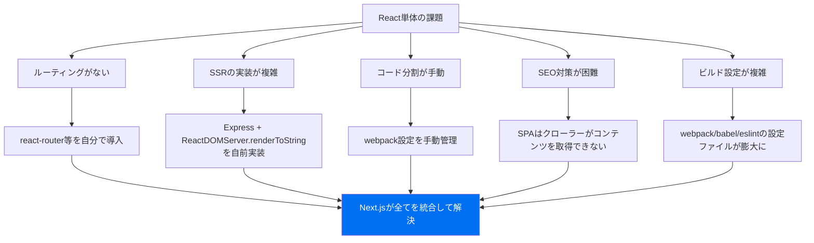
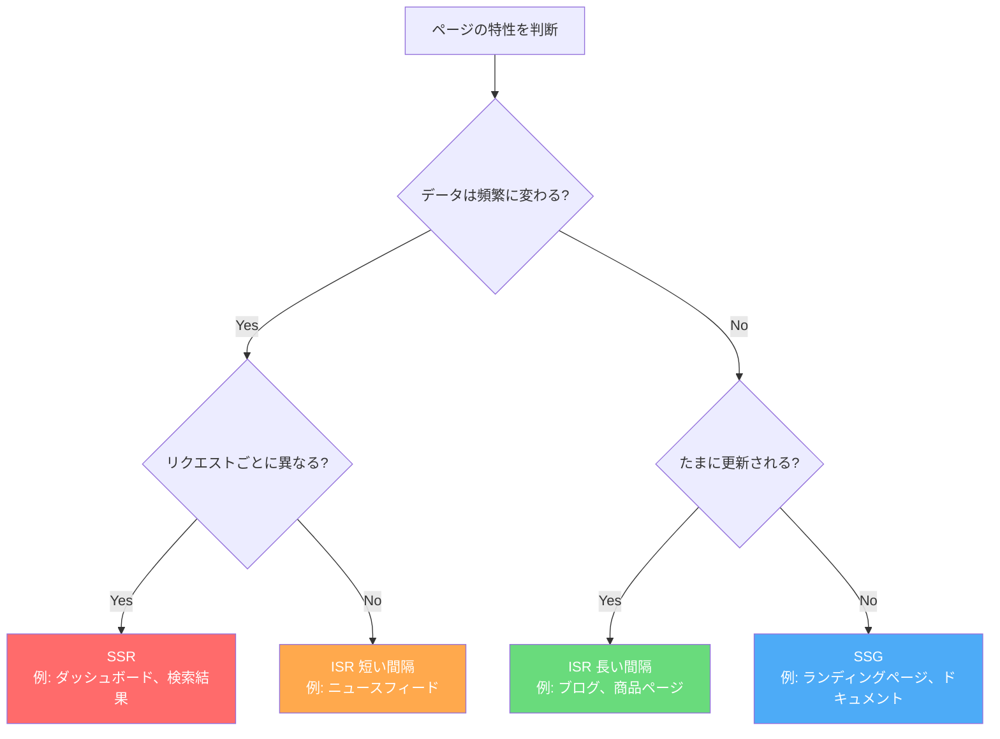

# Next.js

## Next.jsとは何か

Next.jsは**Reactベースのフルスタックフレームワーク**。2016年にVercel（旧ZEIT）が開発・公開した。Reactは本来UIライブラリであり、ルーティングやサーバーサイドレンダリング（SSR）は自前で構築する必要があった。Next.jsはその課題を解決し、Reactアプリケーションを「すぐにプロダクションで使える状態」にするために生まれた。

たとえるなら、Reactが「エンジン」だとすれば、Next.jsは「完成した車」。エンジン単体では走れないが、車になれば道路を走れる。

### Next.jsの核心的な特徴

| 特徴 | 説明 | たとえ |
| --- | --- | --- |
| ハイブリッドレンダリング | SSR/SSG/ISR/CSRを1つのアプリ内で使い分け可能 | 料理の注文に応じて焼きたて・作り置き・温め直しを選べるレストラン |
| ファイルベースルーティング | フォルダ構造がそのままURLになる | 図書館の棚番号がそのまま本の住所になる |
| フルスタック対応 | フロントエンドとバックエンドを1つのプロジェクトで管理 | 表の接客と裏の厨房を一人でこなす |
| 開発者体験（DX） | 高速なHMR、TypeScript対応、ESLint統合 | 道具が全部揃った工房で作業する |

---

## なぜNext.jsが生まれたのか

### 2016年以前のReactの課題

Reactは強力なUIライブラリだったが、プロダクション利用には多くの「自分で選ぶ・設定する」作業が必要だった。



### Vercel（旧ZEIT）の思想

Vercelの創業者Guillermo Rauchは「フロントエンド開発はもっとシンプルであるべき」という信念を持っていた。ZEITはNode.jsのリアルタイムフレームワーク「Socket.io」の開発者でもあるRauchが設立した企業で、デプロイプラットフォーム「Now（現Vercel）」を提供していた。

Next.jsはその延長線上で、「ゼロ設定でReactアプリをSSR対応にする」という目的で誕生した。

### Next.jsの進化の歴史

| バージョン | 年 | 主な機能追加 |
| --- | --- | --- |
| 1.0 | 2016 | 初版リリース。SSR、ファイルベースルーティング |
| 9.0 | 2019 | API Routes、自動最適化 |
| 9.3 | 2020 | `getStaticProps`/`getServerSideProps` 導入 |
| 10.0 | 2020 | 画像最適化（`next/image`）、国際化対応 |
| 12.0 | 2021 | Middlewareの導入、Rust製コンパイラ（SWC） |
| 13.0 | 2022 | App Router（ベータ）、React Server Components |
| 14.0 | 2023 | App Router安定版、Server Actions |
| 15.0 | 2024 | Turbopack安定版、部分プリレンダリング |

---

## レンダリング戦略

Next.jsの最大の強みは、用途に応じて最適なレンダリング戦略を選べること。

### SSR（Server-Side Rendering）

リクエストのたびにサーバーでHTMLを生成する。常に最新のデータを表示したいページに適している。

```typescript
// App Router: サーバーコンポーネント + 動的レンダリング
async function ProductPage({ params }: { params: { id: string } }) {
  // リクエストごとにデータを取得
  const product = await fetch(`https://api.example.com/products/${params.id}`, {
    cache: 'no-store', // キャッシュしない = SSR
  })
  const data = await product.json()

  return (
    <div>
      <h1>{data.name}</h1>
      <p>価格: {data.price}円</p>
      <p>在庫: {data.stock}個</p>
    </div>
  )
}
```

### SSG（Static Site Generation）

ビルド時にHTMLを生成する。コンテンツが頻繁に変わらないページに最適。

```typescript
// App Router: デフォルトでSSG（静的レンダリング）
async function BlogPost({ params }: { params: { slug: string } }) {
  const post = await fetch(`https://api.example.com/posts/${params.slug}`)
  const data = await post.json()

  return (
    <article>
      <h1>{data.title}</h1>
      <div dangerouslySetInnerHTML={{ __html: data.content }} />
    </article>
  )
}

// ビルド時に生成するパスを指定
export async function generateStaticParams() {
  const posts = await fetch('https://api.example.com/posts').then(r => r.json())
  return posts.map((post: { slug: string }) => ({ slug: post.slug }))
}
```

### ISR（Incremental Static Regeneration）

SSGの発展形。静的ページを一定間隔で再生成する。「ほぼ静的だが、たまに更新される」コンテンツに最適。

```typescript
// App Router: revalidateオプションでISRを実現
async function NewsPage() {
  const news = await fetch('https://api.example.com/news', {
    next: { revalidate: 60 }, // 60秒ごとに再生成
  })
  const articles = await news.json()

  return (
    <ul>
      {articles.map((article: { id: string; title: string }) => (
        <li key={article.id}>{article.title}</li>
      ))}
    </ul>
  )
}
```

### レンダリング戦略の使い分け



| 戦略 | 生成タイミング | 適したコンテンツ | TTFB |
| --- | --- | --- | --- |
| SSG | ビルド時 | ドキュメント、LP | 最速 |
| ISR | ビルド時 + 定期再生成 | ブログ、ECサイト | 速い |
| SSR | リクエスト時 | ダッシュボード、検索 | やや遅い |
| CSR | クライアント側 | 管理画面、SPA | 初回遅い |

---

## App Router

### Pages RouterからApp Routerへ

Next.js 13で導入された**App Router**は、Next.jsのアーキテクチャを根本から刷新した。

| 観点 | Pages Router（従来） | App Router（新） |
| --- | --- | --- |
| ディレクトリ | `pages/` | `app/` |
| データ取得 | `getServerSideProps`, `getStaticProps` | `fetch` + React Server Components |
| レイアウト | `_app.tsx`, `_document.tsx` | `layout.tsx`（ネスト可能） |
| ローディング | 自前実装 | `loading.tsx`（組み込み） |
| エラー処理 | `_error.tsx` | `error.tsx`（セグメント単位） |
| コンポーネント | 全てクライアントコンポーネント | デフォルトがサーバーコンポーネント |

### ファイル規約

App Routerでは特別な名前のファイルが特別な役割を持つ。

```
app/
├── layout.tsx          # ルートレイアウト（必須）
├── page.tsx            # / のページ
├── loading.tsx         # ローディングUI
├── error.tsx           # エラーUI
├── not-found.tsx       # 404ページ
├── blog/
│   ├── layout.tsx      # ブログ用レイアウト
│   ├── page.tsx        # /blog のページ
│   └── [slug]/
│       └── page.tsx    # /blog/:slug のページ
├── api/
│   └── users/
│       └── route.ts    # API Route: /api/users
└── (marketing)/        # ルートグループ（URLに影響しない）
    ├── about/
    │   └── page.tsx    # /about
    └── contact/
        └── page.tsx    # /contact
```

### Server Components と Client Components

App Routerの最大の変更点は、**React Server Components（RSC）**をデフォルトにしたこと。

```typescript
// サーバーコンポーネント（デフォルト）
// - サーバーでのみ実行される
// - DBに直接アクセスできる
// - バンドルサイズに影響しない
async function UserList() {
  const users = await db.user.findMany() // DBに直接アクセス
  return (
    <ul>
      {users.map(user => (
        <li key={user.id}>{user.name}</li>
      ))}
    </ul>
  )
}
```

```typescript
'use client' // この宣言でクライアントコンポーネントになる

import { useState } from 'react'

// クライアントコンポーネント
// - ブラウザで実行される
// - useState, useEffect等のフックが使える
// - イベントハンドラが使える
function Counter() {
  const [count, setCount] = useState(0)
  return <button onClick={() => setCount(c => c + 1)}>Count: {count}</button>
}
```

### Server Actions

Next.js 14で安定版となったServer Actionsは、フォーム送信やデータ変更をサーバー側で直接処理できる仕組み。

```typescript
// app/actions.ts
'use server'

export async function createTodo(formData: FormData) {
  const title = formData.get('title') as string
  await db.todo.create({ data: { title } })
  revalidatePath('/todos')
}
```

```typescript
// app/todos/page.tsx
import { createTodo } from '../actions'

export default function TodoPage() {
  return (
    <form action={createTodo}>
      <input name="title" placeholder="新しいToDo" />
      <button type="submit">追加</button>
    </form>
  )
}
```

---

## プロジェクトの始め方

```bash
# Next.jsプロジェクトの作成
npx create-next-app@latest my-app --typescript --tailwind --app --src-dir

cd my-app
npm run dev
```

生成されるフォルダ構造:

```
my-app/
├── src/
│   └── app/
│       ├── layout.tsx       # ルートレイアウト
│       ├── page.tsx         # ホームページ
│       ├── globals.css      # グローバルスタイル
│       └── favicon.ico
├── public/                  # 静的ファイル
├── next.config.ts           # Next.js設定
├── tailwind.config.ts       # Tailwind CSS設定
├── tsconfig.json            # TypeScript設定
└── package.json
```

---

## メリットとデメリット

### メリット

| メリット | 詳細 |
| --- | --- |
| ゼロ設定 | webpack/babel/TypeScript等の設定が不要 |
| SEO最適化 | SSR/SSGにより検索エンジンがコンテンツを認識できる |
| パフォーマンス | 画像最適化、コード分割、プリフェッチが自動 |
| フルスタック | API RoutesやServer Actionsでバックエンドも書ける |
| Vercelとの統合 | デプロイが極めて簡単（git pushだけ） |
| 巨大なコミュニティ | 情報が豊富で問題解決が容易 |

### デメリット

| デメリット | 詳細 |
| --- | --- |
| Vercelへの依存 | 一部機能はVercel以外でのデプロイが困難 |
| 学習コスト | App Router + RSCの概念が複雑 |
| ビルド時間 | 大規模サイトではビルドに時間がかかる |
| バンドルサイズ | フレームワーク自体のオーバーヘッドがある |
| 破壊的変更 | メジャーバージョンアップで大きな変更がある |
| ブラックボックス | 内部の動作が複雑で、問題のデバッグが難しい場合がある |

---

## 代替フレームワークとの比較

| 観点 | Next.js | Remix | Nuxt.js | Astro |
| --- | --- | --- | --- | --- |
| ベース | React | React | Vue.js | フレームワーク非依存 |
| SSR | 対応 | 対応 | 対応 | 対応 |
| SSG | 対応 | 非対応 | 対応 | 得意 |
| ISR | 対応 | 非対応 | 対応 | 非対応 |
| データ取得 | fetch + RSC | loader/action | useFetch | 各種対応 |
| 学習コスト | 中〜高 | 中 | 中 | 低 |
| 適したユースケース | 汎用 | Webアプリ | Vueエコシステム | コンテンツサイト |

---

## 実践: ミニマルなブログアプリ

```typescript
// app/layout.tsx
export default function RootLayout({ children }: { children: React.ReactNode }) {
  return (
    <html lang="ja">
      <body>
        <nav>
          <a href="/">ホーム</a>
          <a href="/blog">ブログ</a>
        </nav>
        <main>{children}</main>
      </body>
    </html>
  )
}
```

```typescript
// app/blog/page.tsx
type Post = { id: string; title: string; excerpt: string }

export default async function BlogPage() {
  const res = await fetch('https://api.example.com/posts', {
    next: { revalidate: 3600 }, // 1時間ごとに再生成
  })
  const posts: Post[] = await res.json()

  return (
    <div>
      <h1>ブログ記事一覧</h1>
      {posts.map(post => (
        <article key={post.id}>
          <h2><a href={`/blog/${post.id}`}>{post.title}</a></h2>
          <p>{post.excerpt}</p>
        </article>
      ))}
    </div>
  )
}
```

```typescript
// app/blog/[id]/page.tsx
type Post = { id: string; title: string; content: string; createdAt: string }

export default async function BlogPostPage({ params }: { params: { id: string } }) {
  const res = await fetch(`https://api.example.com/posts/${params.id}`)
  const post: Post = await res.json()

  return (
    <article>
      <h1>{post.title}</h1>
      <time>{new Date(post.createdAt).toLocaleDateString('ja-JP')}</time>
      <div dangerouslySetInnerHTML={{ __html: post.content }} />
    </article>
  )
}

export async function generateStaticParams() {
  const res = await fetch('https://api.example.com/posts')
  const posts: { id: string }[] = await res.json()
  return posts.map(post => ({ id: post.id }))
}
```

---

## 参考文献

- [Next.js 公式ドキュメント](https://nextjs.org/docs) - Next.jsの公式リファレンスとチュートリアル
- [Next.js Learn](https://nextjs.org/learn) - 公式のインタラクティブ学習コース
- [Vercel 公式サイト](https://vercel.com/) - Next.jsの開発元が提供するデプロイプラットフォーム
- [React Server Components RFC](https://github.com/reactjs/rfcs/blob/main/text/0188-server-components.md) - RSCの設計文書
- [Next.js GitHub](https://github.com/vercel/next.js) - ソースコードとIssue
- [Guillermo Rauch - 7 Principles of Rich Web Applications](https://rauchg.com/2014/7-principles-of-rich-web-applications) - Next.jsの設計思想の原点となったブログ記事
- [Remix 公式ドキュメント](https://remix.run/docs) - 代替フレームワークの公式リファレンス
- [Astro 公式ドキュメント](https://docs.astro.build/) - コンテンツ重視の代替フレームワーク
