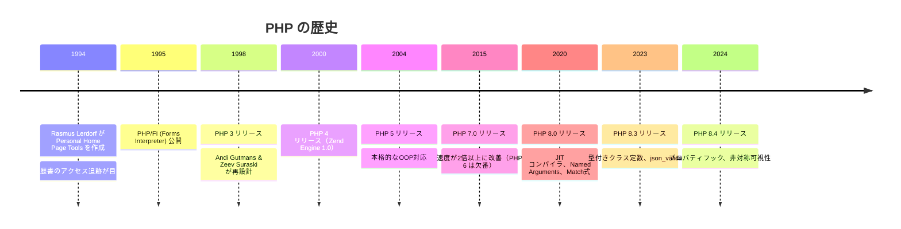
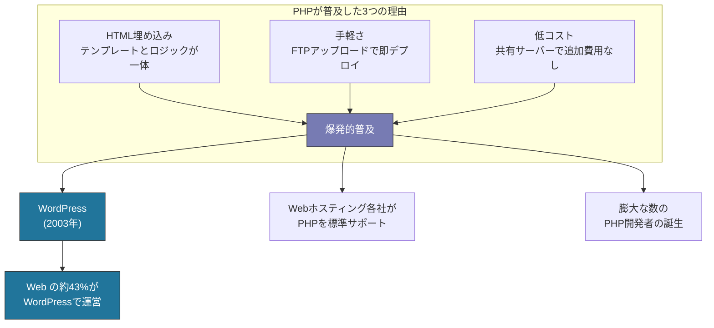

# PHP -- なぜこの言語は生まれたのか

## はじめに

PHPは、1995年にRasmus Lerdorfが公開した**Web開発に特化した**サーバーサイドプログラミング言語である。元々は「**Personal Home Page Tools**」の略称であり、個人のWebページを管理するための簡単なツールとして誕生した。

現在ではWordPressを筆頭に、Webサイトの約77%がPHPで動いているとされ（W3Techs調査）、世界で最も普及したサーバーサイド言語の一つである。

## 誕生の背景

### 1990年代のWeb開発

1990年代前半、World Wide Webは急速に普及していた。しかし当時のWebは**静的なHTML**が主流で、動的なコンテンツの生成は困難だった。

動的なWebページを作るための技術は存在したが、どれも課題を抱えていた。

| 技術 | 課題 |
| --- | --- |
| CGI（C言語） | 書くのが難しい。リクエストごとにプロセスを起動するため遅い |
| CGI（Perl） | テキスト処理に強いが、コードが読みにくい |
| SSI | 機能が限定的 |

### Rasmus Lerdorfの個人ツール

1994年、デンマーク系カナダ人のプログラマRasmus Lerdorfは、自分のオンライン履歴書へのアクセスを追跡するために、C言語で簡単なCGIプログラムを作成した。これが**Personal Home Page Tools**、後のPHPの始まりだった。

Lerdorfは後にこう語っている。

> 「私はプログラミング言語を作るつもりは全くなかった。何が起きたのかさっぱりわからない。」

彼が作ったのは以下のようなものだった。

1. **Personal Home Page Tools** (1994): フォーム処理とアクセスカウンターの簡易ツール
2. **PHP/FI (Forms Interpreter)** (1995): フォームデータの解釈とデータベース連携を追加
3. **PHP 3** (1998): Andi GutmansとZeev Suraskiにより完全に書き直し、本格的なプログラミング言語に



### なぜPHPが爆発的に普及したか

PHPが他の技術を押しのけてWebの支配的言語になった理由は明確である。

#### 1. HTMLへの埋め込み

PHPの最大の特徴は、**HTMLの中にコードを直接埋め込める**ことだった。

```php
<!DOCTYPE html>
<html>
<body>
    <h1>こんにちは、<?php echo $userName; ?>さん！</h1>
    <p>今日は <?php echo date('Y年m月d日'); ?> です。</p>

    <?php if ($isLoggedIn): ?>
        <p>ログイン中です。</p>
    <?php else: ?>
        <p><a href="/login">ログインしてください</a></p>
    <?php endif; ?>

    <ul>
    <?php foreach ($items as $item): ?>
        <li><?php echo htmlspecialchars($item['name']); ?></li>
    <?php endforeach; ?>
    </ul>
</body>
</html>
```

CGI（C/Perl）では、プログラムの中でHTMLを文字列として出力する必要があり、HTMLの構造が見えにくかった。PHPはこの関係を逆転させ、HTMLの中にロジックを埋め込む形にした。

#### 2. 圧倒的な手軽さ

```
# PHPのデプロイ方法（1990年代~2000年代）
1. .phpファイルを書く
2. FTPでサーバーにアップロード
3. 完了（コンパイル不要、サーバー再起動不要）
```

この手軽さは他の技術にはないものだった。共有レンタルサーバーのほぼ全てがPHPをサポートしており、追加費用なしで動的Webサイトを構築できた。

#### 3. 低い学習コスト

PHPはプログラミング初心者でも始めやすい言語だった。

```php
<?php
// 変数の宣言に型指定は不要
$name = "太郎";
$age = 30;

// 配列の作成
$fruits = ["りんご", "みかん", "バナナ"];

// データベース接続と取得（PDO）
$pdo = new PDO('mysql:host=localhost;dbname=mydb', 'user', 'pass');
$stmt = $pdo->query('SELECT * FROM users');
$users = $stmt->fetchAll();
```



## WordPress -- PHPの最大の成功事例

2003年にMatt MullenwegとMike Littleによって公開された**WordPress**は、PHPで書かれたCMS（Content Management System）であり、世界のWebサイトの約43%を占める（2025年時点、W3Techs調査）。

WordPressの存在はPHPの普及に決定的な影響を与えた。

| 数値 | 内容 |
| --- | --- |
| 43% | WordPressのWebサイトシェア |
| 77% | PHPのサーバーサイドシェア |
| 60,000+ | WordPressプラグイン数 |
| 10,000+ | WordPressテーマ数 |

WordPressにより、PHPを直接書かないユーザー（ブロガー、小規模事業者など）も含め、PHPエコシステムの恩恵を受ける人口は膨大になった。

## PHPの技術的進化

### PHP 5 -- オブジェクト指向の導入（2004年）

PHP 5で本格的なオブジェクト指向プログラミングがサポートされた。

```php
<?php
class User
{
    private string $name;
    private string $email;

    public function __construct(string $name, string $email)
    {
        $this->name = $name;
        $this->email = $email;
    }

    public function getName(): string
    {
        return $this->name;
    }
}

interface Repository
{
    public function find(int $id): ?User;
    public function save(User $user): void;
}
```

### PHP 7 -- パフォーマンスの大革命（2015年）

PHP 7はPHP 5.6と比較して**2倍以上の実行速度**と**大幅なメモリ使用量の削減**を実現した。内部エンジン（Zend Engine 3.0）の完全な書き直しによるものである。

| 指標 | PHP 5.6 | PHP 7.0 | 改善率 |
| --- | --- | --- | --- |
| WordPress実行速度 | 基準 | 2-3倍高速 | +200-300% |
| メモリ使用量 | 基準 | 約50%削減 | -50% |

さらに型宣言が強化された。

```php
<?php
// PHP 7: スカラー型宣言と戻り値の型
declare(strict_types=1);

function add(int $a, int $b): int
{
    return $a + $b;
}

// Null合体演算子
$username = $_GET['user'] ?? 'ゲスト';

// 宇宙船演算子
$result = $a <=> $b; // -1, 0, 1 を返す
```

### PHP 8.x -- モダンPHP（2020年～）

PHP 8以降、言語は急速にモダン化している。

#### Named Arguments

```php
<?php
// PHP 8: 名前付き引数
function createUser(
    string $name,
    string $email,
    int $age = 0,
    string $role = 'user'
): User {
    // ...
}

// 引数名を指定して呼び出し（順序は自由）
$user = createUser(
    name: '太郎',
    email: 'taro@example.com',
    role: 'admin',
);
```

#### Match式

```php
<?php
// PHP 8: match式（switchの進化版）
$statusText = match ($statusCode) {
    200 => 'OK',
    301 => 'Moved Permanently',
    404 => 'Not Found',
    500 => 'Internal Server Error',
    default => 'Unknown',
};
```

#### Enum（PHP 8.1）

```php
<?php
// PHP 8.1: 列挙型
enum Status: string
{
    case Active = 'active';
    case Inactive = 'inactive';
    case Suspended = 'suspended';

    public function label(): string
    {
        return match ($this) {
            self::Active => 'アクティブ',
            self::Inactive => '非アクティブ',
            self::Suspended => '停止中',
        };
    }
}

$status = Status::Active;
echo $status->label(); // "アクティブ"
```

#### Readonly Properties & Constructor Promotion

```php
<?php
// PHP 8.2: readonlyクラス
readonly class Point
{
    public function __construct(
        public float $x,
        public float $y,
    ) {}
}

$point = new Point(1.0, 2.0);
// $point->x = 3.0; // Error: readonlyプロパティは変更不可
```

#### Fiber（PHP 8.1）

```php
<?php
// PHP 8.1: Fiber（軽量な非同期処理の基盤）
$fiber = new Fiber(function (): void {
    $value = Fiber::suspend('hello');
    echo "受信: " . $value;
});

$result = $fiber->start(); // 'hello'
$fiber->resume('world');   // "受信: world"
```

## Laravel -- モダンPHPの代表格

2011年にTaylor Otwellが公開した**Laravel**は、PHPの最も人気のあるWebフレームワークであり、モダンPHPの代名詞的存在である。

```php
<?php
// Laravelのルーティング
Route::get('/users', [UserController::class, 'index']);
Route::post('/users', [UserController::class, 'store']);

// コントローラ
class UserController extends Controller
{
    public function index(): JsonResponse
    {
        $users = User::where('active', true)
            ->orderBy('name')
            ->paginate(20);

        return response()->json($users);
    }

    public function store(CreateUserRequest $request): JsonResponse
    {
        $user = User::create($request->validated());

        return response()->json($user, 201);
    }
}

// Eloquent ORM
class User extends Model
{
    protected $fillable = ['name', 'email', 'role'];

    public function posts(): HasMany
    {
        return $this->hasMany(Post::class);
    }
}
```

### PHPフレームワークの比較

| フレームワーク | 特徴 | 用途 |
| --- | --- | --- |
| Laravel | フルスタック、DX重視、豊富なエコシステム | Webアプリ全般 |
| Symfony | 堅牢、コンポーネント指向、エンタープライズ向け | 大規模システム |
| Slim | マイクロフレームワーク | API開発 |
| CakePHP | CoC（設定より規約） | Webアプリ |

## PHPの現代的な開発環境

### Composer -- パッケージマネージャ

```bash
# 依存関係の追加
composer require laravel/framework
composer require phpunit/phpunit --dev

# オートロード設定（PSR-4）
# composer.json
{
    "autoload": {
        "psr-4": {
            "App\\": "src/"
        }
    }
}
```

### 静的解析ツール

| ツール | 用途 |
| --- | --- |
| PHPStan | 静的型解析（レベル0-9で段階的に厳格化） |
| Psalm | 静的型解析（Vimeo製） |
| PHP CS Fixer | コーディングスタイルの自動修正 |
| PHP_CodeSniffer | コーディング規約のチェック |
| Rector | 自動リファクタリング・バージョンアップ |

```bash
# PHPStan: レベル9（最も厳格）で解析
vendor/bin/phpstan analyse src --level=9

# Rector: PHP 8.3 への自動アップグレード
vendor/bin/rector process src
```

## メリットとデメリット

### メリット

| メリット | 詳細 |
| --- | --- |
| **Web特化** | HTMLテンプレートとの統合が自然で、Web開発に最適化 |
| **低い参入障壁** | 学習が容易で、すぐに動くものが作れる |
| **圧倒的なホスティング対応** | ほぼ全ての共有ホスティングがPHPをサポート |
| **WordPressエコシステム** | CMSシェアNo.1のWordPressを通じた巨大なエコシステム |
| **Laravel** | 現代的で生産性の高いフレームワーク |
| **PHP 7/8の性能改善** | 大幅なパフォーマンス向上で実用的な速度を実現 |
| **豊富な人材** | PHP開発者の数は世界でもトップクラス |
| **モダン化の進展** | 型システム、Enum、Fiberなど現代的機能を積極導入 |

### デメリット

| デメリット | 詳細 |
| --- | --- |
| **一貫性のないAPI** | 歴史的経緯による標準関数の命名規則・引数順序の不統一 |
| **レガシーコードの多さ** | 古い書き方のコードが大量に存在し、負の遺産になっている |
| **型安全性の限界** | 型宣言は任意であり、強制力が弱い |
| **非同期処理** | ネイティブの非同期処理サポートが限定的 |
| **評判の問題** | 過去の問題から「古い・ダサい」という偏見が根強い |
| **Web以外の用途** | CLIツールは書けるが、システムプログラミングやデータ分析には不向き |

### 一貫性のないAPIの例

```php
<?php
// 引数の順序が不統一
strpos($haystack, $needle);    // haystack, needle
array_search($needle, $haystack); // needle, haystack

// 命名規則の不統一
strlen();        // アンダースコアなし
str_replace();   // アンダースコアあり
htmlspecialchars(); // 全て小文字
```

これらは歴史的経緯によるもので、PHP 8.xでも後方互換性のために修正されていない。

## 主な採用事例

| 企業/プロジェクト | 用途 |
| --- | --- |
| WordPress | 世界シェア43%のCMS |
| Facebook (Meta) | 初期はPHP（現在はHack言語に移行） |
| Wikipedia | MediaWiki（PHPベースのWikiエンジン） |
| Slack | バックエンドの一部 |
| Etsy | ECプラットフォーム |
| Mailchimp | メールマーケティングプラットフォーム |
| Laravel Forge / Vapor | クラウドデプロイメントツール |

## まとめ

PHPは「個人のホームページを管理するツール」という極めて素朴な動機から生まれ、Webの成長と共に世界で最も普及したサーバーサイド言語に成長した。計画的に設計された言語ではないため、一貫性のないAPIや歴史的負債を抱えているが、PHP 7以降のパフォーマンス改革とPHP 8のモダン機能の導入により、言語としての品質は大幅に向上している。

WordPressという巨大なエコシステムの存在、Laravelという現代的なフレームワークの充実、そしてPHPStanやRectorといった静的解析・自動リファクタリングツールの発展により、PHPは「レガシー言語」ではなく、現代のWeb開発でも十分に選択肢となる言語であり続けている。

## 参考文献

- [PHP公式サイト](https://www.php.net/)
- [PHP公式ドキュメント](https://www.php.net/manual/ja/)
- [PHP: The Right Way](https://phptherightway.com/)
- [Laravel公式サイト](https://laravel.com/)
- [WordPress公式サイト](https://wordpress.org/)
- [Composer](https://getcomposer.org/)
- [PHPStan](https://phpstan.org/)
- [W3Techs - Web Technology Surveys](https://w3techs.com/technologies/details/pl-php)
- [PHP RFC (Request for Comments)](https://wiki.php.net/rfc)
- [Rasmus Lerdorf: PHP History (YouTube)](https://www.youtube.com/watch?v=Lm9bY_dCHBs)
- [Zend Engine](https://www.zend.com/)
