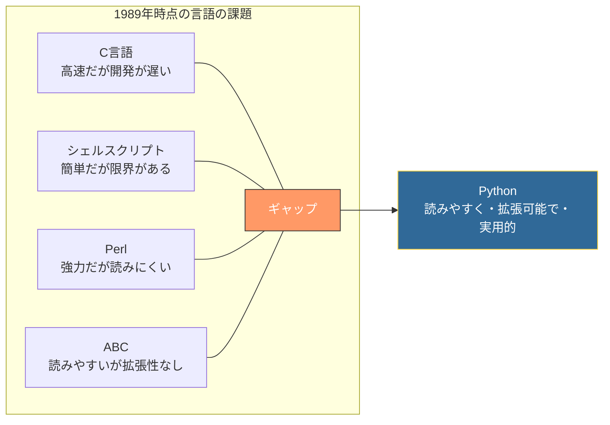
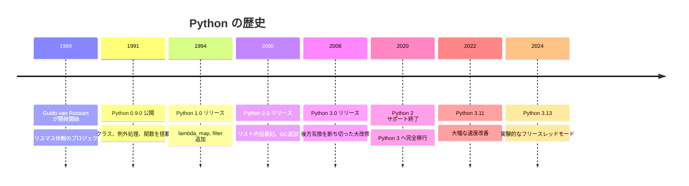
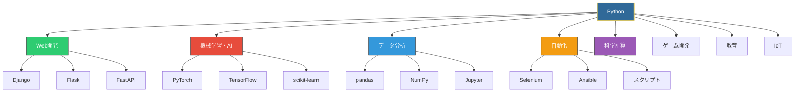

# Python -- なぜこの言語は生まれたのか

## はじめに

Pythonは、1991年にGuido van Rossumによって公開された汎用プログラミング言語である。「**読みやすさ**」を最優先に設計され、初心者からエキスパートまで幅広い開発者に支持されている。

現在ではWeb開発、機械学習、データ分析、自動化、科学計算など、あらゆる分野で使われる世界で最も人気のある言語の一つとなっている。

## 誕生の背景

### ABCという言語の存在

Pythonの誕生を理解するには、その前身である**ABC言語**を知る必要がある。

ABCは1980年代にオランダのCWI（Centrum Wiskunde & Informatica）で開発された教育用プログラミング言語だった。Guido van Rossumはこのプロジェクトに参加しており、ABCの設計思想に大きな影響を受けた。

ABCの特徴は以下の通りである。

| ABCの特徴 | 詳細 |
| --- | --- |
| 読みやすい構文 | インデントによるブロック構造 |
| 高水準のデータ型 | リスト、辞書のような構造を組み込み提供 |
| 対話型実行 | インタラクティブシェルでの実行が可能 |

しかしABCには重大な欠点があった。

- **拡張性がない**: C言語のライブラリを呼び出せない
- **OSとの統合不足**: ファイル操作やネットワーク通信が困難
- **閉じた生態系**: 外部モジュールの仕組みがない
- **普及の失敗**: 限られたアカデミックな環境でしか使われなかった

### Guidoの不満と着想

1989年のクリスマス休暇中、Guido van Rossumは趣味のプロジェクトとして新しいスクリプト言語の開発を始めた。動機は明確だった。

> 「ABCの良い部分（読みやすさ、高水準データ型）を活かしつつ、ABCの欠点（拡張性のなさ）を克服した言語を作りたい」

当時の状況を整理すると以下のようになる。

- **C言語**: 高速だが低水準で開発に時間がかかる
- **シェルスクリプト**: 簡単だが複雑な処理には不向き
- **Perl**: テキスト処理に強いが「書き捨て」コードになりがち
- **ABC**: 読みやすいが拡張性がない

Guidoはこれらの間を埋める言語を目指した。



### 名前の由来

Pythonという名前はヘビではなく、BBCのコメディ番組「**Monty Python's Flying Circus**」に由来する。Guidoはこの番組の大ファンであり、短くて覚えやすい名前としてPythonを選んだ。



## 設計哲学 -- The Zen of Python

Pythonの設計哲学は「**The Zen of Python**」（PEP 20）にまとめられている。Pythonインタプリタで `import this` と実行すると表示される19の格言である。

特に重要なものを抜粋する。

```
Beautiful is better than ugly.
（醜いよりも美しい方がよい）

Explicit is better than implicit.
（暗黙的よりも明示的な方がよい）

Simple is better than complex.
（複雑よりも単純な方がよい）

Readability counts.
（読みやすさは重要である）

There should be one-- and preferably only one --obvious way to do it.
（何かをやる方法は1つ、できれば唯一の明白な方法があるべきだ）
```

この哲学はPythonの全てに反映されている。

- **インデントによるブロック構造**: 波括弧 `{}` ではなくインデントを強制することで、自然と読みやすいコードになる
- **明確な構文**: 「1つのことを行う明白な方法が1つだけある」設計
- **バッテリー同梱**: 標準ライブラリが豊富で、追加インストールなしに多くのことができる

```python
# Pythonの読みやすさの例
# 他の言語と比較して、英語の文章に近い

# リスト内包表記
squares = [x ** 2 for x in range(10) if x % 2 == 0]

# 辞書操作
user = {'name': '太郎', 'age': 30, 'city': '東京'}
if 'name' in user:
    print(f"{user['name']}さん、こんにちは！")

# コンテキストマネージャ
with open('data.txt', 'r', encoding='utf-8') as f:
    content = f.read()
# ファイルは自動的に閉じられる
```

## Pythonの用途の広さ

Pythonが他の言語と一線を画すのは、その**用途の広さ**である。一つの言語でこれほど多様な分野をカバーできる言語は稀少である。

### Web開発

```python
# Flask: 軽量Webフレームワーク
from flask import Flask, jsonify

app = Flask(__name__)

@app.route('/api/users/<int:user_id>')
def get_user(user_id):
    user = {'id': user_id, 'name': '太郎'}
    return jsonify(user)
```

主要フレームワーク:
- **Django**: フルスタックWebフレームワーク（管理画面、ORM、認証を標準搭載）
- **Flask**: マイクロフレームワーク（シンプルで柔軟）
- **FastAPI**: 非同期対応の高速APIフレームワーク（型ヒントベース）

### 機械学習・AI

```python
# scikit-learn: 機械学習
from sklearn.ensemble import RandomForestClassifier
from sklearn.model_selection import train_test_split

X_train, X_test, y_train, y_test = train_test_split(X, y, test_size=0.2)

model = RandomForestClassifier(n_estimators=100)
model.fit(X_train, y_train)
accuracy = model.score(X_test, y_test)
```

主要ライブラリ:
- **NumPy**: 数値計算の基盤
- **pandas**: データ操作・分析
- **scikit-learn**: 機械学習
- **TensorFlow / PyTorch**: ディープラーニング
- **Hugging Face Transformers**: 自然言語処理・LLM

### データ分析・可視化

```python
# pandas + matplotlib による分析
import pandas as pd
import matplotlib.pyplot as plt

df = pd.read_csv('sales.csv')
monthly = df.groupby('month')['revenue'].sum()
monthly.plot(kind='bar', title='月別売上')
plt.show()
```

### 自動化・スクリプティング

```python
# ファイルの一括リネーム
from pathlib import Path

for file in Path('./photos').glob('*.jpg'):
    new_name = file.stem.replace(' ', '_') + file.suffix
    file.rename(file.parent / new_name)
```

### 科学計算

```python
# SciPyによる科学計算
from scipy import integrate
import numpy as np

# 関数の数値積分
result, error = integrate.quad(lambda x: np.exp(-x**2), 0, np.inf)
```



## Pythonの技術的特徴

### 動的型付けと型ヒント

Pythonは動的型付け言語だが、Python 3.5以降では**型ヒント**（Type Hints）が導入された。

```python
# 型ヒントなし（従来のPython）
def greet(name):
    return f"Hello, {name}!"

# 型ヒントあり（Python 3.5+）
def greet(name: str) -> str:
    return f"Hello, {name}!"

# 複雑な型も表現可能
from typing import Optional, Union

def fetch_user(user_id: int) -> Optional[dict[str, str]]:
    ...

def process(data: list[Union[int, float]]) -> float:
    return sum(data)
```

型ヒントは実行時には強制されないが、**mypy**などの型チェッカーでコンパイル時に検証できる。

### GIL（Global Interpreter Lock）

CPython（標準のPython実装）には**GIL**（グローバルインタプリタロック）が存在する。これはマルチスレッドプログラミングにおける大きな制約となっている。

| 処理タイプ | GILの影響 | 対策 |
| --- | --- | --- |
| CPU バウンド | 並列実行できない | multiprocessing、C拡張 |
| I/O バウンド | 影響が少ない | asyncio、threading |

Python 3.13ではGILを無効化できる**フリースレッドモード**が実験的に導入された。

### パッケージ管理

| ツール | 用途 | 特徴 |
| --- | --- | --- |
| pip | パッケージインストール | Python標準のパッケージマネージャ |
| venv | 仮想環境 | Python標準の仮想環境ツール |
| Poetry | 依存関係管理 + パッケージング | モダンな依存関係管理ツール |
| uv | パッケージインストール + 仮想環境 | Rust製の高速ツール（2024年登場） |
| conda | 環境管理 + パッケージ管理 | データサイエンス向け |

## Python 2 から Python 3 への移行

Pythonの歴史で最も大きな出来事の一つが、**Python 2からPython 3への移行**である。

Python 3.0は2008年にリリースされたが、Python 2との**後方互換性を意図的に断ち切った**。これは言語の改善のために必要な決断だったが、移行は非常に長い時間を要した。

主な非互換の変更点:

| 項目 | Python 2 | Python 3 |
| --- | --- | --- |
| print | `print "hello"` (文) | `print("hello")` (関数) |
| 文字列 | デフォルトがバイト列 | デフォルトがUnicode |
| 整数除算 | `3 / 2 = 1` | `3 / 2 = 1.5` |
| range | `range()` がリストを返す | `range()` がイテレータを返す |

2020年1月1日にPython 2のサポートが正式に終了し、現在はPython 3のみがサポートされている。

## メリットとデメリット

### メリット

| メリット | 詳細 |
| --- | --- |
| **読みやすさ** | インデントベースの構文と簡潔な文法で、英語に近い自然な記述 |
| **学習しやすさ** | プログラミング入門に最適。大学・教育機関での採用率が高い |
| **用途の広さ** | Web、ML、データ分析、自動化、科学計算とあらゆる分野で使える |
| **豊富なエコシステム** | PyPIに50万以上のパッケージ。やりたいことの大半はライブラリが存在 |
| **コミュニティ** | 世界最大級の開発者コミュニティ。情報・教材が豊富 |
| **バッテリー同梱** | 標準ライブラリが充実。追加インストールなしに多くの処理が可能 |
| **データサイエンスの標準** | ML/AI分野ではPythonがデファクトスタンダード |

### デメリット

| デメリット | 詳細 |
| --- | --- |
| **実行速度** | インタプリタ言語のため、C/C++/Rust/Goと比較して遅い |
| **GIL** | マルチスレッドの並列実行に制限がある（CPU バウンド処理） |
| **モバイル開発** | iOS/Androidアプリ開発には不向き |
| **ランタイムエラー** | 動的型付けのため、型に起因するバグが実行時まで検出されにくい |
| **パッケージ管理の複雑さ** | pip、venv、Poetry、condaなど複数のツールが乱立 |
| **デプロイの複雑さ** | 実行環境にPythonインタプリタとパッケージの両方が必要 |
| **メモリ使用量** | オブジェクトのオーバーヘッドが大きい |

## 主な採用事例

| 企業/プロジェクト | 用途 |
| --- | --- |
| Google | 社内ツール、YouTube、AI/ML研究 |
| Instagram | バックエンド（Django） |
| Spotify | データパイプライン、バックエンドサービス |
| Netflix | データ分析、推薦システム |
| Dropbox | デスクトップクライアント、バックエンド |
| NASA | 科学計算、データ分析 |
| OpenAI | AI/ML研究、ChatGPTの一部 |

## まとめ

Pythonは「ABCの読みやすさを活かしつつ、実用的な拡張性を持つ言語」として誕生した。Guido van Rossumの「読みやすさが何より重要」という哲学は30年以上経った今も言語の核として維持されている。

特に2010年代以降の機械学習・AI分野の爆発的成長に伴い、Pythonはデータサイエンスのデファクトスタンダードとしての地位を確立した。「簡単に書けて、何でもできる」という特性から、プログラミング入門者から研究者まで、世界で最も幅広い層に使われる言語であり続けている。

## 参考文献

- [Python公式サイト](https://www.python.org/)
- [Python公式ドキュメント](https://docs.python.org/3/)
- [PEP 20 -- The Zen of Python](https://peps.python.org/pep-0020/)
- [Python History (Guido van Rossum's Blog)](https://python-history.blogspot.com/)
- [The Making of Python (Guido van Rossum, 2003)](https://www.artima.com/intv/pythonP.html)
- [Python Developer Survey Results](https://lp.jetbrains.com/python-developers-survey/)
- [PyPI - Python Package Index](https://pypi.org/)
- [PEP 484 -- Type Hints](https://peps.python.org/pep-0484/)
- [Python 3.13 What's New](https://docs.python.org/3.13/whatsnew/3.13.html)
