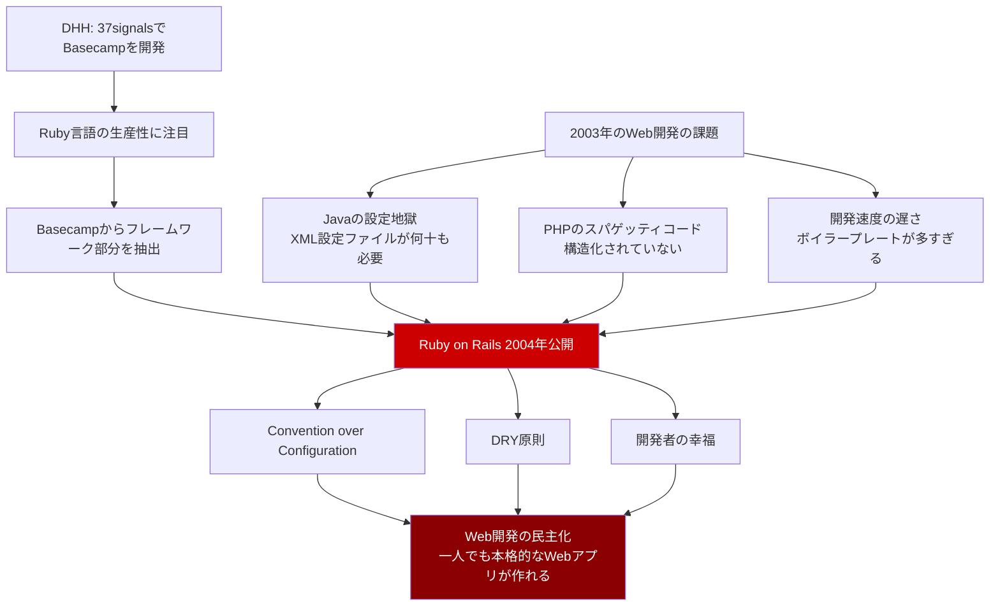
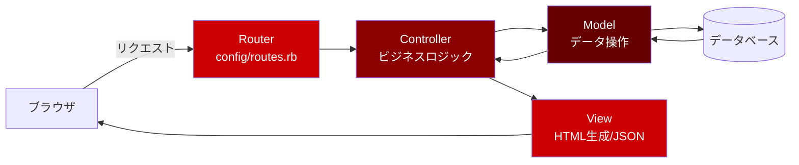

# Ruby on Rails

## Ruby on Railsとは何か

Ruby on Rails（通称Rails）は**Ruby言語で書かれたフルスタックWebフレームワーク**。2004年にDavid Heinemeier Hansson（DHH）がプロジェクト管理ツール「Basecamp」の開発から抽出して公開した。**Convention over Configuration（設定より規約）**と**DRY（Don't Repeat Yourself）**の原則を掲げ、開発者が「何を決めるか」を最小限にすることで生産性を最大化する。

たとえるなら、Railsは「レール」。列車がレールの上を走れば目的地に着くように、Railsの規約に従えば自然とアプリケーションが完成する。レールから外れることもできるが、乗っている方が速い。

### Ruby on Railsの核心的な特徴

| 特徴 | 説明 | たとえ |
| --- | --- | --- |
| Convention over Configuration | 規約に従えば設定ファイルが不要 | 暗黙のルールで動くチーム |
| DRY原則 | 同じ情報を二度書かない | メモは一箇所にだけ書く |
| Active Record | テーブルとクラスが1対1で対応するORM | データベースの代弁者 |
| scaffolding | CRUD操作のコードを一発で生成 | 建設現場の足場（scaffold）が一瞬で組まれる |
| MVC | Model-View-Controllerの明確な分離 | 役割分担が明確な劇団 |

---

## なぜRuby on Railsが生まれたのか

### Basecampからの抽出

2003年、DHHは37signals（現Basecamp社）でプロジェクト管理ツール「Basecamp」を開発していた。当時のWeb開発はJava（Struts、EJB）やPHP（素のPHP）が主流で、設定ファイルの量が膨大だった。

DHHは「Webアプリ開発はもっとシンプルであるべきだ」と考え、Basecampの開発で使ったコードからフレームワーク部分を抽出して公開した。



### Railsが与えた影響

Railsは単なるフレームワーク以上の存在で、Web開発の文化そのものを変えた。

- **Django**（Python）: Railsの成功を見てフルスタックフレームワークの需要を確認
- **Laravel**（PHP）: Railsの設計思想を直接的に受け継いだ
- **Spring Boot**（Java）: Convention over Configurationを取り入れた
- **スタートアップ文化**: 「Rails使えば一人で数週間でMVPが作れる」という認識が広まった

### Ruby on Railsの進化の歴史

| バージョン | 年 | 主な機能追加 |
| --- | --- | --- |
| 1.0 | 2005 | 初版リリース |
| 2.0 | 2007 | REST対応、名前空間 |
| 3.0 | 2010 | Merb統合、Bundler導入 |
| 3.1 | 2011 | Asset Pipeline、CoffeeScript/Sass |
| 4.0 | 2013 | Turbolinks、Strong Parameters |
| 5.0 | 2016 | ActionCable（WebSocket）、API mode |
| 6.0 | 2019 | Action Mailbox、Action Text、並列テスト |
| 7.0 | 2021 | Hotwire（Turbo + Stimulus）、暗号化属性 |
| 8.0 | 2024 | Kamal 2（デプロイ）、Solid Queue/Cache/Cable |

---

## Convention over Configuration

Railsの最も重要な原則。「名前の付け方」に従えば、設定なしで全てが連携する。

| 規約 | 具体例 | 何が起こるか |
| --- | --- | --- |
| モデル名は単数形 | `User` | テーブル名は自動的に `users` になる |
| コントローラ名は複数形 | `UsersController` | `/users` というURLに対応する |
| 主キーは `id` | `users.id` | 自動的にインクリメントされる |
| 外部キーは `モデル名_id` | `articles.user_id` | `User` モデルとの関連が自動認識される |
| テンプレートの場所 | `app/views/users/index.html.erb` | `UsersController#index` で自動的に使われる |

### Railsなし（手動設定）vs Railsあり（規約）

```ruby
# Railsなし: テーブル名、カラム名、関連を全て手動設定
class User
  self.table_name = 'users'
  self.primary_key = 'id'
  # 関連の設定、バリデーション、コールバック、全て手動...
end

# Rails: 規約に従うだけで全てが動く
class User < ApplicationRecord
  has_many :articles
  validates :name, presence: true
end
```

---

## Active Record

RailsのORM。テーブルの各行がオブジェクトに、各カラムがオブジェクトの属性に対応する。

### モデル定義

```ruby
# app/models/user.rb
class User < ApplicationRecord
  has_many :articles, dependent: :destroy
  has_many :comments

  validates :name, presence: true, length: { maximum: 50 }
  validates :email, presence: true, uniqueness: true,
                    format: { with: URI::MailTo::EMAIL_REGEXP }

  before_save :downcase_email

  scope :active, -> { where(active: true) }
  scope :recent, -> { order(created_at: :desc).limit(10) }

  private

  def downcase_email
    self.email = email.downcase
  end
end
```

### CRUD操作

```ruby
# 作成
user = User.create(name: '太郎', email: 'taro@example.com')

# 取得
user = User.find(1)
user = User.find_by(email: 'taro@example.com')
users = User.where(active: true)
users = User.active.recent  # スコープのチェーン

# 更新
user.update(name: '太郎（更新）')

# 削除
user.destroy

# 関連データ
user.articles                    # ユーザーの記事一覧
user.articles.create(title: '...')  # ユーザーに紐づく記事を作成
```

### マイグレーション

```ruby
# db/migrate/20250101000000_create_users.rb
class CreateUsers < ActiveRecord::Migration[7.1]
  def change
    create_table :users do |t|
      t.string :name, null: false
      t.string :email, null: false
      t.boolean :active, default: true
      t.timestamps
    end

    add_index :users, :email, unique: true
  end
end
```

```bash
# マイグレーション実行
rails db:migrate

# ロールバック
rails db:rollback
```

---

## MVC in Rails



### ルーティング

```ruby
# config/routes.rb
Rails.application.routes.draw do
  # RESTfulなルートを一括生成
  resources :articles do
    resources :comments, only: [:create, :destroy]
  end

  resources :users, only: [:show, :edit, :update]

  # カスタムルート
  get 'about', to: 'pages#about'

  root 'articles#index'
end
```

`resources :articles` だけで以下の7つのルートが自動生成される:

| HTTPメソッド | パス | アクション | 用途 |
| --- | --- | --- | --- |
| GET | /articles | index | 一覧 |
| GET | /articles/new | new | 新規作成フォーム |
| POST | /articles | create | 作成実行 |
| GET | /articles/:id | show | 詳細 |
| GET | /articles/:id/edit | edit | 編集フォーム |
| PATCH/PUT | /articles/:id | update | 更新実行 |
| DELETE | /articles/:id | destroy | 削除実行 |

### コントローラ

```ruby
# app/controllers/articles_controller.rb
class ArticlesController < ApplicationController
  before_action :set_article, only: [:show, :edit, :update, :destroy]
  before_action :authenticate_user!, except: [:index, :show]

  def index
    @articles = Article.published.includes(:user).page(params[:page])
  end

  def show
  end

  def new
    @article = Article.new
  end

  def create
    @article = current_user.articles.build(article_params)
    if @article.save
      redirect_to @article, notice: '記事を作成しました'
    else
      render :new, status: :unprocessable_entity
    end
  end

  def update
    if @article.update(article_params)
      redirect_to @article, notice: '記事を更新しました'
    else
      render :edit, status: :unprocessable_entity
    end
  end

  def destroy
    @article.destroy
    redirect_to articles_path, notice: '記事を削除しました'
  end

  private

  def set_article
    @article = Article.find(params[:id])
  end

  def article_params
    params.require(:article).permit(:title, :content, :status)
  end
end
```

### ビュー（ERB）

```erb
<!-- app/views/articles/index.html.erb -->
<h1>記事一覧</h1>

<%= link_to '新規作成', new_article_path, class: 'btn' %>

<% @articles.each do |article| %>
  <article>
    <h2><%= link_to article.title, article %></h2>
    <p>著者: <%= article.user.name %></p>
    <p><%= truncate(article.content, length: 100) %></p>
    <time><%= l article.created_at, format: :long %></time>
  </article>
<% end %>

<%= paginate @articles %>
```

---

## scaffolding

Railsの最も便利な機能の一つ。コマンド一つでCRUD操作に必要なファイルを全て生成する。

```bash
# scaffoldでモデル、マイグレーション、コントローラ、ビュー、テストを一括生成
rails generate scaffold Article title:string content:text status:string user:references

# 生成されるファイル:
#   db/migrate/xxx_create_articles.rb   # マイグレーション
#   app/models/article.rb               # モデル
#   app/controllers/articles_controller.rb  # コントローラ
#   app/views/articles/                  # ビュー（index, show, new, edit, _form, _article）
#   test/                                # テスト
#   config/routes.rb                     # ルートが追加される

rails db:migrate
```

---

## Hotwire（Rails 7+）

Rails 7から導入された**Hotwire**は、JavaScript（React/Vue等）を使わずにSPA的なUXを実現する仕組み。

| コンポーネント | 役割 | 説明 |
| --- | --- | --- |
| Turbo Drive | ページ遷移の高速化 | リンククリック時にAjaxで取得し、bodyだけを差し替える |
| Turbo Frames | 部分更新 | ページの一部だけをサーバーから更新 |
| Turbo Streams | リアルタイム更新 | WebSocketでサーバーからHTMLを送信 |
| Stimulus | 最小限のJS | HTML属性でJavaScriptの動作を宣言的に定義 |

---

## メリットとデメリット

### メリット

| メリット | 詳細 |
| --- | --- |
| 開発速度 | scaffoldと規約により、プロトタイプが素早く完成 |
| 一貫性 | 規約があるため、どのプロジェクトもコードの構造が似ている |
| エコシステム | gem（ライブラリ）が豊富。認証(Devise)、権限(Pundit)、検索(Ransack)等 |
| テスト文化 | テストが開発文化に組み込まれている |
| コミュニティ | 20年の歴史と活発なコミュニティ |
| フルスタック | Hotwireにより、フロントエンド開発者がいなくてもリッチなUIが可能 |

### デメリット

| デメリット | 詳細 |
| --- | --- |
| パフォーマンス | Rubyの実行速度がGo/Java等に比べて遅い |
| 学習曲線 | 「魔法」が多く、内部動作の理解が難しい |
| スケーリング | 大規模システムではマイクロサービス化が必要になることが多い |
| Ruby人材 | Ruby開発者の数がPython/JavaScript等と比べて少ない |
| モノリシック | 大規模になるとモノリスの管理が難しくなる |
| 起動時間 | アプリの起動時間が長い（特にテスト実行時） |

---

## 代替フレームワークとの比較

| 観点 | Ruby on Rails | Django | Laravel | Spring Boot |
| --- | --- | --- | --- | --- |
| 言語 | Ruby | Python | PHP | Java/Kotlin |
| 哲学 | CoC, DRY | バッテリー同梱 | Railsの良さをPHPに | 自動設定 |
| ORM | Active Record | Django ORM | Eloquent | JPA/Hibernate |
| テンプレート | ERB/Slim/Haml | Django Template | Blade | Thymeleaf |
| 学習コスト | 中 | 中 | 低〜中 | 高 |
| パフォーマンス | 低〜中 | 低〜中 | 低〜中 | 高 |
| 適した場面 | スタートアップ、MVP | データ駆動アプリ | Web制作、中小規模 | エンタープライズ |

---

## 参考文献

- [Ruby on Rails 公式サイト](https://rubyonrails.org/) - 公式サイトとドキュメント
- [Rails Guides](https://guides.rubyonrails.org/) - 公式ガイド
- [Rails API ドキュメント](https://api.rubyonrails.org/) - APIリファレンス
- [Rails GitHub](https://github.com/rails/rails) - ソースコードとIssue
- [Rails Tutorial（Michael Hartl）](https://www.railstutorial.org/) - 定番のRails入門チュートリアル
- [DHH - The Rails Doctrine](https://rubyonrails.org/doctrine) - Railsの設計思想
- [Hotwire 公式サイト](https://hotwired.dev/) - Rails 7+のフロントエンド
- [RubyGems](https://rubygems.org/) - Rubyのパッケージマネージャ
