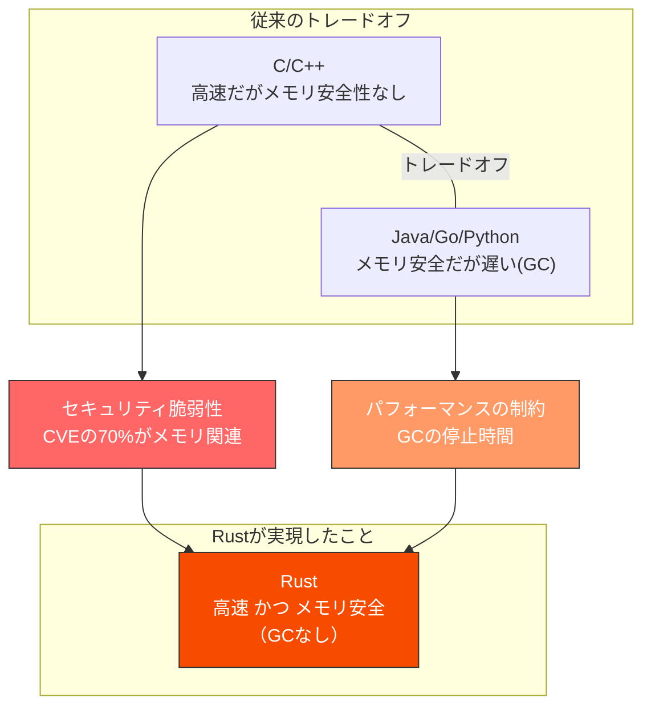
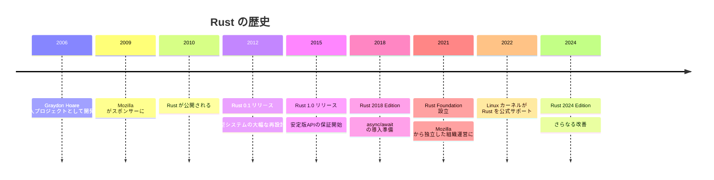
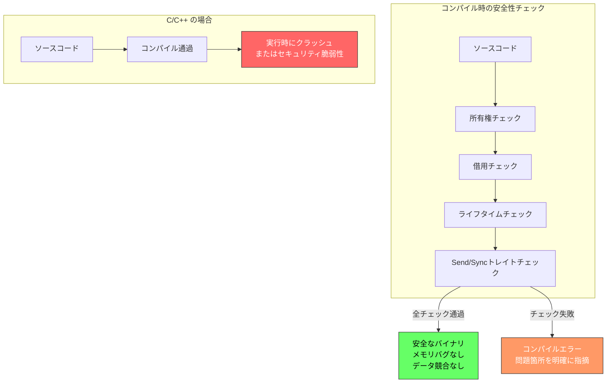

# Rust -- なぜこの言語は生まれたのか

## はじめに

Rustは、2010年にMozillaが公開し、2015年に1.0がリリースされたシステムプログラミング言語である。Mozilla Research所属のGraydon Hoareが個人プロジェクトとして開始し、後にMozillaが公式にスポンサーとなった。

「**メモリ安全性**」と「**高パフォーマンス**」を**両立**するという、従来は不可能とされていた目標を実現した言語である。C/C++と同等の性能を持ちながら、メモリ安全性をコンパイル時に保証する。

## 誕生の背景

### C/C++のメモリ安全性問題

C/C++はOSカーネル、ブラウザエンジン、データベース、ゲームエンジンなど、パフォーマンスが重要な領域で数十年にわたり使われてきた。しかし、メモリ管理を開発者に委ねる設計は、深刻なセキュリティ脆弱性の温床となっていた。

Microsoftの調査（2019年）によると、**過去12年間のCVE（セキュリティ脆弱性）の約70%がメモリ安全性に起因**していた。Googleも同様に、Chromiumのセキュリティバグの約70%がメモリ安全性の問題であると報告している。

| メモリ安全性の問題 | 説明 | 影響 |
| --- | --- | --- |
| バッファオーバーフロー | 配列の範囲外にアクセス | 任意コード実行 |
| 解放後使用（Use After Free） | 解放済みメモリへのアクセス | クラッシュ、情報漏洩 |
| 二重解放（Double Free） | 同じメモリを2回解放 | クラッシュ、メモリ破壊 |
| ヌルポインタ参照 | NULLポインタのデリファレンス | クラッシュ |
| データ競合（Data Race） | 複数スレッドの競合アクセス | 未定義動作 |

```cpp
// C++のメモリ安全性の問題例
#include <vector>
#include <iostream>

int main() {
    std::vector<int> v = {1, 2, 3};
    int& ref = v[0]; // vの要素への参照

    v.push_back(4);  // 再アロケーションが発生する可能性
    // ref は無効になっている（ダングリング参照）
    std::cout << ref; // 未定義動作！

    int* ptr = new int(42);
    delete ptr;
    *ptr = 10; // Use After Free -- 未定義動作！

    return 0;
}
```

### ガベージコレクションという選択肢

Java、C#、Go、Pythonなどの言語はガベージコレクション（GC）によってメモリ安全性を実現している。しかしGCには代償がある。

| GCの代償 | 詳細 |
| --- | --- |
| レイテンシ | GCの停止時間（Stop-the-World）が発生 |
| メモリオーバーヘッド | GCのためのメタデータ・追加メモリが必要 |
| 予測不能性 | GCがいつ実行されるか制御できない |
| 組み込み不向き | リソース制約のある環境では使いにくい |

ブラウザエンジン、OSカーネル、リアルタイムシステムなど、GCの代償を許容できない領域が存在する。

### Mozillaの動機

Mozilla（Firefox開発元）はブラウザエンジンの開発でC++を使用していた。しかしC++の安全性問題はセキュリティ脆弱性として繰り返し顕在化していた。Mozillaは「C++と同等のパフォーマンスを持ちながら、メモリ安全性を保証する言語」を必要としていた。

これがRustの誕生につながった。





## Rustの核心 -- 所有権システム

Rustの最も革新的な特徴は**所有権（Ownership）システム**である。これはGCを使わずにメモリ安全性を保証するための仕組みである。

### 所有権の3つのルール

1. **Rustの各値は、所有者（owner）と呼ばれる変数を1つだけ持つ**
2. **所有者がスコープから外れると、値は自動的に解放される**
3. **所有権は移動（move）できるが、デフォルトではコピーされない**

```rust
fn main() {
    // s1がStringの所有者
    let s1 = String::from("hello");

    // 所有権がs1からs2に移動（move）
    let s2 = s1;

    // println!("{}", s1); // コンパイルエラー！s1はもう所有権を持っていない
    println!("{}", s2);    // OK
}
// ここでs2がスコープを抜け、メモリが自動解放される
```

### 借用（Borrowing）

所有権を移動せずにデータを参照するために、**借用（Borrowing）**の仕組みがある。

```rust
fn calculate_length(s: &String) -> usize {
    // &Stringは不変参照（借用）-- 読み取りのみ可能
    s.len()
}

fn main() {
    let s = String::from("hello");

    // &sで不変参照を渡す（所有権は移動しない）
    let len = calculate_length(&s);

    // sはまだ使える
    println!("'{}' の長さは {} です", s, len);
}
```

### 借用のルール

借用には2つの重要なルールがある。

| ルール | 説明 |
| --- | --- |
| **不変参照は複数可** | `&T` は何個でも同時に存在できる |
| **可変参照は1つだけ** | `&mut T` は同時に1つしか存在できない |
| **両方は共存不可** | 不変参照と可変参照は同時に存在できない |

```rust
fn main() {
    let mut s = String::from("hello");

    let r1 = &s;     // OK: 不変参照1つ目
    let r2 = &s;     // OK: 不変参照2つ目
    println!("{} {}", r1, r2);

    let r3 = &mut s;  // OK: 不変参照の使用が終わった後なので
    r3.push_str(" world");
    println!("{}", r3);
}
```

このルールにより、コンパイル時にデータ競合を完全に防止できる。

### ライフタイム

ライフタイムは参照が有効な期間を表す。ダングリング参照（無効なメモリへの参照）をコンパイル時に防ぐ。

```rust
// ライフタイム注釈の例
// 'a はライフタイムパラメータ
fn longest<'a>(x: &'a str, y: &'a str) -> &'a str {
    if x.len() > y.len() {
        x
    } else {
        y
    }
}

fn main() {
    let string1 = String::from("long string");
    let result;
    {
        let string2 = String::from("xyz");
        result = longest(string1.as_str(), string2.as_str());
        println!("Longest: {}", result); // OK
    }
    // string2はここでスコープを抜けている
    // println!("{}", result); // コンパイルエラー！
}
```

## ゼロコスト抽象化

Rustのもう一つの重要な特徴は**ゼロコスト抽象化（Zero-Cost Abstractions）**である。高水準の抽象化を使っても、手書きの低水準コードと同等の性能が得られる。

> 「使わないものにコストを払わない。使うものについては、手書きのコードより速くならない。」 -- Bjarne Stroustrup（C++の原則をRustも継承）

```rust
// イテレータによる高水準な記述
let sum: i32 = (1..=100)
    .filter(|x| x % 2 == 0)  // 偶数のみ
    .map(|x| x * x)           // 二乗
    .sum();                    // 合計

// ↑これはコンパイル後、手書きのforループと同等の最適化されたコードになる
```

## 型システムとパターンマッチング

```rust
// enumは強力な代数的データ型
enum Shape {
    Circle { radius: f64 },
    Rectangle { width: f64, height: f64 },
    Triangle { base: f64, height: f64 },
}

fn area(shape: &Shape) -> f64 {
    // パターンマッチングで全バリアントを網羅
    match shape {
        Shape::Circle { radius } => std::f64::consts::PI * radius * radius,
        Shape::Rectangle { width, height } => width * height,
        Shape::Triangle { base, height } => base * height / 2.0,
    }
    // 新しいバリアントを追加すると、ここでコンパイルエラーになる
    // → 処理漏れを防止
}

// Option型でnullを排除
fn find_user(id: u64) -> Option<String> {
    if id == 1 {
        Some(String::from("太郎"))
    } else {
        None
    }
}

// Result型で明示的なエラーハンドリング
fn read_file(path: &str) -> Result<String, std::io::Error> {
    std::fs::read_to_string(path)
}
```

## 並行処理の安全性

Rustの所有権システムは、並行処理の安全性も保証する。

```rust
use std::thread;

fn main() {
    let data = vec![1, 2, 3];

    // moveクロージャで所有権をスレッドに移動
    let handle = thread::spawn(move || {
        println!("{:?}", data);
    });

    // data はここでは使えない（所有権が移動済み）
    // println!("{:?}", data); // コンパイルエラー！

    handle.join().unwrap();
}
```

コンパイル時にデータ競合を防止するため、Rustは「**恐れのない並行処理（Fearless Concurrency）**」を謳っている。



## エコシステム

### Cargo -- パッケージマネージャ兼ビルドツール

CargoはRustの公式パッケージマネージャ兼ビルドツールであり、Rustのエコシステムの中心である。

```bash
# 新しいプロジェクトを作成
cargo new my-project

# 依存関係を追加
cargo add serde tokio axum

# ビルド
cargo build --release

# テスト実行
cargo test

# リンター（Clippy）
cargo clippy

# フォーマッタ
cargo fmt
```

### 主要クレート（ライブラリ）

| クレート | 用途 |
| --- | --- |
| serde | シリアライゼーション/デシリアライゼーション |
| tokio | 非同期ランタイム |
| axum / actix-web | Webフレームワーク |
| clap | CLIアプリケーション引数パーサー |
| rayon | データ並列処理 |
| sqlx | 非同期SQLクライアント |

## メリットとデメリット

### メリット

| メリット | 詳細 |
| --- | --- |
| **メモリ安全性** | GCなしでメモリ安全性をコンパイル時に保証 |
| **高パフォーマンス** | C/C++と同等の実行速度 |
| **データ競合防止** | 所有権システムにより並行処理のバグをコンパイル時に検出 |
| **ゼロコスト抽象化** | 高水準コードが低水準と同等の性能になる |
| **優秀なツールチェーン** | Cargo、Clippy、rustfmtなど開発ツールが充実 |
| **充実したエラーメッセージ** | コンパイラのエラーメッセージが非常に親切で教育的 |
| **クロスコンパイル** | 多数のターゲットプラットフォームに対応 |

### デメリット

| デメリット | 詳細 |
| --- | --- |
| **学習曲線** | 所有権・借用・ライフタイムの概念は習得に時間がかかる |
| **コンパイル時間** | 大規模プロジェクトではビルドに時間がかかる |
| **開発速度** | コンパイラとの戦いに時間を取られることがある |
| **エコシステムの成熟度** | C++やJavaと比較すると、一部領域ではライブラリが不足 |
| **非同期プログラミングの複雑さ** | async/awaitと所有権の組み合わせが難しい |
| **GUIエコシステム** | デスクトップGUIアプリ開発はまだ発展途上 |

## 主な採用事例

| 企業/プロジェクト | 用途 |
| --- | --- |
| Mozilla | Servo（実験的ブラウザエンジン）、Firefox |
| Linux Kernel | カーネルモジュールの記述（2022年～） |
| Microsoft | Windows コンポーネント、Azure |
| Google | Android、ChromeOS、Fuchsia |
| Amazon | Firecracker（VMM）、Bottlerocket（OS） |
| Cloudflare | エッジコンピューティング（Pingora） |
| Discord | メッセージ処理基盤（GoからRustへ移行） |
| Figma | レンダリングエンジン |
| Dropbox | ファイル同期エンジン |

## まとめ

Rustは「C/C++のパフォーマンスとメモリ安全性は両立できないのか」という数十年来の問いに対して、所有権システムという革新的なアプローチで答えを出した言語である。

GCなしでメモリ安全性をコンパイル時に保証するという設計は、セキュリティ脆弱性の大幅な削減につながっている。学習コストは高いが、一度習得すればコンパイラが多くのバグを事前に防いでくれるため、長期的な生産性は高い。

Linux カーネルへの採用（2022年）は、システムプログラミングにおけるRustの信頼性を象徴する出来事であり、C/C++が支配してきた領域にRustが着実に浸透していることを示している。

## 参考文献

- [Rust公式サイト](https://www.rust-lang.org/)
- [The Rust Programming Language (The Book)](https://doc.rust-lang.org/book/)
- [Rust by Example](https://doc.rust-lang.org/rust-by-example/)
- [Rust Foundation](https://foundation.rust-lang.org/)
- [Microsoft Security Response Center: A proactive approach to more secure code](https://msrc.microsoft.com/blog/2019/07/a-proactive-approach-to-more-secure-code/)
- [Chromium Memory Safety](https://www.chromium.org/Home/chromium-security/memory-safety/)
- [Rust for Linux](https://rust-for-linux.com/)
- [crates.io - Rust Package Registry](https://crates.io/)
- [Fearless Concurrency (The Rust Blog)](https://blog.rust-lang.org/2015/04/10/Fearless-Concurrency.html)
