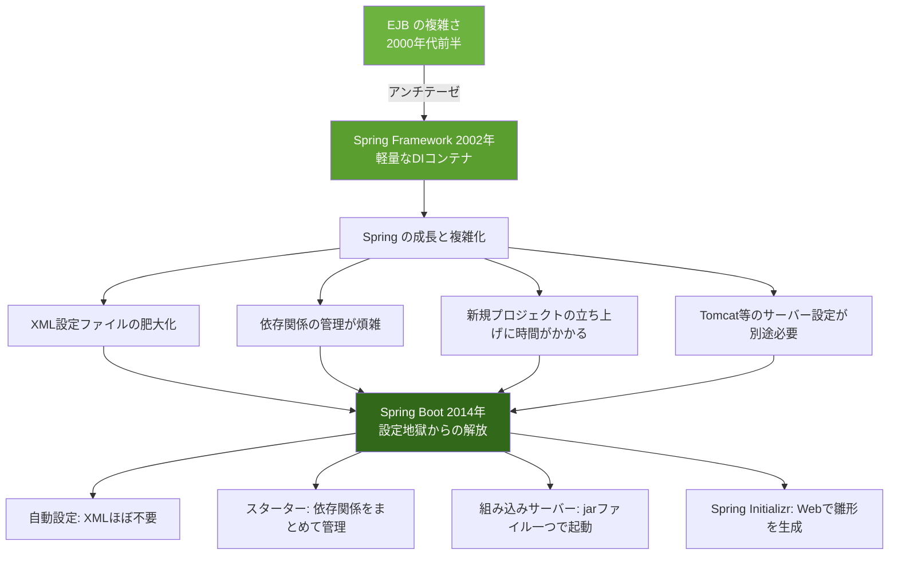
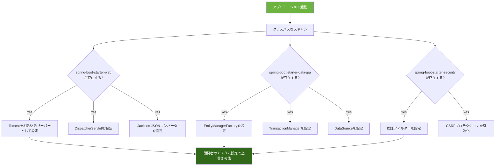

# Spring Boot

## Spring Bootとは何か

Spring Bootは**Java（およびKotlin/Groovy）で書かれたアプリケーションフレームワーク**。2014年にPivotal（現VMware Tanzu）が公開した。親プロジェクトであるSpring Frameworkは2002年に登場した強力なフレームワークだったが、「XML設定地獄」と呼ばれるほど設定が複雑だった。Spring Bootはその設定の煩雑さを解消し、**すぐに動くSpringアプリケーション**を作れるようにするために生まれた。

たとえるなら、Spring Frameworkが「高性能だが操縦が難しいF1マシン」だとすれば、Spring Bootは「誰でも運転できるオートマ車」。エンジン（Spring Framework）の性能はそのままに、操作をシンプルにした。

### Spring Bootの核心的な特徴

| 特徴 | 説明 | たとえ |
| --- | --- | --- |
| 自動設定（Auto Configuration） | クラスパスのライブラリを検出し、適切な設定を自動適用 | 部屋に入ると照明が自動で点く |
| スターター（Starters） | 関連する依存関係をまとめたパッケージ | 料理キット。材料が全部入っている |
| 組み込みサーバー | Tomcat/Jetty/Undertowが内蔵 | 水道管の工事なしで水が出る |
| Opinionated Defaults | 合理的なデフォルト設定が用意されている | おすすめメニューがある食堂 |
| プロダクション対応 | ヘルスチェック、メトリクス、外部設定が標準装備 | 出荷検査済みの製品 |

---

## なぜSpring Bootが生まれたのか

### Spring Frameworkの「設定地獄」

Spring Frameworkは2002年にRod Johnsonが「Expert One-on-One J2EE Design and Development」という書籍とともに公開した。EJB（Enterprise JavaBeans）の複雑さへのアンチテーゼだった。しかしSpring自体も年々機能が増え、設定が複雑化していった。



### Spring Framework時代のXML設定例

```xml
<!-- applicationContext.xml（Spring Framework時代の典型的な設定） -->
<beans xmlns="http://www.springframework.org/schema/beans"
       xmlns:context="http://www.springframework.org/schema/context"
       xmlns:tx="http://www.springframework.org/schema/tx">

    <!-- データソース設定 -->
    <bean id="dataSource" class="org.apache.commons.dbcp.BasicDataSource">
        <property name="driverClassName" value="com.mysql.jdbc.Driver"/>
        <property name="url" value="jdbc:mysql://localhost:3306/mydb"/>
        <property name="username" value="root"/>
        <property name="password" value="password"/>
    </bean>

    <!-- EntityManagerFactory設定 -->
    <bean id="entityManagerFactory"
          class="org.springframework.orm.jpa.LocalContainerEntityManagerFactoryBean">
        <property name="dataSource" ref="dataSource"/>
        <property name="packagesToScan" value="com.example.model"/>
        <property name="jpaVendorAdapter">
            <bean class="org.springframework.orm.jpa.vendor.HibernateJpaVendorAdapter"/>
        </property>
    </bean>

    <!-- トランザクション設定 -->
    <bean id="transactionManager"
          class="org.springframework.orm.jpa.JpaTransactionManager">
        <property name="entityManagerFactory" ref="entityManagerFactory"/>
    </bean>

    <tx:annotation-driven/>
    <context:component-scan base-package="com.example"/>
</beans>
```

### Spring Bootでの同等の設定

```yaml
# application.yml（Spring Bootでは数行で済む）
spring:
  datasource:
    url: jdbc:mysql://localhost:3306/mydb
    username: root
    password: password
  jpa:
    hibernate:
      ddl-auto: update
```

XMLの数十行が、YAMLの数行に置き換わる。残りの設定はSpring Bootの**自動設定**が行う。

---

## 自動設定（Auto Configuration）

Spring Bootの魔法の正体は**自動設定**。クラスパス上にどのライブラリがあるかを検出し、適切なBean定義を自動的に行う。

### 自動設定の仕組み



### スターター（Starters）

スターターは関連する依存関係をまとめたもの。1つのスターターを追加するだけで、必要なライブラリが全て含まれる。

| スターター | 含まれるもの | 用途 |
| --- | --- | --- |
| `spring-boot-starter-web` | Tomcat, Spring MVC, Jackson | REST API/Webアプリ |
| `spring-boot-starter-data-jpa` | Hibernate, Spring Data JPA | データベースアクセス |
| `spring-boot-starter-security` | Spring Security | 認証・認可 |
| `spring-boot-starter-test` | JUnit 5, Mockito, AssertJ | テスト |
| `spring-boot-starter-actuator` | Micrometer, ヘルスチェック | 運用監視 |
| `spring-boot-starter-validation` | Hibernate Validator | 入力バリデーション |

---

## プロジェクトの始め方

### Spring Initializr

[Spring Initializr](https://start.spring.io/) はWebブラウザ上でプロジェクトの雛形を生成できるツール。

```bash
# コマンドラインでも生成可能
curl https://start.spring.io/starter.zip \
  -d type=gradle-project \
  -d language=java \
  -d bootVersion=3.3.0 \
  -d baseDir=my-app \
  -d groupId=com.example \
  -d artifactId=my-app \
  -d dependencies=web,data-jpa,postgresql,validation \
  -o my-app.zip

unzip my-app.zip
cd my-app
./gradlew bootRun
```

### プロジェクト構成

```
my-app/
├── src/
│   ├── main/
│   │   ├── java/com/example/myapp/
│   │   │   ├── MyAppApplication.java       # エントリーポイント
│   │   │   ├── controller/
│   │   │   │   └── ArticleController.java
│   │   │   ├── service/
│   │   │   │   └── ArticleService.java
│   │   │   ├── repository/
│   │   │   │   └── ArticleRepository.java
│   │   │   ├── model/
│   │   │   │   └── Article.java
│   │   │   └── dto/
│   │   │       └── ArticleDto.java
│   │   └── resources/
│   │       ├── application.yml              # 設定ファイル
│   │       ├── static/                      # 静的ファイル
│   │       └── templates/                   # テンプレート
│   └── test/
│       └── java/com/example/myapp/
│           └── MyAppApplicationTests.java
├── build.gradle                             # Gradle設定
└── settings.gradle
```

---

## REST API開発

### エンティティ（Model）

```java
@Entity
@Table(name = "articles")
public class Article {

    @Id
    @GeneratedValue(strategy = GenerationType.IDENTITY)
    private Long id;

    @Column(nullable = false, length = 200)
    private String title;

    @Column(columnDefinition = "TEXT")
    private String content;

    @Column(nullable = false)
    @Enumerated(EnumType.STRING)
    private Status status = Status.DRAFT;

    @CreationTimestamp
    private LocalDateTime createdAt;

    @UpdateTimestamp
    private LocalDateTime updatedAt;

    public enum Status {
        DRAFT, PUBLISHED
    }

    // getter/setter（Lombokを使う場合は @Data で省略可能）
}
```

### リポジトリ

```java
// Spring Data JPAにより、インターフェース定義だけでCRUD操作が可能
public interface ArticleRepository extends JpaRepository<Article, Long> {

    List<Article> findByStatus(Article.Status status);

    List<Article> findByTitleContaining(String keyword);

    @Query("SELECT a FROM Article a WHERE a.status = :status ORDER BY a.createdAt DESC")
    Page<Article> findPublished(@Param("status") Article.Status status, Pageable pageable);
}
```

### サービス

```java
@Service
@Transactional(readOnly = true)
public class ArticleService {

    private final ArticleRepository articleRepository;

    public ArticleService(ArticleRepository articleRepository) {
        this.articleRepository = articleRepository;
    }

    public Page<Article> getPublishedArticles(Pageable pageable) {
        return articleRepository.findPublished(Article.Status.PUBLISHED, pageable);
    }

    public Article getArticle(Long id) {
        return articleRepository.findById(id)
            .orElseThrow(() -> new ResourceNotFoundException("Article not found: " + id));
    }

    @Transactional
    public Article createArticle(ArticleDto dto) {
        Article article = new Article();
        article.setTitle(dto.getTitle());
        article.setContent(dto.getContent());
        return articleRepository.save(article);
    }

    @Transactional
    public Article updateArticle(Long id, ArticleDto dto) {
        Article article = getArticle(id);
        article.setTitle(dto.getTitle());
        article.setContent(dto.getContent());
        article.setStatus(dto.getStatus());
        return articleRepository.save(article);
    }

    @Transactional
    public void deleteArticle(Long id) {
        articleRepository.deleteById(id);
    }
}
```

### コントローラ

```java
@RestController
@RequestMapping("/api/articles")
public class ArticleController {

    private final ArticleService articleService;

    public ArticleController(ArticleService articleService) {
        this.articleService = articleService;
    }

    @GetMapping
    public Page<Article> list(Pageable pageable) {
        return articleService.getPublishedArticles(pageable);
    }

    @GetMapping("/{id}")
    public Article show(@PathVariable Long id) {
        return articleService.getArticle(id);
    }

    @PostMapping
    @ResponseStatus(HttpStatus.CREATED)
    public Article create(@Valid @RequestBody ArticleDto dto) {
        return articleService.createArticle(dto);
    }

    @PutMapping("/{id}")
    public Article update(@PathVariable Long id, @Valid @RequestBody ArticleDto dto) {
        return articleService.updateArticle(id, dto);
    }

    @DeleteMapping("/{id}")
    @ResponseStatus(HttpStatus.NO_CONTENT)
    public void delete(@PathVariable Long id) {
        articleService.deleteArticle(id);
    }
}
```

---

## Actuator（運用監視）

Spring Boot Actuatorは、アプリケーションの健全性やメトリクスを公開するエンドポイントを提供する。

```yaml
# application.yml
management:
  endpoints:
    web:
      exposure:
        include: health,info,metrics,prometheus
  endpoint:
    health:
      show-details: always
```

| エンドポイント | 用途 |
| --- | --- |
| `/actuator/health` | ヘルスチェック（DB接続、ディスク容量等） |
| `/actuator/info` | アプリケーション情報 |
| `/actuator/metrics` | JVM、HTTP、DB等のメトリクス |
| `/actuator/prometheus` | Prometheus形式のメトリクス出力 |

---

## メリットとデメリット

### メリット

| メリット | 詳細 |
| --- | --- |
| 自動設定 | ボイラープレートコードが大幅に減少 |
| エコシステム | Spring Security、Spring Data、Spring Cloud等の統合が容易 |
| エンタープライズ対応 | トランザクション管理、メッセージング、バッチ処理等が充実 |
| 型安全性 | Javaの静的型付けによりコンパイル時にエラーを検出 |
| パフォーマンス | JVMの最適化により高いスループットを実現 |
| 長期サポート | エンタープライズ向けのLTSバージョンがある |

### デメリット

| デメリット | 詳細 |
| --- | --- |
| 学習コスト | Spring Framework全体の理解が必要。DI、AOP、アノテーション等の概念が多い |
| 起動時間 | JVMの起動とDIコンテナの初期化に時間がかかる |
| メモリ消費 | JVMのオーバーヘッドにより、最小メモリ使用量が大きい |
| 冗長なコード | Javaの言語特性上、コード量が多くなりがち |
| 「魔法」の多さ | 自動設定が複雑で、問題発生時のデバッグが困難 |
| コンテナ化との相性 | 起動時間とメモリの問題がコンテナ環境で顕著 |

### GraalVM Native Imageによる改善

Spring Boot 3からは**GraalVM Native Image**をサポートし、起動時間の問題を劇的に改善できる。

| 項目 | JVM | Native Image |
| --- | --- | --- |
| 起動時間 | 数秒〜数十秒 | 数十ミリ秒 |
| メモリ使用量 | 数百MB | 数十MB |
| ピークパフォーマンス | 高い（JITコンパイル） | やや低い（AOTコンパイル） |
| ビルド時間 | 速い | 非常に遅い（数分） |

---

## 代替フレームワークとの比較

| 観点 | Spring Boot | Quarkus | Micronaut | NestJS |
| --- | --- | --- | --- | --- |
| 言語 | Java/Kotlin | Java/Kotlin | Java/Kotlin/Groovy | TypeScript |
| 起動時間 | 遅い（Native Imageで改善） | 高速 | 高速 | 中程度 |
| エコシステム | 最大 | 成長中 | 成長中 | 大きい |
| Native Image | 対応（v3+） | ネイティブ対応 | ネイティブ対応 | N/A |
| 学習コスト | 高 | 中（Spring互換） | 中 | 中 |
| 適した場面 | エンタープライズ | クラウドネイティブ | マイクロサービス | Node.jsエンタープライズ |

---

## 参考文献

- [Spring Boot 公式ドキュメント](https://docs.spring.io/spring-boot/docs/current/reference/html/) - 公式リファレンス
- [Spring Initializr](https://start.spring.io/) - プロジェクト雛形生成ツール
- [Spring Boot GitHub](https://github.com/spring-projects/spring-boot) - ソースコードとIssue
- [Spring Guides](https://spring.io/guides) - 公式チュートリアル集
- [Baeldung](https://www.baeldung.com/) - Spring/Java関連の技術ブログ（英語）
- [GraalVM 公式サイト](https://www.graalvm.org/) - Native Imageコンパイラ
- [Quarkus 公式ドキュメント](https://quarkus.io/) - クラウドネイティブJavaフレームワーク
- [Micronaut 公式ドキュメント](https://micronaut.io/) - 軽量Javaフレームワーク
