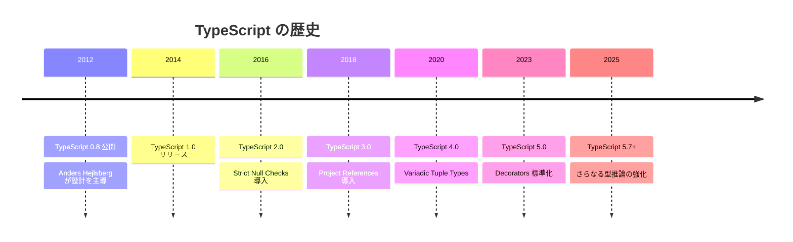
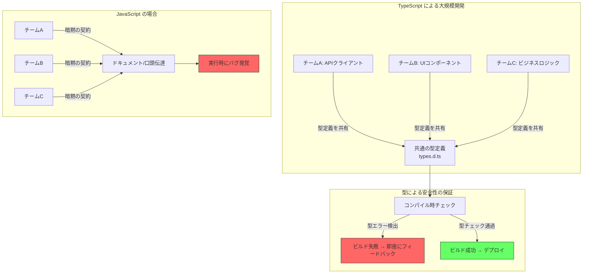
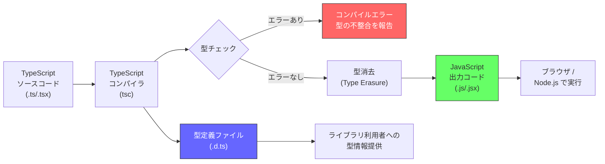

# TypeScript -- なぜこの言語は生まれたのか

## はじめに

TypeScriptは、Microsoftが2012年に公開した**JavaScriptのスーパーセット**（上位互換）言語である。JavaScriptに**静的型付け**を追加することで、大規模なアプリケーション開発における品質と生産性の課題を解決するために誕生した。

現在ではフロントエンド・バックエンドを問わず、JavaScriptを使うほぼ全ての領域でTypeScriptが選択肢に入るようになっている。

## 誕生の背景

### JavaScriptが抱えていた問題

JavaScriptは1995年にNetscape社のBrendan Eichによってわずか10日間で設計された言語である。元々はブラウザ上で簡単なインタラクションを実現するためのスクリプト言語であり、大規模開発を想定した設計ではなかった。

しかし2000年代後半以降、以下の変化が起きた。

| 時期 | 出来事 | 影響 |
| --- | --- | --- |
| 2005年 | Ajaxの普及 | フロントエンドのコード量が急増 |
| 2008年 | Google Chrome（V8エンジン）公開 | JS実行速度が劇的に向上 |
| 2009年 | Node.js登場 | サーバーサイドでもJSを使用 |
| 2010年以降 | SPA（Single Page Application）の台頭 | フロントエンドが数万行規模に |

コードベースが大規模化する中で、JavaScriptの**動的型付け**は深刻な問題を引き起こすようになった。

```javascript
// JavaScriptでは型がないため、こうしたバグが実行時まで検出できない
function add(a, b) {
  return a + b
}

add(1, 2)       // 3（期待通り）
add('1', 2)     // '12'（文字列結合になる -- バグ）
add(null, 2)    // 2（暗黙の型変換 -- 意図しない挙動）
```

### Microsoftの課題

Microsoftは自社製品（Office Online、Azure Portal、Visual Studio Onlineなど）の開発において、数十万行規模のJavaScriptコードベースを抱えていた。以下の課題が顕在化していた。

- **リファクタリングの困難さ**: 関数のシグネチャを変更しても、影響範囲を静的に把握できない
- **IDEサポートの限界**: 型情報がないため、コード補完やナビゲーションが不正確
- **チーム開発の非効率**: 他の開発者が書いたコードの意図（期待する引数・戻り値の型）が不明確
- **実行時エラーの多発**: 型の不整合に起因するバグが本番環境で初めて発覚する

### TypeScriptの誕生

2012年10月、MicrosoftのAnders Hejlsberg（C#やDelphi/Turbo Pascalの設計者としても著名）が中心となり、TypeScriptが公開された。

設計思想は明確だった。

1. **JavaScriptのスーパーセット**: 全てのJavaScriptコードは有効なTypeScriptコードである
2. **段階的な導入**: 既存プロジェクトに少しずつ型を追加できる
3. **コンパイル時の型チェック**: 実行前にバグを検出する
4. **型消去（Type Erasure）**: コンパイル後は純粋なJavaScriptになり、ランタイムのオーバーヘッドがない



## TypeScriptが解決する課題

### 1. 型安全性

TypeScriptの最大の特徴は**静的型付け**である。変数、関数の引数・戻り値に型を定義することで、コンパイル時に型の不整合を検出できる。

```typescript
// TypeScriptでは型を明示できる
function add(a: number, b: number): number {
  return a + b
}

add(1, 2)       // OK
add('1', 2)     // コンパイルエラー: string型はnumber型に代入できない
add(null, 2)    // コンパイルエラー（strictNullChecks有効時）
```

### 2. 開発者体験の向上

型情報があることで、IDEが正確なコード補完・リファクタリング・ナビゲーションを提供できる。

```typescript
interface User {
  id: number
  name: string
  email: string
  createdAt: Date
}

function greet(user: User): string {
  // user. と入力すると id, name, email, createdAt が補完候補に出る
  return `Hello, ${user.name}!`
}
```

### 3. ドキュメントとしての型

型定義はコードの仕様書として機能する。関数が何を受け取り、何を返すかが型シグネチャから明確になる。

```typescript
// 型定義を見るだけで、この関数の使い方がわかる
function fetchUsers(
  page: number,
  limit: number,
  filter?: { role: 'admin' | 'user'; active: boolean }
): Promise<{ users: User[]; total: number }> {
  // 実装
}
```

### 4. 大規模開発のスケーラビリティ

型システムにより、数百人のチームが同時に開発しても、インターフェースの契約（contract）が型で保証される。



## TypeScriptの型システム

### 基本型

```typescript
// プリミティブ型
let isDone: boolean = false
let decimal: number = 6
let color: string = 'blue'

// 配列
let list: number[] = [1, 2, 3]
let list2: Array<number> = [1, 2, 3]

// タプル
let tuple: [string, number] = ['hello', 10]

// enum
enum Direction {
  Up,
  Down,
  Left,
  Right,
}

// any（型チェックを無効化 -- 使用は最小限に）
let notSure: any = 4

// unknown（anyより安全 -- 使用前に型チェックが必要）
let unknown: unknown = 4
```

### ユニオン型とリテラル型

```typescript
// ユニオン型: 複数の型のいずれかを許容
type StringOrNumber = string | number

// リテラル型: 特定の値だけを許容
type Direction = 'north' | 'south' | 'east' | 'west'
type HttpStatus = 200 | 301 | 404 | 500

// 判別共用体（Discriminated Union）
type Shape =
  | { kind: 'circle'; radius: number }
  | { kind: 'rectangle'; width: number; height: number }

function area(shape: Shape): number {
  switch (shape.kind) {
    case 'circle':
      return Math.PI * shape.radius ** 2
    case 'rectangle':
      return shape.width * shape.height
  }
}
```

### ジェネリクス

```typescript
// 型を引数として受け取る
function identity<T>(arg: T): T {
  return arg
}

// 使用時に型が決まる
const num = identity<number>(42)    // T = number
const str = identity<string>('hi')  // T = string

// 制約付きジェネリクス
function getProperty<T, K extends keyof T>(obj: T, key: K): T[K] {
  return obj[key]
}
```

### ユーティリティ型

TypeScriptは豊富なユーティリティ型を提供している。

```typescript
interface User {
  id: number
  name: string
  email: string
  password: string
}

// Partial: 全プロパティをオプショナルに
type UpdateUser = Partial<User>

// Pick: 特定のプロパティだけを抽出
type UserSummary = Pick<User, 'id' | 'name'>

// Omit: 特定のプロパティを除外
type PublicUser = Omit<User, 'password'>

// Readonly: 全プロパティを読み取り専用に
type ImmutableUser = Readonly<User>

// Record: キーと値の型を指定
type UserRoles = Record<string, 'admin' | 'user' | 'guest'>
```

## コンパイルの仕組み

TypeScriptのコンパイラ（`tsc`）は、TypeScriptコードをJavaScriptに変換する。この過程で型チェックが行われるが、**出力されるJavaScriptには型情報は一切含まれない**（型消去）。



### tsconfig.json

TypeScriptプロジェクトの設定は `tsconfig.json` で管理する。

```json
{
  "compilerOptions": {
    "target": "ES2022",
    "module": "ESNext",
    "strict": true,
    "noUncheckedIndexedAccess": true,
    "esModuleInterop": true,
    "skipLibCheck": true,
    "outDir": "./dist",
    "rootDir": "./src",
    "declaration": true
  },
  "include": ["src/**/*"],
  "exclude": ["node_modules", "dist"]
}
```

`strict: true` を設定すると、以下の厳格なチェックが全て有効になる。

| オプション | 効果 |
| --- | --- |
| `strictNullChecks` | null/undefinedの暗黙的な許容を禁止 |
| `strictFunctionTypes` | 関数の引数型を厳格にチェック |
| `strictBindCallApply` | bind/call/applyの引数を厳格にチェック |
| `strictPropertyInitialization` | クラスプロパティの初期化を必須に |
| `noImplicitAny` | 暗黙のany型を禁止 |
| `noImplicitThis` | 暗黙のthis型を禁止 |
| `alwaysStrict` | 全ファイルにuse strictを付与 |

## JavaScriptとの関係

### スーパーセットとは

TypeScriptはJavaScriptの**スーパーセット**である。つまり、全てのJavaScriptコードは有効なTypeScriptコードとして動作する。

```
JavaScript ⊂ TypeScript
```

これにより以下が可能になる。

- 既存のJSプロジェクトに `.ts` ファイルを1つずつ追加して段階的に移行できる
- `.js` ファイルに `// @ts-check` コメントを追加するだけでも、一定の型チェックが効く
- JSDocコメントで型情報を記述し、TypeScriptの恩恵を `.js` のまま受けることもできる

### エコシステムとの統合

TypeScriptはJavaScriptエコシステムとシームレスに統合されている。

- **npm**: TypeScriptパッケージも通常通りnpmで配布・インストールできる
- **DefinitelyTyped**: JSライブラリの型定義を `@types/xxx` として提供するコミュニティプロジェクト
- **フレームワーク対応**: React、Vue、Angular、Next.js、Nuxt、SvelteなどがTypeScriptを公式サポート

## メリットとデメリット

### メリット

| メリット | 詳細 |
| --- | --- |
| **型安全性** | コンパイル時にバグを検出でき、実行時エラーを大幅に削減 |
| **IDE支援** | 正確なコード補完、リファクタリング、ナビゲーションが可能 |
| **可読性** | 型がドキュメントとして機能し、コードの意図が明確になる |
| **段階的導入** | JSとの完全互換により、既存プロジェクトに少しずつ導入できる |
| **エコシステム** | JSのライブラリ資産を全て活用可能 |
| **大規模開発** | インターフェースの契約を型で保証でき、チーム開発に強い |

### デメリット

| デメリット | 詳細 |
| --- | --- |
| **学習コスト** | 型システムの概念（ジェネリクス、条件型など）の習得に時間がかかる |
| **コンパイル時間** | 大規模プロジェクトではビルド時間が増加する |
| **型定義の保守** | 型の定義・更新にも工数がかかる |
| **過度な型定義** | 型パズルに陥り、実装よりも型の記述に時間を費やすことがある |
| **ランタイムの型安全性なし** | 外部入力（API応答など）の型は実行時には保証されない |
| **設定の複雑さ** | tsconfig.jsonの設定項目が多く、最適な設定の判断が難しい |

## 採用企業・プロジェクト

TypeScriptは多くの主要企業・プロジェクトで採用されている。

| 企業/プロジェクト | 用途 |
| --- | --- |
| Microsoft | VS Code、Azure Portal、Office Online |
| Google | Angular（フレームワーク自体がTypeScriptで開発） |
| Slack | デスクトップアプリ |
| Airbnb | フロントエンド全般 |
| Stripe | APIクライアントライブラリ |
| Vercel | Next.js |
| Deno | ランタイム自体がTypeScriptをネイティブサポート |

## TypeScriptの今後

TypeScriptは現在も活発に開発が続いており、以下のようなトレンドがある。

- **型推論の強化**: 明示的な型注釈を減らし、より少ないコードで型安全性を確保する方向
- **パフォーマンス改善**: コンパイラの高速化、インクリメンタルビルドの最適化
- **ECMAScript追従**: TC39の新しい提案（Decorators、Explicit Resource Managementなど）への対応
- **エディタ統合の深化**: Language Serverの改善によるさらに快適な開発体験

## まとめ

TypeScriptは「JavaScriptの大規模開発における型安全性の欠如」という明確な課題を解決するために生まれた。JavaScriptとの完全な互換性を維持しながら静的型付けを追加するという設計思想により、段階的に導入でき、既存のエコシステムを全て活用できる。

現在ではフロントエンド・バックエンドを問わず、JavaScriptを書く場面ではTypeScriptが事実上の標準となりつつある。型の恩恵はプロジェクトの規模が大きくなるほど顕著になるため、チーム開発やプロダクション環境での採用が強く推奨される。

## 参考文献

- [TypeScript公式サイト](https://www.typescriptlang.org/)
- [TypeScript Handbook](https://www.typescriptlang.org/docs/handbook/intro.html)
- [TypeScript GitHub Repository](https://github.com/microsoft/TypeScript)
- [DefinitelyTyped](https://github.com/DefinitelyTyped/DefinitelyTyped)
- [Anders Hejlsberg: Introducing TypeScript (Channel 9, 2012)](https://channel9.msdn.com/posts/Anders-Hejlsberg-Introducing-TypeScript)
- [TypeScript: JavaScript that Scales (Microsoft DevBlog)](https://devblogs.microsoft.com/typescript/)
- [The State of JavaScript Survey](https://stateofjs.com/)
- [TypeScript Deep Dive (Basarat Ali Syed)](https://basarat.gitbook.io/typescript/)
