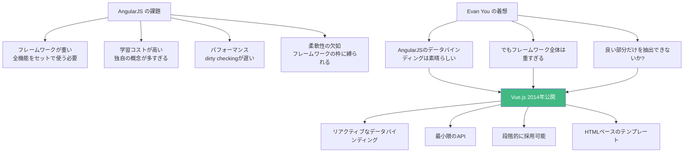
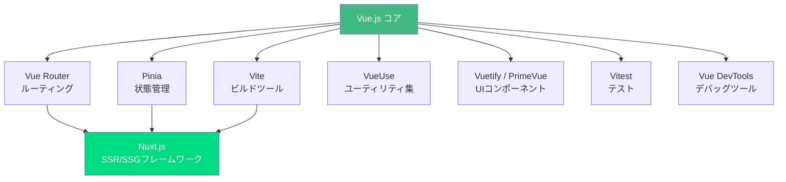

# Vue.js

## Vue.jsとは何か

Vue.js（ビュー）は**ユーザーインターフェースを構築するためのJavaScriptフレームワーク**。2014年にEvan Youが開発・公開した。GoogleでAngularJSを使った開発に携わった後、「AngularJSの良い部分だけを取り出して、もっと軽量でシンプルなフレームワークを作りたい」という動機から生まれた。

たとえるなら、Vue.jsは「段階的に拡張できるツールボックス」。最初はシンプルなスクリプトタグの読み込みだけで使い始め、必要に応じてルーティング、状態管理、ビルドツールを追加していける。これがVue.jsが掲げる**Progressive Framework（プログレッシブフレームワーク）**の概念。

### Vue.jsの核心的な特徴

| 特徴 | 説明 | たとえ |
| --- | --- | --- |
| Progressive Framework | 小さく始めて段階的に拡張できる | 自転車から始めて、必要に応じてバイク、車に乗り換える |
| リアクティブシステム | データの変更を自動的にUIに反映 | スプレッドシートの数式。セルを変えると関連セルも更新 |
| コンポーネント | 再利用可能なUI部品を組み合わせる | レゴブロック |
| 単一ファイルコンポーネント | HTML、CSS、JSを1つのファイルにまとめる | 1枚のカードに全情報がまとまっている |
| 学習しやすさ | HTMLベースのテンプレート構文 | 既知のHTMLに少し追加するだけ |

---

## なぜVue.jsが生まれたのか

### AngularJSへの不満

Evan YouはGoogleでAngularJS（Angular 1.x）を使ったプロジェクトに参加していた。AngularJSは強力だったが、以下の問題を感じていた。



### 「Progressive Framework」という思想

Vue.jsの最大の差別化ポイントは**段階的に採用できる**こと。

| レベル | 使い方 | 追加するもの |
| --- | --- | --- |
| Level 0 | CDNからスクリプトを読み込んでHTMLに追記 | `<script src="vue.js">` のみ |
| Level 1 | コンポーネントで構造化 | `.vue` ファイル、ビルドツール |
| Level 2 | ルーティングを追加 | Vue Router |
| Level 3 | 状態管理を追加 | Pinia |
| Level 4 | SSR/SSGを追加 | Nuxt.js |

Reactは最初からJSXとビルドツールが前提で、Angularは全機能がセットになっている。Vue.jsだけが「段階的に」フレームワークの力を借りていくことができる。

### Vue.jsの進化の歴史

| バージョン | 年 | 主な変更点 |
| --- | --- | --- |
| 0.x | 2014 | 初版リリース |
| 1.0 | 2015 | 安定版、テンプレートコンパイラの改善 |
| 2.0 | 2016 | Virtual DOM導入、レンダリング関数、SSRサポート |
| 2.6 | 2019 | スロットの新構文、動的ディレクティブ引数 |
| 3.0 | 2020 | Composition API、Proxy-basedリアクティビティ、TypeScript対応強化 |
| 3.3 | 2023 | `defineModel`、ジェネリックコンポーネント |
| 3.4 | 2024 | パフォーマンス改善、`defineModel` 安定版 |
| 3.5 | 2024 | リアクティブProps分割代入、遅延ハイドレーション |

---

## リアクティブシステム

Vue.jsの中核はリアクティブシステム。データを変更するだけで、関連するUIが自動的に更新される。

### Vue 2のリアクティビティ（Object.defineProperty）

```javascript
// Vue 2の内部実装（簡略化）
// Object.definePropertyでgetter/setterを定義
Object.defineProperty(data, 'count', {
  get() {
    // 依存関係を追跡
    trackDependency()
    return value
  },
  set(newValue) {
    value = newValue
    // 依存するコンポーネントに通知
    notifyDependents()
  }
})
```

この方式にはプロパティの追加・削除を検出できないという制限があった。

### Vue 3のリアクティビティ（Proxy）

```javascript
// Vue 3: ES6 Proxyで全てのプロパティアクセスを捕捉
const state = new Proxy(target, {
  get(target, key) {
    track(target, key)
    return target[key]
  },
  set(target, key, value) {
    target[key] = value
    trigger(target, key)
    return true
  }
})
```

Proxyベースにより、プロパティの追加・削除、配列のインデックスアクセスも完全にリアクティブになった。

---

## Composition API

Vue 3の最大の新機能。Vue 2のOptions APIに代わる、ロジックの再利用性と型推論に優れた新しいコンポーネント記述方式。

### Options API（Vue 2スタイル）

```vue
<script>
export default {
  data() {
    return {
      count: 0,
      name: '太郎',
    }
  },
  computed: {
    doubleCount() {
      return this.count * 2
    },
  },
  methods: {
    increment() {
      this.count++
    },
  },
  mounted() {
    console.log('マウントされました')
  },
}
</script>
```

### Composition API（Vue 3スタイル）

```vue
<script setup lang="ts">
import { ref, computed, onMounted } from 'vue'

// リアクティブな状態
const count = ref(0)
const name = ref('太郎')

// 算出プロパティ
const doubleCount = computed(() => count.value * 2)

// メソッド
function increment() {
  count.value++
}

// ライフサイクルフック
onMounted(() => {
  console.log('マウントされました')
})
</script>
```

### コンポーザブル（カスタムフック）

Composition APIの真価は**コンポーザブル**（再利用可能なロジックの抽出）にある。

```typescript
// composables/useFetch.ts
import { ref, watchEffect } from 'vue'

export function useFetch<T>(url: string) {
  const data = ref<T | null>(null)
  const error = ref<Error | null>(null)
  const loading = ref(true)

  watchEffect(async () => {
    loading.value = true
    error.value = null
    try {
      const response = await fetch(url)
      data.value = await response.json()
    } catch (e) {
      error.value = e as Error
    } finally {
      loading.value = false
    }
  })

  return { data, error, loading }
}
```

```vue
<!-- コンポーネントでの使用 -->
<script setup lang="ts">
import { useFetch } from '@/composables/useFetch'

const { data: users, loading, error } = useFetch<User[]>('/api/users')
</script>

<template>
  <div v-if="loading">読み込み中...</div>
  <div v-else-if="error">エラー: {{ error.message }}</div>
  <ul v-else>
    <li v-for="user in users" :key="user.id">{{ user.name }}</li>
  </ul>
</template>
```

---

## 単一ファイルコンポーネント（SFC）

Vue.jsの特徴的な構文。1つの`.vue`ファイルにテンプレート、スクリプト、スタイルをまとめる。

```vue
<script setup lang="ts">
import { ref } from 'vue'

interface Todo {
  id: number
  text: string
  done: boolean
}

const todos = ref<Todo[]>([])
const newTodo = ref('')

function addTodo() {
  if (!newTodo.value.trim()) return
  todos.value.push({
    id: Date.now(),
    text: newTodo.value.trim(),
    done: false,
  })
  newTodo.value = ''
}

function removeTodo(id: number) {
  todos.value = todos.value.filter(t => t.id !== id)
}
</script>

<template>
  <div class="todo-app">
    <h1>ToDo リスト</h1>
    <form @submit.prevent="addTodo">
      <input v-model="newTodo" placeholder="新しいタスク" />
      <button type="submit">追加</button>
    </form>
    <ul>
      <li v-for="todo in todos" :key="todo.id">
        <input type="checkbox" v-model="todo.done" />
        <span :class="{ done: todo.done }">{{ todo.text }}</span>
        <button @click="removeTodo(todo.id)">削除</button>
      </li>
    </ul>
  </div>
</template>

<style scoped>
.done {
  text-decoration: line-through;
  color: #999;
}
</style>
```

`<style scoped>` により、CSSがそのコンポーネント内でのみ有効になる。他のコンポーネントに影響しない。

---

## テンプレート構文

Vue.jsのテンプレートはHTMLの拡張。ディレクティブ（`v-` で始まる属性）で動的な振る舞いを記述する。

| ディレクティブ | 用途 | 例 |
| --- | --- | --- |
| `v-bind` (`:`) | 属性バインディング | `:src="imageUrl"` |
| `v-on` (`@`) | イベントハンドリング | `@click="handleClick"` |
| `v-model` | 双方向バインディング | `v-model="name"` |
| `v-if` / `v-else` | 条件付きレンダリング | `v-if="isVisible"` |
| `v-for` | リストレンダリング | `v-for="item in items"` |
| `v-show` | 表示/非表示の切り替え | `v-show="isOpen"` |
| `v-slot` (`#`) | スロットの使用 | `#header="{ title }"` |

---

## エコシステム



| カテゴリ | ライブラリ | 説明 |
| --- | --- | --- |
| ルーティング | Vue Router | 公式ルーティングライブラリ |
| 状態管理 | Pinia | 公式の軽量状態管理（Vuex後継） |
| ビルドツール | Vite | Evan You製の高速ビルドツール |
| SSR/SSG | Nuxt.js | Vue.js用のフルスタックフレームワーク |
| ユーティリティ | VueUse | 200+のComposition APIユーティリティ集 |
| UIライブラリ | Vuetify, PrimeVue, Element Plus | 既成コンポーネント集 |
| テスト | Vitest | Viteベースの高速テストフレームワーク |
| フォーム | VeeValidate | フォームバリデーション |

---

## プロジェクトの始め方

```bash
# Viteでプロジェクトを作成
npm create vue@latest my-vue-app
# 対話形式で設定を選択:
#   TypeScript? Yes
#   JSX Support? No
#   Vue Router? Yes
#   Pinia? Yes
#   Vitest? Yes
#   ESLint? Yes
#   Prettier? Yes

cd my-vue-app
npm install
npm run dev
```

### プロジェクト構成

```
my-vue-app/
├── src/
│   ├── App.vue              # ルートコンポーネント
│   ├── main.ts              # エントリーポイント
│   ├── components/          # 共通コンポーネント
│   ├── views/               # ページコンポーネント
│   ├── composables/         # コンポーザブル（カスタムフック）
│   ├── stores/              # Piniaストア
│   ├── router/              # ルーティング設定
│   ├── assets/              # 静的アセット
│   └── types/               # TypeScript型定義
├── public/
├── index.html
├── vite.config.ts
├── tsconfig.json
└── package.json
```

---

## メリットとデメリット

### メリット

| メリット | 詳細 |
| --- | --- |
| 学習しやすさ | HTMLベースのテンプレートで、既存のHTML/CSS知識が活かせる |
| Progressive | 既存プロジェクトに部分的に導入できる |
| パフォーマンス | コンパイラの最適化により、小さなバンドルサイズ |
| TypeScript | Vue 3でTypeScriptサポートが大幅に強化 |
| 公式ツール | Router、Pinia、Vite、DevToolsが公式で統一されている |
| ドキュメント | 公式ドキュメントが非常に丁寧で読みやすい |

### デメリット

| デメリット | 詳細 |
| --- | --- |
| 求人数 | React/Angularと比較すると、特にエンタープライズ領域で少ない |
| エコシステム | Reactと比べるとサードパーティライブラリが少ない |
| 大規模開発 | Angularほどの規約がないため、大規模チームでは統一が必要 |
| Vue 2からの移行 | Composition APIへの移行は既存コードの書き換えが必要 |
| React Native相当がない | モバイル開発のエコシステムが弱い |
| Evan You依存 | プロジェクトのリーダーシップが個人に依存している面がある |

---

## React / Angular との比較

| 観点 | Vue.js | React | Angular |
| --- | --- | --- | --- |
| 開発元 | Evan You（個人 + コミュニティ） | Meta | Google |
| リリース年 | 2014 | 2013 | 2016（Angular 2+） |
| テンプレート | HTMLベース | JSX | HTMLベース |
| 状態管理 | Pinia（公式） | 自由選択（Redux等） | RxJS + Services |
| 学習コスト | 低い | 中 | 高い |
| TypeScript | 強化された対応 | 良好 | ネイティブ対応 |
| CLI | create-vue | create-react-app/Vite | Angular CLI |
| SSRフレームワーク | Nuxt.js | Next.js | Angular Universal |
| 企業採用 | 中小〜中規模 | 大企業〜スタートアップ | 大企業 |
| バンドルサイズ | 小さい | 中 | 大きい |

---

## 参考文献

- [Vue.js 公式ドキュメント](https://vuejs.org/) - 公式リファレンスとチュートリアル
- [Vue.js 日本語ドキュメント](https://ja.vuejs.org/) - 公式ドキュメントの日本語版
- [Vue Router 公式ドキュメント](https://router.vuejs.org/) - 公式ルーティングライブラリ
- [Pinia 公式ドキュメント](https://pinia.vuejs.org/) - 公式状態管理ライブラリ
- [Nuxt.js 公式ドキュメント](https://nuxt.com/) - Vue.js用フルスタックフレームワーク
- [VueUse](https://vueuse.org/) - Composition APIユーティリティ集
- [Vue.js GitHub](https://github.com/vuejs/core) - ソースコードとIssue
- [Evan You - VueMastery Interview](https://www.vuemastery.com/courses/intro-to-vue-3/intro-to-vue3) - 作者によるVue.jsの紹介
